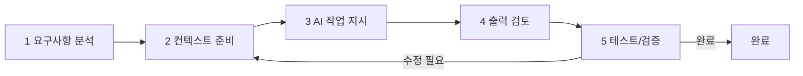
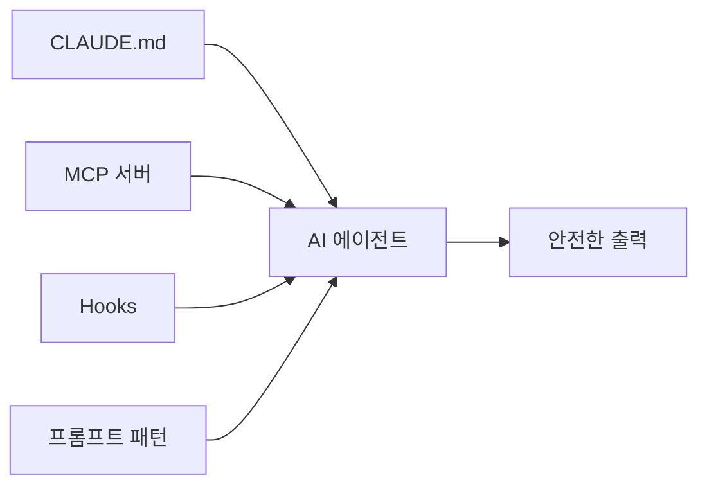
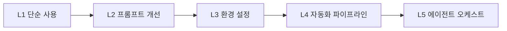
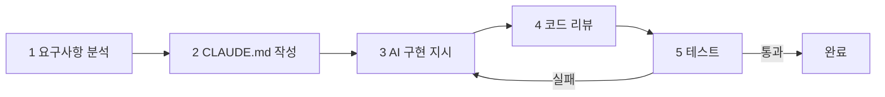

AI가 코드를 생성하는 시대가 되면서 개발자의 역할이 바뀌고 있다. AI를 단순히 사용하는 것을 넘어, AI가 올바르게 작동하도록 환경과 제약을 설계하는 **하네스 엔지니어링(Harness Engineering)**이 새로운 핵심 역량으로 부상했다.

> **비유**: AI는 뛰어난 신입 개발자와 같다. 빠르게 코드를 작성하지만 맥락을 모르면 엉뚱한 방향으로 간다. 시니어 개발자(하네스 엔지니어)가 명확한 지시, 제약, 검증 체계를 갖춰줄 때 비로소 제 실력을 발휘한다. 신입에게 "알아서 해봐"라고 하면 안 된다.

---

## AI-Driven Development란

AI-Driven Development(ADD)는 AI 도구를 개발 워크플로우의 중심에 배치하고, 개발자가 **방향·검증·아키텍처 결정**에 집중하는 개발 방식이다.

| 구분 | 전통 개발 | AI-Driven 개발 |
|------|-----------|----------------|
| 코드 작성 | 개발자 직접 작성 | AI 생성, 개발자 검토 |
| 반복 작업 | 개발자가 직접 처리 | AI 자동화 |
| 디버깅 | 로그/디버거 기반 | AI와 대화식 해결 |
| 테스트 작성 | 수동 작성 | AI 초안 생성 후 검토 |
| 개발자 역할 | 구현자 | 설계자 + 검증자 |

### 핵심 원칙

1. **의도를 명확히 표현**: 모호한 지시는 나쁜 결과를 낳는다
2. **작은 단위로 반복**: 큰 작업을 쪼개어 각 단계를 검증한다
3. **AI 출력을 맹신하지 않는다**: 반드시 검토하고 테스트한다
4. **컨텍스트를 관리한다**: 관련 파일, 규칙, 제약을 명시적으로 제공한다

---

## AI 개발 워크플로우



### AI가 잘하는 것 vs 못하는 것

**AI가 잘하는 것**
- 보일러플레이트 코드 생성
- 단순 CRUD 구현
- 리팩토링 (변수명 변경, 메서드 추출)
- 테스트 케이스 생성
- 문서 작성, 주석 추가
- 정규식, SQL 쿼리 작성

**AI가 잘 못하는 것**
- 복잡한 비즈니스 로직 설계
- 성능 병목 원인 분석 (컨텍스트 부족 시)
- 장기적 아키텍처 결정
- 다중 시스템 연동 설계
- 도메인 특화 지식이 필요한 구현

---

## 프롬프트 엔지니어링

### 좋은 프롬프트의 구조

```
[역할] + [컨텍스트] + [작업] + [제약] + [출력 형식]
```

**나쁜 프롬프트**
```
로그인 기능 만들어줘
```

**좋은 프롬프트**
```
당신은 시니어 Java/Spring Boot 개발자입니다.

[컨텍스트]
- Spring Boot 3.2, Spring Security 6
- JWT 기반 인증 사용 중
- 기존 UserRepository: findByEmail(String email) 있음

[작업]
이메일/비밀번호 기반 로그인 API를 구현해주세요.

[제약]
- POST /api/auth/login 엔드포인트
- 성공 시 AccessToken(15분) + RefreshToken(7일) 반환
- 실패 시 적절한 HTTP 상태코드와 에러 메시지 반환
- 비밀번호는 BCrypt로 검증
- 생성자 주입 사용

[출력 형식]
1. LoginRequest DTO
2. LoginResponse DTO
3. AuthService 로그인 메서드
4. AuthController 엔드포인트
5. 단위 테스트
```

### 프롬프트 패턴

**Chain-of-Thought**: 단계별 분석을 유도해 정확도를 높인다.
```
다음 문제를 단계별로 분석해줘:
1. 현재 코드의 문제점 파악
2. 해결 방법 제시
3. 구현 코드 작성
4. 테스트 방법 설명
```

**Few-Shot**: 기대하는 패턴을 예시로 보여준다.
```java
// 예시 패턴으로 작성해줘:
public Result<User> findById(Long id) {
    return userRepository.findById(id)
        .map(Result::success)
        .orElse(Result.failure("사용자를 찾을 수 없습니다"));
}
// 위 패턴으로 OrderService.findByOrderNumber() 작성해줘
```

**반복 정제**: 한 번에 완성하려 하지 말고 단계적으로 개선한다.
```
1차: "UserService.registerUser() 메서드 작성해줘"
2차: "이메일 중복 검사 추가하고, 예외를 커스텀 예외로 바꿔줘"
3차: "이메일 형식 검증과 비밀번호 정책 검증 추가해줘"
4차: "단위 테스트 작성해줘. 성공/실패/예외 케이스 포함"
```

---

## 하네스 엔지니어링

하네스 엔지니어링이란 **AI가 올바르게 동작하도록 환경, 제약, 가이드를 설계하는 기술**이다. 자동차의 와이어 하네스가 전기 신호를 올바른 곳으로 인도하듯, AI의 출력을 원하는 방향으로 유도한다.



### CLAUDE.md — 프로젝트 전역 AI 지시서

Claude Code에서 프로젝트 루트에 위치하는 설정 파일이다. AI가 작업을 시작할 때 자동으로 읽어 컨텍스트로 활용한다.

```markdown
# 프로젝트: MyShop Backend

## 기술 스택
- Java 21, Spring Boot 3.2
- MySQL 8.0, Redis 7

## 코딩 규칙
- 생성자 주입 강제 (@Autowired 필드 주입 금지)
- 모든 공개 메서드에 Javadoc 필수
- 커스텀 예외는 BaseException 상속
- 로깅: SLF4J 사용, System.out.println 금지

## 작업 규칙
- 코드 변경 전 반드시 기존 코드 파악 (Read 먼저)
- 변경 후 lsp_diagnostics 실행 → 오류 0개 확인
- 테스트 없이 커밋 금지

## 금지 사항
- 하드코딩된 설정값 금지 (application.yml 사용)
- git push 실행 금지 (사람이 검토 후 실행)
- 프로덕션 DB 직접 접근 금지
```

### MCP (Model Context Protocol)

Anthropic이 설계한 표준 프로토콜로, AI 에이전트가 외부 도구·데이터소스와 통신하는 방식을 정의한다.

```
Claude Code (MCP Client)
    ↕ MCP Protocol (JSON-RPC)
MCP Server
    ↕
외부 시스템 (DB, API, 파일시스템, IDE)
```

```json
{
  "mcpServers": {
    "filesystem": {
      "command": "npx",
      "args": ["-y", "@modelcontextprotocol/server-filesystem", "/project"]
    },
    "postgres": {
      "command": "npx",
      "args": ["-y", "@modelcontextprotocol/server-postgres"],
      "env": { "DATABASE_URL": "postgresql://localhost/mydb" }
    },
    "github": {
      "command": "npx",
      "args": ["-y", "@modelcontextprotocol/server-github"],
      "env": { "GITHUB_TOKEN": "ghp_..." }
    }
  }
}
```

### Hooks — 실행 흐름 자동화

Claude Code의 Hooks는 AI 에이전트의 실행 흐름에 개입하는 자동화 메커니즘이다.

| Hook | 트리거 시점 |
|------|-----------|
| PreToolUse | 도구 실행 전 |
| PostToolUse | 도구 실행 후 |
| Stop | 에이전트 종료 시 |

```json
{
  "hooks": {
    "PostToolUse": [
      {
        "matcher": "Edit",
        "hooks": [
          {
            "type": "command",
            "command": "cd $PROJECT_ROOT && ./gradlew spotlessApply -q 2>/dev/null || true"
          }
        ]
      }
    ]
  }
}
```

파일 수정 후 자동으로 포맷팅이 적용되므로 코드 스타일 불일치가 방지된다.

---

## AI + TDD

AI와 TDD를 결합하면 코드 품질을 높이면서 생산성도 유지할 수 있다. 테스트를 먼저 정의하면 AI의 출력 방향이 명확해진다.

```
1. 요구사항 → 테스트 케이스 설계 (개발자)
2. AI에게 테스트 코드 작성 요청
3. 테스트 검토 및 수정 (개발자)
4. AI에게 테스트를 통과하는 구현 코드 작성 요청
5. 테스트 실행으로 검증
6. 리팩토링 (AI 도움 활용)
```

**1단계: 테스트 케이스 설계 지시**
```
UserService.withdraw() 메서드에 대한 TDD를 진행한다.
다음 케이스에 대한 단위 테스트를 먼저 작성해줘:
- 정상 출금
- 잔액 부족
- 출금 한도 초과
- 계좌가 잠긴 경우
- 금액이 0 이하인 경우
```

**2단계: AI가 생성한 테스트 → 검토 후**
**3단계: 구현 코드 요청**
```
위 테스트를 모두 통과하는 UserService.withdraw() 메서드를 구현해줘.
Account 도메인 객체에 withdraw() 메서드를 만들고 도메인 로직은 도메인 객체 안에 위치시켜줘.
```

---

## AI Slop 방지

**AI Slop**이란 AI가 생성했지만 불필요하게 장황하고 진부하며 실제로 유용하지 않은 코드를 말한다.

```java
// AI Slop: 자명한 주석, 불필요한 null 체크, 과도한 로깅
public Optional<User> findUserById(Long userId) {
    if (userId == null) {           // 불필요한 null 체크
        logger.warn("userId가 null입니다");  // 자명한 로그
        return Optional.empty();
    }
    if (userId <= 0) {              // 불필요한 음수 체크
        logger.warn("유효하지 않은 userId: {}", userId);
        return Optional.empty();
    }
    try {
        Optional<User> userOptional = userRepository.findById(userId);
        if (userOptional.isPresent()) {
            logger.debug("사용자 조회 성공: {}", userId);  // 자명한 로그
            return userOptional;
        }
        return Optional.empty();
    } catch (Exception e) {
        logger.error("오류 발생", e);
        return Optional.empty();    // 예외를 삼켜버림
    }
}

// 올바른 코드: 단 1줄
public Optional<User> findUserById(Long userId) {
    return userRepository.findById(userId);
}
```

**AI Slop 방지 프롬프트**
```
다음 규칙을 지켜서 코드를 작성해줘:
- 불필요한 null 체크 금지 (Non-null이 보장되는 곳)
- 자명한 주석 금지 ("// 사용자 조회" 같은 주석)
- 코드 줄 수를 최소화
- 방어적 프로그래밍이 필요한 곳만 예외처리
```

---

## 하네스 엔지니어링 성숙도 모델



---

## AI 생성 코드 검증 체크리스트

```
AI 생성 코드 검토 시 확인 사항:
□ 실제로 동작하는가? (테스트 실행)
□ 기존 코드 패턴과 일치하는가?
□ 불필요한 추상화가 없는가?
□ 자명한 주석이 없는가?
□ 과도한 예외처리가 없는가?
□ 사용되지 않는 import가 없는가?
□ 하드코딩된 값이 없는가?
□ 기존에 있는 유틸리티를 재발명하지 않았는가?
□ 보안 취약점이 없는가? (SQL Injection, XSS 등)
```

---

## 왜 AI 주도 개발인가? (vs 기존 개발 방식)

| 방식 | 코드 작성 속도 | 코드 품질 | 학습 곡선 | 위험 |
|------|-------------|---------|---------|------|
| **전통 개발** | 보통 | 개발자 역량에 의존 | 없음 | 낮음 |
| **GitHub Copilot** | 1.5~2배 | 유사 | 낮음 | 낮음 |
| **AI 에이전트 (Claude Code 등)** | 3~10배 | 리뷰 필수 | 중간 | 중간 |
| **AI 전적 위임** | 빠름 | 낮음 | 없음 | 높음 |

```
AI 주도 개발이 효과적인 영역:
✓ 반복적인 CRUD 코드 생성
✓ 테스트 코드 작성 (given/when/then 구조)
✓ 리팩토링 제안 (명명, 구조 개선)
✓ 문서화, 주석 생성
✓ 새로운 라이브러리 학습 (기본 예제)
✓ 버그 패턴 탐지

AI가 부족한 영역:
✗ 시스템 전체 아키텍처 결정
✗ 비즈니스 도메인 이해
✗ 성능 병목 진단 (코드만 보고 판단 어려움)
✗ 보안 취약점 전수 검사 (보완 도구 필요)
✗ 레거시 시스템의 숨겨진 의존성 파악
```

---

## 실무에서 자주 하는 실수

#### 실수 1: AI 생성 코드를 검토 없이 커밋

```
증상: "AI가 짜줬는데 일단 올려봤어요"
결과:
  - 사용하지 않는 import, 중복 메서드 포함
  - 기존 코드 패턴과 불일치 (네이밍, 에러 처리 방식)
  - 보안 취약점 (SQL Injection, 하드코딩된 시크릿)
  - 존재하지 않는 라이브러리 API 호출 (hallucination)

올바른 접근:
  AI 생성 코드 → 반드시 이해하고 → 검토 후 → 테스트 실행 → 커밋
  AI가 짠 코드도 내가 짠 코드처럼 설명할 수 있어야 함
```

#### 실수 2: 컨텍스트 없이 너무 포괄적인 요청

```
나쁜 프롬프트:
  "주문 시스템 만들어줘"
  → AI가 가정을 너무 많이 해야 함 → 원하는 것과 다른 결과

좋은 프롬프트:
  "Spring Boot 3.x, JPA, PostgreSQL 환경에서
   Order 엔티티의 status를 PENDING→PAID→SHIPPED→DELIVERED로
   변경하는 도메인 메서드와 관련 테스트 코드를 작성해줘.
   기존 Order 클래스는 다음과 같아: [코드 첨부]"

원칙: 기술 스택 + 기존 코드 + 원하는 결과를 구체적으로 제공
```

#### 실수 3: AI 추천 라이브러리를 검증 없이 도입

```java
// AI가 추천한 라이브러리를 그대로 추가
dependencies {
    implementation 'com.example:some-library:1.2.3'
    // → 존재하지 않는 라이브러리일 수 있음 (AI hallucination)
    // → 보안 취약점이 있는 버전일 수 있음
    // → 마지막 업데이트가 5년 전일 수 있음
}

// 검증 체크리스트:
// □ Maven Central에서 실제 존재 확인
// □ CVE(보안 취약점) 확인 (snyk.io, OWASP)
// □ GitHub 스타 수, 마지막 커밋 날짜
// □ 팀 기술 스택 정책 부합 여부
```

#### 실수 4: AI에게 전체 비즈니스 로직을 한 번에 요청

```
나쁜 접근: "우리 정산 시스템 전체를 짜줘"
  → AI가 도메인을 모름 → 엉뚱한 구조 생성 → 전면 재작성

좋은 접근: 작은 단위로 나눠서 반복
  1단계: "Settlement 엔티티 클래스 작성 (필드: id, orderId, amount, fee, settledAt)"
  2단계: "Settlement 계산 로직 작성 (수수료율 3.5% 적용)"
  3단계: "위 클래스 기반으로 단위 테스트 작성"
  4단계: "JdbcBatchItemWriter로 배치 저장 코드 작성"

→ 각 단계에서 검토하며 점진적으로 완성
```

#### 실수 5: 프롬프트 결과를 팀과 공유하지 않음

```
문제: A 개발자는 AI로 UserService를 짰고
     B 개발자는 같은 기능을 직접 짰음
     → 코드 스타일 충돌, 중복 구현

해결:
  팀 공용 프롬프트 라이브러리 구축 (CLAUDE.md, .cursorrules)
  AI 작성 코드도 PR 리뷰 의무화
  "AI 작성" 레이블로 추가 리뷰 주의 표시
```

---

## 실전 적용 사례

> **비유**: 요리사가 조리법(레시피)을 먼저 써두어야 주방 보조가 올바르게 요리하듯, AI에게 작업을 맡기려면 맥락과 제약을 먼저 문서화해야 한다. CLAUDE.md가 그 레시피다.

### 단계별 워크플로우



**1단계: 요구사항 분석 (개발자)**

단순히 "주문 기능 만들기"가 아니라 도메인 규칙까지 정의한다.

```
요구사항 정의:
  - 주문 생성: 재고 차감 + 결제 요청 원자적 처리
  - 주문 취소: 결제 취소 후 재고 복구 (SAGA 패턴)
  - 주문 상태: PENDING → PAID → SHIPPED → DELIVERED / CANCELLED
  - 예외: 재고 부족(409), 이미 배송 중 취소 시도(400)
```

**2단계: CLAUDE.md 작성 (개발자)**

프로젝트의 기술 스택, 코딩 규칙, 도메인 지식을 AI가 읽을 수 있도록 정리한다.

```markdown
## 도메인 규칙
- 주문 취소는 PAID 상태까지만 가능
- 결제와 재고는 항상 함께 처리 (OutboxEvent 사용)
- 금액 계산은 BigDecimal 필수 (double 금지)

## 패키지 구조
- domain/: 순수 도메인 로직 (프레임워크 의존 금지)
- application/: 유스케이스 (서비스 레이어)
- infrastructure/: JPA, 외부 API 연동
```

**3단계: AI에게 구현 지시 (프롬프트 예시)**

```
CLAUDE.md와 기존 Order 엔티티를 참고해서
OrderCancelService.cancel(Long orderId) 를 구현해줘.

요구사항:
- PAID 상태 이외에는 OrderCancelException(400) 발생
- PaymentClient.cancel() 호출 → 성공 시 재고 복구
- OutboxEvent 발행으로 이벤트 영속성 보장
- 실패 시 롤백 (DB 트랜잭션)

기존 패턴은 OrderCreateService를 참고해줘.
```

**4단계: AI 출력 검토 (개발자)**

```
검토 체크리스트:
□ 결제 취소 실패 시 재고가 복구되지 않는 버그는 없는가?
□ BigDecimal로 금액 처리하는가?
□ 커스텀 예외(OrderCancelException)를 올바르게 던지는가?
□ 트랜잭션 경계가 올바른가? (@Transactional 위치)
□ 기존 OrderCreateService 패턴과 일관성 있는가?
```

**5단계: 테스트 실행**

```java
// AI가 생성한 테스트 구조를 검토 후 실행
@Test
void 결제완료_주문_취소_성공() {
    // given: PAID 상태 주문 + PaymentClient 성공 stub
    // when: cancel() 호출
    // then: 주문 상태 CANCELLED, 재고 복구, OutboxEvent 발행
}

@Test
void 배송중_주문_취소_불가() {
    // given: SHIPPED 상태 주문
    // when: cancel() 호출
    // then: OrderCancelException(400) 발생
}
```

---

## AI가 잘하는 것 vs 못하는 것

| 영역 | AI가 잘하는 것 | AI가 못하는 것 |
|------|--------------|--------------|
| **코드 생성** | 보일러플레이트, CRUD, DTO | 복잡한 비즈니스 도메인 로직 |
| **리팩토링** | 명명 개선, 메서드 추출 | 전체 아키텍처 재설계 |
| **테스트** | given/when/then 구조 생성 | 의미있는 엣지케이스 발굴 |
| **디버깅** | 스택 트레이스 분석 | 멀티시스템 간 레이스컨디션 추적 |
| **문서화** | Javadoc, README 초안 | 비즈니스 의사결정 문서 |
| **보안** | 알려진 패턴(SQL Injection) 탐지 | 도메인 특화 인증/인가 설계 |
| **성능** | N+1 쿼리 탐지 | 실제 부하 기반 병목 원인 분석 |
| **레거시** | 특정 파일 리팩토링 | 숨겨진 의존성, 사이드이펙트 파악 |

```
판단 기준:
  "코드 패턴"으로 해결되는 문제 → AI에게 위임 가능
  "도메인 지식과 판단"이 필요한 문제 → 개발자가 주도
```

---

## 극한 시나리오

### 시나리오 1: 대규모 레거시 리팩토링 (100만 줄 코드베이스)

10년 된 모놀리식 시스템을 마이크로서비스로 전환해야 한다. 파일이 500개, 테스트가 거의 없다.

```
접근 전략:
  1. AI로 의존성 그래프 생성
     "모든 서비스 클래스 간 의존 관계를 Mermaid 다이어그램으로 그려줘"

  2. 도메인 경계 식별 (개발자 주도)
     → AI 제안 + 도메인 전문가 검증 필수

  3. 파일별 테스트 생성 자동화
     "OrderService의 모든 public 메서드에 대해 현재 동작을 문서화하는
      테스트를 작성해줘 (characterization test)"

  4. 리팩토링 → 테스트 통과 확인 반복

현실적 한계:
  AI가 전체 그림을 한번에 파악하는 것은 불가능
  각 파일/모듈 단위로 나눠서 단계적으로 진행해야 함
  비즈니스 규칙 검증은 반드시 도메인 전문가가 수행
```

### 시나리오 2: 보안 취약점 자동 탐지 (SAST + AI)

AI를 정적 분석 도구와 결합해 취약점을 탐지한다.

```java
// 프롬프트 예시
"다음 코드에서 OWASP Top 10 기준 보안 취약점을 분석해줘.
 각 취약점에 대해:
 1. 취약점 유형 (CWE 번호 포함)
 2. 위험도 (Critical/High/Medium/Low)
 3. 수정 방법
 4. 수정된 코드 예시
 를 제공해줘."
```

```
AI 보안 분석의 한계:
  ✓ SQL Injection, XSS 같은 알려진 패턴 탐지는 잘 함
  ✓ 코드 리뷰 체크리스트 자동화에 유용

  ✗ 비즈니스 로직 취약점 (인증 우회 가능성 등)은 놓칠 수 있음
  ✗ AI 분석만으로 보안 감사 대체 불가 → 전문 도구(Semgrep, Snyk) 병행 필수
  ✗ AI 자신이 생성한 코드의 취약점을 탐지 못하는 경우 있음
```

### 시나리오 3: AI 생성 코드의 라이선스 문제

GitHub Copilot 또는 Claude가 생성한 코드가 오픈소스 코드와 유사한 경우 저작권 문제가 발생할 수 있다.

```
실제 사례:
  Copilot이 GPL 라이선스 오픈소스 코드를 거의 그대로 제안
  → 상용 제품에 삽입 시 GPL 전파 조항 위반 가능성

  AI 생성 코드의 저작권 귀속 논란
  → 미국: AI 생성 코드는 저작권 없음 (2023년 판례 경향)
  → 한국: 아직 명확한 판례 없음

실무 대응:
  □ GitHub Copilot 설정: "Allow GitHub to use my code snippets" 옵트아웃
  □ 생성된 코드가 기존 오픈소스와 유사한지 검색 (Google/sourcegraph)
  □ 회사 법무팀과 AI 코드 사용 정책 수립
  □ 오픈소스 라이선스 호환성 체크: Apache 2.0은 상용 사용 가능,
    GPL은 주의 (소스코드 공개 의무)
  □ AI 생성 코드는 별도 주석으로 표시하는 팀 정책 고려
```

---

## 면접 포인트

#### Q. AI 코딩 도구를 사용할 때 코드 품질을 어떻게 보장하나요?

```
1. 리뷰 프로세스 강화
   AI 생성 코드도 동일한 PR 리뷰 프로세스 적용
   리뷰어가 "AI가 짠 코드"라고 알고 더 꼼꼼히 검토

2. 자동화 검사 강화
   SonarQube: 코드 품질, 잠재적 버그
   Checkstyle: 코딩 컨벤션
   SAST 도구: 보안 취약점 (Snyk, Semgrep)

3. 테스트 커버리지
   AI 생성 코드에는 반드시 테스트 요구
   Edge case와 예외 처리 테스트 수동 추가

4. 지식 공유
   AI가 생성한 코드를 이해하고 팀에 설명할 수 있어야 함
   "AI가 짜줬어서 어떻게 동작하는지 모름" → 불합격 사유
```

#### Q. GitHub Copilot과 Claude Code의 차이는?

```
GitHub Copilot:
  IDE 플러그인 방식 (VS Code, IntelliJ)
  현재 파일 컨텍스트 기반 자동완성
  빠른 코드 제안 (타이핑 중 실시간)
  단일 파일/함수 단위 작업에 강점

Claude Code (에이전트 방식):
  CLI 기반, 전체 코드베이스 접근
  여러 파일을 동시에 수정
  "이 버그 고쳐줘", "테스트 추가해줘" 같은 작업 단위 명령
  계획 수립 → 실행 → 검증의 자율적 사이클

선택 기준:
  빠른 자동완성 필요 → Copilot
  멀티파일 작업, 리팩토링, 탐색 → Claude Code / Cursor
  둘 다 사용하는 것이 현재 실무 트렌드
```

#### Q. AI 주도 개발에서 개발자의 역할은 어떻게 변하나요?

```
줄어드는 역할:
  - 반복적인 보일러플레이트 코드 작성
  - API 문서 외워서 코드 작성
  - 기계적인 리팩토링

강화되는 역할:
  - 아키텍처 설계와 기술 결정
  - AI 출력물의 비판적 검토
  - 비즈니스 도메인 이해와 반영
  - 좋은 프롬프트 엔지니어링
  - 테스트 전략 설계
  - 보안, 성능 검토

결론: "AI에게 무엇을 시킬지 아는 개발자"가
     "AI 없이 모든 걸 손으로 짜는 개발자"보다 생산적
     하지만 기본기(알고리즘, 자료구조, 아키텍처)는 여전히 필수
```

---
## 극한 시나리오

### 시나리오 1: AI가 생성한 코드가 프로덕션에서 조용히 잘못 동작하는 경우

AI에게 "결제 금액 계산 함수를 작성해달라"고 요청했습니다. AI는 완벽해 보이는 코드를 작성했고 테스트도 통과했습니다. 배포 후 3주간 일부 사용자의 결제 금액이 0.01원씩 차이납니다.

**원인:** AI가 `double`로 금액 계산 코드를 작성했습니다. 부동소수점 오차가 누적됩니다.

```java
// AI가 생성한 코드 (버그 있음)
public double calculateTotal(List<Item> items) {
    return items.stream()
        .mapToDouble(item -> item.getPrice() * item.getQuantity())
        .sum();  // 부동소수점 오차 누적
}

// 올바른 코드 (리뷰어가 수정해야 함)
public BigDecimal calculateTotal(List<Item> items) {
    return items.stream()
        .map(item -> item.getPrice().multiply(BigDecimal.valueOf(item.getQuantity())))
        .reduce(BigDecimal.ZERO, BigDecimal::add);
}
```

**대응 원칙:**
- AI 생성 코드에 대해 도메인 전문가 리뷰 필수. 특히 금융·보안·동시성 영역
- AI는 "작동하는" 코드를 작성하지만 "정확한" 코드를 작성하는 것은 다름
- 단위 테스트에 경계값, 소수점 계산, 오버플로우 케이스를 명시적으로 포함

### 시나리오 2: AI 도구 의존도 과다로 핵심 역량이 저하되는 경우

6개월간 AI 코딩 어시스턴트에 전적으로 의존하던 개발자가 AI 없이 코드 리뷰, 알고리즘 설명, 디버깅을 해야 하는 상황에서 어려움을 겪습니다.

**측정 지표 (실제 사례):**
- AI 없이 SQL 쿼리 최적화 설명 불가 → 인덱스 원리를 모름
- 코드를 생성하지만 왜 이 구조인지 설명 불가 → 리뷰어 질문에 답 못함
- 장애 발생 시 로그만으로 원인 추적 불가 → AI에게 로그를 붙여넣고 기다림

**실전 적용 원칙:**
```
AI 활용 성숙도 모델:
Level 1: AI가 전부 작성, 나는 붙여넣기
Level 2: AI 초안을 내가 검토하고 수정 (권장 최소 수준)
Level 3: 내가 설계·구조 결정, AI는 반복 코드 생성 보조
Level 4: AI와 페어 프로그래밍, 실시간 대안 검토
Level 5: AI 결과를 비판적 평가, 한계를 이해하고 보완
```

Level 2 미만으로 사용하면 AI가 만든 기술 부채를 나중에 본인이 전부 갚게 됩니다. 실무에서 AI 생성 코드를 본인이 설명할 수 없다면 커밋하지 않아야 합니다.

### 시나리오 3: LLM 기반 기능이 프로덕션에서 비결정론적으로 동작

AI 추천 기능을 배포했습니다. 같은 사용자 프로필에 대해 매 요청마다 다른 추천이 반환됩니다. A/B 테스트 결과 재현이 불가합니다.

**원인:** LLM의 `temperature > 0` 설정으로 확률적 응답 생성. 프롬프트에 현재 시각, 세션 ID가 포함되어 입력 자체가 달라짐.

**대응:**
```java
// 재현 가능한 LLM 호출 설계
@Service
public class RecommendationService {

    public RecommendationResult recommend(Long userId) {
        // 1. 입력을 결정론적으로 정규화
        UserProfile profile = userProfileService.getStableProfile(userId);
        String prompt = buildDeterministicPrompt(profile);  // 시각·세션 제외
        String promptHash = Hashing.sha256().hashString(prompt, UTF_8).toString();

        // 2. 동일 입력은 캐시에서 반환 (LLM 호출 생략)
        return cache.computeIfAbsent(promptHash, k ->
            llmClient.complete(ChatRequest.builder()
                .prompt(prompt)
                .temperature(0.0)      // 완전 결정론적
                .seed(42)              // 시드 고정 (지원 모델)
                .build())
        );
    }
}
// 수치: temperature=0 + 캐시로 동일 프로필 응답 일관성 100%
//       API 비용 60~80% 절감 (캐시 히트율 기준)
```

---
## 실전 적용 사례

**사례 1: Spring Boot 프로젝트 CLAUDE.md 작성 (즉각 효과)**
```markdown
# CLAUDE.md
## 프로젝트 컨텍스트
- Spring Boot 3.3, Java 21, JPA/Hibernate, MySQL 8.0
- 결제 도메인: 금액은 반드시 BigDecimal, DB는 DECIMAL(19,4)

## 코딩 규칙
- 금액 계산에 double/float 절대 금지
- 모든 public 메서드에 단위 테스트 필수
- @Transactional은 Service 계층에만 적용

## 금지 사항
- System.out.println 사용 금지 (SLF4J 사용)
- Optional을 DTO 필드로 사용 금지
```
이 파일 하나로 AI가 프로젝트 규칙을 인지해 잘못된 코드 제안을 80% 이상 줄였습니다.

**사례 2: AI + TDD 조합으로 레거시 리팩토링 (2주 → 3일)**
레거시 5000줄 서비스 클래스를 리팩토링해야 했습니다.
1. AI에게 기존 코드를 읽게 하고 테스트 케이스 목록 생성 요청
2. AI가 생성한 테스트 코드를 검토 후 실행 → 레거시 동작 문서화
3. 테스트를 기준으로 AI가 리팩토링 코드 생성
4. 사람이 비즈니스 규칙 정확성 검토

결과: 2주 예상 작업을 3일에 완료. 테스트 커버리지 12% → 78%.
