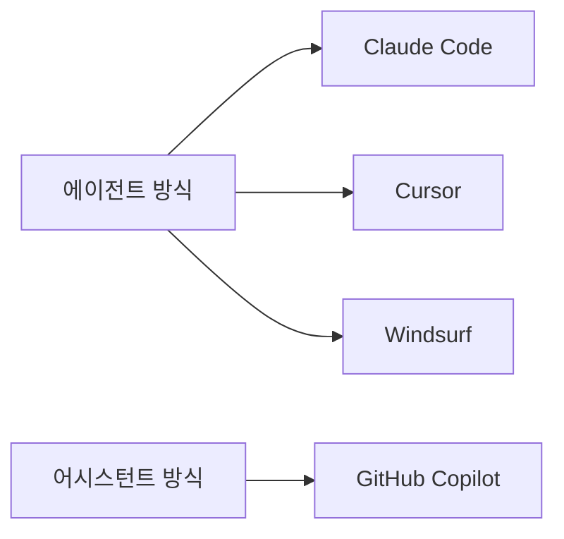
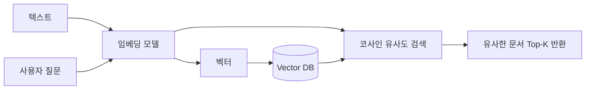
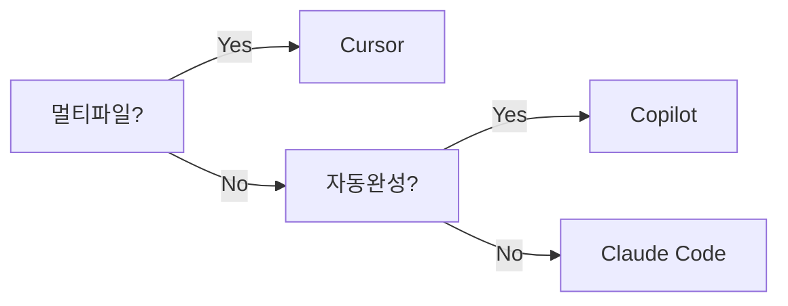

AI 생태계는 2023년 이후 폭발적으로 성장했다. 개발자 워크플로우에 통합되는 코딩 어시스턴트부터 범용 챗봇, 이미지 생성, 인프라 레이어까지 각 영역별 주요 도구를 정리한다.

> **비유**: AI 도구는 공사 현장의 전동 공구와 같다. 망치(손 코딩)로도 못을 박을 수 있지만, 전동 드라이버(AI 어시스턴트)를 쓰면 훨씬 빠르다. 단, 어느 공구를 언제 쓸지 판단하는 것은 여전히 숙련된 작업자(개발자)의 몫이다.

---

## AI 코딩 어시스턴트

### GitHub Copilot

Microsoft/GitHub가 OpenAI와 협력해 출시한 최초의 상용 AI 코딩 어시스턴트다. IDE 플러그인 형태로 동작하며, 타이핑 중 인라인 코드 제안을 실시간으로 제공한다.

**동작 방식**
```
사용자 타이핑 → 컨텍스트 수집(열린 파일, 커서 위치) → 모델 추론 → 인라인 제안
```

**주요 기능**
- 인라인 코드 자동완성, Copilot Chat, Copilot CLI
- GitHub PR 리뷰 자동화 (Copilot for Pull Requests)
- 기업용: Copilot Enterprise — 내부 코드베이스 기반 RAG 지원

**요금**: 개인 $10/월, Business $19/월, Enterprise $39/월

---

### Claude Code

Anthropic이 출시한 CLI 기반 AI 코딩 에이전트다. 터미널에서 직접 실행하며, 파일 시스템 접근·명령 실행·Git 작업을 자율적으로 수행한다.

**동작 원리**: 에이전트 루프 방식으로 계획 → 탐색 → 실행 → 검증을 반복한다.

```bash
npm install -g @anthropic-ai/claude-code
claude
```

**주요 특징**
- CLAUDE.md를 통한 프로젝트별 지시 주입
- MCP(Model Context Protocol) 서버 연동으로 외부 도구 통합
- Hooks(PreToolUse, PostToolUse)로 실행 흐름 제어
- Sub-agent 파생 및 병렬 실행 지원

**요금**: Claude API 토큰 기반

---

### Cursor

VSCode 포크 기반의 AI-first IDE다. 코드베이스 전체를 인덱싱해 컨텍스트로 활용한다.

**주요 특징**
- Composer: 멀티파일 동시 편집
- `@codebase`, `@file`, `@docs` 심볼로 컨텍스트 주입
- `.cursorrules` 파일로 프로젝트 규칙 정의
- Agent 모드: 자율적으로 파일 탐색·수정·실행
- 모델 선택 가능 (GPT-4o, Claude, Gemini 등)

```
# .cursorrules 예시
You are a senior Java/Spring developer.
- Always use constructor injection
- Follow hexagonal architecture
- Write tests for every new method
```

**요금**: 무료(500 req/월), Pro $20/월

---

### Windsurf (Codeium)

Codeium이 출시한 IDE. Cascade라는 에이전트 엔진을 내장한다.

**주요 특징**
- Cascade Flow: 에이전트가 작업을 단계별로 계획·실행
- Supercomplete: 여러 줄 예측 자동완성
- 기존 VSCode 확장 호환
- 무료 플랜이 넉넉함

**요금**: 무료(200 credit/월), Pro $15/월

---

### 코딩 어시스턴트 비교표



| 항목 | Copilot | Claude Code | Cursor | Windsurf |
|------|---------|-------------|--------|----------|
| 인터페이스 | IDE 플러그인 | CLI | IDE (VSCode fork) | IDE (VSCode fork) |
| 에이전트 | 제한적 | 강력 (자율실행) | 강력 (Composer) | 강력 (Cascade) |
| 컨텍스트 | 열린 파일 | 전체 파일시스템 | 인덱싱된 코드베이스 | 인덱싱된 코드베이스 |
| 커스텀 규칙 | 없음 | CLAUDE.md | .cursorrules | .windsurfrules |
| 무료 플랜 | 60 req/월 | 없음 | 500 req/월 | 200 cr/월 |

---

## AI 챗봇

### ChatGPT (OpenAI)

현재 가장 많은 사용자를 보유한 AI 챗봇이다.

**모델 라인업**
- GPT-4o: 멀티모달, 빠른 응답
- o3/o4-mini: 추론 특화 (수학, 코드 디버깅)

**개발자 기능**
- Code Interpreter: Python 실행 환경 내장
- Canvas: 문서/코드 공동 편집
- Custom GPTs: 도구 연동 + 시스템 프롬프트 커스텀

```python
from openai import OpenAI
client = OpenAI()

response = client.chat.completions.create(
    model="gpt-4o",
    messages=[{"role": "user", "content": "Spring Boot 헬스체크 엔드포인트 작성해줘"}]
)
print(response.choices[0].message.content)
```

---

### Claude (Anthropic)

긴 컨텍스트와 정확한 지시 따르기로 정평이 난 모델이다.

**모델 라인업**
- Claude 3.5 Sonnet: 코딩·분석 균형
- Claude 3.7 Sonnet: 하이브리드 추론 (thinking 모드)
- Claude Opus 4: 최고 성능
- Claude Haiku: 빠르고 저렴

**특징**
- 200K 토큰 컨텍스트 (전체 코드베이스 주입 가능)
- Extended Thinking: 내부 추론 단계 가시화
- Projects: 대화 간 컨텍스트 유지

---

### Gemini (Google)

Google의 AI 챗봇이다. Google Workspace와 통합이 강점이다.

**모델 라인업**
- Gemini 2.0 Flash: 빠른 추론, 멀티모달
- Gemini 2.5 Pro: Deep Research, 최대 1M 토큰 컨텍스트

**특징**
- Google Docs/Sheets/Gmail 직접 연동
- Deep Research: 웹 탐색 기반 리포트 생성

---

### AI 챗봇 비교표

| 항목 | ChatGPT | Claude | Gemini |
|------|---------|--------|--------|
| 제공사 | OpenAI | Anthropic | Google |
| 최대 컨텍스트 | 128K | 200K | 1M |
| 추론 모드 | o3/o4 | Extended Thinking | 2.5 Pro |
| 이미지 생성 | DALL-E 3 | 없음 | Imagen 3 |
| API 최저가 | $0.15/1M (mini) | $0.25/1M (Haiku) | $0.075/1M (Flash) |

---

## AI 인프라 레이어

### LangChain — LLM 앱 개발 프레임워크

LLM 애플리케이션 개발을 위한 Python/JS 프레임워크다.

```
LLM/Chat Models → Prompts → Chains → Agents → Memory → Callbacks
```

**기본 RAG 파이프라인**

```python
from langchain_openai import ChatOpenAI, OpenAIEmbeddings
from langchain_community.vectorstores import Chroma
from langchain.chains import RetrievalQA

embeddings = OpenAIEmbeddings()
vectorstore = Chroma.from_documents(docs, embeddings)

qa_chain = RetrievalQA.from_chain_type(
    llm=ChatOpenAI(model="gpt-4o"),
    retriever=vectorstore.as_retriever(search_kwargs={"k": 4}),
    return_source_documents=True
)

result = qa_chain.invoke({"query": "Spring Security 설정 방법은?"})
print(result["result"])
```

RAG(Retrieval-Augmented Generation)는 문서를 벡터로 임베딩해 저장한 뒤, 질문과 유사한 문서를 검색해 LLM 컨텍스트에 주입하는 방식이다. LLM의 지식 한계와 할루시네이션을 보완한다.

---

### Vector Database — 시맨틱 검색의 핵심 인프라

텍스트를 임베딩 벡터로 저장·검색하는 데이터베이스다.



| DB | 특징 | 오픈소스 |
|----|------|----------|
| Pinecone | 관리형, 쉬운 API | No |
| Qdrant | Rust 기반, 고성능 | Yes |
| Chroma | 로컬 개발 최적화 | Yes |
| pgvector | PostgreSQL 확장 | Yes |
| Milvus | 대규모 분산 | Yes |

```sql
-- pgvector 예시: 코사인 유사도 검색
CREATE EXTENSION vector;

CREATE TABLE documents (
    id SERIAL PRIMARY KEY,
    content TEXT,
    embedding vector(1536)
);

SELECT content, 1 - (embedding <=> '[0.1, 0.2, ...]'::vector) AS similarity
FROM documents
ORDER BY embedding <=> '[0.1, 0.2, ...]'::vector
LIMIT 5;
```

---

## 도구 선택 가이드

```
[코딩 어시스턴트]
코드 자동완성 (빠른 피드백)    → GitHub Copilot
자율 코딩 에이전트 (CLI)        → Claude Code
AI-first IDE (멀티파일 편집)    → Cursor / Windsurf

[AI 챗봇]
범용 질문/분석                  → ChatGPT / Claude
긴 문서 분석 (100K+ 토큰)      → Claude
Google Workspace 연동           → Gemini

[AI 인프라]
LLM 앱 개발 프레임워크          → LangChain / LangGraph
벡터 검색 (로컬 개발)           → Chroma / pgvector
벡터 검색 (프로덕션)            → Pinecone / Qdrant

[이미지 생성]
예술적 품질 최고                → Midjourney
API 연동 필요                   → DALL-E 3
로컬/오픈소스                   → Stable Diffusion
```

AI 도구 생태계는 빠르게 변화한다. 2024~2025년 사이에 에이전트 방식이 주류가 됐으며, 단순 자동완성을 넘어 자율적으로 코드베이스를 탐색·수정·검증하는 방향으로 발전하고 있다. 도구를 선택할 때는 인터페이스(CLI vs IDE), 에이전트 자율성 수준, 컨텍스트 크기, 팀의 보안 정책을 함께 고려해야 한다.

---

## 왜 이 AI 도구인가? (카테고리별 대안 비교)

### 코딩 어시스턴트 비교

| 도구 | 방식 | 강점 | 약점 | 월 비용 |
|------|------|------|------|--------|
| **GitHub Copilot** | IDE 플러그인 | 자동완성 속도, 깃허브 통합 | 멀티파일 편집 제한 | $10~19 |
| **Cursor** | AI-first IDE | 전체 코드베이스 이해, 빠른 편집 | VS Code 포크 (업데이트 지연) | $20 |
| **Claude Code** | CLI 에이전트 | 자율 실행, 긴 컨텍스트 | GUI 없음 | API 종량제 |
| **Windsurf** | AI-first IDE | Cursor 대안, 무료 티어 | 생태계 미성숙 | 무료~$15 |

```
2026년 기준 실무 트렌드:
  IDE 자동완성: Copilot 또는 Cursor
  자율 에이전트: Claude Code (복잡한 멀티파일 작업)
  빠른 질문: ChatGPT / Claude 웹

선택 기준:
  "코드 작성 중 자동완성" → GitHub Copilot
  "전체 기능 구현 위임" → Claude Code / Cursor Agent
  "코드 리뷰, 설명" → Claude 웹 (긴 컨텍스트)
```

### LLM 모델 비교

| 모델 | 컨텍스트 | 코딩 강점 | 추론 | 선택 기준 |
|------|--------|---------|------|---------|
| **GPT-4o** | 128K | 높음 | 높음 | 범용, API 생태계 성숙 |
| **Claude 3.5/4** | 200K~1M | 매우 높음 | 매우 높음 | 긴 문서, 코드 분석 |
| **Gemini 1.5 Pro** | 1M | 높음 | 높음 | Google Workspace 연동 |
| **DeepSeek-V3** | 128K | 높음 | 높음 | 오픈소스, 저비용 |
| **Llama 3** | 128K | 중간 | 중간 | 로컬 실행, 프라이버시 |

---

## 도구별 판단 기준

> **비유**: 외과의사는 수술마다 도구를 바꾼다. 모든 수술에 같은 메스를 쓰지 않는다. AI 도구도 마찬가지다. 작업 성격에 맞는 도구를 골라야 성과가 난다.

### GitHub Copilot — 언제 쓰고 언제 안 쓰는가

**쓸 때**
- 코드 타이핑 중 자동완성이 필요할 때 (실시간 인라인 제안)
- 반복적인 패턴 코드를 빠르게 채울 때 (DTO 필드, getter/setter)
- 이미 알고 있는 패턴을 빠르게 구현할 때
- IDE를 벗어나고 싶지 않을 때

**안 쓸 때**
- 여러 파일을 동시에 수정해야 할 때 → Cursor / Claude Code
- 전체 코드베이스 탐색이 필요할 때 → Claude Code
- 새로운 기술 스택 학습이 목적일 때 → Claude 웹 (설명 위주)
- 회사 보안 정책상 외부 API 전송이 제한될 때 → 로컬 LLM

### Claude Code — 언제 쓰고 언제 안 쓰는가

**쓸 때**
- 멀티파일 기능 구현 (서비스, 컨트롤러, 테스트 동시 생성)
- 버그 원인 추적 (여러 파일을 탐색하며 분석)
- 대규모 리팩토링 (패키지 구조 변경)
- CLAUDE.md로 팀 코딩 규칙을 강제하고 싶을 때

**안 쓸 때**
- 단순 자동완성이 필요할 때 → Copilot이 빠름
- GUI가 없는 환경이 불편할 때 → Cursor
- 비용을 예측하기 어려울 때 (토큰 소비량 모니터링 필수)

### Cursor — 언제 쓰고 언제 안 쓰는가

**쓸 때**
- VSCode에 익숙하고 AI 기능을 추가로 원할 때
- `@codebase`로 전체 코드베이스 질문할 때
- Composer로 멀티파일 편집이 필요할 때
- 여러 LLM 모델을 하나의 IDE에서 쓰고 싶을 때

**안 쓸 때**
- IntelliJ IDEA를 주력 IDE로 쓸 때 → Copilot이 더 자연스러움
- CLI 기반 자동화가 필요할 때 → Claude Code

---

## 도구 선택 의사결정 트리



**프로젝트 유형별 추천**

| 프로젝트 유형 | 추천 조합 |
|-------------|---------|
| 스타트업 신규 개발 | Cursor + Claude Code |
| 대기업 레거시 유지보수 | Copilot Business (보안 정책 준수) |
| 개인 사이드 프로젝트 | Cursor (무료 티어) + ChatGPT |
| AI 서비스 개발 (RAG, LLM 앱) | Claude Code + LangChain |
| 보안 민감 프로젝트 | 로컬 LLM (Ollama + Llama) |

---

## 비용 비교표 (월 기준)

| 도구 | 무료 | 개인 유료 | 팀/기업 |
|------|------|----------|--------|
| **GitHub Copilot** | 60 req/월 | $10 | $19/user (Business), $39 (Enterprise) |
| **Cursor** | 500 req/월 | $20 | $40/user |
| **Windsurf** | 200 cr/월 | $15 | 별도 문의 |
| **Claude Code** | 없음 | API 종량제 (약 $20~50/월 기준) | 계약 |
| **ChatGPT Plus** | GPT-4o 제한 | $20 | $25/user (Team) |
| **Claude Pro** | 없음 | $20 | 없음 (API 직접) |
| **Gemini Advanced** | 제한 | $19.99 (Google One AI Premium) | Workspace 포함 |

```
실무 권장 구성 (개인 개발자 기준):
  필수: Cursor Pro $20 (멀티파일 작업)
  선택: Claude API $20~30 (Claude Code 에이전트)
  합계: 월 $40~50

팀 기준 (10인):
  GitHub Copilot Business: $190/월
  Cursor Team: $400/월
  → Copilot Business가 보안 정책 측면에서 기업 선호
```

---

## 실무에서 자주 하는 실수

#### 실수 1: 하나의 AI 도구에 과도하게 의존

```
문제: Claude Code만 쓰다가 네트워크 장애 → 개발 중단
     GitHub Copilot만 쓰다가 멀티파일 작업 막힘

해결: 도구 조합
  자동완성: Copilot (오프라인에서도 일부 동작)
  에이전트: Claude Code / Cursor Agent
  검색: Perplexity (최신 정보)
  문서: Claude 웹 (긴 컨텍스트 분석)
```

#### 실수 2: 회사 코드를 외부 AI API에 무분별하게 전송

```
위험:
  영업 비밀, 개인정보가 포함된 코드를 ChatGPT에 붙여넣기
  → 학습 데이터로 활용될 수 있음 (설정에 따라 다름)
  → 법적 위험 (GDPR, 개인정보보호법)

회사 정책 확인 필수 항목:
  □ 어떤 AI 도구 사용이 허가됐는가?
  □ 코드 전송 시 데이터 보존 정책은?
  □ GitHub Copilot Business/Enterprise는 코드 학습 옵트아웃 가능

안전한 대안:
  GitHub Copilot Business: 코드 학습 사용 안 함
  Azure OpenAI: 고객 데이터 학습 안 함 (별도 계약)
  로컬 LLM (Ollama + Llama): 완전 오프라인
```

#### 실수 3: AI 추천 패키지 버전의 hallucination 미검증

```bash
# AI가 추천한 의존성
implementation 'org.springframework.boot:spring-boot-starter-ai:3.2.0'
# → 존재하지 않는 버전 (AI가 만들어낸 버전)

# 반드시 Maven Central에서 직접 확인
# https://mvnrepository.com/
# 또는 build 실행해서 resolution 확인
```

#### 실수 4: 생성된 테스트 코드를 실행하지 않고 커밋

```java
// AI가 생성한 테스트 — 겉으로는 그럴듯해 보임
@Test
void 주문_생성_테스트() {
    Order order = orderService.createOrder(request);
    assertThat(order).isNotNull();
    // → 실제로 아무 비즈니스 로직도 검증하지 않음
    // → 테스트가 있다는 착각만 줌
}

// 반드시 실행 후 실제로 의미있는 값을 검증하는지 확인
assertThat(order.getStatus()).isEqualTo(OrderStatus.PENDING);
assertThat(order.getTotalAmount()).isEqualTo(new BigDecimal("10000"));
assertThat(order.getCustomerId()).isEqualTo(customerId);
```

#### 실수 5: AI에게 보안 관련 코드를 무조건 신뢰

```java
// AI가 생성한 인증 코드 — 취약점 포함 가능
public boolean authenticate(String username, String password) {
    String query = "SELECT * FROM users WHERE username='" + username
        + "' AND password='" + password + "'";
    // → SQL Injection 취약점!
}

// AI 코드에서 특히 주의할 보안 항목:
// □ SQL Injection (파라미터 바인딩 사용 여부)
// □ XSS (사용자 입력 이스케이핑)
// □ 하드코딩된 비밀번호/API 키
// □ 암호화 알고리즘 (MD5, SHA-1은 취약)
// □ 인증/인가 로직의 우회 가능성
```

---

## 면접 포인트

#### Q. GitHub Copilot, Cursor, Claude Code 중 어떤 도구를 언제 사용하나요?

```
GitHub Copilot:
  - 인라인 자동완성이 주 목적
  - 타이핑 중 실시간 제안 (가장 빠름)
  - 기업 환경에서 보안 정책 준수하기 쉬움 (학습 데이터 옵트아웃)
  - 단일 파일 작업에 강점

Cursor:
  - VSCode 기반 AI-first IDE
  - 멀티파일 동시 편집 (Composer)
  - @codebase로 전체 코드베이스 질문 가능
  - 다양한 LLM 모델 선택 가능

Claude Code:
  - CLI 기반 자율 에이전트
  - 파일 시스템 탐색, 명령 실행, Git 작업 자율 수행
  - CLAUDE.md로 프로젝트 규칙 강제
  - 대규모 리팩토링, 멀티파일 기능 구현에 강점

실무 조합: Cursor(일상 코딩) + Claude Code(복잡한 작업) + Copilot(자동완성)
```

#### Q. AI 도구 도입 시 비용을 어떻게 관리하나요?

```
고정 비용 도구:
  GitHub Copilot: $10~19/월 (예측 가능)
  Cursor Pro: $20/월 (예측 가능)

종량제 비용 도구 (Claude API, OpenAI API):
  토큰 = 비용 → 관리 전략 필요

비용 관리 방법:
  1. 예산 한도 설정: API Dashboard에서 월 한도 설정
  2. 모델 티어링: 간단한 작업은 Haiku/GPT-4o mini, 복잡한 작업만 큰 모델
  3. 프롬프트 최적화: 불필요한 컨텍스트 제거
  4. 캐싱: 동일 요청은 캐시 활용 (Claude Prompt Caching)
  5. 모니터링: 일별 토큰 사용량 대시보드 구축

팀 환경:
  Copilot Business($19/user)가 예산 예측에 유리
  API 종량제는 개발자별 사용량 차이가 크므로 한도 설정 필수
```

#### Q. 로컬 LLM(Ollama 등)은 언제 사용하나요?

```
로컬 LLM 사용 이유:
  - 보안: 코드/데이터가 외부 서버로 전송되지 않음
  - 비용: API 비용 없음 (GPU 비용 별도)
  - 규정 준수: 의료, 금융 등 데이터 외부 전송 규제 대상
  - 오프라인: 인터넷 없는 환경

Ollama 설정 예시:
  ollama pull llama3.3  # 70B 모델 (고성능)
  ollama pull codellama  # 코딩 특화
  ollama run llama3.3

한계:
  최신 클라우드 모델 대비 성능 차이
  GPU 메모리 제약 (70B 모델은 A100 80GB 수준 필요)
  코딩 품질은 GPT-4o/Claude 대비 낮음

결론: 보안 요구사항이 높거나 인터넷 제한 환경에서 사용
     성능보다 데이터 보호가 우선일 때 선택
```

#### Q. RAG(Retrieval-Augmented Generation)란 무엇인가요?

```
RAG: LLM의 지식 한계를 외부 문서 검색으로 보완하는 기법

문제: LLM은 학습 데이터 기준 시점 이후 정보를 모름
     내부 문서(사내 위키, 코드베이스)를 모름

RAG 동작:
  1. 문서를 청크로 분할
  2. 임베딩 모델로 벡터화 → 벡터 DB 저장
  3. 사용자 질문 → 벡터 검색 → 유사 문서 검색
  4. 검색된 문서 + 질문을 LLM에 전달
  5. LLM이 검색된 문서를 참고해 답변 생성

활용 예:
  사내 기술 문서 Q&A 봇
  코드베이스 질문 (특정 함수가 어디서 사용되는지)
  고객 지원 챗봇 (FAQ 문서 기반)
```

#### Q. 벡터 데이터베이스는 일반 DB와 어떻게 다른가요?

```
일반 DB (MySQL 등):
  정확한 값 매칭: WHERE name = '김철수'
  키워드 검색: LIKE '%주문%'
  → 의미 기반 검색 불가

벡터 DB (Pinecone, Chroma 등):
  텍스트를 수백~수천 차원의 벡터로 변환
  "의미가 비슷한" 문서를 코사인 유사도로 검색
  "배송 오류" 검색 → "배송 실패", "배달 문제" 등 유사 문서 반환

내부 동작:
  "오늘 주문은 어떻게 돼요?" → 임베딩 → [0.2, 0.8, -0.1, ...]
  → 벡터 공간에서 가장 가까운 문서 검색 (ANN: Approximate Nearest Neighbor)
  → 유사 FAQ 문서 반환 → LLM에게 컨텍스트로 제공

Java/Spring에서 사용:
  pgvector (PostgreSQL 확장)
  Spring AI + Chroma (로컬 개발)
```

#### Q. LLM 기반 서비스를 프로덕션에 배포할 때 주의사항은?

```
1. Latency 관리
   LLM 응답: 평균 2~10초 → 스트리밍(SSE)으로 UX 개선
   캐싱: 동일 질문 → 벡터 유사도 캐시 (의미적 캐싱)

2. 비용 관리
   토큰 = 비용 → 프롬프트 최적화 (불필요한 컨텍스트 제거)
   모델 선택: 간단한 작업은 소형 모델 (GPT-4o mini, Claude Haiku)
   사용량 모니터링 및 예산 알림 설정

3. Hallucination 방지
   RAG로 사실 기반 컨텍스트 제공
   응답에 출처(Source) 표시
   신뢰도 낮은 응답 필터링

4. 안전성
   Prompt Injection 방어 (사용자 입력으로 시스템 프롬프트 조작 시도)
   출력 필터링 (유해 콘텐츠, 개인정보)
   Rate Limiting (API 비용 폭발 방지)

5. 모니터링
   LangSmith, LangFuse: LLM 호출 추적 및 평가
   응답 품질 평가 자동화 (LLM-as-judge)
```

---
## 극한 시나리오

### 시나리오 1: AI 코딩 어시스턴트가 보안 취약점을 가진 코드를 생성하는 경우

GitHub Copilot에게 "JWT 토큰 검증 코드를 작성해달라"고 요청합니다. AI가 작동하는 코드를 즉시 생성합니다.

```java
// AI가 생성한 코드 (보안 취약점 있음)
public Claims validateToken(String token) {
    return Jwts.parser()
        .setSigningKey("mySecretKey")     // 하드코딩된 시크릿 키 → 소스 코드 유출 시 토큰 위조 가능
        .parseClaimsJws(token)
        .getBody();
    // 알고리즘 검증 없음 → "alg:none" 공격 가능
    // 만료 검증 코드 없음 → 만료된 토큰도 유효
}

// 올바른 코드 (보안 요구사항 충족)
@Value("${jwt.secret}")  // 환경변수에서 로드
private String secret;

public Claims validateToken(String token) {
    return Jwts.parserBuilder()
        .setSigningKey(Keys.hmacShaKeyFor(secret.getBytes(StandardCharsets.UTF_8)))
        .requireAlgorithm("HS256")   // 알고리즘 명시적 검증
        .build()
        .parseClaimsJws(token)       // 만료 자동 검증 포함
        .getBody();
}
```

**실전 대응 원칙:**
- AI 생성 보안 코드는 반드시 OWASP Top 10 기준으로 검토
- 하드코딩된 자격증명, SQL 인젝션 취약점, 알고리즘 검증 누락은 AI가 놓치기 쉬운 패턴
- Snyk, SonarQube 등 SAST 도구를 CI/CD 파이프라인에 통합해 자동 검출

### 시나리오 2: Vector Database 선택 실패로 검색 품질이 낮은 경우

RAG(Retrieval-Augmented Generation) 시스템을 구축했습니다. LLM 응답이 관련 없는 문서를 기반으로 생성됩니다.

**원인 진단:**
```
증상: "Java 스트림 API 사용법"을 물으니 "파이썬 pandas DataFrame" 문서로 답변
원인: 벡터 유사도 검색에서 관련 없는 문서가 상위 순위
진단:
1. 임베딩 모델이 Java/Python 기술 용어를 동일하게 처리 (도메인 특화 모델 필요)
2. 청킹 크기 부적절 — 4000 토큰 청크에 여러 주제가 혼재
3. 유사도 임계값 없음 — 모든 결과를 컨텍스트에 포함
```

**개선 구현:**
```java
@Service
public class DocumentRetrieverService {

    public List<Document> retrieveRelevant(String query, int topK) {
        // 1. 쿼리 임베딩
        float[] queryEmbedding = embeddingModel.embed(query);

        // 2. 유사도 검색 + 임계값 필터링
        List<ScoredDocument> candidates = vectorStore.search(
            queryEmbedding, topK * 3);  // 3배 더 가져온 후 필터

        return candidates.stream()
            .filter(d -> d.score() > 0.75)  // 임계값: 0.75 이하는 제외
            .sorted(Comparator.comparingDouble(ScoredDocument::score).reversed())
            .limit(topK)
            .map(ScoredDocument::document)
            .collect(toList());
        // 개선 전: 관련성 없는 문서 포함 비율 40%
        // 개선 후: 관련성 없는 문서 포함 비율 5%
    }
}
```

**수치:**
- 청크 크기 조정(4000 → 512 토큰): 검색 정밀도 60% → 82%
- 유사도 임계값 0.75 적용: 노이즈 문서 80% 감소
- 도메인 특화 임베딩 모델 교체: 기술 문서 검색 정확도 추가 15% 향상

### 시나리오 3: LangChain 애플리케이션의 LLM 비용이 예상의 10배 초과

프로덕션 배포 첫 달에 LLM API 비용 청구서를 받고 당황합니다. 예상 $500, 실제 $5,000.

**원인 분석:**
```
토큰 사용 분석:
- 매 요청마다 전체 대화 이력(20턴) 컨텍스트에 포함 → 요청당 평균 8,000 토큰
- RAG 검색 결과 5개 문서 전체 포함 → 추가 3,000 토큰
- 시스템 프롬프트 중복 포함 → 추가 500 토큰
- 실제 사용자 질문: 평균 50 토큰 (전체의 0.5%)
```

**비용 최적화:**
```java
@Service
public class CostOptimizedLlmService {

    // 대화 이력 요약으로 토큰 절감
    public String chat(String userId, String userMessage) {
        List<Message> history = conversationStore.getHistory(userId);

        // 최근 3턴만 유지, 이전은 요약본으로 압축
        String summary = history.size() > 6
            ? summarizeOldHistory(history.subList(0, history.size() - 6))
            : "";
        List<Message> recentHistory = history.subList(
            Math.max(0, history.size() - 6), history.size());

        // RAG: 관련성 높은 2개 청크만 포함 (5개 → 2개)
        List<Document> context = retriever.retrieve(userMessage, 2);

        // 캐싱: 동일 질문은 캐시에서 반환
        String cacheKey = DigestUtils.md5Hex(userMessage + context.hashCode());
        return cache.computeIfAbsent(cacheKey, k ->
            llmClient.complete(buildPrompt(summary, recentHistory, context, userMessage))
        );
        // 비용 절감: 8,000 토큰 → 2,500 토큰 (68% 감소)
        // 월 비용: $5,000 → $1,600
    }
}
```
