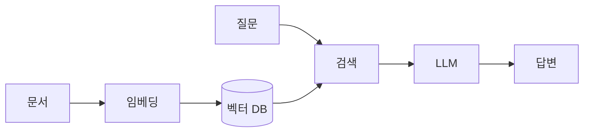
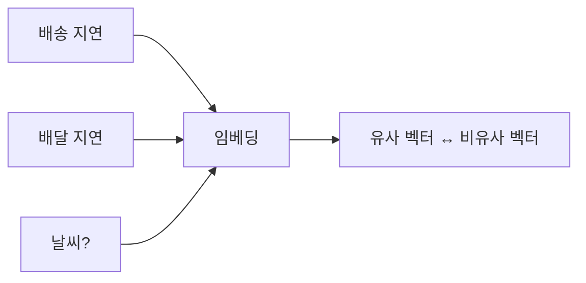
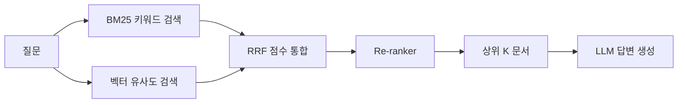

ChatGPT에게 "우리 회사 API 문서를 설명해줘"라고 물으면 모른다고 한다. 학습 데이터에 없기 때문이다. RAG(Retrieval-Augmented Generation)는 이 문제를 해결하는 현재 가장 실용적인 방법이다. 회사 내부 문서, 코드베이스, 고객 FAQ를 AI에게 실시간으로 주입해 정확한 답변을 끌어낸다.

> **비유**: LLM 단독 사용은 백과사전을 통째로 외운 학자에게 질문하는 것과 같다. 최신 정보나 회사 내부 정보는 모른다. RAG는 그 학자에게 도서관 검색 시스템을 연결한 것이다. 질문이 오면 관련 문서를 검색해 읽고 답변한다.

---

## 왜 RAG인가

LLM에게 회사 데이터를 학습시키는 방법은 세 가지다. 각 방법의 차이를 명확히 이해해야 올바른 선택을 할 수 있다.

### Fine-tuning vs RAG vs Prompt Engineering

| 방법 | 원리 | 비용 | 최신성 | 적합한 경우 |
|------|------|------|--------|-----------|
| **Prompt Engineering** | 질문에 문서를 직접 붙여넣기 | 낮음 | 실시간 | 문서가 적고 단순한 경우 |
| **RAG** | 검색 후 관련 문서만 주입 | 중간 | 실시간 | 대용량 문서, 자주 업데이트 |
| **Fine-tuning** | 모델 가중치 재학습 | 매우 높음 | 학습 시점 고정 | 특정 말투/스타일 학습 |

```
Fine-tuning의 오해:
  "내 문서로 학습시키면 완벽하겠지" → 틀린 생각

  Fine-tuning은 모델의 "스타일"과 "형식"을 바꾸는 데 효과적
  문서의 "내용"을 정확히 기억시키는 것은 RAG가 훨씬 효과적

  이유:
  - 학습 데이터를 완벽히 암기하지 않음 (일반화 학습)
  - 문서가 업데이트되면 재학습 필요 → 비용 폭발
  - 할루시네이션 문제가 여전히 존재

결론: 사내 문서 Q&A, 코드베이스 질의응답 → RAG
     특정 전문 도메인 문체 학습 → Fine-tuning + RAG 조합
```

---

## RAG 파이프라인 전체 구조

RAG는 두 단계로 나뉜다. 문서를 미리 처리해 저장하는 **인덱싱 파이프라인**과, 사용자 질문에 답변하는 **검색-생성 파이프라인**이다.



---

## 청킹 전략

청킹(Chunking)은 긴 문서를 LLM 컨텍스트에 맞게 조각내는 과정이다. **청킹 전략이 RAG 품질의 70%를 결정한다.**

> **비유**: 도서관에서 책 전체를 복사하는 것과 관련 페이지만 복사하는 것의 차이다. 관련 없는 내용이 많을수록 LLM이 핵심을 찾기 어려워진다.

### 고정 크기 청킹

가장 단순한 방법. 정해진 토큰 수로 잘라낸다.

```python
from langchain.text_splitter import CharacterTextSplitter

splitter = CharacterTextSplitter(
    chunk_size=500,      # 청크당 최대 500 토큰
    chunk_overlap=50,    # 앞뒤 50 토큰 겹침 (문맥 유지)
    separator="\n"
)
chunks = splitter.split_text(document)
```

```
장점: 구현 단순, 예측 가능한 크기
단점: 문장 중간에서 잘릴 수 있음
     "최대 주문 금액은 100만원이며, 단" ← 잘린 문맥
적합: 구조가 없는 텍스트 (뉴스, 일반 문서)
```

### 의미 단위 청킹 (Semantic Chunking)

문장 간 의미 변화를 감지해 자른다.

```python
from langchain_experimental.text_splitter import SemanticChunker
from langchain_openai import OpenAIEmbeddings

splitter = SemanticChunker(
    OpenAIEmbeddings(),
    breakpoint_threshold_type="percentile",
    breakpoint_threshold_amount=95  # 상위 5% 의미 변화 지점에서 분리
)
chunks = splitter.create_documents([document])
```

```
장점: 의미 단위로 자름 → 검색 품질 향상
단점: 임베딩 비용 발생, 처리 시간 증가
적합: 기술 문서, API 문서, 법률 문서
```

### 재귀적 청킹 (Recursive Chunking)

구조(단락 → 문장 → 단어) 순으로 재귀적으로 분리한다. **가장 범용적이며 실무에서 가장 많이 사용한다.**

```python
from langchain.text_splitter import RecursiveCharacterTextSplitter

splitter = RecursiveCharacterTextSplitter(
    chunk_size=1000,
    chunk_overlap=100,
    separators=["\n\n", "\n", ".", "!", "?", ",", " ", ""]
    # 우선순위 순으로 시도: 단락 → 줄바꿈 → 문장 → 단어
)
chunks = splitter.split_documents(documents)
```

### 청킹 크기 선택 기준

```
청크가 너무 작으면 (< 200 토큰):
  문맥 부족 → "최대 주문 금액은" → 뒤에 숫자가 없음
  검색 정확도 저하

청크가 너무 크면 (> 2000 토큰):
  관련 없는 내용 포함 → LLM이 혼란
  비용 증가 (토큰 = 비용)

권장:
  일반 문서: 500~1000 토큰, overlap 10~20%
  코드: 함수 단위 분리 (RecursiveCharacterTextSplitter + language 옵션)
  표/구조화 데이터: 행 단위 유지
```

---

## 임베딩 모델 비교

임베딩은 텍스트를 수백~수천 차원의 숫자 벡터로 변환하는 과정이다. 의미가 비슷한 텍스트일수록 벡터 공간에서 가까운 위치에 놓인다.



V1과 V2는 가깝고(유사), V3는 멀다(비유사).

### 임베딩 모델 비교

| 모델 | 차원 | 최대 토큰 | 비용 | 특징 |
|------|------|----------|------|------|
| **OpenAI text-embedding-3-small** | 1536 | 8191 | $0.02/1M 토큰 | 성능/비용 균형, 가장 많이 사용 |
| **OpenAI text-embedding-3-large** | 3072 | 8191 | $0.13/1M 토큰 | 최고 성능, 비용 높음 |
| **Cohere embed-v3** | 1024 | 512 | $0.10/1M 토큰 | 다국어 강점 |
| **BGE-M3 (로컬)** | 1024 | 8192 | 무료 | 한국어 포함 다국어, 오픈소스 |
| **ko-sroberta (로컬)** | 768 | 512 | 무료 | 한국어 특화 |

```
한국어 문서 처리 시 주의사항:
  OpenAI ada-002 → 한국어도 처리하지만 영어 대비 품질 떨어짐
  BGE-M3 → 다국어 지원, 한국어 품질 우수, 로컬 실행 가능
  ko-sroberta → 한국어 전용, 가볍고 빠름

실무 추천:
  빠른 프로토타입: text-embedding-3-small
  한국어 서비스 프로덕션: BGE-M3 (비용 0, 성능 우수)
```

---

## 벡터 DB 비교

| DB | 언어 | 호스팅 | 특징 | 선택 기준 |
|----|------|--------|------|----------|
| **Pinecone** | 관리형 | 클라우드 | 완전 관리형, 쉬운 API | 빠른 시작, 관리 부담 없애고 싶을 때 |
| **Weaviate** | Go | 자체/클라우드 | 그래프+벡터, 다양한 모듈 | 복잡한 메타데이터 필터링 |
| **Chroma** | Python | 로컬/서버 | 가장 단순, 로컬 개발 최적 | 개발 환경, 프로토타입 |
| **pgvector** | C (PG 확장) | 자체 | PostgreSQL 안에서 벡터 검색 | 이미 PostgreSQL 사용 중인 팀 |
| **Qdrant** | Rust | 자체/클라우드 | 고성능, 필터링 강력 | 대규모 프로덕션 |
| **Milvus** | Go/C++ | 자체/클라우드 | 분산 아키텍처 | 수억 건 이상 대규모 |

```
선택 가이드:
  "이미 PostgreSQL 쓰는 팀" → pgvector (추가 인프라 없음)
  "빠르게 프로토타입" → Chroma (pip install chromadb 끝)
  "프로덕션, 관리 부담 없음" → Pinecone
  "대규모, 자체 호스팅" → Qdrant / Milvus
```

```sql
-- pgvector: PostgreSQL에서 벡터 검색
CREATE EXTENSION IF NOT EXISTS vector;

CREATE TABLE documents (
    id      BIGSERIAL PRIMARY KEY,
    content TEXT NOT NULL,
    source  VARCHAR(500),
    embedding vector(1536)  -- text-embedding-3-small 차원
);

-- 인덱스 생성 (IVFFlat: 근사 최근접 이웃)
CREATE INDEX ON documents
    USING ivfflat (embedding vector_cosine_ops)
    WITH (lists = 100);

-- 코사인 유사도 검색 (Top 5)
SELECT content, source,
       1 - (embedding <=> $1::vector) AS similarity
FROM documents
ORDER BY embedding <=> $1::vector
LIMIT 5;
```

---

## 검색 품질 향상

### 하이브리드 검색 전략 비교



### 하이브리드 검색 (키워드 + 벡터)

순수 벡터 검색은 정확한 키워드(제품 코드, 고유명사)를 놓칠 수 있다. 키워드 검색(BM25)과 벡터 검색을 결합한다.

```python
from langchain.retrievers import EnsembleRetriever
from langchain_community.retrievers import BM25Retriever
from langchain_community.vectorstores import Chroma

# BM25: 키워드 기반 (TF-IDF 방식)
bm25_retriever = BM25Retriever.from_documents(docs, k=4)

# 벡터 검색
vector_retriever = vectorstore.as_retriever(search_kwargs={"k": 4})

# 앙상블: 두 방식 결합 (가중치 조정 가능)
ensemble = EnsembleRetriever(
    retrievers=[bm25_retriever, vector_retriever],
    weights=[0.4, 0.6]  # 벡터 검색에 더 높은 가중치
)
```

```
언제 하이브리드가 필요한가:
  "주문번호 ORD-2024-001234 상태 확인" → 정확한 코드 검색 필요
  "배송 관련 정책" → 의미 기반 검색 필요
  → 두 방식을 결합하면 두 케이스 모두 처리
```

### Re-ranking

검색된 문서 Top-K를 더 정교한 모델로 재정렬한다.

```python
from langchain.retrievers import ContextualCompressionRetriever
from langchain_cohere import CohereRerank

# 1차 검색: 벡터 검색으로 Top 20 가져옴
base_retriever = vectorstore.as_retriever(search_kwargs={"k": 20})

# 2차 정렬: Cohere Re-rank 모델로 실제 관련성 재평가 → Top 5 선택
compressor = CohereRerank(model="rerank-multilingual-v3.0", top_n=5)

retriever = ContextualCompressionRetriever(
    base_compressor=compressor,
    base_retriever=base_retriever
)
```

```
Re-ranking 효과:
  벡터 유사도: 텍스트의 전반적 의미 유사도 (빠름)
  Re-rank 모델: 질문과 문서의 실제 관련성 정밀 평가 (느리지만 정확)

  Top-20 검색 후 Top-5로 줄이는 방식이 비용과 품질의 균형
```

---

## 프롬프트 엔지니어링 — 출처 인용 강제

RAG에서 가장 중요한 프롬프트 원칙은 **"검색된 문서에만 기반해 답변하고, 모르면 모른다고 해라"** 다.

```python
from langchain.prompts import PromptTemplate

RAG_PROMPT = PromptTemplate(
    template="""당신은 회사 내부 문서 기반 Q&A 어시스턴트입니다.
반드시 아래 [참고 문서]에 있는 내용만 사용해 답변하세요.
[참고 문서]에 답이 없으면 "제공된 문서에서 해당 정보를 찾을 수 없습니다"라고 답하세요.
절대 추측하거나 외부 지식을 사용하지 마세요.

[참고 문서]
{context}

[질문]
{question}

[답변]
(출처를 반드시 명시하세요: 예) 출처: 배송정책_v2.pdf, 3페이지)
""",
    input_variables=["context", "question"]
)
```

```
출처 명시가 중요한 이유:
  사용자가 원본 문서를 확인할 수 있음
  할루시네이션 발생 시 추적 가능
  신뢰도 향상 (근거 있는 답변)
```

---

## Spring Boot + LangChain4j 구현 예시

Java/Spring Boot 환경에서 RAG를 구현하는 가장 현실적인 방법이다.

```xml
<!-- pom.xml -->
<dependency>
    <groupId>dev.langchain4j</groupId>
    <artifactId>langchain4j-spring-boot-starter</artifactId>
    <version>0.36.0</version>
</dependency>
<dependency>
    <groupId>dev.langchain4j</groupId>
    <artifactId>langchain4j-pgvector</artifactId>
    <version>0.36.0</version>
</dependency>
```

```java
// RAG 설정
@Configuration
public class RagConfig {

    @Bean
    public EmbeddingStore<TextSegment> embeddingStore(DataSource dataSource) {
        return PgVectorEmbeddingStore.datasourceBuilder()
            .datasource(dataSource)
            .table("rag_documents")
            .dimension(1536)
            .build();
    }

    @Bean
    public EmbeddingModel embeddingModel() {
        return OpenAiEmbeddingModel.builder()
            .apiKey(System.getenv("OPENAI_API_KEY"))
            .modelName("text-embedding-3-small")
            .build();
    }

    @Bean
    public ContentRetriever contentRetriever(
            EmbeddingStore<TextSegment> store,
            EmbeddingModel model) {
        return EmbeddingStoreContentRetriever.builder()
            .embeddingStore(store)
            .embeddingModel(model)
            .maxResults(5)
            .minScore(0.7)  // 유사도 0.7 미만 문서는 제외
            .build();
    }
}
```

```java
// AI 서비스 인터페이스 (LangChain4j가 구현체 자동 생성)
@AiService
public interface DocumentQaService {

    @SystemMessage("""
        당신은 회사 내부 문서 기반 Q&A 어시스턴트입니다.
        제공된 문서에만 기반해 답변하고, 정보가 없으면 없다고 말하세요.
        """)
    String answer(@UserMessage String question);
}
```

```java
// 문서 인덱싱
@Service
@RequiredArgsConstructor
public class DocumentIndexService {

    private final EmbeddingStore<TextSegment> embeddingStore;
    private final EmbeddingModel embeddingModel;

    public void indexDocument(String filePath) {
        // 1. 문서 로드
        Document document = FileSystemDocumentLoader.loadDocument(filePath);

        // 2. 청킹 (재귀적 방식)
        DocumentSplitter splitter = DocumentSplitters.recursive(500, 50);
        List<TextSegment> segments = splitter.split(document);

        // 3. 임베딩 생성
        Response<List<Embedding>> embeddings =
            embeddingModel.embedAll(segments);

        // 4. 벡터 DB 저장
        embeddingStore.addAll(embeddings.content(), segments);
    }
}
```

---

## 실무 실수 5개

#### 실수 1: 청킹 크기를 기본값으로만 사용

```
증상: 검색 결과가 엉뚱하거나 불완전한 답변
원인: 기본 chunk_size=200이 문서 특성에 맞지 않음

해결:
  문서 분석 → 평균 단락 길이 측정
  다양한 청크 크기로 평가 실험 (RAGAS 등 평가 도구 활용)
  코드 문서: 함수 단위 / 기술 문서: 500~1000 토큰 / FAQ: Q&A 쌍 단위
```

#### 실수 2: 할루시네이션 검증 없이 답변 노출

```java
// 위험: 검색된 문서와 답변의 일치 여부 검증 없음
String answer = qaService.answer(question);
return answer;  // 할루시네이션일 수 있음

// 개선: 출처 문서 함께 반환하고 UI에서 표시
record QaResponse(String answer, List<String> sources, double confidence) {}

// 신뢰도 낮으면 "확인이 필요합니다" 메시지 추가
if (response.confidence() < 0.8) {
    answer = answer + "\n\n※ 이 답변은 확인이 필요합니다. 원본 문서를 참조하세요.";
}
```

#### 실수 3: 메타데이터 없이 저장

```python
# 나쁜 예: 텍스트만 저장
vectorstore.add_texts(chunks)

# 좋은 예: 메타데이터 포함
vectorstore.add_texts(
    texts=chunks,
    metadatas=[{
        "source": "배송정책_v2.pdf",
        "page": 3,
        "updated_at": "2026-03-01",
        "department": "물류팀"
    } for chunk in chunks]
)
# → 검색 후 출처 표시 가능, 부서별 필터링 가능
```

#### 실수 4: 문서 업데이트 시 중복 인덱싱

```
증상: 같은 내용이 두 번 검색됨 (문서를 수정 후 다시 인덱싱)
원인: 기존 벡터를 삭제하지 않고 새로 추가

해결:
  문서 ID 기반 관리
  업데이트 시: DELETE WHERE source = '문서명' → 재인덱싱
  해시 기반 변경 감지 (파일 해시가 같으면 건너뜀)
```

#### 실수 5: 검색 결과 개수(k)를 너무 크게 설정

```
k=20으로 설정 → 관련 없는 문서 18개 + 관련 문서 2개
→ LLM 컨텍스트가 노이즈로 가득 → 품질 저하 + 비용 증가

권장:
  k=3~7이 대부분의 경우 최적
  minScore(유사도 임계값) 설정으로 관련 없는 문서 차단
  Re-ranking으로 Top-20 → Top-5 정제
```

---

## 극한 시나리오 3개

### 시나리오 1: 문서 100만 건 처리

사내 위키, 지라 티켓, 코드 리뷰 댓글, 이메일이 합산 100만 건이다.

```
문제점:
  일괄 임베딩 API 호출 → 비용 폭발 + 속도 한계
  벡터 DB 검색 성능 저하

해결 전략:
  1. 배치 처리: 1000건씩 묶어 비동기 임베딩 (Kafka/RabbitMQ 활용)
  2. 분산 벡터 DB: Milvus 클러스터 또는 Qdrant 분산 모드
  3. 계층적 인덱싱:
     - 먼저 문서 요약으로 거친 검색 (Top-50)
     - 원본 청크로 세밀한 검색 (Top-5)
  4. 증분 인덱싱: 변경된 문서만 재처리 (전체 재빌드 금지)
  5. ANN 인덱스 튜닝: IVFFlat lists 값 조정 (√N 권장)

비용 계산:
  100만 청크 × 평균 500 토큰 = 5억 토큰
  text-embedding-3-small: $0.02/1M → $10 (1회 인덱싱)
  → 초기 비용은 낮음, 검색 비용은 요청당 질문 임베딩만 발생
```

### 시나리오 2: 다국어 문서 (한국어 + 영어 + 일본어)

```
문제:
  영어로 질문하면 한국어 문서를 못 찾음
  언어별 임베딩 품질 차이

해결:
  1. 다국어 임베딩 모델 선택
     BGE-M3: 100개 언어 지원, 한/영/일 모두 우수
     multilingual-e5-large: 대안

  2. 번역 전 저장 (번역 비용 vs 검색 품질 트레이드오프)
     한국어 원문 + 영어 번역본 둘 다 인덱싱
     검색 시 두 언어 결과 합산

  3. Cross-lingual Re-ranking
     Cohere rerank-multilingual-v3.0 활용

  실무 결론:
    BGE-M3 하나로 충분히 처리 가능
    추가 번역 파이프라인은 품질 차이가 클 때만 도입
```

### 시나리오 3: 실시간 문서 업데이트

내부 위키가 하루 500건씩 업데이트된다. 새 문서가 즉시 검색에 반영되어야 한다.

```
문제: 임베딩 + 저장 레이턴시 → 업데이트 후 최대 수 분 지연

해결 아키텍처:
  1. 변경 감지: CDC(Change Data Capture) 또는 Webhook
  2. 이벤트 큐: Kafka Topic "document-updated"
  3. 임베딩 워커: 비동기 소비 + 배치 처리
  4. 원자적 업데이트: 기존 청크 삭제 → 새 청크 삽입 (트랜잭션)
  5. 캐시 무효화: 해당 문서 관련 캐시 삭제

목표 레이턴시:
  문서 저장 → 검색 반영: < 30초 (Kafka 기반)
  문서 저장 → 검색 반영: < 5분 (배치 기반, 간단한 구현)
```

---

## 면접 포인트 5개

### Q. RAG와 Fine-tuning의 차이는 무엇이고 언제 각각을 사용하나요?

```
RAG:
  외부 문서를 검색해 LLM 컨텍스트에 주입
  문서 업데이트에 즉시 반응 가능
  사실 기반 Q&A에 적합 (할루시네이션 감소)
  사내 문서, 최신 정보 활용에 적합

Fine-tuning:
  모델 가중치 자체를 재학습
  특정 말투, 형식, 도메인 전문 용어 학습에 효과적
  학습 후 문서 업데이트에 반응 불가 (재학습 필요)
  비용이 매우 높음 (GPU 학습 시간)

실무 답변:
  "사내 Q&A 봇이나 최신 데이터 기반 서비스 → RAG 선택
   특정 전문 분야 스타일 학습 → Fine-tuning 후 RAG 결합"
```

### Q. 청킹 전략이 RAG 품질에 미치는 영향은?

```
청킹 = RAG 품질의 핵심
  너무 작은 청크: 문맥 소실 → 불완전한 답변
  너무 큰 청크: 노이즈 증가 → LLM 혼란, 비용 증가

실무에서는:
  RecursiveCharacterTextSplitter (1000 토큰, 100 overlap)로 시작
  평가 지표(Faithfulness, Answer Relevancy) 측정
  문서 유형에 맞게 조정
```

### Q. 벡터 유사도 검색의 원리를 설명해주세요.

```
텍스트를 고차원 벡터로 변환 (임베딩)
의미가 비슷한 텍스트 → 벡터 공간에서 가까운 위치
코사인 유사도: 두 벡터의 각도 측정 (1에 가까울수록 유사)

  cos(θ) = (A·B) / (|A| × |B|)

실제 검색: ANN (Approximate Nearest Neighbor)
  정확한 최근접 이웃 탐색은 O(N) → 대규모 비효율
  HNSW, IVFFlat 등 인덱스로 근사값 빠르게 탐색
  속도 vs 정확도 트레이드오프
```

### Q. 할루시네이션을 RAG에서 어떻게 줄이나요?

```
1. 시스템 프롬프트에 "문서 기반만 답변" 명시
2. minScore 임계값으로 관련 없는 문서 차단
3. 출처 문서 함께 반환 → 사용자가 확인 가능
4. RAGAS 같은 평가 프레임워크로 Faithfulness 측정
5. LLM-as-judge: 답변이 검색 문서와 일치하는지 별도 LLM이 검증
```

### Q. pgvector를 선택하는 이유는 무엇인가요?

```
이미 PostgreSQL을 사용하는 팀에게 이상적
  - 추가 인프라 없음 (별도 벡터 DB 서버 불필요)
  - 관계형 데이터와 벡터 데이터를 같은 트랜잭션으로 처리
  - SQL JOIN으로 메타데이터 필터링 가능
  - 기존 백업, 모니터링 인프라 재사용

한계:
  단일 서버에서 수천만 건 이상은 Qdrant/Milvus가 유리
  분산 처리 지원 없음

결론: 수백만 건 이하 + 기존 PostgreSQL 팀 → pgvector
     수천만 건 이상 + 전용 벡터 검색 → Qdrant / Milvus
```

---

## 실무에서 자주 하는 실수

1. **청크 크기를 고정값으로만 설정** — 모든 문서를 동일한 크기(예: 500토큰)로 자르면 문장 중간에 잘려 의미가 훼손된다. 문서 유형에 따라 문단 기준, 문장 기준, 슬라이딩 윈도우(겹침 포함)를 조합해야 한다.

2. **임베딩 모델과 검색 모델 불일치** — 인덱싱 시 사용한 임베딩 모델과 쿼리 시 사용한 모델이 다르면 코사인 유사도 계산이 의미 없어진다. 인덱싱과 쿼리에 반드시 동일한 임베딩 모델을 사용해야 한다.

3. **벡터 검색만 사용하고 키워드 검색 미결합** — 순수 벡터 검색은 정확한 제품 코드, 사람 이름, 고유 명사 검색에서 recall이 낮다. BM25 키워드 검색과 벡터 검색을 결합한 하이브리드 검색(RRF 재랭킹)으로 정확도를 높여야 한다.

4. **검색된 청크를 재랭킹 없이 LLM에 전달** — 상위 K개 청크 중 관련성이 낮은 것이 포함되면 LLM이 혼란스러운 컨텍스트로 잘못된 답변을 생성한다. Cross-Encoder 재랭킹 모델로 최종 전달 청크를 걸러야 한다.

5. **RAG 시스템 평가 지표 없이 운영** — 검색 품질과 생성 품질을 측정하지 않으면 청크 크기나 임베딩 모델 변경의 효과를 알 수 없다. Faithfulness(출처 충실도), Answer Relevancy, Context Recall을 RAGAS 같은 프레임워크로 정량 평가해야 한다.
