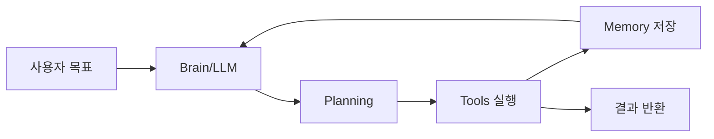
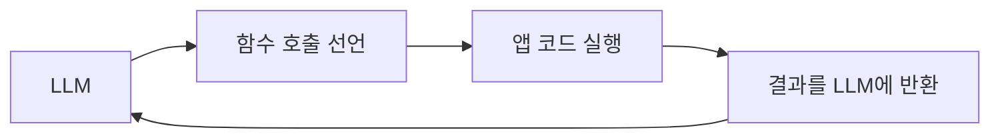
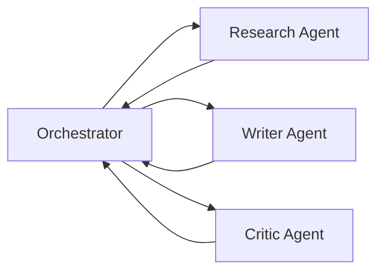

LLM에게 "오늘 날씨 알려줘"라고 물으면 그냥 대답한다. 그런데 "내 캘린더에서 오늘 일정 꺼내서, 날씨 API 조회하고, 적절한 옷차림까지 추천해"라고 하면? 단순한 텍스트 생성이 아닌 **계획 수립 → 도구 실행 → 결과 반영**의 루프가 필요하다. 이 루프를 자율적으로 수행하는 시스템이 AI 에이전트다.

## AI 에이전트란 무엇인가

일반 LLM 호출은 **자판기**다. 동전 넣으면(프롬프트) 결과물이 나온다(응답). 한 번의 입출력으로 끝이다.

AI 에이전트는 **심부름꾼**이다. "마트 가서 제일 신선한 사과 2kg 사와"라는 지시를 받으면, 마트 위치를 찾고, 사과 코너로 이동하고, 신선도를 판단하고, 계산하고, 돌아온다. 중간에 사과가 없으면 대체재를 선택한다. 목표가 달성될 때까지 스스로 판단하며 행동한다.

에이전트를 구성하는 핵심 요소는 네 가지다.

1. **Brain (LLM)**: 추론과 판단을 담당하는 핵심 엔진
2. **Tools**: 웹 검색, DB 조회, 코드 실행 등 실세계와 상호작용하는 수단
3. **Memory**: 대화 이력(단기)과 지식 베이스(장기)
4. **Planning**: 복잡한 목표를 하위 태스크로 분해하는 능력



## ReAct 패턴: Reasoning + Acting

ReAct는 2022년 Google이 제안한 에이전트 패턴으로, **추론(Reasoning)과 행동(Acting)을 번갈아** 수행한다. 사람이 문제를 푸는 방식과 동일하다.

"서울 지하철 2호선 연장 구간 개통일이 언제야?"라는 질문을 받으면:

```
Thought: 최신 정보라서 학습 데이터에 없을 수 있다. 웹 검색이 필요하다.
Action: search("서울 지하철 2호선 연장 개통일")
Observation: "2호선 신림선 연장... 2025년 개통 예정..."
Thought: 정확한 날짜가 없다. 더 구체적으로 검색해야 한다.
Action: search("서울 지하철 2호선 신림선 정확한 개통일 2025")
Observation: "2025년 5월 24일 개통 예정..."
Answer: 서울 지하철 2호선 신림선 연장 구간은 2025년 5월 24일 개통 예정입니다.
```

각 단계는 다음 구조를 따른다.

- **Thought**: 현재 상황에서 무엇을 해야 할지 추론
- **Action**: 실제 도구 호출
- **Observation**: 도구 실행 결과를 LLM 컨텍스트에 반영

이 Thought-Action-Observation 루프가 최종 답이 나올 때까지 반복된다.

```python
from langchain.agents import create_react_agent
from langchain.tools import DuckDuckGoSearchRun
from langchain_openai import ChatOpenAI

llm = ChatOpenAI(model="gpt-4o", temperature=0)
tools = [DuckDuckGoSearchRun()]

# ReAct 프롬프트 템플릿은 Thought/Action/Observation 형식을 강제한다
agent = create_react_agent(llm, tools, prompt)
agent_executor = AgentExecutor(agent=agent, tools=tools, verbose=True)

result = agent_executor.invoke({"input": "서울 지하철 2호선 연장 개통일은?"})
```

ReAct의 강점은 **추론 과정이 투명**하다는 점이다. 중간 Thought를 로깅하면 에이전트가 왜 그 도구를 썼는지 추적할 수 있다.

## Tool Use와 Function Calling

에이전트가 실세계와 상호작용하는 창구가 **Tool**이다. OpenAI의 Function Calling, Anthropic의 Tool Use는 LLM이 "이 함수를 호출하겠습니다"라고 선언하면, 실제 실행은 애플리케이션 코드가 담당하는 구조다.



OpenAI Function Calling의 흐름을 코드로 보면 다음과 같다.

```python
import openai
import json

tools = [
    {
        "type": "function",
        "function": {
            "name": "get_weather",
            "description": "특정 도시의 현재 날씨를 조회한다",
            "parameters": {
                "type": "object",
                "properties": {
                    "city": {
                        "type": "string",
                        "description": "도시 이름 (예: 서울, 부산)"
                    },
                    "unit": {
                        "type": "string",
                        "enum": ["celsius", "fahrenheit"]
                    }
                },
                "required": ["city"]
            }
        }
    }
]

def get_weather(city: str, unit: str = "celsius") -> dict:
    # 실제 날씨 API 호출
    return {"city": city, "temp": 22, "condition": "맑음"}

response = openai.chat.completions.create(
    model="gpt-4o",
    messages=[{"role": "user", "content": "서울 날씨 알려줘"}],
    tools=tools,
    tool_choice="auto"
)

# LLM이 함수 호출을 선언했다면 직접 실행한다
message = response.choices[0].message
if message.tool_calls:
    for tool_call in message.tool_calls:
        func_name = tool_call.function.name
        args = json.loads(tool_call.function.arguments)

        if func_name == "get_weather":
            result = get_weather(**args)

        # 결과를 다시 LLM에 넣어 최종 응답을 생성한다
        messages.append({
            "role": "tool",
            "tool_call_id": tool_call.id,
            "content": json.dumps(result, ensure_ascii=False)
        })
```

LLM은 함수를 직접 실행하지 않는다. "이 함수에 이 인자를 넣어라"는 JSON 선언만 생성한다. 실제 실행 권한과 책임은 애플리케이션 코드에 있다. 이 구조 덕분에 위험한 작업(DB 삭제, 결제 등)에 추가 인증 레이어를 끼워 넣을 수 있다.

### 자주 쓰이는 Tool 유형

| Tool 유형 | 예시 | 특징 |
|-----------|------|------|
| 검색 | Google Search, Bing, DuckDuckGo | 실시간 정보 획득 |
| 코드 실행 | Python REPL, E2B Sandbox | 계산, 데이터 처리 |
| DB 조회 | SQL, Vector DB | 구조화 데이터 접근 |
| API 호출 | REST, GraphQL | 외부 서비스 연동 |
| 파일 시스템 | 읽기/쓰기 | 문서 처리 |
| 브라우저 | Playwright, Puppeteer | 웹 자동화 |

## Planning: 복잡한 목표를 쪼개는 법

단순한 ReAct 루프는 **순차적 태스크**에 적합하다. 하지만 "Q4 영업 보고서 작성"처럼 복잡한 목표는 병렬 처리와 의존성 관리가 필요하다.

Plan-and-Execute 패턴은 두 단계로 분리한다.

1. **Planner**: 전체 목표를 하위 태스크 목록으로 분해
2. **Executor**: 각 태스크를 순서대로(또는 병렬로) 실행

```python
from langchain_experimental.plan_and_execute import (
    PlanAndExecute, load_agent_executor, load_chat_planner
)

planner = load_chat_planner(llm)
executor = load_agent_executor(llm, tools)

agent = PlanAndExecute(planner=planner, executor=executor)
result = agent.invoke({
    "input": "2024년 IT 업계 트렌드를 조사하고 한국어 요약 보고서를 작성해"
})
```

내부적으로 Planner가 생성하는 계획은 이런 형태다.

```
1. 2024년 IT 업계 주요 트렌드를 웹에서 검색한다
2. AI/ML 분야 주요 발전사항을 검색한다
3. 클라우드/인프라 트렌드를 검색한다
4. 수집한 정보를 한국어로 구조화하여 보고서 형식으로 작성한다
5. 최종 보고서를 파일로 저장한다
```

각 단계 완료 후 결과가 다음 단계 입력으로 전달된다. 3단계가 실패하면 재시도하거나 대체 경로를 선택한다.

더 정교한 방법은 **LangGraph의 DAG 기반 플로우**다. 태스크 간 의존성을 그래프로 표현하여 독립적인 태스크는 병렬 실행한다.

```python
from langgraph.graph import StateGraph, END
from typing import TypedDict, List

class AgentState(TypedDict):
    messages: List[dict]
    plan: List[str]
    past_steps: List[tuple]
    response: str

workflow = StateGraph(AgentState)
workflow.add_node("planner", planner_node)
workflow.add_node("executor", executor_node)
workflow.add_node("replan", replan_node)

workflow.set_entry_point("planner")
workflow.add_edge("planner", "executor")
workflow.add_conditional_edges(
    "executor",
    should_continue,  # 완료 여부 판단
    {
        "continue": "replan",  # 아직 할 일이 있으면 재계획
        "end": END             # 완료되면 종료
    }
)

app = workflow.compile()
```

## Memory: 단기 기억과 장기 기억

에이전트의 기억은 두 층으로 나뉜다. 사람으로 치면 **작업 기억(Working Memory)**과 **장기 기억(Long-term Memory)**이다.

### 단기 기억 (In-Context Memory)

현재 대화 컨텍스트 창에 올라간 정보다. 빠르지만 토큰 한계가 있다. GPT-4o의 128K 컨텍스트도 긴 대화에서는 초과할 수 있다.

```python
from langchain.memory import ConversationBufferWindowMemory

# 최근 10개 메시지만 유지한다
memory = ConversationBufferWindowMemory(k=10, return_messages=True)

# 요약 방식: 오래된 메시지를 LLM으로 압축한다
from langchain.memory import ConversationSummaryBufferMemory
summary_memory = ConversationSummaryBufferMemory(
    llm=llm,
    max_token_limit=2000,
    return_messages=True
)
```

### 장기 기억 (External Memory)

벡터 DB나 일반 DB에 저장하는 외부 메모리다. 수백만 건의 과거 대화나 지식을 검색하여 컨텍스트에 삽입할 수 있다.

```python
from langchain.memory import VectorStoreRetrieverMemory
from langchain_openai import OpenAIEmbeddings
from langchain_community.vectorstores import Chroma

vectorstore = Chroma(embedding_function=OpenAIEmbeddings())
retriever = vectorstore.as_retriever(search_kwargs={"k": 5})

# 가장 관련성 높은 과거 기억 5개를 자동으로 가져온다
memory = VectorStoreRetrieverMemory(retriever=retriever)
```

### 에피소딕 메모리 vs 시맨틱 메모리

- **에피소딕**: "지난 월요일에 사용자가 파이썬 질문을 했다"처럼 특정 사건 기록
- **시맨틱**: "사용자는 파이썬 중급자이다"처럼 일반화된 지식

좋은 에이전트는 에피소딕 메모리에서 패턴을 뽑아 시맨틱 메모리를 업데이트하는 **메모리 증류(Memory Distillation)** 과정을 갖는다.

## Multi-Agent 시스템

복잡한 워크플로우는 단일 에이전트로 처리하기 어렵다. 여러 에이전트가 협업하는 **Multi-Agent 시스템**이 등장한다.



### Orchestrator-Worker 패턴

오케스트레이터가 전체 계획을 세우고, 전문화된 워커 에이전트에게 하위 태스크를 위임한다.

```python
# 오케스트레이터는 전문가 에이전트를 도구로 사용한다
from langchain.agents import Tool

research_agent_tool = Tool(
    name="research_specialist",
    func=research_agent.run,
    description="웹 검색과 정보 수집이 필요할 때 사용한다"
)

code_agent_tool = Tool(
    name="code_specialist",
    func=code_agent.run,
    description="코드 작성과 실행이 필요할 때 사용한다"
)

orchestrator = create_react_agent(
    llm=llm,
    tools=[research_agent_tool, code_agent_tool]
)
```

### Debate/Reflection 패턴

두 에이전트가 서로 비판하며 결과를 개선한다. 초안을 작성하는 에이전트와 검토하는 에이전트가 번갈아 동작한다.

```python
def reflection_loop(initial_response: str, max_iterations: int = 3):
    response = initial_response

    for i in range(max_iterations):
        # Critic이 현재 응답의 문제점을 지적한다
        critique = critic_agent.invoke({
            "response": response,
            "task": "위 내용의 논리적 오류와 개선점을 찾아라"
        })

        if "개선 불필요" in critique["output"]:
            break

        # Reviser가 비판을 반영하여 개선한다
        response = reviser_agent.invoke({
            "original": response,
            "critique": critique["output"]
        })

    return response
```

## LangChain과 LangGraph 실전 구현

### LangChain LCEL 기반 에이전트

```python
from langchain_core.prompts import ChatPromptTemplate, MessagesPlaceholder
from langchain_core.runnables import RunnablePassthrough
from langchain.agents.format_scratchpad.openai_tools import (
    format_to_openai_tool_messages
)
from langchain.agents.output_parsers.openai_tools import (
    OpenAIToolsAgentOutputParser
)

prompt = ChatPromptTemplate.from_messages([
    ("system", "당신은 유능한 리서치 어시스턴트입니다."),
    ("user", "{input}"),
    MessagesPlaceholder(variable_name="agent_scratchpad")
])

llm_with_tools = llm.bind_tools(tools)

agent = (
    RunnablePassthrough.assign(
        agent_scratchpad=lambda x: format_to_openai_tool_messages(
            x["intermediate_steps"]
        )
    )
    | prompt
    | llm_with_tools
    | OpenAIToolsAgentOutputParser()
)

agent_executor = AgentExecutor(
    agent=agent,
    tools=tools,
    verbose=True,
    max_iterations=10,            # 무한루프 방지
    early_stopping_method="generate"
)
```

### LangGraph 상태 기반 에이전트

LangGraph는 에이전트 루프를 **명시적 상태 머신**으로 표현한다. 복잡한 분기와 루프를 다루기에 적합하다.

```python
from langgraph.prebuilt import create_react_agent

# 가장 간단한 형태
agent = create_react_agent(
    model=llm,
    tools=tools,
    state_modifier="당신은 금융 데이터 분석 전문가입니다."
)

# 체크포인터로 대화 이력을 저장한다
from langgraph.checkpoint.sqlite import SqliteSaver
memory = SqliteSaver.from_conn_string("agent_memory.db")

agent_with_memory = create_react_agent(
    model=llm,
    tools=tools,
    checkpointer=memory
)

# thread_id로 대화 세션을 구분한다
config = {"configurable": {"thread_id": "user_123_session_1"}}
result = agent_with_memory.invoke(
    {"messages": [("user", "어제 분석 결과 기억해?")]},
    config=config
)
```

## 안전성과 가드레일

에이전트가 자율적으로 행동할수록 **예상치 못한 부작용**이 생긴다. 가드레일은 에이전트의 행동 범위를 제한하는 안전장치다.

### 입력 검증

```python
from langchain_core.runnables import RunnableLambda

def validate_input(input_data: dict) -> dict:
    user_input = input_data["input"]

    # 금지어 필터링
    forbidden = ["drop table", "rm -rf", "sudo", "delete all"]
    for keyword in forbidden:
        if keyword.lower() in user_input.lower():
            raise ValueError(f"허용되지 않는 명령: {keyword}")

    # 입력 길이 제한
    if len(user_input) > 2000:
        raise ValueError("입력이 너무 깁니다")

    return input_data

safe_agent = RunnableLambda(validate_input) | agent_executor
```

### 도구 실행 권한 제어

```python
from functools import wraps

def require_confirmation(func):
    """위험한 작업 전에 확인을 요청한다"""
    @wraps(func)
    def wrapper(*args, **kwargs):
        print(f"실행 예정: {func.__name__}({args}, {kwargs})")
        confirm = input("계속하시겠습니까? (y/n): ")
        if confirm.lower() != 'y':
            return "사용자가 취소했습니다"
        return func(*args, **kwargs)
    return wrapper

@require_confirmation
def delete_record(table: str, record_id: int):
    # DB에서 레코드를 삭제한다
    ...
```

### 실행 제한

```python
agent_executor = AgentExecutor(
    agent=agent,
    tools=tools,
    max_iterations=15,          # 최대 반복 횟수
    max_execution_time=60,      # 최대 실행 시간(초)
    handle_parsing_errors=True  # 파싱 오류 시 재시도
)
```

## 극한 시나리오

### 시나리오 1: 무한 루프에 빠진 에이전트

에이전트가 "검색 → 결과 불만족 → 재검색"을 무한 반복하는 상황이다. `max_iterations`를 넘으면 강제 종료하지만, 그 전에 **루프 감지 로직**이 필요하다.

```python
from collections import Counter

class LoopDetector:
    def __init__(self, threshold=3):
        self.action_counter = Counter()
        self.threshold = threshold

    def check(self, action: str, action_input: str) -> bool:
        key = f"{action}:{action_input[:50]}"  # 유사 행동 그룹화
        self.action_counter[key] += 1

        if self.action_counter[key] >= self.threshold:
            raise RuntimeError(
                f"루프 감지: '{action}' 동일 입력으로 {self.threshold}회 반복"
            )
        return True
```

### 시나리오 2: 도구 실패 연쇄

외부 API가 503을 반환하면 에이전트는 같은 도구를 계속 재시도하거나, 잘못된 대체 경로를 선택할 수 있다. **폴백 도구**를 미리 정의해두면 대부분의 상황을 처리할 수 있다.

```python
from tenacity import retry, stop_after_attempt, wait_exponential

@retry(
    stop=stop_after_attempt(3),
    wait=wait_exponential(multiplier=1, min=1, max=10)
)
def robust_search(query: str) -> str:
    try:
        return primary_search_api(query)
    except Exception:
        return fallback_search_api(query)  # 대체 검색 엔진으로 전환
```

### 시나리오 3: 컨텍스트 창 폭발

100단계 작업을 수행하면 중간 단계의 Thought/Action/Observation이 컨텍스트를 가득 채운다. GPT-4o 128K도 긴 코드 분석 에이전트에서는 금방 넘친다.

해결책은 **스크래치패드 압축**이다. N단계마다 중간 결과를 요약하여 토큰을 절약한다.

```python
def compress_scratchpad(intermediate_steps: list, llm, keep_last: int = 5) -> list:
    if len(intermediate_steps) <= keep_last:
        return intermediate_steps

    # 오래된 단계를 LLM으로 요약한다
    old_steps = intermediate_steps[:-keep_last]
    summary_prompt = f"다음 에이전트 실행 단계를 2-3문장으로 요약: {old_steps}"
    summary = llm.invoke(summary_prompt).content

    # 요약 + 최근 단계만 유지한다
    return [("summary", summary)] + intermediate_steps[-keep_last:]
```

## 면접 포인트

### ReAct 패턴에서 Thought가 왜 중요한가?

Thought는 LLM이 자기 자신에게 보내는 "내부 독백"이다. Chain-of-Thought(CoT)처럼 중간 추론 단계를 명시화하면 복잡한 문제에서 더 정확한 Action을 선택한다. 단순히 Action만 출력하는 방식 대비 정확도가 약 20-30% 향상된다는 실험 결과가 있다. 또한 Thought 로그는 에이전트 디버깅의 핵심 근거가 된다.

### Tool Use에서 LLM은 함수를 직접 실행하는가?

실행하지 않는다. LLM은 어떤 함수를 어떤 인자로 호출할지 JSON 형식으로 선언만 한다. 실제 실행은 애플리케이션 레이어(Python, Java 등)가 담당한다. 이 구조가 중요한 이유는 보안 때문이다. DB 삭제, 결제, 파일 시스템 접근 같은 위험한 작업에 추가 인증, 권한 검사, 감사 로그를 끼워 넣을 수 있다. LLM이 직접 실행권을 갖는 구조는 심각한 보안 취약점이 된다.

### 단기 기억과 장기 기억을 함께 쓸 때 주의점은?

컨텍스트 오염 문제가 있다. 벡터 DB에서 검색해온 장기 기억이 현재 대화와 무관하면 오히려 잘못된 방향으로 유도한다. 따라서 장기 기억 검색 결과에는 **신뢰도 점수(score threshold)**를 설정하고, 임계값 이하는 컨텍스트에 삽입하지 않는다. 또한 장기 기억과 단기 기억이 서로 모순될 때 어느 쪽을 우선시할지 명확한 정책이 필요하다.

### Multi-Agent에서 오케스트레이터가 병목이 되는 상황을 어떻게 해결하는가?

오케스트레이터가 모든 결과를 수집한 후 다음 단계를 결정하면, 워커가 병렬로 빠르게 완료해도 오케스트레이터의 LLM 추론 시간이 전체 레이턴시를 지배한다. 해결책은 두 가지다. 첫째, 사전에 DAG로 의존성을 명확히 정의하여 오케스트레이터 개입 없이 독립 태스크는 자동으로 병렬 실행한다(LangGraph의 방식). 둘째, 오케스트레이터를 경량 LLM(GPT-4o-mini)으로 교체하고, 실제 복잡한 추론은 워커 에이전트에 위임한다.

### 에이전트 평가는 어떻게 하는가?

단순 정확도 외에 세 가지 지표를 본다. **Task Success Rate**: 최종 목표 달성 여부. **Trajectory Efficiency**: 목표 달성에 필요한 최소 단계 대비 실제 단계 수. **Tool Call Precision**: 올바른 도구를 올바른 인자로 호출한 비율. LangSmith나 LangFuse 같은 트레이싱 도구로 모든 Thought-Action-Observation을 기록하고 오프라인 평가를 수행한다.
