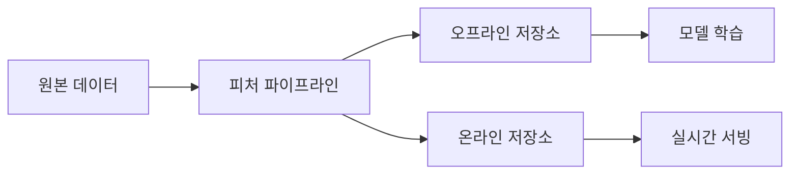

데이터 과학자가 노트북에서 95% 정확도를 달성한 모델을 만들었다. 그런데 이것을 초당 1만 건의 요청을 처리하는 프로덕션 서비스에 올리면 어떻게 될까? 십중팔구 레이턴시 폭발, 메모리 부족, 그리고 3개월 후 모델 성능 저하로 이어진다. 학습(training)과 서빙(serving)은 전혀 다른 문제다. MLOps는 그 간극을 메우는 엔지니어링 규율이다.

## MLOps가 필요한 이유

소프트웨어 엔지니어링에는 잘 확립된 DevOps 패턴이 있다. 코드를 짜고, 테스트하고, CI/CD 파이프라인으로 자동 배포한다. ML 시스템은 여기에 **데이터**와 **모델**이라는 변수가 추가된다.

일반 소프트웨어와 ML 시스템의 차이를 공장에 비유하면 이렇다.

- **일반 소프트웨어**: 기계(코드)가 고정되어 있고 재료(입력)가 바뀐다.
- **ML 시스템**: 기계(모델)도 바뀌고 재료(데이터)도 바뀐다. 기계가 재료를 보면서 스스로 변형된다.

이 복잡성 때문에 ML 시스템에서는 다음과 같은 문제가 자주 발생한다.

1. **재현 불가능**: 어제의 학습 결과를 오늘 재현하지 못한다. 데이터나 라이브러리 버전이 달라졌기 때문이다.
2. **학습-서빙 스큐**: 학습 시 쓴 전처리 로직과 서빙 시 쓴 전처리 로직이 미묘하게 다르다.
3. **모델 드리프트**: 시간이 지나면 실세계 데이터 분포가 변한다. 6개월 전 학습한 모델은 오늘의 데이터에 맞지 않는다.
4. **실험 추적 부재**: "저번 달에 가장 좋았던 실험 설정이 뭐였더라"를 답할 수 없다.

MLOps는 이 문제들을 시스템적으로 해결하는 프레임워크다.

## 모델 서빙 패턴

모델을 어떻게 서빙할지는 비즈니스 요구사항에 따라 세 가지로 나뉜다.

### Online Serving (실시간)

사용자의 요청에 즉시 응답해야 하는 경우다. 추천 시스템, 검색 랭킹, 챗봇이 여기에 해당한다.


레이턴시가 핵심 지표다. P99 레이턴시 100ms 이내가 일반적인 목표다. 모델이 복잡할수록 이 목표를 달성하기 어렵다.

### Batch Serving (배치)

사전에 계산해두는 방식이다. 내일의 날씨 예보, 매일 밤 실행하는 사기 탐지 등이 여기에 해당한다.

```python
# 스파크로 대규모 배치 추론
from pyspark.sql import SparkSession
from pyspark.ml import PipelineModel

spark = SparkSession.builder.appName("batch_inference").getOrCreate()

model = PipelineModel.load("s3://models/fraud_detector/v3")
data = spark.read.parquet("s3://data/transactions/2026-05-15/")

predictions = model.transform(data)
predictions.write.parquet("s3://predictions/2026-05-15/")
```

레이턴시보다 처리량(throughput)이 중요하다. GPU 병렬 처리로 초당 수만 건을 처리한다.

### Streaming Serving (스트리밍)

이벤트 스트림에서 실시간으로 모델을 적용한다. 신용카드 결제 사기 감지, IoT 이상 탐지가 여기에 해당한다.

```python
# Kafka + Faust 스트리밍 추론
import faust
import pickle

app = faust.App("fraud_detector", broker="kafka://localhost:9092")
transaction_topic = app.topic("transactions")
alert_topic = app.topic("fraud_alerts")

with open("model.pkl", "rb") as f:
    model = pickle.load(f)

@app.agent(transaction_topic)
async def process_transaction(stream):
    async for transaction in stream:
        features = extract_features(transaction)
        score = model.predict_proba([features])[0][1]

        if score > 0.85:
            await alert_topic.send(value={
                "transaction_id": transaction["id"],
                "fraud_score": score
            })
```

## TorchServe: PyTorch 모델 서빙

TorchServe는 PyTorch 공식 모델 서빙 프레임워크다. 모델을 `.mar` 패키지로 묶어 REST/gRPC API로 노출한다.

### 핸들러 작성

```python
# custom_handler.py
from ts.torch_handler.base_handler import BaseHandler
import torch
import json

class SentimentHandler(BaseHandler):
    def initialize(self, context):
        super().initialize(context)
        # 모델과 토크나이저를 로드한다
        from transformers import AutoTokenizer, AutoModelForSequenceClassification

        model_dir = context.system_properties.get("model_dir")
        self.tokenizer = AutoTokenizer.from_pretrained(model_dir)
        self.model = AutoModelForSequenceClassification.from_pretrained(model_dir)
        self.model.eval()

    def preprocess(self, data):
        texts = [item["body"].get("text", "") for item in data]
        inputs = self.tokenizer(
            texts,
            padding=True,
            truncation=True,
            max_length=512,
            return_tensors="pt"
        )
        return inputs

    def inference(self, inputs):
        with torch.no_grad():
            outputs = self.model(**inputs)
        return outputs.logits

    def postprocess(self, outputs):
        probs = torch.softmax(outputs, dim=-1).tolist()
        labels = ["negative", "positive"]
        return [
            {"label": labels[prob.index(max(prob))], "score": max(prob)}
            for prob in probs
        ]
```

### 패키징과 배포

```bash
# .mar 아카이브 생성
torch-model-archiver \
  --model-name sentiment \
  --version 1.0 \
  --model-file model.py \
  --serialized-file pytorch_model.bin \
  --handler custom_handler.py \
  --extra-files "config.json,vocab.txt" \
  --export-path model_store/

# TorchServe 시작
torchserve \
  --start \
  --model-store model_store \
  --models sentiment=sentiment.mar \
  --ts-config config.properties

# 추론 요청
curl -X POST http://localhost:8080/predictions/sentiment \
  -H "Content-Type: application/json" \
  -d '{"text": "이 제품 정말 좋아요"}'
```

```properties
# config.properties
inference_address=http://0.0.0.0:8080
management_address=http://0.0.0.0:8081
number_of_netty_threads=4
job_queue_size=1000
default_workers_per_model=4   # GPU 개수에 맞춘다
```

### 동적 배칭

개별 요청을 모아 배치로 처리하면 GPU 활용률을 높인다.

```properties
# 배치 설정
batch_size=8
max_batch_delay=100  # 최대 100ms 기다린 후 배치 실행
```

## TF Serving: TensorFlow 모델 서빙

SavedModel 포맷으로 저장된 TensorFlow 모델을 서빙한다. gRPC와 REST 모두 지원한다.

```python
# 모델 저장
model.save("models/my_model/1/")  # 버전 디렉토리 구조 필수

# Docker로 TF Serving 실행
# docker run -p 8501:8501 \
#   -v /models:/models/my_model \
#   -e MODEL_NAME=my_model \
#   tensorflow/serving
```

```python
# gRPC 추론 클라이언트
import grpc
from tensorflow_serving.apis import predict_pb2
from tensorflow_serving.apis import prediction_service_pb2_grpc
import tensorflow as tf

channel = grpc.insecure_channel("localhost:8500")
stub = prediction_service_pb2_grpc.PredictionServiceStub(channel)

request = predict_pb2.PredictRequest()
request.model_spec.name = "my_model"
request.model_spec.signature_name = "serving_default"
request.inputs["input_tensor"].CopyFrom(
    tf.make_tensor_proto(data, shape=data.shape)
)

response = stub.Predict(request, timeout=10.0)
output = tf.make_ndarray(response.outputs["output"])
```

## ONNX Runtime: 프레임워크 독립 서빙

ONNX(Open Neural Network Exchange)는 PyTorch, TensorFlow, JAX 등 다양한 프레임워크의 모델을 **단일 포맷**으로 변환한다. ONNX Runtime은 이 포맷을 실행하는 고성능 추론 엔진이다.

PyTorch 대비 CPU 추론에서 2~5배 속도 향상이 일반적이다. GPU(CUDA), 인텔 OpenVINO, ARM NN 등 다양한 하드웨어 최적화를 지원한다.

```python
# PyTorch → ONNX 변환
import torch
import torch.onnx

model = MyModel()
model.eval()

dummy_input = torch.randn(1, 3, 224, 224)  # 실제 입력 shape
torch.onnx.export(
    model,
    dummy_input,
    "model.onnx",
    export_params=True,
    opset_version=17,
    input_names=["input"],
    output_names=["output"],
    dynamic_axes={
        "input": {0: "batch_size"},   # 배치 차원을 동적으로
        "output": {0: "batch_size"}
    }
)
```

```python
# ONNX Runtime으로 추론
import onnxruntime as ort
import numpy as np

# GPU 우선, CPU 폴백
providers = ["CUDAExecutionProvider", "CPUExecutionProvider"]
session = ort.InferenceSession("model.onnx", providers=providers)

# 입출력 이름 확인
input_name = session.get_inputs()[0].name
output_name = session.get_outputs()[0].name

# 추론
input_data = np.random.randn(4, 3, 224, 224).astype(np.float32)
results = session.run([output_name], {input_name: input_data})
```

### 모델 양자화로 속도 향상

```python
from onnxruntime.quantization import quantize_dynamic, QuantType

# INT8 동적 양자화: 모델 크기 4배 감소, 속도 2배 향상
quantize_dynamic(
    "model.onnx",
    "model_int8.onnx",
    weight_type=QuantType.QInt8
)
```

## MLflow: 모델 레지스트리

MLflow는 실험 추적, 모델 버전 관리, 서빙을 하나로 묶는 MLOps 플랫폼이다.

```python
import mlflow
import mlflow.sklearn
from sklearn.ensemble import RandomForestClassifier

mlflow.set_experiment("fraud_detection_v2")

with mlflow.start_run(run_name="rf_baseline"):
    # 하이퍼파라미터 기록
    mlflow.log_params({
        "n_estimators": 100,
        "max_depth": 10,
        "min_samples_split": 5
    })

    model = RandomForestClassifier(n_estimators=100, max_depth=10)
    model.fit(X_train, y_train)

    # 메트릭 기록
    mlflow.log_metrics({
        "accuracy": model.score(X_test, y_test),
        "f1_score": f1,
        "auc_roc": auc
    })

    # 모델 저장 (데이터 스키마 포함)
    signature = mlflow.models.infer_signature(X_train, model.predict(X_train))
    mlflow.sklearn.log_model(
        model,
        "model",
        signature=signature,
        registered_model_name="FraudDetector"  # 레지스트리에 등록
    )
```

### 모델 스테이지 관리

```python
from mlflow.tracking import MlflowClient

client = MlflowClient()

# Staging으로 승격
client.transition_model_version_stage(
    name="FraudDetector",
    version=3,
    stage="Staging",
    archive_existing_versions=False
)

# 테스트 통과 후 Production으로 승격
client.transition_model_version_stage(
    name="FraudDetector",
    version=3,
    stage="Production"
)

# Production 모델 로드
model = mlflow.sklearn.load_model("models:/FraudDetector/Production")
```

## A/B 테스트와 카나리 배포

새 모델을 한 번에 전체에 배포하는 건 위험하다. 점진적으로 트래픽을 옮기는 전략이 필요하다.

### 카나리 배포

```yaml
# Kubernetes Deployment: 트래픽 5%만 신규 모델로 보낸다
apiVersion: networking.k8s.io/v1
kind: Ingress
metadata:
  annotations:
    nginx.ingress.kubernetes.io/canary: "true"
    nginx.ingress.kubernetes.io/canary-weight: "5"  # 5% 트래픽
spec:
  rules:
  - http:
      paths:
      - path: /predict
        pathType: Prefix
        backend:
          service:
            name: model-v2-service  # 신규 모델
            port:
              number: 80
```

### 쉐도우 테스트 (Shadow Testing)

프로덕션 트래픽을 복사해서 신규 모델에 동시에 전달하지만, 응답은 기존 모델만 반환한다. 실 트래픽 데이터로 신규 모델을 검증하되, 사용자에게 영향을 주지 않는다.

```python
import asyncio
import aiohttp

async def shadow_predict(request_data: dict) -> dict:
    # 기존 모델과 신규 모델에 동시 요청
    async with aiohttp.ClientSession() as session:
        prod_task = session.post("http://model-v1/predict", json=request_data)
        shadow_task = session.post("http://model-v2/predict", json=request_data)

        prod_response, shadow_response = await asyncio.gather(
            prod_task, shadow_task, return_exceptions=True
        )

    prod_result = await prod_response.json()
    shadow_result = await shadow_response.json() if not isinstance(
        shadow_response, Exception) else None

    # 차이를 메트릭으로 기록한다
    if shadow_result:
        log_shadow_comparison(prod_result, shadow_result)

    return prod_result  # 응답은 기존 모델 결과만 반환
```

### 통계적 유의성 판단

A/B 테스트 결과를 단순히 "A가 나은가 B가 나은가"로 판단하면 안 된다. 충분한 샘플이 쌓인 후 통계적으로 유의미한 차이인지 확인해야 한다.

```python
from scipy import stats

def evaluate_ab_test(
    control_conversions: int, control_total: int,
    treatment_conversions: int, treatment_total: int,
    alpha: float = 0.05
) -> dict:
    control_rate = control_conversions / control_total
    treatment_rate = treatment_conversions / treatment_total

    # 이항 비율 z-검정
    _, p_value = stats.proportions_ztest(
        [treatment_conversions, control_conversions],
        [treatment_total, control_total]
    )

    return {
        "control_rate": control_rate,
        "treatment_rate": treatment_rate,
        "lift": (treatment_rate - control_rate) / control_rate,
        "p_value": p_value,
        "significant": p_value < alpha
    }
```

## 모델 모니터링: 드리프트 감지

배포 후에도 모델이 잘 동작하는지 지속적으로 감시해야 한다. 두 종류의 드리프트가 있다.

### 데이터 드리프트 (Feature Drift)

입력 데이터의 분포가 학습 데이터와 달라지는 현상이다. 사용자 행동 패턴이 변했거나, 데이터 수집 파이프라인에 버그가 생겼을 때 발생한다.

```python
from evidently.report import Report
from evidently.metric_preset import DataDriftPreset, DataQualityPreset

# 학습 데이터(reference)와 현재 데이터(current) 비교
report = Report(metrics=[
    DataDriftPreset(),
    DataQualityPreset()
])

report.run(
    reference_data=train_df,
    current_data=production_df_last_7days
)

report.save_html("drift_report.html")

# 드리프트 감지 결과를 JSON으로 추출한다
result = report.as_dict()
drift_detected = result["metrics"][0]["result"]["dataset_drift"]

if drift_detected:
    send_alert("데이터 드리프트 감지: 모델 재학습 검토 필요")
```

### 개념 드리프트 (Concept Drift)

입력과 출력 사이의 관계 자체가 변하는 현상이다. 코로나 이전에 학습한 여행 수요 예측 모델이 코로나 이후 완전히 틀리는 것이 대표적 예다.

레이블이 있다면 직접 예측 성능을 모니터링한다. 레이블이 늦게 들어오는 경우(예: 대출 부도는 수개월 후 확인됨) 프록시 메트릭(신청 완료율, 재방문율 등)으로 간접 모니터링한다.

```python
import pandas as pd
from sklearn.metrics import roc_auc_score

class ModelMonitor:
    def __init__(self, model, baseline_auc: float, threshold: float = 0.05):
        self.model = model
        self.baseline_auc = baseline_auc
        self.threshold = threshold

    def check_performance(self, X: pd.DataFrame, y: pd.Series) -> dict:
        predictions = self.model.predict_proba(X)[:, 1]
        current_auc = roc_auc_score(y, predictions)
        degradation = (self.baseline_auc - current_auc) / self.baseline_auc

        return {
            "current_auc": current_auc,
            "baseline_auc": self.baseline_auc,
            "degradation_pct": degradation * 100,
            "alert": degradation > self.threshold
        }
```

### Prometheus + Grafana 연동

```python
from prometheus_client import Histogram, Counter, Gauge, start_http_server

# 메트릭 정의
prediction_latency = Histogram(
    "model_prediction_latency_seconds",
    "모델 추론 레이턴시",
    buckets=[0.01, 0.05, 0.1, 0.25, 0.5, 1.0, 2.5]
)
prediction_counter = Counter("model_predictions_total", "총 추론 횟수")
model_score = Gauge("model_average_score", "최근 1시간 평균 예측 점수")

# 추론 엔드포인트에 적용
@app.post("/predict")
def predict(request: PredictRequest):
    with prediction_latency.time():
        result = model.predict(request.features)

    prediction_counter.inc()
    model_score.set(result.score)
    return result
```

## Feature Store

학습과 서빙 모두에서 동일한 피처 계산 로직을 사용하는 것이 Feature Store의 핵심이다. 학습 때는 배치로 피처를 계산하고, 서빙 때는 실시간으로 가져온다.



```python
# Feast Feature Store 예시
from feast import FeatureStore, Entity, FeatureView, Field
from feast.types import Float32, Int64

store = FeatureStore(repo_path="feature_repo/")

# 온라인 피처 조회 (실시간 서빙용)
feature_vector = store.get_online_features(
    features=[
        "user_features:age",
        "user_features:purchase_count_7d",
        "user_features:avg_session_duration",
    ],
    entity_rows=[{"user_id": "user_123"}]
).to_df()

# 학습용 피처 조회 (오프라인, 포인트-인-타임 조인)
training_df = store.get_historical_features(
    entity_df=entity_df,  # user_id + event_timestamp
    features=["user_features:age", "user_features:purchase_count_7d"]
).to_df()
```

## ML CI/CD 파이프라인

ML 파이프라인은 코드 변경뿐 아니라 **데이터 변경**과 **모델 성능 저하**도 트리거가 된다.

```yaml
# GitHub Actions 예시
name: ML CI/CD Pipeline

on:
  push:
    branches: [main]
  schedule:
    - cron: '0 2 * * 1'  # 매주 월요일 새벽 2시 재학습

jobs:
  validate-data:
    runs-on: ubuntu-latest
    steps:
      - uses: actions/checkout@v3
      - name: 데이터 품질 검사
        run: python scripts/validate_data.py

  train-and-evaluate:
    needs: validate-data
    runs-on: [self-hosted, gpu]
    steps:
      - name: 모델 학습
        run: python train.py --config configs/production.yaml

      - name: 성능 평가 및 임계값 검사
        run: |
          python evaluate.py \
            --model outputs/model.pkl \
            --min-auc 0.85 \
            --min-f1 0.80

      - name: MLflow에 모델 등록
        run: python register_model.py --stage Staging

  integration-test:
    needs: train-and-evaluate
    steps:
      - name: 서빙 통합 테스트
        run: |
          docker-compose up -d model-server
          python tests/test_serving.py
          docker-compose down

  deploy-canary:
    needs: integration-test
    if: github.ref == 'refs/heads/main'
    steps:
      - name: 카나리 배포 (5% 트래픽)
        run: kubectl apply -f k8s/canary-deployment.yaml
```

## 극한 시나리오

### 시나리오 1: 모델 드리프트로 사기 탐지율이 40% 하락

명절 기간에 사용자 결제 패턴이 평소와 완전히 달라진다. 평소 데이터로 학습한 사기 탐지 모델은 정상 거래를 사기로 잘못 분류하거나(오탐), 실제 사기를 탐지하지 못한다(미탐).

대응 전략:
1. **슬라이딩 윈도우 재학습**: 최근 30일 데이터로 매일 밤 재학습한다.
2. **시즌 모델**: 명절, 연말 등 특수 기간용 별도 모델을 준비한다.
3. **앙상블 가중치 조정**: 최근 데이터에 더 높은 가중치를 주는 온라인 학습 컴포넌트를 추가한다.

```python
class AdaptiveEnsemble:
    def __init__(self, base_model, recent_model, decay: float = 0.95):
        self.base_model = base_model
        self.recent_model = recent_model
        self.decay = decay
        self.performance_history = []

    def predict(self, X):
        # 최근 성능에 따라 가중치를 동적으로 조정한다
        if len(self.performance_history) >= 7:
            recent_perf = sum(self.performance_history[-7:]) / 7
            weight = min(0.9, max(0.1, recent_perf))
        else:
            weight = 0.5

        base_pred = self.base_model.predict_proba(X)[:, 1]
        recent_pred = self.recent_model.predict_proba(X)[:, 1]

        return weight * recent_pred + (1 - weight) * base_pred
```

### 시나리오 2: 서빙 레이턴시 폭발 — GPT 수준 모델을 100ms 안에 응답

BERT 기반 분류 모델을 CPU로 서빙하면 요청당 500ms가 걸린다. SLA는 100ms다.

최적화 단계별 접근:

1. **ONNX 변환**: PyTorch → ONNX로 변환만 해도 CPU에서 2~3배 빠르다.
2. **양자화 (INT8)**: 정확도 0.5% 손실로 속도 2배 향상.
3. **배치 처리**: 요청을 8개씩 묶어 배치 추론. 개별 레이턴시는 올라가지만 처리량이 8배.
4. **모델 증류 (Knowledge Distillation)**: BERT-base(12레이어)를 DistilBERT(6레이어)로 증류. 정확도 3% 손실, 속도 2배.

```python
# 단계별 최적화 효과 측정
import time
import numpy as np

def benchmark(session, inputs, n_runs=100):
    latencies = []
    for _ in range(n_runs):
        start = time.perf_counter()
        session.run(None, inputs)
        latencies.append((time.perf_counter() - start) * 1000)

    return {
        "p50": np.percentile(latencies, 50),
        "p95": np.percentile(latencies, 95),
        "p99": np.percentile(latencies, 99),
        "throughput": 1000 / np.mean(latencies)
    }

# FP32 기준 → 530ms p99
# ONNX 변환 → 180ms p99
# INT8 양자화 → 95ms p99 ← SLA 달성
```

### 시나리오 3: 모델 서버 OOM으로 전체 서비스 다운

GPU 메모리 부족으로 모델 서버가 크래시된다. 동시에 여러 요청이 몰리면서 각 요청이 독립적으로 모델을 GPU에 올리려 한 게 원인이다.

해결책:

```python
import threading

class ModelPool:
    """동시 접근을 제어하는 모델 인스턴스 풀"""

    def __init__(self, model_factory, pool_size: int):
        self._pool = [model_factory() for _ in range(pool_size)]
        self._semaphore = threading.Semaphore(pool_size)
        self._lock = threading.Lock()
        self._index = 0

    def predict(self, inputs):
        self._semaphore.acquire()  # 풀이 꽉 찼으면 대기
        try:
            with self._lock:
                model = self._pool[self._index % len(self._pool)]
                self._index += 1
            return model.predict(inputs)
        finally:
            self._semaphore.release()

# GPU 메모리에 맞게 2개 인스턴스만 허용한다
model_pool = ModelPool(
    model_factory=lambda: load_model("model.onnx"),
    pool_size=2
)
```

## 면접 포인트

### 학습-서빙 스큐(Training-Serving Skew)란 무엇이며 어떻게 방지하는가?

학습 시 데이터 전처리 로직과 서빙 시 전처리 로직이 미묘하게 달라 모델 성능이 저하되는 현상이다. 예를 들어 학습 때 결측값을 평균으로 채웠는데, 서빙 코드에서는 0으로 채우는 경우다. 방지 방법은 세 가지다. 첫째, Feature Store를 사용해 피처 계산 로직을 한 곳에서 관리한다. 둘째, 학습 파이프라인에 Sklearn Pipeline이나 TFX Transform을 사용하면 동일한 변환 로직이 서빙에도 자동 적용된다. 셋째, 서빙 직전 입력 분포와 학습 데이터 분포를 비교하는 입력 검증 레이어를 추가한다.

### ONNX가 PyTorch 직접 서빙 대비 빠른 이유는?

PyTorch는 학습 편의를 위해 동적 그래프(eager mode)를 사용한다. 연산 시 최적화 기회를 놓친다. ONNX 변환 시 정적 그래프로 표현되어, ONNX Runtime이 연산 그래프를 분석하고 Operator Fusion(여러 연산을 하나로 합침), Dead Code Elimination, 하드웨어 특화 커널 선택 등의 최적화를 적용한다. 또한 ONNX Runtime의 Execution Provider는 Intel MKL-DNN, NVIDIA TensorRT, ARM Compute Library 등 하드웨어 특화 라이브러리를 자동으로 활용한다.

### 카나리 배포와 블루/그린 배포의 차이는?

블루/그린은 두 개의 동일한 환경을 유지하다가 **한 번에 100% 트래픽을 전환**한다. 롤백이 빠르지만 잘못된 모델이 전체 트래픽에 영향을 줄 위험이 있다. 카나리는 **점진적으로 트래픽 비율을 높인다** (5% → 20% → 50% → 100%). 이상 감지 시 즉시 0%로 줄일 수 있어 위험이 낮다. ML 서빙에서는 카나리가 더 적합하다. 모델 품질은 단순한 가동 여부가 아닌 예측 성능 지표로 측정되므로, 충분한 트래픽 샘플이 쌓인 후에야 안전을 확인할 수 있기 때문이다.

### 모델 드리프트를 실시간으로 감지하는 방법은?

레이블이 즉시 가용하면 예측 정확도를 직접 모니터링한다. 레이블이 늦게 오거나 없는 경우가 더 흔하다. 이 경우 두 가지 간접 방법을 쓴다. 첫째, 입력 피처 분포를 모니터링한다(PSI, KL-divergence, KS test로 학습 분포와 비교). 둘째, 예측값 분포를 모니터링한다. 모델이 갑자기 특정 클래스를 과도하게 예측하거나, 예측 점수 분포가 치우치면 드리프트 신호다. Evidently AI, WhyLabs, Arize AI 같은 도구가 이 모니터링을 자동화한다.

### Feature Store의 온라인 저장소와 오프라인 저장소 차이는?

오프라인 저장소(Parquet/Hive/BigQuery)는 학습용 대규모 히스토리 데이터를 보관한다. 배치 쿼리에 최적화되어 있고, 포인트-인-타임(Point-in-time) 조인을 지원하여 데이터 누수(leakage) 없이 학습 데이터를 생성한다. 온라인 저장소(Redis/DynamoDB/Cassandra)는 서빙 시 수 밀리초 내 피처를 조회하기 위한 저레이턴시 캐시다. 최신 피처 값만 보관한다. 핵심은 두 저장소가 동일한 피처 계산 로직으로 채워진다는 점이다. 이를 통해 학습-서빙 스큐를 구조적으로 제거한다.
