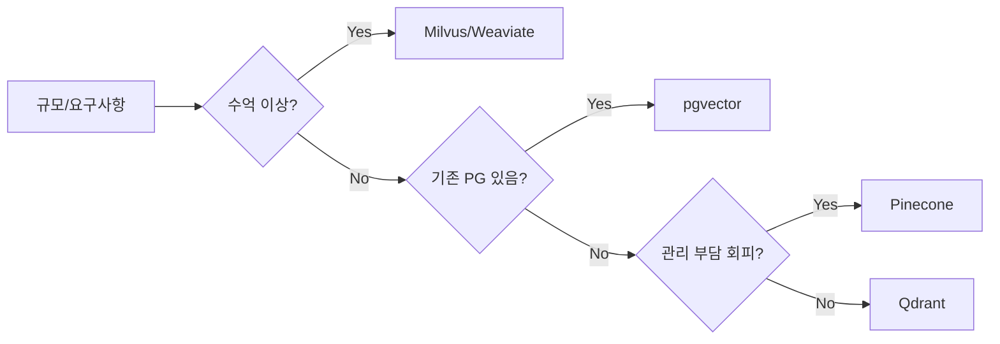

"고양이 사진 보여줘"를 검색하면 파일명에 "고양이"가 없는 사진도 찾아주는 검색엔진이 있다. 반면 기존 키워드 검색은 "고양이"라는 단어가 정확히 일치해야만 결과를 내놓는다. 이 차이가 임베딩과 벡터 DB에서 시작된다.

## 임베딩이란 무엇인가

텍스트를 컴퓨터가 이해할 수 있는 형태로 바꾸는 방법은 오래전부터 있었다. 가장 원시적인 방법은 **One-Hot Encoding**이다. "사과"를 `[1, 0, 0, 0, ...]`, "바나나"를 `[0, 1, 0, 0, ...]`으로 표현한다. 단어 수만큼 차원이 생기고, 모든 단어 사이의 거리가 동일하다. "사과"와 "과일"이 "사과"와 "자동차"만큼 멀다.

임베딩은 다르다. **의미가 비슷한 단어는 벡터 공간에서 가깝게** 위치한다.

```
"왕" - "남자" + "여자" ≈ "여왕"
```

Word2Vec이 2013년에 보여준 이 예시가 임베딩의 핵심이다. 단어의 의미 관계가 벡터 연산으로 표현된다.

현대 임베딩 모델(BERT, text-embedding-ada-002, BGE 등)은 문장 전체를 하나의 벡터로 압축한다. "배가 고프다"와 "허기가 진다"는 표현이 달라도 임베딩 공간에서 매우 가깝다.

```python
from openai import OpenAI

client = OpenAI()

def get_embedding(text: str) -> list[float]:
    response = client.embeddings.create(
        model="text-embedding-3-small",  # 1536차원
        input=text
    )
    return response.data[0].embedding

vec1 = get_embedding("배가 고프다")
vec2 = get_embedding("허기가 진다")
vec3 = get_embedding("자동차를 운전한다")

# vec1과 vec2의 코사인 유사도는 0.93
# vec1과 vec3의 코사인 유사도는 0.21
```

임베딩 벡터는 보통 256 ~ 3072 차원의 실수 배열이다. text-embedding-3-large는 3072차원, BGE-M3는 1024차원이다.

## 유사도 측정: 어떤 거리 함수를 쓰는가

벡터 공간에서 두 벡터가 얼마나 비슷한지 측정하는 방법이 세 가지다.

### 코사인 유사도 (Cosine Similarity)

두 벡터 사이의 **각도**를 측정한다. 크기는 무시하고 방향만 본다.

```
cosine_similarity(A, B) = (A · B) / (|A| × |B|)
```

결과값은 -1 ~ 1 사이다. 1이면 완전히 같은 방향(동일한 의미), -1이면 반대 방향, 0이면 직교(무관).

텍스트 임베딩에 가장 많이 쓴다. 문서 길이가 달라도(벡터 크기가 달라도) 의미 유사도를 일관되게 측정할 수 있기 때문이다.

```python
import numpy as np

def cosine_similarity(v1: list, v2: list) -> float:
    a = np.array(v1)
    b = np.array(v2)
    return np.dot(a, b) / (np.linalg.norm(a) * np.linalg.norm(b))
```

### 유클리디안 거리 (L2 Distance)

두 점 사이의 **직선 거리**다. 낮을수록 유사하다.

이미지 임베딩이나 정규화된 벡터에 적합하다. 하지만 고차원 공간에서는 모든 점 사이의 거리가 비슷해지는 "차원의 저주"가 발생하므로 주의가 필요하다.

### 내적 (Dot Product / Inner Product)

크기와 방향을 모두 고려한다. 벡터가 정규화(unit vector)되어 있다면 코사인 유사도와 동일하다.

OpenAI의 최신 임베딩 모델은 정규화된 벡터를 반환하므로 내적과 코사인 유사도가 같다. 내적이 계산이 더 빠르므로 대부분의 벡터 DB는 내적을 기본으로 사용한다.

| 유사도 함수 | 범위 | 적합한 사용 케이스 |
|------------|------|-------------------|
| 코사인 유사도 | -1 ~ 1 | 텍스트, 문서 검색 |
| 유클리디안 거리 | 0 ~ ∞ | 이미지, 정규화 벡터 |
| 내적 | -∞ ~ ∞ | 정규화된 임베딩, 추천 |

## ANN 알고리즘: 수백만 벡터 중에서 빠르게 찾는 법

1억 개의 벡터에서 가장 유사한 10개를 찾으려면 **완전 탐색(Brute-force)**은 불가능하다. ANN(Approximate Nearest Neighbor) 알고리즘이 이 문제를 해결한다. 정확도를 조금 포기하는 대신 속도를 극적으로 높인다.

### HNSW (Hierarchical Navigable Small World)

현재 가장 널리 쓰이는 ANN 알고리즘이다. **다층 그래프** 구조를 사용한다.


최상위 레이어는 노드 수가 적고(고속도로), 하위 레이어로 내려갈수록 노드가 많아진다(이면도로). 검색은 최상위 레이어에서 대략적인 위치를 잡은 후 하위 레이어에서 정밀하게 좁혀간다.

**장점**: 빠른 검색 속도 (O(log N)), 메모리 내 인덱스, 삽입/삭제 가능
**단점**: 메모리 사용량이 높다, 인덱스 빌드 시간이 오래 걸린다

```python
import hnswlib
import numpy as np

dim = 1536  # OpenAI embedding 차원
num_elements = 100000

index = hnswlib.Index(space='cosine', dim=dim)
index.init_index(
    max_elements=num_elements,
    ef_construction=200,  # 인덱스 빌드 품질 (높을수록 정확하나 느리다)
    M=16                  # 각 노드의 최대 연결 수
)

# 벡터 삽입
vectors = np.random.rand(num_elements, dim).astype(np.float32)
labels = np.arange(num_elements)
index.add_items(vectors, labels)

# 검색 파라미터
index.set_ef(50)  # 검색 범위 (높을수록 정확하나 느리다)

# 쿼리 벡터 10개의 최근접 이웃 5개 반환
query = np.random.rand(10, dim).astype(np.float32)
labels, distances = index.knn_query(query, k=5)
```

### IVF (Inverted File Index)

벡터 공간을 **클러스터**로 나누어 인덱싱한다. K-means로 클러스터 중심(centroid)을 잡고, 각 벡터를 가장 가까운 클러스터에 할당한다.

검색 시 쿼리와 가장 가까운 N개의 클러스터만 탐색한다. 전체를 보지 않으므로 빠르다.

**장점**: 메모리 효율적, 대규모 데이터셋에 적합
**단점**: 클러스터 경계에 있는 벡터를 놓칠 수 있다(recall 저하)

### PQ (Product Quantization)

벡터를 **압축**하는 기법이다. 1536차원 float32 벡터(6KB)를 64바이트로 압축한다. 메모리와 디스크 사용량을 100배 줄인다.

IVF+PQ를 조합하여 대규모 데이터셋에서 메모리 효율과 검색 속도를 동시에 달성한다. Faiss 라이브러리가 이 조합을 지원한다.

## 벡터 DB 비교

### Pinecone

완전 관리형(Fully Managed) 클라우드 서비스다. 서버 설정 없이 API 키만 발급받아 즉시 사용한다.

```python
from pinecone import Pinecone, ServerlessSpec

pc = Pinecone(api_key="YOUR_API_KEY")

pc.create_index(
    name="my-index",
    dimension=1536,
    metric="cosine",
    spec=ServerlessSpec(cloud="aws", region="us-east-1")
)

index = pc.Index("my-index")

# 업서트: id, vector, metadata
index.upsert(vectors=[
    {
        "id": "doc1",
        "values": get_embedding("AI 에이전트 아키텍처"),
        "metadata": {"title": "AI 에이전트", "category": "tech"}
    }
])

# 검색
results = index.query(
    vector=get_embedding("자율 행동 AI"),
    top_k=5,
    filter={"category": {"$eq": "tech"}},  # 메타데이터 필터링
    include_metadata=True
)
```

**장단점**: 운영 부담 없음, 자동 스케일링. 하지만 비용이 높고 데이터가 외부에 저장된다.

### Milvus

오픈소스 벡터 DB로 자체 호스팅이 가능하다. HNSW, IVF, DISKANN 등 다양한 인덱스를 지원한다.

```python
from pymilvus import MilvusClient, DataType

client = MilvusClient(uri="http://localhost:19530")

# 스키마 정의
schema = client.create_schema(auto_id=False, enable_dynamic_field=True)
schema.add_field("id", DataType.INT64, is_primary=True)
schema.add_field("vector", DataType.FLOAT_VECTOR, dim=1536)
schema.add_field("text", DataType.VARCHAR, max_length=65535)

# 인덱스 파라미터
index_params = client.prepare_index_params()
index_params.add_index(
    field_name="vector",
    index_type="HNSW",
    metric_type="COSINE",
    params={"M": 16, "efConstruction": 256}
)

client.create_collection(
    collection_name="documents",
    schema=schema,
    index_params=index_params
)

# 검색
results = client.search(
    collection_name="documents",
    data=[get_embedding("검색 쿼리")],
    limit=10,
    output_fields=["text"]
)
```

**장단점**: 대규모(수억 벡터) 처리 가능, 풍부한 인덱스 옵션. 하지만 운영 복잡도가 높다.

### pgvector (PostgreSQL 확장)

기존 PostgreSQL에 벡터 검색을 추가한다. 관계형 데이터와 벡터 데이터를 같은 DB에서 관리할 수 있다.

```sql
-- pgvector 확장 활성화
CREATE EXTENSION IF NOT EXISTS vector;

-- 벡터 컬럼이 포함된 테이블 생성
CREATE TABLE documents (
    id SERIAL PRIMARY KEY,
    content TEXT NOT NULL,
    embedding VECTOR(1536),
    category VARCHAR(50),
    created_at TIMESTAMP DEFAULT NOW()
);

-- HNSW 인덱스 생성
CREATE INDEX ON documents
USING hnsw (embedding vector_cosine_ops)
WITH (m = 16, ef_construction = 64);

-- 코사인 유사도로 검색 (1-cosine_distance = cosine_similarity)
SELECT id, content, 1 - (embedding <=> '[0.1, 0.2, ...]'::vector) AS similarity
FROM documents
WHERE category = 'tech'
ORDER BY embedding <=> '[0.1, 0.2, ...]'::vector
LIMIT 10;
```

**장단점**: 기존 PostgreSQL 인프라 재사용, SQL 조인으로 관계형 필터링 가능. 하지만 전용 벡터 DB 대비 대규모에서 성능이 낮다.

### Weaviate

멀티모달(텍스트+이미지) 지원과 GraphQL API가 특징이다. 임베딩 생성을 내장 모듈로 처리한다.

### Redis (Vector Search)

Redis Stack에 포함된 벡터 검색이다. 인메모리 속도를 그대로 활용한다. 실시간 추천, 세션 기반 검색에 적합하다.

### 선택 기준



## Spring Boot + pgvector 연동

Spring AI를 사용하면 pgvector와의 연동이 간단하다.

```xml
<!-- pom.xml -->
<dependency>
    <groupId>org.springframework.ai</groupId>
    <artifactId>spring-ai-pgvector-store-spring-boot-starter</artifactId>
</dependency>
<dependency>
    <groupId>org.springframework.ai</groupId>
    <artifactId>spring-ai-openai-spring-boot-starter</artifactId>
</dependency>
```

```yaml
# application.yml
spring:
  datasource:
    url: jdbc:postgresql://localhost:5432/vectordb
    username: postgres
    password: password
  ai:
    openai:
      api-key: ${OPENAI_API_KEY}
      embedding:
        options:
          model: text-embedding-3-small
    vectorstore:
      pgvector:
        initialize-schema: true
        index-type: HNSW
        distance-type: COSINE_DISTANCE
        dimensions: 1536
```

```java
@Service
@RequiredArgsConstructor
public class DocumentSearchService {

    private final VectorStore vectorStore;
    private final EmbeddingModel embeddingModel;

    // 문서 저장
    public void addDocuments(List<String> texts) {
        List<Document> documents = texts.stream()
            .map(text -> new Document(text, Map.of("source", "manual")))
            .toList();

        vectorStore.add(documents); // 임베딩 생성 + 저장 자동화
    }

    // 유사도 검색
    public List<Document> search(String query, int topK) {
        return vectorStore.similaritySearch(
            SearchRequest.query(query)
                .withTopK(topK)
                .withSimilarityThreshold(0.7)  // 70% 이상 유사한 결과만
                .withFilterExpression("source == 'manual'")  // 메타데이터 필터
        );
    }
}
```

### 순수 JDBC로 직접 구현하는 경우

```java
@Repository
@RequiredArgsConstructor
public class VectorRepository {

    private final JdbcTemplate jdbcTemplate;
    private final EmbeddingModel embeddingModel;

    public void save(String content, String category) {
        float[] embedding = embeddingModel.embed(content);
        String vectorStr = Arrays.toString(embedding)
            .replace("[", "[").replace("]", "]");

        jdbcTemplate.update(
            "INSERT INTO documents (content, embedding, category) VALUES (?, ?::vector, ?)",
            content, vectorStr, category
        );
    }

    public List<SearchResult> findSimilar(String query, int limit) {
        float[] queryEmbedding = embeddingModel.embed(query);
        String vectorStr = Arrays.toString(queryEmbedding);

        return jdbcTemplate.query(
            """
            SELECT id, content,
                   1 - (embedding <=> ?::vector) AS similarity
            FROM documents
            ORDER BY embedding <=> ?::vector
            LIMIT ?
            """,
            (rs, rowNum) -> new SearchResult(
                rs.getLong("id"),
                rs.getString("content"),
                rs.getDouble("similarity")
            ),
            vectorStr, vectorStr, limit
        );
    }
}
```

## 하이브리드 검색: 벡터 + 키워드

순수 벡터 검색은 정확한 키워드 매칭에 약하다. "ChatGPT-4o 출시일"처럼 고유명사나 날짜가 중요한 쿼리는 키워드 검색(BM25)이 더 강하다.

**하이브리드 검색**은 두 방식의 결과를 합산한다. RRF(Reciprocal Rank Fusion)가 가장 흔한 방법이다.

```python
def hybrid_search(query: str, top_k: int = 10) -> list:
    # 벡터 검색 결과
    vector_results = vector_store.search(query, k=top_k * 2)

    # 키워드 검색 결과 (Elasticsearch BM25)
    keyword_results = es_client.search(
        index="documents",
        body={"query": {"match": {"content": query}}},
        size=top_k * 2
    )["hits"]["hits"]

    # RRF로 두 결과를 합친다
    scores = {}
    rrf_k = 60  # 상수

    for rank, doc in enumerate(vector_results):
        doc_id = doc["id"]
        scores[doc_id] = scores.get(doc_id, 0) + 1 / (rrf_k + rank + 1)

    for rank, hit in enumerate(keyword_results):
        doc_id = hit["_id"]
        scores[doc_id] = scores.get(doc_id, 0) + 1 / (rrf_k + rank + 1)

    # RRF 점수 기준으로 정렬
    sorted_ids = sorted(scores, key=scores.get, reverse=True)[:top_k]
    return fetch_documents(sorted_ids)
```

pgvector도 PostgreSQL의 전문 검색(`tsvector`)과 조합할 수 있다.

```sql
-- 벡터 유사도 + 전문 검색 결합
SELECT id, content,
       (1 - (embedding <=> query_vec)) * 0.6 +   -- 벡터 점수 60%
       ts_rank(to_tsvector('korean', content),
               plainto_tsquery('korean', 'AI 에이전트')) * 0.4  -- BM25 점수 40%
       AS combined_score
FROM documents,
     (SELECT ?::vector AS query_vec) AS q
WHERE to_tsvector('korean', content) @@
      plainto_tsquery('korean', 'AI 에이전트')
   OR (embedding <=> query_vec) < 0.5
ORDER BY combined_score DESC
LIMIT 10;
```

## 인덱스 설계 가이드

### 차원 선택

임베딩 차원이 클수록 표현력이 높지만 메모리와 속도 비용이 든다. 저장 공간을 계산하면 다음과 같다.

- 1536차원 float32 벡터: 6KB
- 100만 벡터: 6GB (인덱스 오버헤드 제외)
- 1억 벡터: 600GB

실용적으로는 text-embedding-3-small(1536차원)과 Matryoshka Representation Learning을 활용해 512차원으로 압축해도 성능 손실이 5% 미만이다.

```python
# OpenAI의 Matryoshka 임베딩: 더 짧은 차원 추출 가능
response = client.embeddings.create(
    model="text-embedding-3-small",
    input="텍스트",
    dimensions=512  # 1536 → 512로 압축
)
```

### HNSW 파라미터 튜닝

| 파라미터 | 역할 | 기본값 | 권장 범위 |
|---------|------|--------|---------|
| M | 각 노드의 연결 수 | 16 | 8-64 |
| efConstruction | 인덱스 빌드 품질 | 64 | 64-512 |
| ef (검색) | 검색 범위 | 10 | 10-500 |

M을 높이면 recall이 올라가지만 메모리와 빌드 시간이 증가한다. 일반적으로 M=16, efConstruction=128이 균형점이다.

## 극한 시나리오

### 시나리오 1: 차원의 저주로 검색 품질 붕괴

1000차원 이상의 벡터를 유클리디안 거리로 검색하면 모든 점 사이의 거리가 수렴한다. 100만 개의 문서 중 상위 10개의 거리와 하위 10개의 거리가 거의 같아지는 현상이다.

```python
import numpy as np

def demonstrate_curse_of_dimensionality():
    n_samples = 1000

    for dim in [10, 100, 1000, 10000]:
        vectors = np.random.randn(n_samples, dim)
        query = np.random.randn(dim)

        distances = np.linalg.norm(vectors - query, axis=1)
        dist_range = distances.max() - distances.min()
        dist_mean = distances.mean()

        # 차원이 높을수록 range/mean 비율이 0에 수렴한다
        print(f"dim={dim:5d}: range={dist_range:.3f}, "
              f"mean={dist_mean:.3f}, ratio={dist_range/dist_mean:.4f}")
```

해결책: 코사인 유사도 사용(크기 정규화), 차원 축소(PCA, UMAP), PQ 압축.

### 시나리오 2: 인덱스 빌드 중 OOM

1억 벡터 HNSW 인덱스를 단일 서버에서 빌드하면 M=16 기준 약 400GB 메모리가 필요하다. 대부분의 서버는 이를 감당할 수 없다.

해결책:
1. **스트리밍 빌드**: Milvus의 Segment 단위 점진적 인덱싱
2. **DiskANN**: 인덱스를 SSD에 저장하는 디스크 기반 ANN
3. **IVF+PQ**: 메모리 효율적인 조합 사용

```python
# Faiss IVF+PQ: 메모리 효율적 대규모 인덱스
import faiss

dim = 1536
n_centroids = 1024   # IVF 클러스터 수
n_subvectors = 64    # PQ 서브벡터 수 (dim의 약수)
n_bits = 8           # 서브벡터당 비트

quantizer = faiss.IndexFlatL2(dim)
index = faiss.IndexIVFPQ(quantizer, dim, n_centroids, n_subvectors, n_bits)

# 학습 데이터로 클러스터 및 코드북 학습
train_data = np.random.rand(50000, dim).astype('float32')
index.train(train_data)
```

### 시나리오 3: 임베딩 모델 버전 변경

기존 데이터는 `text-embedding-ada-002`로 인덱싱되어 있는데, `text-embedding-3-small`로 업그레이드하면 두 모델의 벡터 공간이 달라서 검색이 깨진다.

해결책: 블루/그린 인덱스 전략. 신규 인덱스를 동시에 구축하면서 기존 인덱스로 서빙을 유지하다가 구축 완료 후 전환한다. 전환 중에는 두 인덱스에 동시 쓰기하고 읽기는 기존 인덱스를 본다.

```python
class DualIndexManager:
    def __init__(self, old_store, new_store, new_model):
        self.old_store = old_store
        self.new_store = new_store
        self.new_model = new_model
        self._migration_complete = False

    def search(self, query: str, k: int):
        if self._migration_complete:
            return self.new_store.search(query, k)
        return self.old_store.search(query, k)  # 마이그레이션 전까지 구 인덱스 사용

    def add(self, doc: str, metadata: dict):
        self.old_store.add(doc, metadata)   # 기존 인덱스에도 계속 쓴다
        new_vec = self.new_model.embed(doc)
        self.new_store.add(new_vec, metadata)

    def complete_migration(self):
        self._migration_complete = True
```

## 면접 포인트

### 코사인 유사도와 유클리디안 거리 중 텍스트 검색에 무엇을 쓰는가?

코사인 유사도가 적합하다. 텍스트 임베딩은 문서 길이에 따라 벡터의 크기(magnitude)가 달라질 수 있다. 짧은 문장과 긴 문단을 같은 의미로 표현해도 크기가 다르다. 코사인 유사도는 크기를 제거하고 방향만 비교하므로 길이 편향이 없다. 유클리디안 거리는 크기 차이도 거리에 반영되어 짧은 문서가 불리해진다.

### HNSW의 M 파라미터가 검색에 미치는 영향은?

M은 각 노드가 그래프에서 가질 수 있는 최대 이웃 연결 수다. M이 크면 그래프가 촘촘해져 recall(검색 정확도)이 높아지지만, 인덱스 빌드 시간과 메모리 사용량이 O(M)에 비례해 늘어난다. M이 작으면 빠르고 가볍지만 검색 품질이 떨어진다. 일반적으로 M=8~16은 속도 우선, M=32~64는 정확도 우선 상황에 사용한다. 최상위 레이어(layer > 0)에서는 M*2 연결을 사용하는데, 이는 상위 레이어에서 빠른 네비게이션을 보장하기 위해서다.

### 벡터 검색에서 메타데이터 필터링과 인덱스의 관계는?

Pre-filtering과 Post-filtering으로 나뉜다. Pre-filtering은 메타데이터 조건을 먼저 적용해 후보 벡터를 줄인 다음 ANN 검색을 수행한다. 후보가 너무 적으면 ANN 효율이 떨어질 수 있다. Post-filtering은 ANN으로 top-K를 먼저 찾은 후 메타데이터 조건을 적용한다. 필터 조건이 까다로우면 실제 반환되는 결과가 K보다 훨씬 적어질 수 있다. Pinecone, Milvus는 인덱스 구조 내에 메타데이터 필터를 통합한 Hybrid filtering을 지원하여 두 방식의 단점을 완화한다.

### 하이브리드 검색에서 벡터 점수와 BM25 점수를 어떻게 합산하는가?

두 점수의 스케일이 다르므로(코사인 유사도 0~1 vs BM25 0~∞) 단순 합산은 잘못된 결과를 낸다. RRF(Reciprocal Rank Fusion)가 표준 방법이다. 각 결과의 순위(rank)를 `1/(k+rank)` 형태로 변환하여 합산한다. 점수 스케일에 무관하게 순위 기반으로 합치므로 두 시스템을 캘리브레이션 없이 결합할 수 있다. k=60이 경험적으로 안정적이다.

### 임베딩 모델을 바꿀 때 기존 인덱스 재구축이 불가피한가?

불가피하다. 서로 다른 임베딩 모델은 완전히 다른 벡터 공간을 사용하므로, 구 모델로 인코딩된 문서 벡터와 신 모델로 인코딩된 쿼리 벡터 사이의 유사도 계산은 의미가 없다. 대규모 인덱스 재구축 비용을 줄이려면, 먼저 Matryoshka 임베딩처럼 이식성이 높은 모델을 선택하고, 마이그레이션 기간 동안 이중 인덱스를 운영하면서 점진적으로 전환하는 전략이 필요하다.
