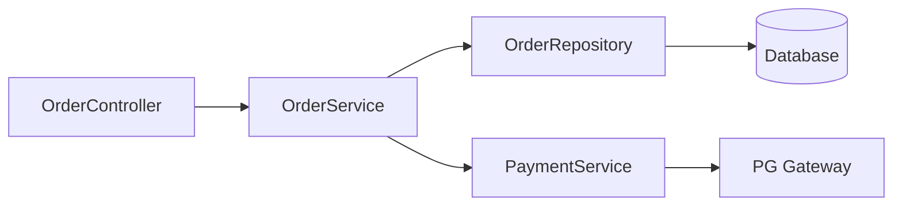

개발자의 하루는 코드를 작성하는 시간보다 **코드를 이해하고, 고치고, 설명하는 시간**이 훨씬 많습니다. Claude Code는 바로 이 지점을 공략합니다. 단순한 자동완성 도구가 아니라, 코드베이스 전체를 이해하고 대화하듯 함께 작업하는 **AI 페어 프로그래머**입니다. 이 가이드에서는 설치부터 고급 활용까지, Claude Code로 실제 개발 생산성을 높이는 방법을 단계별로 살펴봅니다.

---

## 1. Claude Code란 무엇인가

Claude Code는 Anthropic이 만든 **터미널 기반 AI 코딩 에이전트**입니다. 에디터 플러그인이 아니라, 터미널에서 직접 실행되어 파일을 읽고, 수정하고, 명령어를 실행하는 자율적인 에이전트로 작동합니다.

> **비유:** 기존 AI 코딩 도구가 "옆에 앉아 조언해주는 선배"라면, Claude Code는 "내 맥북에 직접 접근해서 함께 코딩하는 공동 개발자"입니다. 파일 시스템을 직접 탐색하고, 테스트를 돌리고, Git 히스토리를 분석합니다.

### Claude Code의 핵심 특징

**컨텍스트 인식**: 단순히 열린 파일 하나가 아니라, 프로젝트 전체 구조를 파악합니다. `package.json`, `README`, 디렉터리 트리를 종합해 "이 프로젝트가 무엇인지"를 먼저 이해합니다.

**도구 사용**: 파일 읽기/쓰기, 터미널 명령어 실행, 웹 검색, Git 작업을 직접 수행합니다. 사람이 할 수 있는 대부분의 개발 작업을 자율적으로 처리합니다.

**대화 지속성**: 하나의 세션 안에서 이전 대화 내용을 기억합니다. "아까 만든 함수에 예외 처리 추가해줘"같은 자연스러운 대화가 가능합니다.

**긴 컨텍스트 윈도우**: 최대 200K 토큰의 컨텍스트를 지원해, 대규모 코드베이스도 한 번에 파악합니다.

---

## 2. 설치 및 초기 설정

### 2.1 사전 요구사항

Claude Code는 Node.js 기반으로 동작합니다. 설치 전에 다음을 확인합니다.

```bash
# Node.js 버전 확인 (18 이상 권장)
node --version

# npm 버전 확인
npm --version
```

### 2.2 설치

```bash
# npm으로 전역 설치
npm install -g @anthropic-ai/claude-code

# 설치 확인
claude --version
```

### 2.3 API 키 설정

Anthropic Console(console.anthropic.com)에서 API 키를 발급받습니다. Claude Code는 Pro 플랜 이상 또는 API 직접 결제 방식으로 사용합니다.

```bash
# API 키를 환경변수로 설정 (bash/zsh)
export ANTHROPIC_API_KEY="sk-ant-..."

# 영구 적용을 위해 셸 설정 파일에 추가
echo 'export ANTHROPIC_API_KEY="sk-ant-..."' >> ~/.zshrc
source ~/.zshrc
```

### 2.4 첫 실행

```bash
# 프로젝트 디렉터리로 이동
cd /path/to/your/project

# Claude Code 시작
claude
```

처음 실행하면 Claude Code가 프로젝트 구조를 탐색하고 컨텍스트를 파악합니다. `CLAUDE.md` 파일이 있으면 자동으로 읽어 프로젝트 규칙을 적용합니다.

---

## 3. CLAUDE.md — 프로젝트 설정의 핵심

`CLAUDE.md`는 Claude Code에게 프로젝트를 소개하는 "팀 온보딩 문서"입니다. 이 파일 하나로 AI가 코드 스타일, 금지 사항, 개발 규칙을 자동으로 따르게 할 수 있습니다.

> **비유:** 신입 개발자가 첫 출근했을 때 건네주는 "팀 컨벤션 문서"와 같습니다. 이 문서를 잘 써놓으면, 매번 같은 설명을 반복하지 않아도 됩니다.

### 효과적인 CLAUDE.md 작성법

```markdown
# 프로젝트 개요
Spring Boot 기반 전자상거래 API 서버입니다.
Java 17, Spring Boot 3.2, PostgreSQL 15를 사용합니다.

# 코드 컨벤션
- 들여쓰기: 4 spaces (탭 금지)
- 클래스명: PascalCase
- 변수명: camelCase
- 상수: UPPER_SNAKE_CASE
- 모든 public 메서드에 Javadoc 필수

# 금지 사항
- System.out.println 사용 금지 (반드시 lombok @Slf4j 사용)
- @Autowired 필드 주입 금지 (생성자 주입만 허용)
- 테스트 없이 서비스 레이어 코드 추가 금지

# 빌드 및 테스트
- 빌드: ./gradlew build
- 테스트 실행: ./gradlew test
- 로컬 서버 실행: ./gradlew bootRun

# 브랜치 전략
- main: 프로덕션
- develop: 개발 통합
- feature/[JIRA-번호]-설명: 기능 개발
```

### CLAUDE.md 위치 전략

```
project-root/
├── CLAUDE.md              # 전체 프로젝트 규칙
├── src/
│   ├── CLAUDE.md          # 소스코드 전용 규칙
│   └── test/
│       └── CLAUDE.md      # 테스트 전용 규칙
```

서브디렉터리의 CLAUDE.md는 해당 디렉터리 작업 시 추가로 적용됩니다.

---

## 4. 효과적인 프롬프트 전략

Claude Code를 잘 활용하는 핵심은 **구체적이고 맥락이 풍부한 프롬프트**입니다. 막연한 요청보다 명확한 목표와 제약 조건을 함께 제시하면 훨씬 좋은 결과를 얻습니다.

> **비유:** 택시를 탈 때 "어디 좋은 데로 가주세요"보다 "강남역 2번 출구 앞 스타벅스까지 가주세요"가 훨씬 빠르게 목적지에 도달하는 것과 같습니다.

### 4.1 나쁜 프롬프트 vs 좋은 프롬프트

**나쁜 예:**
```
로그인 기능 만들어줘
```

**좋은 예:**
```
Spring Security를 사용해서 JWT 기반 로그인 API를 만들어줘.
- POST /api/v1/auth/login 엔드포인트
- 요청: { "email": "string", "password": "string" }
- 응답: { "accessToken": "string", "refreshToken": "string", "expiresIn": 3600 }
- 비밀번호는 BCrypt로 검증
- 실패 시 401 응답 with 에러 메시지
- UserService, AuthService 분리
- 단위 테스트 포함
```

### 4.2 컨텍스트 제공 전략

**파일 직접 참조:**
```
@UserService.java 파일의 findByEmail 메서드에 캐싱 레이어 추가해줘.
Redis를 사용하고, TTL은 10분으로 설정해줘.
```

**에러 메시지 포함:**
```
아래 에러가 발생했어. 원인 찾아서 수정해줘.

java.lang.NullPointerException: Cannot invoke "String.length()"
  at com.example.UserService.validateEmail(UserService.java:42)
  at com.example.AuthController.login(AuthController.java:28)
```

**기존 코드 패턴 유지 요청:**
```
ProductService.java와 동일한 패턴으로 OrderService를 만들어줘.
Repository, DTO, 예외 처리 방식을 그대로 따라줘.
```

### 4.3 단계적 작업 분해

복잡한 기능은 한 번에 요청하지 말고 단계별로 진행합니다.

```
# 1단계: 설계 확인
주문 취소 기능을 어떻게 설계할지 계획을 먼저 보여줘.
파일 구조, 필요한 메서드, DB 변경사항을 요약해줘.

# 2단계: 승인 후 구현
계획대로 구현해줘.

# 3단계: 테스트
테스트 케이스 작성해줘.
```

---

## 5. 코드 리뷰 자동화

Claude Code는 단순히 코드를 작성하는 것을 넘어, **코드 리뷰 파트너**로도 탁월합니다. PR을 제출하기 전에 Claude Code에게 먼저 리뷰를 받으면 팀 코드 리뷰 품질이 눈에 띄게 높아집니다.

> **비유:** 발표 전에 친한 동료에게 "이거 말이 되는 것 같아?"라고 먼저 물어보는 것과 같습니다. 공식 발표(PR) 전에 비공식 사전 검토를 거치는 셈입니다.

### 5.1 코드 품질 리뷰

```
방금 수정한 OrderService.java를 리뷰해줘.
다음 기준으로 확인해줘:
1. SOLID 원칙 위반 여부
2. 잠재적 NPE 위험
3. 트랜잭션 처리 누락
4. 성능 문제 (N+1 쿼리 등)
5. 보안 취약점
```

### 5.2 PR diff 리뷰

```bash
# Git diff를 Claude Code에 전달
git diff main...feature/order-cancel | claude "이 변경사항을 리뷰해줘.
버그, 코드 스멜, 테스트 커버리지 누락을 중심으로 봐줘."
```

### 5.3 자동 리뷰 스크립트

```bash
#!/bin/bash
# review.sh — PR 제출 전 자동 리뷰

BRANCH=$(git branch --show-current)
DIFF=$(git diff main...$BRANCH)

echo "$DIFF" | claude "
다음 Git diff를 리뷰해줘.

리뷰 기준:
- 버그 가능성
- 엣지 케이스 누락
- 코딩 컨벤션 위반
- 불필요한 복잡도
- 테스트 누락

심각도별로 분류해서 보고해줘: [CRITICAL] [WARNING] [SUGGESTION]
"
```

---

## 6. 리팩토링 워크플로우

레거시 코드를 현대적으로 바꾸는 작업은 Claude Code가 가장 빛을 발하는 영역입니다. 맥락을 이해하고 점진적으로 안전하게 리팩토링을 진행합니다.

### 6.1 레거시 코드 분석

```
LegacyOrderProcessor.java를 분석해줘.
현재 문제점, 리팩토링 우선순위, 예상 리스크를 정리해줘.
기존 동작을 깨지 않는 방법으로 개선 계획을 세워줘.
```

### 6.2 단계적 리팩토링

```
1단계로 LegacyOrderProcessor의 긴 메서드들을
작은 private 메서드로 분리해줘.
로직 변경 없이 구조만 개선해줘.
기존 테스트가 모두 통과해야 해.
```

### 6.3 패턴 현대화

```
아래 코드를 Java 17 스타일로 현대화해줘:
- Optional 활용
- Stream API 적용
- Record 클래스 도입
- Pattern Matching 활용
변경 전/후 비교표도 만들어줘.
```

**변경 전 코드:**
```java
public String getCustomerName(Order order) {
    if (order != null) {
        if (order.getCustomer() != null) {
            if (order.getCustomer().getName() != null) {
                return order.getCustomer().getName();
            }
        }
    }
    return "Unknown";
}
```

**Claude Code가 제안하는 변경 후:**
```java
public String getCustomerName(Order order) {
    return Optional.ofNullable(order)
        .map(Order::getCustomer)
        .map(Customer::getName)
        .orElse("Unknown");
}
```

---

## 7. TDD 워크플로우

Claude Code와 함께하는 TDD(Test-Driven Development)는 일반적인 TDD보다 훨씬 빠릅니다. 테스트 작성 → 구현 → 리팩토링 사이클을 AI와 함께 빠르게 돌릴 수 있습니다.

> **비유:** 건물 설계도(테스트)를 먼저 그리고, 건물(구현)을 짓는 방식입니다. Claude Code는 설계도를 보고 빠르게 건물을 올려주는 시공팀입니다.

### 7.1 Red 단계 — 테스트 먼저

```
PaymentService의 processPayment 메서드에 대한 테스트를 먼저 작성해줘.

요구사항:
- 정상 결제 성공 케이스
- 잔액 부족 시 InsufficientBalanceException
- 카드 만료 시 ExpiredCardException
- 외부 PG API 호출 실패 시 PaymentGatewayException
- Mockito로 외부 의존성 Mock 처리

아직 구현체는 만들지 말고, 테스트만 먼저 작성해줘.
```

### 7.2 Green 단계 — 최소 구현

```
방금 작성한 테스트가 모두 통과하도록
PaymentService를 최소한으로 구현해줘.
과도한 최적화 없이, 테스트 통과에만 집중해줘.
```

### 7.3 Refactor 단계

```
테스트가 모두 통과하는 상태에서 PaymentService를 리팩토링해줘.
- 메서드 분리
- 예외 처리 일관성
- 코드 중복 제거
리팩토링 후 테스트가 여전히 통과하는지 확인해줘.
```

---

## 8. 대규모 코드베이스 탐색

수십만 줄의 레거시 프로젝트에 투입됐을 때, Claude Code는 강력한 온보딩 도구가 됩니다.

### 8.1 프로젝트 전체 파악

```
이 프로젝트의 전체 구조를 파악해줘.
- 핵심 도메인 모델
- 주요 서비스 레이어
- 외부 의존성 (DB, 메시지큐, 외부 API)
- 데이터 흐름
한 페이지 요약으로 만들어줘.
```

### 8.2 특정 기능 추적

```
주문이 생성될 때 어떤 코드가 실행되는지
OrderController부터 DB 저장까지 흐름을 추적해줘.
관련된 모든 클래스와 메서드를 나열해줘.
```



### 8.3 의존성 분석

```
UserService가 변경될 때 영향받는 모든 클래스를 찾아줘.
직접 의존과 간접 의존을 구분해서 보여줘.
```

### 8.4 데드 코드 탐지

```
사용되지 않는 메서드, 클래스, 상수를 찾아줘.
제거해도 안전한 것과 확인이 필요한 것으로 분류해줘.
```

---

## 9. 실제 업무 사례

### 사례 1: API 문서화 자동화

```
UserController.java의 모든 API 엔드포인트에
Swagger/OpenAPI 어노테이션을 추가해줘.
@Operation, @Parameter, @ApiResponse를 포함해줘.
기존 로직은 변경하지 말고 어노테이션만 추가해줘.
```

**시간 절약 효과:** 수동 작업 2시간 → Claude Code 5분 + 검토 10분

### 사례 2: DB 마이그레이션 스크립트 생성

```
User 엔티티에 새 컬럼을 추가했어:
- phoneNumber (VARCHAR 20, nullable)
- lastLoginAt (TIMESTAMP, nullable)
- isEmailVerified (BOOLEAN, default false)

Flyway 마이그레이션 스크립트 V3__add_user_columns.sql을 만들어줘.
롤백 스크립트도 함께 만들어줘.
```

### 사례 3: 성능 병목 분석

```
아래 쿼리가 느려. 최적화 방법 알려줘.
실행 계획도 같이 분석해줘.

SELECT o.*, u.name, u.email, p.product_name
FROM orders o
JOIN users u ON o.user_id = u.id
JOIN order_items oi ON o.id = oi.order_id
JOIN products p ON oi.product_id = p.id
WHERE o.status = 'PENDING'
ORDER BY o.created_at DESC;
```

### 사례 4: 멀티파일 리팩토링

```
현재 분산된 상수값들을 통합해줘.
프로젝트 전체에서 하드코딩된 "ADMIN", "USER", "GUEST" 문자열을
UserRole enum으로 교체해줘.
영향받는 파일을 전부 찾아서 일괄 수정해줘.
```

---

## 10. 슬래시 명령어 활용

Claude Code는 `/` 로 시작하는 내장 명령어를 제공합니다.

| 명령어 | 설명 |
|--------|------|
| `/help` | 사용 가능한 명령어 목록 |
| `/clear` | 대화 컨텍스트 초기화 |
| `/compact` | 긴 대화를 요약해서 토큰 절약 |
| `/memory` | CLAUDE.md 메모리 관리 |
| `/model` | 사용할 Claude 모델 변경 |
| `/cost` | 현재 세션 비용 확인 |
| `/exit` | Claude Code 종료 |

### /compact 활용 팁

긴 작업 세션 중간에 `/compact`를 사용하면 컨텍스트를 요약해서 토큰 한계를 늦출 수 있습니다.

```
# 중요한 작업 맥락을 먼저 정리하고 compact 실행
지금까지 작업한 내용을 요약해줘:
어떤 파일을 수정했고, 남은 작업이 무엇인지.
그 다음 /compact 실행할게.
```

---

## 11. Git 통합 워크플로우

Claude Code는 Git 작업도 자율적으로 수행합니다.

### 11.1 커밋 메시지 자동 생성

```
방금 수정한 내용으로 커밋 메시지 만들어줘.
Conventional Commits 형식으로,
변경 이유와 영향 범위를 포함해줘.
```

### 11.2 브랜치 전략 도우미

```
feature/order-cancel 브랜치에서 작업 중이야.
develop 브랜치와 충돌이 났어.
충돌 파일 분석해서 해결 방법 제안해줘.
```

### 11.3 릴리스 노트 자동화

```bash
# 마지막 릴리스 이후 변경사항으로 릴리스 노트 생성
git log v1.2.0..HEAD --oneline | claude "
이 커밋 목록으로 릴리스 노트를 작성해줘.
- 새 기능
- 버그 수정
- 성능 개선
- 브레이킹 체인지
형식으로 분류해줘.
"
```

---

## 12. 비용 최적화 전략

Claude Code는 API 사용량에 따라 요금이 부과됩니다. 스마트하게 사용하면 비용을 크게 줄일 수 있습니다.

> **비유:** 택시 미터기를 생각하면 됩니다. 목적지가 명확할수록, 불필요한 우회 없이 바로 가는 것이 경제적입니다.

### 비용 절감 팁

**1. 작업 범위 한정:** 전체 프로젝트보다 관련 파일만 참조하도록 구체적으로 지정합니다.

**2. /compact 활용:** 대화가 길어지면 중간에 compact해서 토큰 절약합니다.

**3. 일괄 작업:** 유사한 작업은 한 번의 프롬프트로 묶어서 처리합니다.

**4. 모델 선택:** 간단한 작업은 더 저렴한 Claude Haiku 모델을 사용합니다.

```bash
# 비용 확인
/cost

# 더 저렴한 모델로 전환
/model claude-3-haiku-20240307
```

---

## 13. 팀 도입 전략

Claude Code를 혼자 쓰는 것도 좋지만, 팀 전체에 도입하면 시너지가 폭발합니다.

### 13.1 CLAUDE.md 표준화

팀 공용 `CLAUDE.md`를 리포지터리에 커밋해서 모든 팀원이 동일한 AI 컨텍스트를 사용하도록 합니다.

### 13.2 프롬프트 라이브러리 구축

```markdown
# team-prompts/code-review.md
## 코드 리뷰 표준 프롬프트

아래 코드를 리뷰해줘. 팀 컨벤션(CLAUDE.md 참고)을 기준으로:

**필수 확인 사항:**
- [ ] 예외 처리 완전성
- [ ] 트랜잭션 경계
- [ ] 입력 유효성 검증
- [ ] 로그 레벨 적절성
- [ ] 테스트 커버리지

심각도: [BLOCKER] [MAJOR] [MINOR] [TRIVIAL]
```

### 13.3 온보딩 자동화

```
이 프로젝트에 처음 투입된 신입 개발자를 위한
온보딩 가이드를 만들어줘.
- 프로젝트 구조 설명
- 로컬 환경 설정 방법
- 첫 번째 기여를 위한 단계별 가이드
- 자주 발생하는 실수와 해결법
```

---

## 14. 고급 활용: 커스텀 에이전트 패턴

Claude Code를 스크립트와 결합하면 반복 작업을 완전 자동화할 수 있습니다.

### 14.1 CI/CD 통합

```yaml
# .github/workflows/ai-review.yml
name: AI Code Review

on:
  pull_request:
    types: [opened, synchronize]

jobs:
  review:
    runs-on: ubuntu-latest
    steps:
      - uses: actions/checkout@v3
        with:
          fetch-depth: 0

      - name: AI Review
        env:
          ANTHROPIC_API_KEY: ${{ secrets.ANTHROPIC_API_KEY }}
        run: |
          npm install -g @anthropic-ai/claude-code
          git diff origin/main...${{ github.sha }} | \
          claude "코드 리뷰해줘. BLOCKER 이슈만 보고해줘." \
          > review.txt
          cat review.txt
```

### 14.2 일일 코드 품질 리포트

```bash
#!/bin/bash
# daily-quality-check.sh

# 오늘 변경된 파일만 검사
CHANGED_FILES=$(git diff --name-only HEAD~1 HEAD -- "*.java")

for file in $CHANGED_FILES; do
    echo "=== Reviewing: $file ==="
    claude "
    $file 파일을 분석해줘.
    잠재적 버그, 성능 이슈, 보안 취약점을 찾아줘.
    각 이슈에 라인 번호를 포함해줘.
    " < "$file"
done
```

---

## 15. 생산성 측정과 ROI

Claude Code 도입 후 실제 팀에서 측정한 생산성 향상 사례입니다.

| 작업 유형 | 기존 소요 시간 | Claude Code 활용 | 절약 시간 |
|-----------|---------------|-----------------|-----------|
| 새 API 엔드포인트 개발 | 4시간 | 1시간 | 75% |
| 코드 리뷰 준비 | 1시간 | 10분 | 83% |
| 버그 원인 분석 | 2시간 | 30분 | 75% |
| API 문서 작성 | 3시간 | 20분 | 89% |
| 레거시 코드 파악 | 1일 | 2시간 | 75% |
| 테스트 코드 작성 | 2시간 | 30분 | 75% |

> **비유:** 계산기가 등장했을 때 회계사들이 사라진 것이 아니라, 더 복잡한 분석에 집중할 수 있게 된 것처럼, Claude Code는 개발자를 대체하는 것이 아니라 더 가치 있는 작업에 집중하게 해줍니다.

---

## 마치며

Claude Code는 단순한 코드 생성 도구가 아닙니다. 코드베이스를 이해하고, 맥락을 파악하며, 실제 개발 워크플로우에 통합되는 **진정한 AI 페어 프로그래밍** 도구입니다.

처음에는 간단한 리팩토링이나 문서화 작업부터 시작해보세요. Claude Code가 코드를 얼마나 정확하게 이해하는지 확인하고, 점차 복잡한 작업으로 영역을 넓혀가는 방식을 권장합니다.

가장 중요한 것은 **AI의 출력을 맹목적으로 신뢰하지 않는 것**입니다. Claude Code는 훌륭한 페어 프로그래머지만, 최종 판단은 여전히 개발자의 몫입니다. AI의 제안을 검토하고, 이해하고, 필요하면 수정하는 역량이 바로 AI 시대의 핵심 개발자 역량입니다.

---

*본 가이드는 Claude Code 최신 버전 기준으로 작성되었습니다. 기능은 계속 업데이트될 수 있습니다.*
