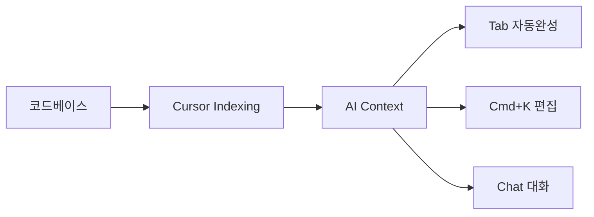

VS Code에 AI 플러그인을 추가하는 것과, 처음부터 AI를 중심으로 설계된 에디터를 쓰는 것은 차원이 다릅니다. Cursor는 단순히 "AI 기능이 있는 에디터"가 아니라, **코드베이스 전체를 이해하고 대화할 수 있는 AI 네이티브 환경**입니다. 이 가이드에서 설치부터 고급 활용까지 모두 다룹니다.

---

## 1. Cursor란 무엇인가

Cursor는 VS Code를 포크(fork)해서 만든 AI 네이티브 코드 에디터입니다. VS Code의 모든 기능(확장 프로그램, 단축키, 테마)을 그대로 사용하면서, AI 기능이 에디터 깊숙이 통합되어 있습니다.

> **비유:** 일반 자동차에 네비게이션을 붙이는 것(VS Code + Copilot)과, 처음부터 AI 주행 보조 시스템을 설계에 포함한 전기차(Cursor)의 차이입니다. 결과적으로 목적지에 가는 것은 같지만, 운전 경험이 근본적으로 다릅니다.

### Cursor의 핵심 차별점



**1. 코드베이스 인덱싱:** 프로젝트 전체를 벡터 DB에 인덱싱해서 AI가 전체 컨텍스트를 파악합니다.

**2. 다중 파일 컨텍스트:** 단일 파일이 아닌 관련 파일들을 자동으로 참조합니다.

**3. 실시간 코드베이스 이해:** 새 파일을 추가하면 자동으로 인덱싱되어 AI가 즉시 인식합니다.

---

## 2. 설치 및 초기 설정

### 2.1 다운로드 및 설치

[cursor.com](https://cursor.com)에서 운영체제에 맞는 버전을 다운로드합니다.

- macOS: `.dmg` 파일 다운로드 후 Applications 폴더로 이동
- Windows: `.exe` 설치 프로그램 실행
- Linux: `.AppImage` 또는 `.deb` 파일 사용

### 2.2 VS Code 설정 가져오기

첫 실행 시 VS Code 설정 가져오기를 선택합니다. 기존 VS Code 사용자라면 이 단계에서 바로 친숙한 환경을 유지할 수 있습니다.

```
Cursor 첫 실행 → "Import VS Code Settings" 선택
→ 확장 프로그램, 테마, 단축키가 자동으로 가져와짐
```

### 2.3 AI 모델 설정

Cursor는 여러 AI 모델을 지원합니다.

**Settings → Models에서 설정:**

| 모델 | 특징 | 추천 용도 |
|------|------|-----------|
| claude-3-5-sonnet | 코드 이해 최강 | 복잡한 리팩토링, 분석 |
| gpt-4o | 빠르고 균형잡힘 | 일반 코딩 |
| claude-3-haiku | 빠르고 저렴 | 간단한 자동완성 |
| gemini-1.5-pro | 긴 컨텍스트 | 대규모 파일 분석 |

### 2.4 프로젝트 인덱싱

처음 프로젝트를 열면 Cursor가 자동으로 코드베이스를 인덱싱합니다.

```
파일 열기 → 우측 하단에 인덱싱 진행 표시 → 완료 후 AI 기능 활성화
```

인덱싱이 완료되면 AI가 프로젝트 전체 구조를 이해한 상태가 됩니다.

---

## 3. Tab 자동완성 — 생각을 읽는 AI

Cursor의 Tab 자동완성은 GitHub Copilot보다 훨씬 스마트합니다. 현재 작성 중인 코드뿐만 아니라, **방금 한 수정을 보고 다음에 해야 할 작업을 예측**합니다.

> **비유:** 경험 많은 페어 프로그래머가 당신이 타이핑하는 것을 보고 "아, 이걸 하려는구나"라고 파악해서 미리 다음 줄을 준비해두는 것과 같습니다.

### 3.1 기본 자동완성

함수를 작성하기 시작하면 전체 구현을 제안합니다.

```java
// 이렇게 입력을 시작하면...
public List<User> findActiveUsersByAge(int minAge, int maxAge) {
    // Cursor가 아래를 자동으로 제안
    return userRepository.findAll().stream()
        .filter(user -> user.isActive())
        .filter(user -> user.getAge() >= minAge && user.getAge() <= maxAge)
        .collect(Collectors.toList());
}
```

`Tab`으로 수락, `Esc`로 거절, `Alt+]`로 다음 제안을 볼 수 있습니다.

### 3.2 다음 편집 예측 (Next Edit Prediction)

한 줄을 수정하면 Cursor가 다음에 수정해야 할 곳을 자동으로 예측합니다.

```java
// 메서드 시그니처를 변경하면...
// 변경 전
public void updateUser(Long id, String name) { ... }

// 이렇게 변경하면
public void updateUser(Long id, String name, String email) { ... }
// → Cursor가 이 메서드를 호출하는 모든 곳에 email 파라미터 추가를 제안
```

### 3.3 자동완성 최적화 팁

**주석으로 의도 표현:**
```java
// 사용자의 최근 30일 주문을 총액 내림차순으로 가져오기
public List<Order> getRecentOrders(Long userId) {
    // Tab 누르면 정확한 구현 제안
```

**타입 힌트 활용:**
```java
Map<String, List<Order>> // 이것만 입력해도 적절한 groupingBy 코드 제안
```

---

## 4. Cmd+K — 인라인 AI 편집

`Cmd+K` (Windows: `Ctrl+K`)는 Cursor의 핵심 기능 중 하나입니다. 코드를 선택하거나, 빈 곳에서 자연어로 코드를 생성/수정합니다.

> **비유:** 문서 작업 중에 "이 단락을 더 간결하게 바꿔줘"라고 말하면 즉시 수정해주는 비서와 같습니다. 에디터 밖으로 나가지 않고 인라인에서 바로 처리됩니다.

### 4.1 코드 생성

빈 라인에서 `Cmd+K`:
```
→ "JWT 토큰 검증 미들웨어 생성해줘"
→ 즉시 해당 위치에 코드 생성
```

### 4.2 코드 수정

코드를 선택하고 `Cmd+K`:
```java
// 선택한 코드
public String formatDate(Date date) {
    SimpleDateFormat sdf = new SimpleDateFormat("yyyy-MM-dd");
    return sdf.format(date);
}

// Cmd+K → "Java 8 LocalDate 방식으로 변경해줘"
// 즉시 변환됨
public String formatDate(LocalDate date) {
    return date.format(DateTimeFormatter.ofPattern("yyyy-MM-dd"));
}
```

### 4.3 터미널에서 Cmd+K

터미널 창에서 `Cmd+K`를 누르면 자연어로 명령어를 생성합니다.

```
→ "3일보다 오래된 로그 파일 삭제해줘"
→ find /var/log -name "*.log" -mtime +3 -delete
```

```
→ "Docker 컨테이너 중 포트 8080을 사용하는 것 찾아줘"
→ docker ps --filter "publish=8080"
```

---

## 5. Chat — 코드베이스와 대화

`Cmd+L` (Chat 창 열기)로 코드베이스 전체를 컨텍스트로 한 대화를 시작합니다.

### 5.1 @파일 참조

```
@UserService.java 에서 트랜잭션 처리가 제대로 되고 있는지 확인해줘
```

```
@src/main/java/com/example/order/ 디렉터리의 전체 구조를 설명해줘
```

### 5.2 @코드베이스 참조

```
@codebase 에서 결제 처리 관련 코드를 모두 찾아줘.
어디에 분산되어 있는지 구조도를 그려줘.
```

```
@codebase 에서 deprecated된 API를 사용하는 곳을 모두 찾아줘
```

### 5.3 @웹 참조

```
@web Spring Boot 3.3의 새 기능을 조사해서, 우리 @application.yml 에
적용할 수 있는 것들을 알려줘
```

### 5.4 멀티파일 편집

Chat에서 여러 파일에 걸친 변경을 한 번에 요청할 수 있습니다.

```
UserDTO와 UserEntity가 분리되어 있는데,
새 필드 "phoneNumber"를 추가하려면 수정해야 할 모든 파일을 알려주고
직접 수정해줘.
```

Cursor가 관련된 모든 파일을 찾아서 일괄 수정합니다.

---

## 6. .cursorrules 설정

`.cursorrules`는 프로젝트 전체에 적용되는 AI 동작 규칙 파일입니다. CLAUDE.md와 유사하지만 Cursor에 특화되어 있습니다.

> **비유:** 새 직원에게 주는 "팀 업무 매뉴얼"과 같습니다. 이 파일이 있으면 AI가 프로젝트 규칙을 자동으로 따릅니다.

### 6.1 Java/Spring Boot 프로젝트용

```
# .cursorrules

## 프로젝트 정보
Spring Boot 3.2, Java 17, PostgreSQL 15 기반 전자상거래 API

## 코드 스타일
- Lombok 필수 사용 (@Slf4j, @RequiredArgsConstructor, @Builder)
- 생성자 주입만 사용 (필드 주입 금지)
- Optional 적극 활용 (null 직접 반환 금지)
- Stream API 선호
- record 클래스를 DTO에 활용

## 레이어 규칙
- Controller: 요청/응답 변환만
- Service: 비즈니스 로직, @Transactional 경계
- Repository: DB 접근만

## 명명 규칙
- DTO: XxxRequestDto, XxxResponseDto
- Exception: XxxException (RuntimeException 상속)
- Test: XxxTest (단위), XxxIT (통합)

## 금지 사항
- System.out.println 사용 금지
- @SuppressWarnings 무분별 사용 금지
- Magic number 사용 금지 (상수로 정의)
- TODO 주석 없이 코드 완성 금지

## 테스트
- JUnit 5 + Mockito 사용
- @DisplayName 한국어로 작성
- given/when/then 구조 필수
- 경계값 테스트 필수
```

### 6.2 React/TypeScript 프로젝트용

```
# .cursorrules

## 기술 스택
React 18, TypeScript 5, Vite, TanStack Query, Zustand, Tailwind CSS

## 컴포넌트 규칙
- 함수형 컴포넌트만 사용 (클래스형 금지)
- Props는 interface로 명시적 타입 정의
- any 타입 사용 금지
- useEffect 의존성 배열 완전히 명시

## 파일 구조
- 컴포넌트: PascalCase.tsx
- 훅: useCamelCase.ts
- 유틸: camelCase.ts
- 타입: types.ts (각 도메인 폴더)

## 스타일
- Tailwind CSS 클래스 사용
- 인라인 스타일 금지
- CSS 모듈 사용 금지

## 상태 관리
- 서버 상태: TanStack Query
- 전역 클라이언트 상태: Zustand
- 지역 상태: useState
```

---

## 7. 대규모 프로젝트 활용법

### 7.1 레거시 코드 이해

```
@src/legacy/ 디렉터리의 코드를 분석해줘.

알고 싶은 것:
1. 전체적인 아키텍처 패턴
2. 핵심 비즈니스 로직이 어디에 있는지
3. 외부 의존성 (DB, API 등)
4. 가장 복잡한 부분 Top 3
5. 현대화할 때 가장 위험한 부분
```

### 7.2 코드 탐색 최적화


**심볼 검색과 AI 결합:**
```
@codebase 에서 OrderStatus enum이 사용되는 모든 곳을 찾아줘.
CANCELLED 상태 추가 시 영향받는 파일 목록도 함께 알려줘.
```

### 7.3 의존성 분석

```
@package.json 과 @pom.xml 을 보고
현재 사용 중인 라이브러리 중 보안 취약점이 있는 것을 찾아줘.
최신 버전으로 업그레이드 시 호환성 이슈도 예측해줘.
```

### 7.4 테스트 커버리지 분석

```
@src/ 디렉터리의 코드를 보고
테스트가 없는 public 메서드를 찾아줘.
비즈니스 중요도 순으로 우선순위를 매겨줘.
```

---

## 8. Cursor vs VS Code + Copilot 비교

### 8.1 기능 비교

| 기능 | Cursor | VS Code + Copilot |
|------|--------|-------------------|
| 코드베이스 인덱싱 | 전체 인덱싱 | 열린 파일만 |
| 멀티파일 컨텍스트 | 자동 참조 | 수동 지정 |
| 인라인 편집 | Cmd+K (강력) | 기본 제안 |
| 대화형 편집 | Chat (코드베이스 인식) | Chat (제한적) |
| 다음 편집 예측 | 지원 | 미지원 |
| 모델 선택 | 다양 (Claude, GPT, Gemini) | GPT-4o만 |
| VS Code 호환성 | 완전 호환 | 네이티브 |
| 가격 (Pro) | $20/월 | $10/월 (Copilot) |

### 8.2 어떤 경우에 Cursor가 더 좋은가

**Cursor가 압도적으로 좋은 경우:**
- 대규모 레거시 코드베이스 탐색
- 멀티파일 리팩토링
- 새 프로젝트에 온보딩
- 복잡한 버그 추적

**Copilot이 나은 경우:**
- 이미 VS Code 환경에 깊이 투자된 팀
- 엔터프라이즈 보안 정책이 엄격한 환경
- GitHub 통합이 핵심인 워크플로우

### 8.3 마이그레이션 전략

VS Code에서 Cursor로 전환 시:

```
1. Cursor 설치 (VS Code 설정 가져오기)
2. 가장 복잡한 프로젝트 1개에서 1주일 체험
3. .cursorrules 파일 작성 및 최적화
4. 팀 공유 .cursorrules 리포지터리 구축
5. 단계적으로 모든 프로젝트로 확장
```

---

## 9. 고급 기능: Composer

Composer는 Cursor의 가장 강력한 기능입니다. 자연어 명령 하나로 여러 파일에 걸친 복잡한 기능을 구현합니다.

> **비유:** 건축가에게 "2층 주택 설계해줘"라고 하면 설계도, 구조 계산서, 전기 배선도까지 모두 만들어주는 것과 같습니다. Composer는 한 문장으로 전체 기능 스캐폴딩을 만들어냅니다.

### 9.1 Composer 실행

`Cmd+Shift+I` (Windows: `Ctrl+Shift+I`)로 Composer를 엽니다.

### 9.2 Composer 활용 예시

```
상품 리뷰 기능을 전체적으로 구현해줘.

요구사항:
- 사용자가 구매 완료한 상품에만 리뷰 작성 가능
- 별점 (1-5), 제목, 내용 필드
- 리뷰당 최대 사진 5장
- 판매자 답글 기능
- 리뷰 좋아요 기능

기존 코드 패턴 (@UserService.java, @ProductService.java) 따라서 구현해줘.
필요한 파일을 모두 생성하고 수정해줘.
```

Cursor가 생성/수정하는 파일 목록:
- `Review.java` (Entity)
- `ReviewRepository.java`
- `ReviewService.java`
- `ReviewController.java`
- `ReviewDto.java` (Request/Response)
- `ReviewPhoto.java` (Entity)
- `V4__add_review_tables.sql` (Flyway)
- `ReviewServiceTest.java`
- `ReviewControllerTest.java`

---

## 10. Cursor Rules 고급 설정

### 10.1 파일 패턴별 규칙

```
# .cursorrules

## Test 파일에만 적용
[*.test.ts, *.spec.ts]
- describe/it 구조 사용
- beforeEach로 공통 setup 분리
- 각 test는 독립적으로 실행 가능해야 함

## Migration 파일에만 적용
[V*__*.sql]
- 롤백 스크립트 항상 포함
- 트랜잭션으로 감싸기
- 코멘트로 변경 이유 명시
```

### 10.2 AI 동작 커스터마이징

**Settings → Cursor Settings → Rules for AI:**

```
코드를 생성할 때:
1. 항상 주석으로 의도를 설명
2. TODO 없이 완전한 구현 제공
3. 예외 처리 항상 포함
4. 로그는 적절한 레벨 사용

코드를 리뷰할 때:
1. 구체적인 라인 번호 명시
2. 수정 전/후 코드 모두 보여주기
3. 이유 설명 필수
```

---

## 11. 팀 협업 설정

### 11.1 .cursorrules 공유

`.cursorrules`를 리포지터리에 커밋해서 팀 전체가 동일한 AI 경험을 공유합니다.

```bash
# .gitignore에서 제외 (기본적으로 무시될 수 있음)
# .cursorrules 파일은 꼭 git에 포함

git add .cursorrules
git commit -m "chore: add Cursor AI rules for team consistency"
```

### 11.2 팀 Cursor 설정 표준화

```json
// .vscode/settings.json (Cursor와 호환)
{
  "cursor.general.gitGraphEnabled": true,
  "cursor.cpp.disabledLanguages": [],
  "cursor.chat.smoothStreaming": true,
  "editor.inlineSuggest.enabled": true,
  "editor.suggestOnTriggerCharacters": true
}
```

---

## 12. 생산성 단축키 치트시트

| 단축키 (Mac) | 단축키 (Win) | 기능 |
|--------------|-------------|------|
| `Tab` | `Tab` | AI 제안 수락 |
| `Esc` | `Esc` | AI 제안 거절 |
| `Cmd+K` | `Ctrl+K` | 인라인 편집 |
| `Cmd+L` | `Ctrl+L` | Chat 창 열기 |
| `Cmd+Shift+I` | `Ctrl+Shift+I` | Composer 열기 |
| `Cmd+I` | `Ctrl+I` | 인라인 Chat |
| `Alt+]` | `Alt+]` | 다음 AI 제안 |
| `Alt+[` | `Alt+[` | 이전 AI 제안 |
| `Cmd+Shift+L` | `Ctrl+Shift+L` | Chat에 선택 코드 추가 |

---

## 13. Privacy Mode 와 보안

기업 환경에서 사용할 때는 코드가 AI 학습에 사용되지 않도록 설정합니다.

**Settings → General → Privacy Mode: Enabled**

Privacy Mode 활성화 시:
- 코드가 Cursor 서버에 저장되지 않음
- AI 학습 데이터로 사용되지 않음
- 요청이 암호화되어 전송

### 엔터프라이즈 고려사항

```
민감한 프로젝트에서는:
1. Privacy Mode 항상 활성화
2. 사내 LLM 연동 (Azure OpenAI 등)
3. .cursorrules에 민감 정보 포함 금지 명시
4. API 키, 비밀번호를 AI에 공유하지 않도록 팀 교육
```

---

## 14. 실전 워크플로우 예시

### 시나리오: 새 기능 개발 (결제 시스템)

```
1단계: 요구사항 분석 (Chat)
"@codebase 현재 결제 관련 코드가 어떻게 되어 있어?
새로 카카오페이를 추가하려면 어떤 부분을 수정해야 할지 분석해줘."

2단계: 설계 검토 (Chat)
"카카오페이 SDK 연동을 위한 설계를 제안해줘.
기존 @PaymentService.java 패턴을 따르되,
Strategy 패턴으로 확장 가능하게 해줘."

3단계: 구현 (Composer)
"카카오페이 결제 기능을 구현해줘.
KakaoPay SDK: kakao-pay-sdk-java 1.2.0 사용.
@PaymentService.java 패턴 따라서."

4단계: 검토 (Cmd+K)
생성된 코드 선택 → Cmd+K → "이 코드의 에러 처리가 충분한지 검토해줘"

5단계: 테스트 (Chat)
"방금 구현한 KakaoPayService의 단위 테스트를 작성해줘.
결제 성공, 실패, 타임아웃, 환불 시나리오 포함해줘."
```

---

## 마치며

Cursor는 단순한 에디터 업그레이드가 아닙니다. 개발 방식 자체를 바꾸는 패러다임 전환입니다. 처음에는 AI 제안을 얼마나 신뢰해야 할지 판단하는 데 시간이 걸리지만, 일주일만 사용해도 없이는 개발하기 불편할 정도로 생산성이 올라갑니다.

가장 큰 변화는 **"어떻게 구현하지?"를 덜 생각하고, "무엇을 만들지?"를 더 많이 생각하게 된다**는 것입니다. 구현 세부사항은 AI에게 맡기고, 개발자는 비즈니스 가치와 아키텍처 결정에 더 집중할 수 있습니다.

단, AI가 생성한 코드는 반드시 이해하고 검증해야 합니다. Cursor는 강력한 도구이지, 판단을 대신해주는 시스템이 아닙니다.

---

*본 가이드는 Cursor 0.43 버전 기준으로 작성되었습니다. 기능은 빠르게 업데이트되고 있습니다.*
