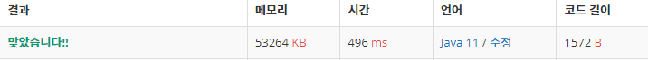

 

##### 🔗  에디터 백준 1406 문제 [스택]

```java
package stack;

import java.io.*;
import java.util.Stack;

public class Editor {


    public static void main(String[] args) throws IOException {

        BufferedReader br = new BufferedReader(new InputStreamReader(System.in));

        BufferedWriter bw = new BufferedWriter(new OutputStreamWriter(System.out));


        String line = br.readLine();

        int n = Integer.parseInt(br.readLine());

        Stack<Character> leftStack  = new Stack<>();
        Stack<Character> rightStack = new Stack<>();

        for(char ch : line.toCharArray()) {
            leftStack.push(ch);
        }


        for (int i = 0; i < n; i++) {

            String command = br.readLine();

            switch (command) {
                case "L":
                    if (!leftStack.isEmpty()){
                        rightStack.push(leftStack.pop());
                    }
                    break;
                case "D":
                    if (!rightStack.isEmpty()) {
                        leftStack.push(rightStack.pop());
                    }
                    break;
                case "B":
                    if (!leftStack.isEmpty()) {
                        leftStack.pop();
                    }
                    break;

                default:
                        leftStack.push(command.charAt(2));
                    break;
            }
        }

        while(!leftStack.isEmpty()) {
            rightStack.push(leftStack.pop());
        }

        while(!rightStack.isEmpty()) {
            bw.write(rightStack.pop());
        }
        bw.flush();
    }
}
```


<hr>


##### 💎결과 


