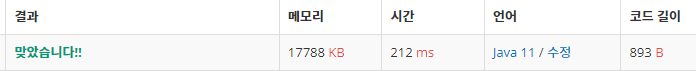

 

##### 🔗 쇠막대기 백준 10799문제 

```java
package stack;

import java.io.*;
import java.util.Stack;

public class Ironbar {

    public static void main(String[] args) throws IOException {

        BufferedReader br = new BufferedReader(new InputStreamReader(System.in));
        BufferedWriter bw = new BufferedWriter(new OutputStreamWriter(System.out));
        String line = br.readLine();
        Stack<Integer> stack = new Stack();
        int count = 0;
        for (int i = 0; i < line.length(); i++) {

            if (line.charAt(i) == '(') {
                stack.push(i);
            }
            else {
                if (stack.peek()+1 == i) {
                    stack.pop();
                    count+=stack.size();
                }
                else {
                    stack.pop();
                    count+=1;
                }
            }
        }
        bw.write(count+"\n");
        bw.flush();
    }
}

```


<hr>


##### 💎결과 


