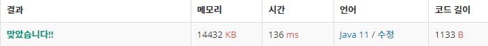

 

##### 🔗  괄호 백준 9012 문제 [스택]

```java
package stack;

import java.io.*;
import java.util.Stack;

public class Parenthesis {

    public static boolean isValid(String s) {

        Stack<Character> stack = new Stack<>();

        for (char ch : s.toCharArray()) {

            if (ch == '(') {
                stack.push(ch);
            }
            else if (ch == ')'){
                if (stack.isEmpty()) {
                    return false;
                }
                else {
                    stack.pop();
                }
            }
        }

        return stack.isEmpty();
    }

    public static void main(String[] args) throws IOException {

        BufferedReader br = new BufferedReader(new InputStreamReader(System.in));

        BufferedWriter bw = new BufferedWriter(new OutputStreamWriter(System.out));

        int n = Integer.parseInt(br.readLine());

        for (int i = 0; i < n; i++) {
            String line = br.readLine() + "\n";

            boolean result = isValid(line);
            if (result) {
                bw.write("YES\n");
            }
            else {
                bw.write("NO\n");
            }
        }
        bw.flush();
    }
}
```


<hr>


##### 💎결과 


