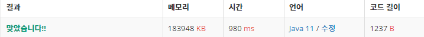

 

##### 🔗  수열 백준 1874 문제 [스택]

```java
package stack;

import java.io.BufferedWriter;
import java.io.OutputStreamWriter;
import java.util.Scanner;
import java.util.Stack;

public class Progression {

    public static void solve(int[] a) {

        Stack<Integer> stack = new Stack<>();

        StringBuilder sb = new StringBuilder();

        int m = 0;
        for (int num : a) {
            if (num > m) {
                while(num > m) {
                    stack.push(++m);
                    sb.append("+\n");
                }
                stack.pop();
                sb.append("-\n");
            }
            else {
                if(stack.peek() != num) {
                    System.out.println("NO");
                    return;
                }
                stack.pop();
                sb.append("-\n");
            }
        }

        System.out.println(sb.toString());
    }

    public static void main(String[] args) {

        BufferedWriter bw = new BufferedWriter(new OutputStreamWriter(System.out));
        Scanner sc = new Scanner(System.in);
        int n = Integer.parseInt(sc.nextLine());

        int a[] = new int[n];

        for (int i = 0 ; i < n; i++) {
            a[i] = Integer.parseInt(sc.nextLine());
        }

        solve(a);
    }
}
```


<hr>


##### 💎결과 


