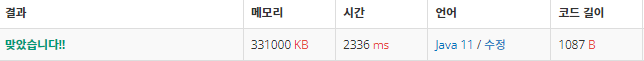

 

##### 🔗 오큰수 백준 17298문제 

```java
package stack;

import java.io.BufferedWriter;
import java.io.IOException;
import java.io.OutputStreamWriter;
import java.util.Scanner;
import java.util.Stack;

public class RightBigNumber {
    public static void main(String[] args) throws IOException {

        Scanner sc = new Scanner(System.in);

        BufferedWriter bw = new BufferedWriter(new OutputStreamWriter(System.out));

        int n = Integer.parseInt(sc.nextLine());
        int[] num = new int[n];
        int[] nge = new int[n];

        for (int i = 0; i < n; i++) {
            num[i] = sc.nextInt();
        }

        Stack<Integer> stack = new Stack<>();
        stack.push(0);

        int count = 1;
        while(count < num.length) {


            while(!stack.isEmpty() && num[stack.peek()] < num[count]) {
                nge[stack.pop()] = num[count];
            }

            stack.push(count);

            count++;
        }

        while(!stack.isEmpty()) {
            nge[stack.pop()] = -1;
        }

        for (int i : nge) {
            bw.write(i+" ");
        }

        bw.write("\n");
        bw.flush();

    }
}

```


<hr>


##### 💎결과 


