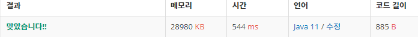

 

##### 🔗 단어 뒤집기 백준 9093문제 

```java
package stack;

import java.io.*;
import java.util.Stack;

public class WordReverse {

    public static void main(String[] args) throws IOException {
        BufferedReader bf = new BufferedReader(new InputStreamReader(System.in));
        int num = Integer.parseInt(bf.readLine());
        BufferedWriter bw = new BufferedWriter(new OutputStreamWriter(System.out));

        for (int i = 0 ; i < num; i++) {
            Stack<Character> stack = new Stack<>();

            String words = bf.readLine()+"\n";

            for (char one : words.toCharArray()) {
                if (one == ' ' || one == '\n') {
                    while(!stack.isEmpty()) {
                        bw.write(stack.pop());
                    }
                    bw.write(one);
                }
                else {
                    stack.push(one);
                }
            }
        }
        bw.flush();
    }
}

```


<hr>


##### 💎결과 



