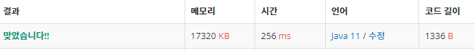

 

##### 🔗 단어 뒤집기2 백준 17413문제 

```java
package stack;

import java.io.*;
import java.util.Stack;

public class WordReverse2 {

    public static void print(BufferedWriter bw, Stack<Character> stack) throws IOException {
        while(!stack.isEmpty()) {
            bw.write(stack.pop());
        }
    }

    public static void main(String[] args) throws IOException {

        Stack<Character> stack = new Stack<>();

        BufferedReader br = new BufferedReader(new InputStreamReader(System.in));
        BufferedWriter bw = new BufferedWriter(new OutputStreamWriter(System.out));


        String line = br.readLine();

        boolean isTag = false;

        for (char ch : line.toCharArray()) {

            if (ch == '<') {
                print(bw, stack);
                isTag = true;
                bw.write(ch);
            }
            else if (ch == '>') {
                isTag = false;
                bw.write(ch);
            }
            else {
                if (!isTag) {
                    if (ch == ' ') {
                        print(bw, stack);
                        bw.write(ch);
                    }
                    else {
                        stack.push(ch);
                    }
                }
                else {
                    bw.write(ch);
                }
            }
        }

        print(bw, stack);
        bw.flush();
    }
}
```


<hr>


##### 💎결과 


