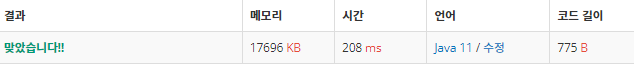

 

##### 🔗 최대공약수 최소공배수 백준 2609문제 

```java
package math;

import java.util.Scanner;

public class GcdLcd {
    public static void main(String[] args) {

        Scanner sc = new Scanner(System.in);

        String[] line = sc.nextLine().split(" ");

        int a = Integer.parseInt(line[0]);
        int b = Integer.parseInt(line[1]);

        int gcd = getGcd(a,b);
        int lcd = getLcd(gcd,a,b);

        System.out.println(gcd);
        System.out.println(lcd);
    }

    public static int getGcd(int a, int b){

        if (b == 0){
            return a;
        }
        else {
            return getGcd(b, a % b);
        }
    }

    public static int getLcd(int gcd, int a, int b) {

        //최소공배수 = 최대공약수 * (a/최대공약수) * (b/최대공약수)
        return gcd * (a/gcd) * (b/gcd);
    }
}
```


<hr>


##### 💎결과 


