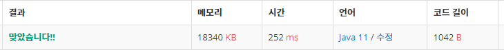

 

##### 🔗 최대공약수 합 9613문제 

```java
package math;

import java.io.BufferedWriter;
import java.io.IOException;
import java.io.OutputStreamWriter;
import java.util.Scanner;

public class GcdSum {

    public static void main(String[] args) throws IOException {

        Scanner sc = new Scanner(System.in);

        BufferedWriter bw = new BufferedWriter(new OutputStreamWriter(System.out));
        int n = Integer.parseInt(sc.nextLine());


        while (n-- > 0) {
            int num = sc.nextInt();

            int line[] = new int[num];
            for (int i = 0; i < num; i++){
                line[i] = sc.nextInt();
            }

            long count = 0;
            for (int j = 0; j < num-1; j++) {
                for (int k = j+1; k < num; k++) {
                    count += getGcd(line[j], line[k]);
                }
            }
            bw.write(count+"\n");
        }


        bw.flush();
    }

    public static int getGcd(int a, int b) {

        if (b == 0){
            return a;
        }
        else {
            return getGcd(b, a % b);
        }
    }
}
```


<hr>


##### 💎결과 


