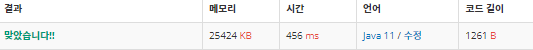

 

##### 🔗 골드바흐의 추측 백준 1929문제 

```java
package math;

import java.io.*;
import java.util.ArrayList;
import java.util.List;

public class GoldBagh {

    public static final int MAX = 1000000;
    public static void main(String[] args) throws IOException {

        BufferedReader br = new BufferedReader(new InputStreamReader(System.in));

        BufferedWriter bw = new BufferedWriter(new OutputStreamWriter(System.out));

        boolean[] check = new boolean[MAX+1];
        check[0] = check[1] = true;

        List<Integer> primes = new ArrayList<>();

        for (int i = 2; i*i <= MAX; i++) {

            if (check[i] == false) {
                primes.add(i);
                for (int j = i+i; j <=MAX; j+=i) {
                    check[j] = true;
                }
            }
        }

        while(true) {
            int n = Integer.parseInt(br.readLine());

            if (n == 0){
                break;
            }
            for (int i = 1; i < primes.size(); i++) {
                int p = primes.get(i);
                if (n-p > 0) {
                    if (check[n-p] == false) {
                        bw.write(n + " = " + p + " + " + (n-p)+"\n");
                        break;
                    }
                }

            }
        }
        bw.flush();
    }
}
```


<hr>


##### 💎결과 


