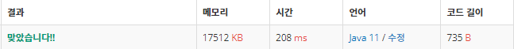

 

##### 🔗 소수 찾기 백준 1978문제 

```java
package math;

import java.util.Scanner;

public class Prime {


    public static boolean isPrime(int n) {
        if (n < 2) {
            return false;
        }
        else {
            for (int i = 2; i*i <= n; i++) {
                if (n % i == 0){
                    return false;
                }
            }
        }
        return true;
    }
    public static void main(String[] args) {


        Scanner sc = new Scanner(System.in);
        int n = Integer.parseInt(sc.nextLine());
        String[] line = sc.nextLine().split(" ");

        int result = 0;
        for (String one : line) {
            if(isPrime(Integer.parseInt(one))) {
                result++;
            }
        }
        System.out.println(result);
    }
}
```


<hr>


##### 💎결과 


