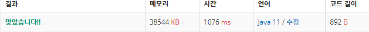

 

##### 🔗 소수 구하기 백준 1929문제 

```java
package math;

import java.util.Scanner;

public class SeieveOfEratosthenes {

    public static void getPrimebyRange(int a, int b){

        int[] primes = new int[b+1]; // 소수 저장
        int pn = 0; // 소수의 개수
        boolean[] check = new boolean[b+1];

        check[0] = check[1] = true;
        for (int i = 2; i * i <= b; i++) {

            if (check[i] == false) {
                //primes[pn++] = i;
                for (int j = i + i; j <= b; j += i) {
                    check[j] = true;
                }
            }
        }

        for (int i = a; i <= b; i++) {

            if (check[i]== false) {
                System.out.println(i);
            }
        }
    }


    public static void main(String[] args) {

        Scanner sc = new Scanner(System.in);

        int a = sc.nextInt();
        int b = sc.nextInt();

        getPrimebyRange(a,b);
    }
}

```


<hr>


##### 💎결과 


