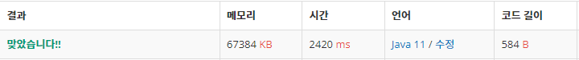

 

##### 🔗 2진수 8진수 변환 백준 1373문제 

```java
package math;

import java.util.Scanner;

public class BinaryToHex {
    public static void main(String[] args) {

        Scanner sc = new Scanner(System.in);

        String num = sc.nextLine();

        if (num.length() % 3 == 1) {
            System.out.print(num.charAt(0));
        }
        else if (num.length() % 3 == 2) {

            System.out.print((num.charAt(0)-'0')* 2 + (num.charAt(1)-'0') );
        }

        for (int i = num.length()%3; i < num.length(); i+=3) {
            System.out.print((num.charAt(i)-'0')*4 + (num.charAt(i+1)-'0') * 2 + (num.charAt(i+2)-'0'));
        }
    }
}
```


<hr>


##### 💎결과 


