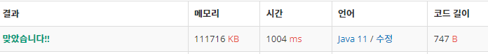

 

##### 🔗 숨바꼭질6 백준 17087문제 

```java
package math;

import java.util.Scanner;

public class HideAndSeek {

    public static void main(String[] args) {

        Scanner sc = new Scanner(System.in);
        int n = sc.nextInt();
        int s = sc.nextInt();

        int[] a = new int[n];
        for (int i = 0; i < n; i++) {
            a[i] = sc.nextInt();
        }

        int[] d = new int[n];

        for (int i = 0 ; i < n; i++) {
            d[i] = Math.abs(a[i]-s);
        }

        int max = d[0];
        for (int i = 1; i < d.length; i++) {
            max = gcd(max, d[i]);
        }
        System.out.println(max);

    }

    public static int gcd(int a, int b) {
        if (b == 0) {
            return a;
        }
        else {
            return gcd(b, a % b);
        }
    }
}
```


<hr>


##### 💎결과 


