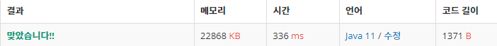

 

##### 🔗 골드바흐의 파티션 백준 17103문제 

```java
package math;

import java.io.BufferedWriter;
import java.io.IOException;
import java.io.OutputStreamWriter;
import java.util.*;

public class GoldBaghPartition {

    private static final int MAX = 1000000;
    private static boolean[] check = new boolean[MAX + 1];
    private static List<Integer> primes = new ArrayList<>();

    public static void main(String[] args) throws IOException {
        check[0] = check[1] = true;
        for (int i = 2; i <= MAX; i++) {
            if (check[i] == false) {
                primes.add(i);
                for (int j = i + i; j <= MAX; j += i) {
                    check[j] = true;
                }
            }
        }

        Scanner sc = new Scanner(System.in);
        int n = sc.nextInt();

        BufferedWriter bw = new BufferedWriter(new OutputStreamWriter(System.out));
        for (int i = 0; i < n; i++) {
            bw.write(getPrimes(sc.nextInt()) + "\n");
        }
        bw.flush();
    }

    public static int getPrimes(int n) {

        int count = 0;

        for (int i = 0; i < primes.size(); i++) {
            int p = primes.get(i);
            int findNum = n - p;
            if (findNum >= 2 && p <= findNum) {
                if (check[findNum] == false) {
                    count++;
                }
            }
            else {
                break;
            }

        }
        return count;
    }
}
```


<hr>


##### 💎결과 


