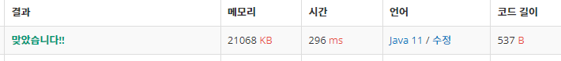

 

##### 🔗 카드 구매하기 백준 11052문제 

```java
package dynamic;

import java.util.Scanner;

public class CardPurchase {
    public static void main(String[] args) {

        Scanner sc = new Scanner(System.in);

        int n = Integer.parseInt(sc.nextLine());

        int[] p = new int[n+1];

        int[] d = new int[n+1];

        for (int i = 1; i <= n; i++) {
            p[i] = sc.nextInt();
        }

        for (int i = 1; i <= n; i++) {
            for (int j = 1; j <=i; j++) {
                d[i]= Math.max(p[j]+d[i-j], d[i]);
            }
        }

        System.out.println(d[n]);
    }
}
```


<hr>


##### 💎결과 


