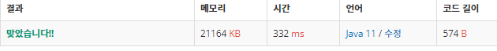

 

##### 🔗 카드 구매하기2 백준 16194문제 

```java
package dynamic;

import java.util.Scanner;

public class CardPurchase2 {

    public static void main(String[] args) {

        Scanner sc = new Scanner(System.in);

        int n = Integer.parseInt(sc.nextLine());

        int[] p = new int[n+1];
        int[] d = new int[n+1];


        for (int i = 1; i <= n; i++) {
            p[i] = sc.nextInt();
            d[i] = 1000 * 10000;
        }


        for (int i = 1; i <=n; i++) {

            for (int j = 1; j <= i; j++) {
                d[i] = Math.min(d[i], d[i-j]+p[j]);
            }
        }

        System.out.println(d[n]);
    }
}
```


<hr>


##### 💎결과 

****
