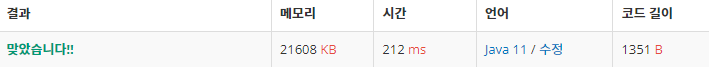

 

##### 🔗 1,2,3 더하기 5 백준 15990문제 

```java
package dynamic;

import java.io.*;

public class OneTwoThreeFive {

    public static final int MAX = 100000;
    public static final int J = 3;
    public static final int MOD = 1000000009;
    public static long D[][];
    public static void main(String[] args) throws IOException {

        BufferedReader br = new BufferedReader(new InputStreamReader(System.in));
        BufferedWriter bw = new BufferedWriter(new OutputStreamWriter(System.out));

        D = new long[MAX+1][J+1];

        for (int i = 1; i <= MAX; i++) {

            if ( i -1 >= 0) {
                D[i][1] = D[i-1][2]+D[i-1][3];
                if (i == 1) {
                    D[i][1] = 1;
                }
            }

            if ( i - 2 >= 0) {
                D[i][2] = D[i-2][1]+D[i-2][3];
                if (i == 2) {
                    D[i][2] = 1;
                }
            }

            if ( i -3 >= 0 ) {
                D[i][3] = D[i-3][1]+D[i-3][2];

                if (i == 3) {
                    D[i][3] = 1;
                }
            }
            D[i][1]%=MOD;
            D[i][2]%=MOD;
            D[i][3]%=MOD;
        }


        int n = Integer.parseInt(br.readLine());

        for (int i = 0; i < n; i++) {
            int k = Integer.parseInt(br.readLine());
            bw.write((D[k][1]+D[k][2]+D[k][3])%MOD+"\n");
        }
        bw.flush();
    }
}

```


<hr>


##### 💎결과 


