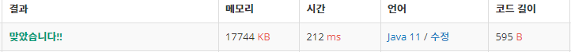

 

##### 🔗 이친수 백준 2193문제 

```java
package dynamic;

import java.util.Scanner;

public class PinaryNumber {

    public static long[][] pinaryNums;
    public static void main(String[] args) {

        Scanner sc = new Scanner(System.in);

        int n = sc.nextInt();

        pinaryNums = new long[n+1][2];

        pinaryNums[1][0] = 0;
        pinaryNums[1][1] = 1;

        for (int i = 2; i <= n; i++) {
            pinaryNums[i][0] = pinaryNums[i-1][0] + pinaryNums[i-1][1];
            pinaryNums[i][1] = pinaryNums[i-1][0];
        }

        long result = pinaryNums[n][0] + pinaryNums[n][1];
        System.out.println(result);
    }
}
```


<hr>


##### 💎결과 


