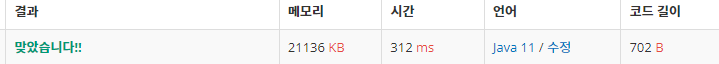

 

##### 🔗 가장 긴 증가하는 부분 수열 백준 11053문제 

```java
package dynamic;
import java.util.Scanner;

public class LongestIncreasingSubsequence {

    public static void main(String[] args) {

        Scanner sc = new Scanner(System.in);
        int n = sc.nextInt();

        int[] A = new int[n];

        int[] D = new int[n];


        for (int i = 0; i < n; i++) {
            A[i] = sc.nextInt();
        }

        for (int i = 0; i < n; i++) {
            D[i] = 1;
            for (int j = 0; j < i; j++) {
                if (A[i] > A[j] && D[i] < D[j]+1) {
                    D[i] = D[j] + 1;
                }
            }
        }

        int max = D[0];

        for (int i = 1; i <n; i++) {
            max = Math.max(max, D[i]);
        }

        System.out.println(max);

    }
}
```


<hr>


##### 💎결과 


