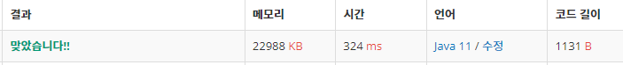

 

##### 🔗 가장 긴 증가하는 부분 수열4 백준 14002문제 

```java
package dynamic;
import java.util.Scanner;

public class LongestIncreasingSubsequence {
    public static int[] A;
    public static int[] D;
    public static int[] V;

    public static void main(String[] args) {

        Scanner sc = new Scanner(System.in);
        int n = sc.nextInt();

        A = new int[n];

        D = new int[n];

        V = new int[n];


        for (int i = 0; i < n; i++) {
            A[i] = sc.nextInt();
        }

        for (int i = 0; i < n; i++) {
            D[i] = 1;
            V[i] = -1;
            for (int j = 0; j < i; j++) {
                if (A[i] > A[j] && D[i] < D[j]+1) {
                    D[i] = D[j] + 1;
                    V[i] = j;
                }
            }
        }

        int max = D[0];
        int maxIndex = 0;

        for (int i = 1; i <n; i++) {
            if (max < D[i]) {
                max = D[i];
                maxIndex = i;
            }
        }

        System.out.println(max);
        goV(maxIndex);
    }

    public static void goV(int index){

        if (index == -1) {
            return;
        }
        goV(V[index]);
        System.out.print(A[index] + " ");
    }
}

```


<hr>


##### 💎결과 


