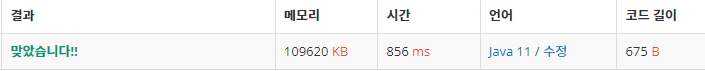

 

##### 🔗 연속합 백준 1912 문제 

```java
package dynamic;

import java.util.Scanner;

public class ContinuitySum {
    public static void main(String[] args) {

        Scanner sc = new Scanner(System.in);
        int n = sc.nextInt();


        int[] D = new int[n];
        int[] A = new int[n];
        for (int i = 0; i < n; i++ ) {
            A[i] = sc.nextInt();
        }


        for (int i = 0; i < n; i++) {
            D[i]=A[i];
            if (i==0)continue;
            if (D[i] < D[i-1] + D[i]) {
                D[i] = D[i-1] + D[i];
            }
        }
        int answer = D[0];

        for (int i = 1; i < n; i++) {
            answer = Math.max(answer, D[i]);
        }

        System.out.println(answer);
    }
}

```


<hr>


##### 💎결과 


