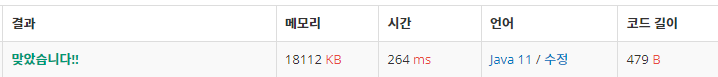

 

##### 🔗 제곱수의 합 백준 1699 문제 

```java
package dynamic;

import java.util.Scanner;

public class PowerSum {

    public static void main(String[] args) {

        Scanner sc = new Scanner(System.in);

        int n = sc.nextInt();

        int[] D = new int[n+1];


        for(int i = 1; i <= n; i++) {
            D[i] = i;
            for (int j = 1; j*j <= i; j++) {
                if (D[i] > D[i-j*j] + 1) {
                    D[i] = D[i-j*j] + 1;
                }
            }
        }

        System.out.println(D[n]);
    }
}
```


<hr>


##### 💎결과 


