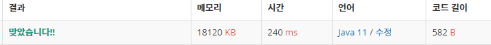

 

##### 🔗 합분해 백준 2225문제 

```java
package dynamic;

import java.util.Scanner;

public class SumDisassemble {
    private static final int MOD = 1000000000;
    public static void main(String[] args) {

        Scanner sc = new Scanner(System.in);

        int n = sc.nextInt();
        int k = sc.nextInt();

        int[][] d = new int[k+1][n+1];

        d[0][0] = 1;

        for (int i = 1; i <= k; i++) {
            for (int j = 0; j <= n; j++) {
                for (int l = 0; l <= j; l++) {
                    d[i][j] += (d[i-1][j-l])%MOD;
                }
            }
        }

        System.out.println(d[k][n]%MOD);
    }
}
```


<hr>


##### 💎결과 


