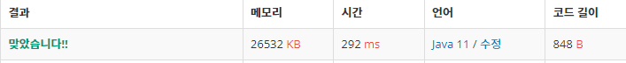

 

##### 🔗 1,2,3 더하기 3 백준 15988문제 

```java
package dynamic;

import java.io.BufferedWriter;
import java.io.IOException;
import java.io.OutputStreamWriter;
import java.util.Scanner;

public class OneTwoThreeThree {

    private static final int MOD = 1000000009;
    private static final int MAX = 1000000;

    public static void main(String[] args) throws IOException {

        Scanner sc = new Scanner(System.in);
        BufferedWriter bw = new BufferedWriter(new OutputStreamWriter(System.out));
        long[] d = new long[MAX+1];
        d[0] = 1;
        d[1] = 1;
        d[2] = 2;

        for (int i = 3; i <= MAX; i++) {
            d[i] = d[i-3] + d[i-2] + d[i-1];
            d[i] = d[i] % MOD;
        }


        int t = sc.nextInt();

        for (int i = 0; i < t; i++) {
            int n = sc.nextInt();
            bw.write(d[n]%MOD + "\n");
        }
        bw.flush();
        bw.close();
    }
}
```


<hr>


##### 💎결과 


