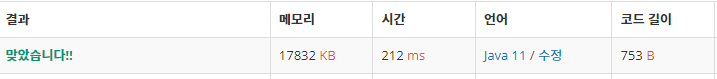

 

##### 🔗 오르막 수 백준 11507문제 

```java
package dynamic;

import java.util.Scanner;

public class AcsentNumber {

    private static final int MAX = 1000;
    private static final int MOD = 10007;
    public static void main(String[] args) {

        Scanner sc = new Scanner(System.in);

        int n = sc.nextInt();

        long d[][] = new long[MAX+1][10];

        for (int i = 1; i <= MAX; i++) {
            for (int j = 0; j < 10; j++) {
                if (i == 1) d[i][j] = 1;
                for (int k = 0; k <= j; k++) {
                    d[i][j] += d[i-1][k];
                    d[i][j] %= MOD;
                }
            }
        }

        long max = 0;
        for (int i = 0; i < 10; i++) {
            max += d[n][i];
            max %= MOD;
        }

        System.out.println(max);
    }
}

```


<hr>


##### 💎결과 


