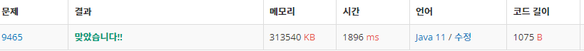

 

##### 🔗 스티커 백준 9465문제 

```java
package dynamic;

import java.io.BufferedWriter;
import java.io.IOException;
import java.io.OutputStreamWriter;
import java.util.Scanner;

public class Sticker {
    public static void main(String[] args) throws IOException {

        Scanner sc = new Scanner(System.in);
        BufferedWriter bw = new BufferedWriter(new OutputStreamWriter(System.out));
        int t = sc.nextInt();

        for (int i = 0; i < t; i ++) {
            int n = sc.nextInt();
            int[][] a = new int[2][n+1];

            for (int j = 0; j < 2; j++) {
                for (int k = 1; k <=n; k++) {
                    a[j][k] = sc.nextInt();
                }
            }

            int[][] d = new int[n+1][3];


            for (int j = 1; j <= n; j++ ) {
                d[j][0] = Math.max(d[j-1][1], d[j-1][2]);
                d[j][1] = Math.max(d[j-1][0], d[j-1][2]) + a[0][j];
                d[j][2] = Math.max(d[j-1][0], d[j-1][1]) + a[1][j];
            }
            bw.write(Math.max(Math.max(d[n][0], d[n][1]), d[n][2]) + "\n");
        }
        bw.flush();
        bw.close();
    }
}

```


<hr>


##### 💎결과 


