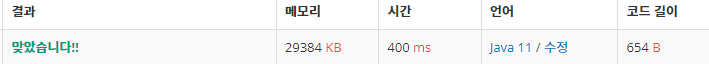

 

##### 🔗 와인시음백준 2156문제 

```java
package dynamic;

import java.util.Scanner;

public class WineTasting {
    private static final int MAX = 10000;

    public static void main(String[] args) {

        Scanner sc = new Scanner(System.in);

        int n = sc.nextInt();
        int[][] d = new int[n+1][3];
        int[] a = new int[n+1];

        for (int i = 1; i <= n; i++) {
            a[i] = sc.nextInt();
        }

        for (int i = 1; i <= n; i++) {
            d[i][0] = Math.max(Math.max(d[i-1][0], d[i-1][1]),d[i-1][2]);
            d[i][1] = d[i-1][0] + a[i];
            d[i][2] = d[i-1][1] + a[i];
        }

        System.out.println(Math.max(Math.max(d[n][0], d[n][1]), d[n][2]));

    }
}

```


<hr>


##### 💎결과 


