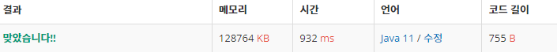

 

##### 🔗 정수 삼각형 1932 문제 

```java
package dynamic;

import java.util.Scanner;

public class Triangle {
    public static void main(String[] args) {

        Scanner sc = new Scanner(System.in);

        int n = sc.nextInt();

        int[][] a = new int[n+1][n+1];

        int[][] d = new int[n+1][n+1];

        for (int i = 1; i <= n; i++) {
            for (int j = 1; j <= i; j++) {
                a[i][j] = sc.nextInt();
            }
        }

        d[1][1] = a[1][1];

        for (int i = 2; i <= n; i++) {

            for (int j = 1; j <= i; j++) {
                d[i][j] = Math.max(d[i-1][j], d[i-1][j-1])+ a[i][j];
            }
        }

        int max = 0;

        for (int i = 1; i<=n; i++) {
            max = Math.max(max, d[n][i]);
        }
        System.out.println(max);
    }
}
```


<hr>


##### 💎결과 


