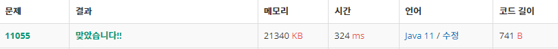

 

##### 🔗 가장 큰 증가 부분 수열 11055번 문제 

```java
package dynamic;

import java.util.Scanner;

public class TheLongestIncreasingMaxSubsequence {
    public static void main(String[] args) {

        Scanner sc = new Scanner(System.in);

        int n = sc.nextInt();

        int[] a = new int[n+1];

        for (int i = 1; i <= n; i++) {
            a[i] = sc.nextInt();
        }

        int[] d = new int[n+1];

        d[1] = a[1];
        for (int i = 2; i <= n; i++) {

            d[i] = a[i];
            for (int j = 1; j < i; j++) {

                if (a[i] > a[j] && d[j] + a[i] > d[i]) {
                    d[i] = a[i] + d[j];
                }
            }
        }

        int max = 0;

        for (int i = 1 ; i <= n; i++) {
            max = Math.max(max, d[i]);
        }

        System.out.println(max);
    }
}

```


<hr>


##### 💎결과 


