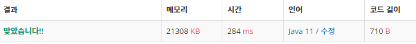

 

##### 🔗 가장 긴 감소하는 부분 수열 11722번 문제 

```java
package dynamic;

import java.util.Scanner;

public class TheLongestDecreasingMaxSubsequence {
    public static void main(String[] args) {

        Scanner sc = new Scanner(System.in);

        int n = sc.nextInt();

        int a[] = new int[n+1];

        int d[] = new int[n+1];

        for(int i = 1; i <= n; i++) {
            a[i] = sc.nextInt();
        }

        for (int i = 1; i <= n; i++){
            d[i] = 1;

            for (int j = 1; j < i; j++) {
                if (a[i] < a[j] && d[j] + 1 > d[i] ) {
                    d[i] = d[i] + 1;
                }
            }
        }

        int max = 0;

        for (int i = 1; i <= n; i++) {
            max = Math.max(d[i], max);
        }

        System.out.println(max);

    }
}
```


<hr>


##### 💎결과 


