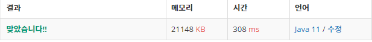

 

##### 🔗 가장 긴 바이토닉 부분 수열 11054번 문제 

```java
package dynamic;

import java.util.Scanner;

public class BitonicSubsequence {
    public static void main(String[] args) {
        Scanner sc = new Scanner(System.in);

        int n = sc.nextInt();

        int[] a = new int[n+1];

        for (int i = 1; i <= n; i++) {
            a[i] = sc.nextInt();
        }

        int[] d1 = new int[n+1];
        int[] d2 = new int[n+1];

        for (int i = 1; i <= n; i++) {
            d1[i] = 1;

            for (int j = 1; j < i; j++) {

                if (a[i] > a[j] && d1[j] + 1 > d1[i]) {
                    d1[i] = d1[j] + 1;
                }

            }
        }

        for (int i = n; i > 0; i--) {
            d2[i] = 1;
            for (int j = i+1; j <= n; j++) {

                if (a[i] > a[j] && d2[j] + 1 > d2[i]) {
                    d2[i] = d2[j] + 1;
                }
            }
        }

        int max = 0;
        for (int i = 1; i <= n; i++) {
            max = Math.max(d1[i]+d2[i] - 1, max);
        }
        System.out.println(max);

    }
}
```


<hr>


##### 💎결과 


