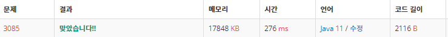

 

##### 🔗 사탕 게임 3085번 문제 

```java
package bruteforce;

import java.util.Scanner;

public class CandyGame {
    private static char[][] candyColor;
    private static int n;
    private static void swap(int i1, int j1, int i2, int j2) {
        char tmp = candyColor[i1][j1];
        candyColor[i1][j1] = candyColor[i2][j2];
        candyColor[i2][j2] = tmp;
    }

    public static void main(String[] args) {

        Scanner sc = new Scanner(System.in);

        n = sc.nextInt();
        candyColor = new char[n][n];

        for (int i = 0; i < n; i++) {
            candyColor[i] = sc.next().toCharArray();
        }

        
        int result = 0;

        for (int i = 0 ; i < n; i++) {
             for (int j = 0; j < n; j++) {
                 if (i == j) continue;
                 //오른쪽
                 if(j+1 < n && candyColor[i][j] != candyColor[i][j+1]) {
                     swap(i, j, i, j+1);
                     result = Math.max(result, getCandyMax());
                     swap(i, j+1, i, j);
                 }

                 //아래
                 if(i+1 < n && candyColor[i][j] != candyColor[i+1][j]) {
                     swap(i, j, i+1, j);
                     result = Math.max(result, getCandyMax());
                     swap(i, j, i+1, j);
                 }
             }
        }

        System.out.println(result);

    }

    private static int getCandyMax() {
        int max = 1;
        for (int i = 0; i < n; i++) {
            int cnt = 1;
            //행 Max 구하기
            for (int j = 1; j < n; j++) {
                if (candyColor[i][j] == candyColor[i][j-1]) {
                    cnt++;
                }
                else {
                    cnt = 1;
                }
                max = Math.max(cnt, max);
            }

            cnt = 1;
            //열 Max 구하기
            for (int j = 1; j < n; j++) {
                if (candyColor[j][i] == candyColor[j-1][i]) {
                    cnt++;
                }
                else {
                    cnt = 1;
                }
                max = Math.max(cnt, max);
            }
        }
        return max;
    }
}
```


<hr>


##### 💎결과 


