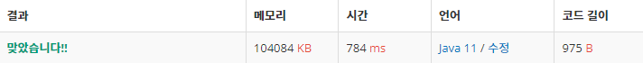

 

##### 🔗 연속합2 13398번 문제 

```java
package dynamic;

import java.util.Scanner;

public class ContinuitySum2 {
    public static void main(String[] args) {

        Scanner sc = new Scanner(System.in);

        int n = sc.nextInt();

        int[] a =  new int[n+1];
        int[] d1 = new int[n+1];
        int[] d2 = new int[n+1];

        for (int i = 1; i <= n;  i++) {
            a[i] = sc.nextInt();
        }

        for (int i = 1; i <=n; i++) {
            d1[i] = a[i];
            if (i > 1 && d1[i-1] + a[i] > d1[i]) {
                d1[i] = d1[i-1] + a[i];
            }
        }

        for (int i = n; i > 0; i--) {
            d2[i] = a[i];
            if (i < n && d2[i+1] + a[i] > d2[i]) {
                d2[i] = d2[i+1] + a[i];
            }
        }


        int max = d1[1];

        for (int i = 2; i <= n; i++) {
            max = Math.max(max, d1[i]);
        }

        for (int i = 2; i < n; i++) {
            max = Math.max(d1[i-1] + d2[i+1], max);
        }

        System.out.println(max);


    }
}
```


<hr>


##### 💎결과 


