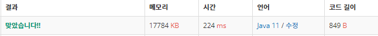

 

##### 🔗 일곱 난장이 2309번 문제 

```java
package bruteforce;

import java.util.Arrays;
import java.util.HashSet;
import java.util.Scanner;
import java.util.Set;

public class SevenDwarf {
    public static void main(String[] args) {

        Scanner sc = new Scanner(System.in);
        int n = 9;
        int a[] = new int[n];

        int sum = 0;
        for (int i = 0; i < n; i++) {
            a[i] = sc.nextInt();
            sum += a[i];
        }

        Set<Integer> set = new HashSet<>();
        loop:
        for (int i = 0; i < 9; i++) {
            for (int j = 0; j < 9; j++) {
                if (i == j) continue;
                if (sum - (a[i] + a[j]) == 100) {
                    set.add(a[i]);
                    set.add(a[j]);
                    break loop;
                }
            }
        }
        Arrays.stream(a).sorted().filter(one -> !set.contains(one)).forEach(System.out::println);
    }
}

```


<hr>


##### 💎결과 


