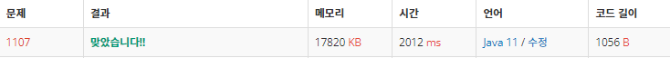

 

##### 🔗 리모컨 1107번 문제 

```java
package bruteforce;

import java.util.Scanner;

public class RemoteControl {
    static boolean[] broken = new boolean[10];

    public static void main(String[] args) {

        Scanner sc = new Scanner(System.in);

        int n = sc.nextInt();

        int result = Math.abs(n-100);

        int brokenNum = sc.nextInt();

        for(int i = 0; i < brokenNum; i++) {
            broken[sc.nextInt()] = true;
        }

        for (int i = 0; i <= 100000000; i++) {

            int len = possible(i);

            if (len > 0) {
                result = Math.min(Math.abs(n-i)+len, result);
            }
        }
        System.out.println(result);
    }

    private static int possible(int i) {
        if (i == 0) {
            if(broken[0]) {
                return 0;
            }
            else {
                return 1;
            }
        }
        else {
            int len = 0;

            while (i > 0) {
                 if (broken[i%10]) return 0;
                 len += 1;
                 i /= 10;
            }
            return len;
        }
    }
}

```


<hr>


##### 💎결과 


