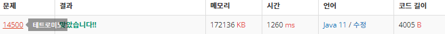

 

##### 🔗 테트로미노 14500번 문제 

```java
package bruteforce;

import java.util.Scanner;

public class Tetromino {
    public static void main(String[] args) {

        Scanner sc = new Scanner(System.in);

        int n = sc.nextInt();
        int m = sc.nextInt();

        int[][] nm = new int[n][m];

        for (int i = 0 ; i < n; i++) {
            for (int j = 0; j < m; j++) {
                nm[i][j] = sc.nextInt();
            }
        }
        int answer = 0;

        for (int i = 0; i < n; i++) {
            for (int j = 0; j < m; j++) {

                //1 ----
                if (j+3 < m) {
                    answer = Math.max(nm[i][j] + nm[i][j+1] + nm[i][j+2]+ nm[i][j+3], answer);
                }

                //2 |
                if (i+3 < n) {
                    answer = Math.max(nm[i][j] + nm[i+1][j] + nm[i+2][j]+ nm[i+3][j], answer);
                }

                //|___
                if (i-1 >= 0 && j + 2 < m) {
                    answer = Math.max(nm[i-1][j] + nm[i][j] + nm[i][j+1]+ nm[i][j+2], answer);
                }

                //|-
                if (i + 2 < n && j + 1 < m) {
                    answer = Math.max(nm[i][j] + nm[i+1][j] + nm[i+2][j]+ nm[i][j+1], answer);
                }

                //--|
                if (i+1 < n && j-2 >= 0) {
                    answer = Math.max(nm[i][j] + nm[i][j-1] + nm[i][j-2]+ nm[i+1][j], answer);
                }

                //_|
                if (i-2 >= 0 && j -1 >= 0) {
                    answer = Math.max(nm[i-2][j] + nm[i-1][j] + nm[i][j]+ nm[i][j-1], answer);
                }

                //__|
                if (i-1 >= 0 && j-2 >= 0) {
                    answer = Math.max(nm[i][j] + nm[i-1][j] + nm[i][j-1]+ nm[i][j-2], answer);
                }

                //|_
                if (i-2 >= 0 && j+1 < m) {
                    answer = Math.max(nm[i][j] + nm[i-1][j] + nm[i-2][j]+ nm[i][j+1], answer);
                }

                //|--
                if (i+1 < n && j+2 < m) {
                    answer = Math.max(nm[i][j] + nm[i+1][j] + nm[i][j+1]+ nm[i][j+2], answer);
                }

                //--|
                if (i+2 < n && j-1 >= 0) {
                    answer = Math.max(nm[i][j] + nm[i+1][j] + nm[i+2][j]+ nm[i][j-1], answer);
                }

                //[]
                if (i+1 < n && j+1 < m) {
                    answer = Math.max(nm[i][j] + nm[i+1][j] + nm[i][j+1]+ nm[i+1][j+1], answer);
                }

                //__--
                if (i-1 >= 0 && j+2 < m) {
                    answer = Math.max(nm[i][j] + nm[i][j+1] + nm[i-1][j+1]+ nm[i-1][j+2], answer);
                }

                //|_
                //  |
                if (i+2 < n && j+1 < m) {
                    answer = Math.max(nm[i][j] + nm[i+1][j] + nm[i+1][j+1]+ nm[i+2][j+1], answer);
                }

                //--__
                if (i-1 >= 0 && j+2 < m) {
                    answer = Math.max(nm[i-1][j] + nm[i-1][j+1] + nm[i][j+1]+ nm[i][j+2], answer);
                }

                // _|
                //|
                if (i+2 < n && j+1 < m) {
                    answer = Math.max(nm[i+2][j] + nm[i+1][j] + nm[i+1][j+1]+ nm[i][j+1], answer);
                }

                //ㅗ
                if (i-1 >= 0 && j+2 < m) {
                    answer = Math.max(nm[i][j] + nm[i][j+1] + nm[i][j+2]+ nm[i-1][j+1], answer);
                }

                //ㅜ
                if (i+1 < n && j+2 < m) {
                    answer = Math.max(nm[i][j] + nm[i][j+1] + nm[i][j+2]+ nm[i+1][j+1], answer);
                }

                //ㅏ
                if (i+2 < n && j+1 < m) {
                    answer = Math.max(nm[i][j] + nm[i+1][j] + nm[i+2][j]+ nm[i+1][j+1], answer);
                }

                //ㅓ
                if (i+2 < n && j-1 >= 0) {
                    answer = Math.max(nm[i][j] + nm[i+1][j] + nm[i+2][j]+ nm[i+1][j-1], answer);
                }
            }
        }
        System.out.println(answer);
    }
}

```


<hr>


##### 💎결과 


