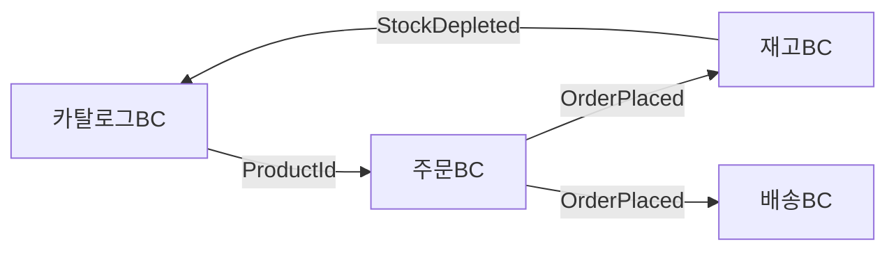
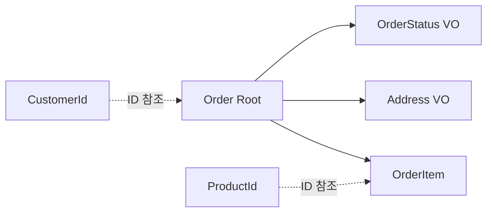
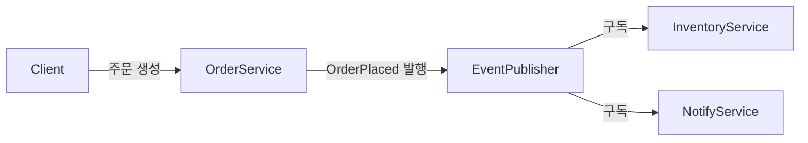
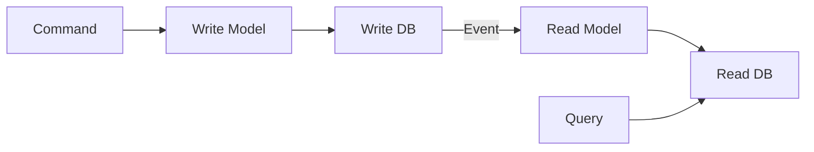
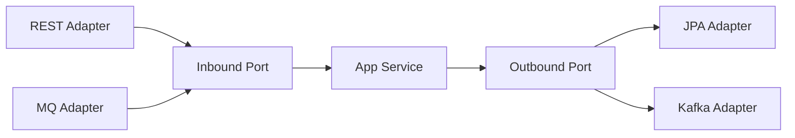
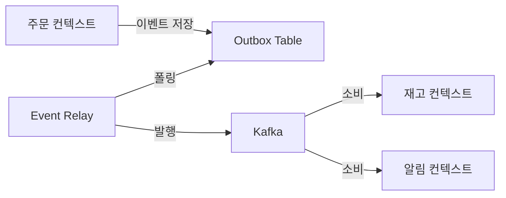
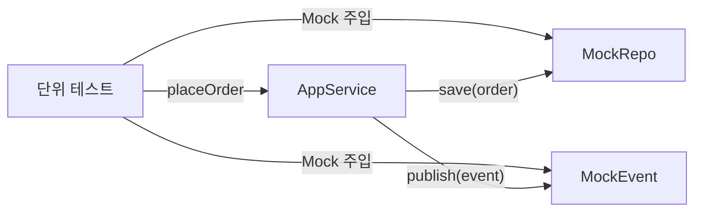

> **한 줄 요약**: DDD는 "코드가 비즈니스를 번역하는 것"이 아니라 "코드 자체가 비즈니스 언어로 말하는 것"을 목표로 한다. 헥사고날 아키텍처는 그 도메인이 기술에 종속되지 않도록 보호하는 구조적 장치다.

---

## 왜 DDD인가 — DB 중심 설계의 한계

> 어느 스타트업이 MySQL 테이블을 먼저 설계하고, 그 위에 Service 클래스를 얹어 이커머스를 만들었습니다. 6개월 후 "주문 취소 시 재고 복구를 어디서 해야 하지?" — 순환 의존이 터지고, "쿠폰 적용 로직이 어디 있지?" — 중복 구현이 양쪽에 흩어집니다. 비즈니스 규칙이 서비스 레이어에 흩어지고, DB 스키마 변경이 전체를 깨뜨리고, 무엇이 진짜 비즈니스 규칙인지 코드에서 찾을 수 없습니다. 이것이 **DB 중심 설계**의 결말입니다.

전형적인 트랜잭션 스크립트 방식의 서비스 코드를 보겠습니다.

```java
// 전형적인 절차지향 서비스 — 비즈니스 규칙이 어디 있는지 알기 어렵다
@Service
public class OrderService {
    public void cancelOrder(Long orderId, Long userId) {
        Order order = orderRepository.findById(orderId).orElseThrow();
        if (!order.getUserId().equals(userId)) throw new ForbiddenException();
        if (order.getStatus().equals("SHIPPED")) throw new RuntimeException("배송 중");
        if (order.getStatus().equals("CANCELLED")) throw new RuntimeException("이미 취소");
        order.setStatus("CANCELLED");
        order.setCancelledAt(LocalDateTime.now());
        orderRepository.save(order);
        // 알림, 재고 복원, 환불 — 이 모든 것이 한 메서드에?
        notificationService.sendCancelMail(order.getUserEmail());
        inventoryService.restore(order.getProductId(), order.getQuantity());
        paymentService.refund(order.getPaymentId(), order.getTotalAmount());
    }
}
```

무엇이 문제인가요?

1. **비즈니스 규칙이 서비스 메서드에 흩어짐** — `Order` 엔티티는 상태 컨테이너에 불과하고 "배송 중이면 취소 불가"라는 규칙이 서비스에 삽입됩니다. 이 규칙이 10개의 서비스 메서드에서 중복됩니다.
2. **결합도 폭발** — OrderService가 Notification, Inventory, Payment 세 시스템을 직접 호출합니다. 결제 서비스 장애가 주문 취소 실패로 전파됩니다.
3. **도메인 전문가가 코드를 읽을 수 없음** — "getStatus().equals('SHIPPED')"는 비즈니스 언어가 아닙니다.

DDD는 이 세 문제를 각각 **풍부한 도메인 모델**, **Bounded Context 분리**, **Domain Event**로 해결합니다. 기술이 아니라 **비즈니스 도메인**을 먼저 설계하고, 기술은 그것을 지원하는 역할에 머물게 합니다.

---

## 전략적 설계 (Strategic Design)

전략적 설계는 큰 그림입니다. "무엇을 어떻게 나눌 것인가"를 결정합니다.

### Ubiquitous Language — 공통 언어의 힘

Ubiquitous Language는 단순히 "용어를 통일하자"가 아닙니다. **도메인 전문가의 멘탈 모델을 코드 구조에 직접 매핑**하는 것입니다.

같은 회사의 영업팀과 개발팀이 "주문"을 어떻게 다르게 이해하는지 봅시다.

```
영업팀 사고: 고객이 제품에 관심을 보이면 → 견적 → 협상 → 계약 → 주문 확정
개발팀 사고: users 테이블 JOIN orders 테이블, status = 'CONFIRMED'

Ubiquitous Language 적용 후:
영업팀: "계약 확정이 되면 수주가 등록됩니다"
개발팀: Order.confirm() 호출 → OrderConfirmedEvent 발행
```

코드에서의 실천 방법은 단순합니다. **도메인 전문가가 말하는 단어 그대로 클래스명, 메서드명, 변수명으로 씁니다.**

```java
// 나쁜 코드 — 기술 용어와 도메인 용어 혼재
public void processUserProductTransaction(Long uid, Long pid, int qty) {
    userProductMappingRepository.insertMapping(uid, pid, qty);
    userBalanceRepository.decreaseBalance(uid, getProductPrice(pid) * qty);
}

// 좋은 코드 — 유비쿼터스 언어로 작성, 도메인 전문가가 읽을 수 있다
public void addItemToCart(CustomerId customerId, ProductId productId, Quantity quantity) {
    Cart cart = cartRepository.findByCustomer(customerId);
    cart.addItem(productId, quantity);  // "장바구니에 상품을 담는다"
    cartRepository.save(cart);
}
```

테스트 코드 역시 동일합니다.

```java
@Test
void 고객이_장바구니에_상품을_담으면_수량이_증가한다() {
    // "장바구니에 담는다"는 도메인 언어가 테스트 명세가 된다
    Cart cart = Cart.createForCustomer(customerId);
    cart.addItem(productId, Quantity.of(2));

    assertThat(cart.totalItemCount()).isEqualTo(2);
}
```

### Bounded Context — 경계의 의미

Bounded Context는 **동일한 용어가 동일한 의미를 가지는 언어적 경계**입니다.



"상품(Product)"이라는 단어를 봅시다.

| Bounded Context | Product의 의미 | 핵심 속성 |
|----------------|--------------|----------|
| 상품 카탈로그 컨텍스트 | 판매 가능한 물건의 정보 | 이름, 설명, 이미지, 카테고리 |
| 주문 컨텍스트 | 주문 당시 구매한 물건 | 주문 시점 가격, 수량 |
| 재고 컨텍스트 | 창고에 있는 물리적 물건 | 수량, 위치, 입고일 |
| 배송 컨텍스트 | 포장하여 보낼 물건 | 무게, 부피, 위험물 여부 |

이 네 컨텍스트가 하나의 `Product` 클래스를 공유하면 어떻게 될까요? 배송을 위한 무게 필드가 카탈로그 조회 쿼리에서도 로딩됩니다. 재고 수량 변경 로직이 카탈로그 서비스 배포와 결합됩니다. 결국 아무도 선뜻 수정하지 못하는 거대한 `Product` 신 클래스가 탄생합니다.

각 컨텍스트가 자신의 언어로 Product를 정의하면:

```java
// 상품 카탈로그 컨텍스트 — 오직 카탈로그 정보만
package com.example.catalog.domain;

public class Product {
    private ProductId id;
    private ProductName name;
    private ProductDescription description;
    private List<ProductImage> images;
    private Category category;
    private Price currentPrice;

    public void updateDescription(ProductDescription newDesc) { ... }
    public void addImage(ProductImage image) { ... }
}

// 주문 컨텍스트 — 주문 시점의 스냅샷만
package com.example.order.domain;

public class OrderItem {
    private ProductId productId;        // 카탈로그의 Product를 ID로만 참조
    private String productNameSnapshot; // 주문 당시 이름 (이후 변경돼도 보존)
    private Money unitPriceSnapshot;    // 주문 당시 가격 (이후 변경돼도 보존)
    private Quantity quantity;
}

// 재고 컨텍스트 — 물리적 재고만
package com.example.inventory.domain;

public class StockItem {
    private ProductId productId;
    private StockQuantity availableQuantity;
    private StockQuantity reservedQuantity;
    private WarehouseLocation location;

    public void reserve(Quantity quantity) { ... }
    public void release(Quantity quantity) { ... }
}
```

각 컨텍스트의 `Product` 관련 클래스는 오직 해당 컨텍스트가 필요한 것만 가집니다. 변경도, 배포도, 테스트도 독립적입니다.

#### Bounded Context 간 통신 방식

가장 나쁜 방식은 **직접 DB 공유**입니다. 주문 서비스가 카탈로그 DB의 `products` 테이블을 직접 읽는 것. Bounded Context의 경계가 사라집니다.

좋은 방식은 두 가지입니다. 첫째, **API 호출**: 주문 서비스가 카탈로그 서비스의 API를 통해 가격을 조회합니다. 명시적인 계약이 생깁니다. 둘째, **Domain Event**: 주문이 완료되면 `OrderPlaced` 이벤트를 발행합니다. 재고 서비스가 이를 구독해 재고를 차감합니다. 주문 서비스는 재고 서비스의 존재를 알 필요가 없습니다.

### Context Map — 컨텍스트 간 관계 패턴

Bounded Context들은 독립적이지만 서로 통신해야 합니다. Context Map은 이 관계를 명시합니다.


각 패턴의 의미와 구현 방식을 깊이 봅시다.

**Customer-Supplier (고객-공급자)**

공급자(Supplier)가 소비자(Customer)의 요구에 맞춰 API를 제공합니다. 주문 BC가 결제 BC에게 "이런 API가 필요하다"고 요구하면, 결제 BC가 그에 맞춰 구현합니다. 권력 관계가 명확합니다.

```java
// 결제 BC가 주문 BC를 위해 제공하는 API (공급자)
@RestController
@RequestMapping("/api/payments")
public class PaymentController {
    @PostMapping("/order-payments")
    public PaymentResponse initiateOrderPayment(@RequestBody OrderPaymentRequest request) {
        // 주문 BC의 요구사항에 맞는 API 형태
    }
}

// 주문 BC에서 결제 BC API를 호출 (소비자)
@Component
public class PaymentGatewayClient {
    public PaymentResult processPayment(OrderId orderId, Money amount) {
        OrderPaymentRequest request = new OrderPaymentRequest(orderId.getValue(), amount.getAmount());
        return restTemplate.postForObject("/api/payments/order-payments", request, PaymentResult.class);
    }
}
```

**Anti-Corruption Layer (ACL) — 도메인 보호**

외부 시스템(레거시, 서드파티 API)의 모델이 내 도메인을 오염시키지 못하도록 방어합니다. 외부 PG사의 결제 응답 모델이 내 도메인 언어와 다를 때 ACL이 변환합니다.

```java
// 외부 PG사의 응답 모델 — 내 도메인과 다른 언어를 사용
public class TossPaymentResponse {
    private String paymentKey;
    private String orderId;
    private String status;          // "DONE", "CANCELED", "PARTIAL_CANCELED"
    private Integer totalAmount;
    private String approvedAt;      // "2024-01-15T10:30:00+09:00"
}

// ACL — 외부 모델을 내 도메인 모델로 변환
@Component
public class TossPaymentAcl {

    public PaymentResult translate(TossPaymentResponse external) {
        PaymentStatus domainStatus = switch (external.getStatus()) {
            case "DONE" -> PaymentStatus.COMPLETED;
            case "CANCELED" -> PaymentStatus.CANCELLED;
            case "PARTIAL_CANCELED" -> PaymentStatus.PARTIALLY_REFUNDED;
            default -> throw new UnknownPaymentStatusException(external.getStatus());
        };

        return new PaymentResult(
            PaymentId.of(external.getPaymentKey()),
            OrderId.of(external.getOrderId()),
            domainStatus,
            Money.won(external.getTotalAmount()),
            parseApprovedAt(external.getApprovedAt())
        );
        // 내 도메인은 TossPaymentResponse를 전혀 모른다
    }
}

// 도메인 서비스 — 내부에서는 완전히 도메인 언어만 사용
@Service
public class PaymentService {
    private final TossPaymentAcl acl;

    public PaymentResult processPayment(OrderId orderId, Money amount) {
        TossPaymentResponse external = tossApiClient.pay(orderId.getValue(), amount.getAmount());
        return acl.translate(external); // ACL이 경계를 지킨다
    }
}
```

외부 게이트웨이가 KakaoPay로 교체되면 `KakaoPayAcl`을 새로 만들면 됩니다. 도메인 코드는 변경 없습니다. 헥사고날 아키텍처에서 ACL은 Outbound Adapter 내부에 위치합니다.

**Open Host Service (OHS)**

내 Bounded Context를 외부에 공개할 때 잘 정의된 프로토콜을 제공합니다. REST API, gRPC 인터페이스가 대표적입니다. 소비자들이 내 내부 모델을 알 필요 없이 공개 계약(contract)만 알면 됩니다.

**Published Language (PL)**

Kafka 이벤트 스키마처럼 여러 BC가 공유하는 공통 교환 형식입니다. Avro 스키마나 JSON Schema로 정의하고, 스키마 레지스트리로 버전 관리합니다.

```java
// Published Language — 이벤트 스키마 (여러 BC가 구독)
public record OrderPlacedEvent(
    String eventId,
    String eventType,       // "ORDER_PLACED"
    String schemaVersion,   // "v2" — 하위 호환 버전 관리
    String orderId,
    String customerId,
    List<OrderItemDto> items,
    Long totalAmount,
    String currency,
    Instant occurredAt
) {}
// 이 스키마는 주문BC/배송BC/알림BC/재고BC 모두가 이해한다
```

**Shared Kernel**

두 팀이 코드 일부를 공유합니다. 변경 시 양 팀의 합의가 필요해 결합도가 높으므로 신중하게 사용합니다. `Money`, `CustomerId` 같은 공통 Value Object가 후보입니다.

---

## 전술적 설계 (Tactical Design)

전술적 설계는 Bounded Context 내부 구조를 만드는 패턴들입니다.

### Entity — 정체성과 생명주기

Entity의 본질은 **식별자(Identity)**입니다. 속성이 모두 같아도 ID가 다르면 다른 객체입니다. 두 고객이 같은 이름과 주소를 가져도 다른 고객입니다.

왜 이것이 중요한가요? 실세계에서 "동일성"의 기준이 ID인 것들이 있습니다. 주민등록번호가 같으면 같은 사람, 주문번호가 같으면 같은 주문입니다. 이 개념을 코드로 정확히 표현해야 합니다.

```java
@Entity
@Table(name = "orders")
public class Order extends AbstractAggregateRoot<Order> {

    @EmbeddedId
    private OrderId id;

    @Embedded
    private CustomerId customerId;

    @Enumerated(EnumType.STRING)
    private OrderStatus status;

    @OneToMany(cascade = CascadeType.ALL, orphanRemoval = true)
    @JoinColumn(name = "order_id")
    private List<OrderItem> items = new ArrayList<>();

    @Embedded
    private Money totalAmount;

    @Embedded
    private Address shippingAddress;

    private Instant placedAt;
    private Instant cancelledAt;

    protected Order() {} // JPA 기본 생성자 (protected로 직접 생성 방지)

    // 정적 팩토리 메서드 — 유효한 초기 상태만 허용
    public static Order place(CustomerId customerId, List<OrderItem> items, Address shippingAddress) {
        validateItems(items);
        Order order = new Order();
        order.id = OrderId.generate();
        order.customerId = customerId;
        order.items = new ArrayList<>(items);
        order.status = OrderStatus.PENDING;
        order.totalAmount = calculateTotal(items);
        order.shippingAddress = shippingAddress;
        order.placedAt = Instant.now();
        order.registerEvent(new OrderPlacedEvent(order)); // 도메인 이벤트 등록
        return order;
    }

    // 비즈니스 행위 — "주문을 취소한다"
    public void cancel(CancellationReason reason) {
        if (this.status == OrderStatus.SHIPPED || this.status == OrderStatus.DELIVERED) {
            throw new OrderCancellationNotAllowedException(
                "배송이 시작된 주문은 취소할 수 없습니다. 주문 ID: " + this.id);
        }
        if (this.status == OrderStatus.CANCELLED) {
            throw new OrderAlreadyCancelledException(this.id);
        }
        this.status = OrderStatus.CANCELLED;
        this.cancelledAt = Instant.now();
        registerEvent(new OrderCancelledEvent(this.id, this.customerId, this.totalAmount, reason));
    }

    // 아이템 추가 — Root를 통해서만 내부 상태 변경
    public void addItem(ProductId productId, Money unitPrice, Quantity quantity) {
        ensureStatus(OrderStatus.PENDING, "PENDING 상태에서만 아이템을 추가할 수 있습니다");
        OrderItem item = new OrderItem(this.id, productId, unitPrice, quantity);
        this.items.add(item);
        this.totalAmount = this.totalAmount.add(unitPrice.multiply(quantity.getValue()));
    }

    // equals/hashCode — ID 기반 동일성 (속성이 달라도 ID가 같으면 동일)
    @Override
    public boolean equals(Object o) {
        if (this == o) return true;
        if (!(o instanceof Order)) return false;
        Order other = (Order) o;
        return id != null && id.equals(other.id);
    }

    @Override
    public int hashCode() {
        return getClass().hashCode();
    }
}
```

### Value Object — 개념적 완전성과 불변성

Value Object의 본질은 **개념적 완전성(Conceptual Wholeness)**입니다. `amount`와 `currency`는 따로 존재할 때 의미가 불완전합니다. `10000`이 원인지 달러인지 알 수 없습니다. `Money(10000, KRW)`가 되어야 완전한 개념입니다.

왜 불변이어야 하는가? VO를 공유했을 때 한쪽이 변경하면 다른 쪽이 영향을 받습니다. 불변이면 공유해도 안전합니다.

```java
@Embeddable
public final class Money {

    @Column(name = "amount")
    private final BigDecimal amount;

    @Enumerated(EnumType.STRING)
    @Column(name = "currency")
    private final Currency currency;

    protected Money() { this.amount = BigDecimal.ZERO; this.currency = Currency.KRW; }

    private Money(BigDecimal amount, Currency currency) {
        if (amount == null) throw new IllegalArgumentException("금액은 null일 수 없습니다");
        if (currency == null) throw new IllegalArgumentException("통화는 null일 수 없습니다");
        if (amount.compareTo(BigDecimal.ZERO) < 0) {
            throw new NegativeAmountException("금액은 음수일 수 없습니다: " + amount);
        }
        this.amount = amount.setScale(currency.getDefaultScale(), RoundingMode.HALF_UP);
        this.currency = currency;
    }

    public static Money of(BigDecimal amount, Currency currency) {
        return new Money(amount, currency);
    }

    public static Money won(long amount) {
        return new Money(BigDecimal.valueOf(amount), Currency.KRW);
    }

    public static final Money ZERO_KRW = won(0);

    // 불변 연산 — 새 객체 반환, 기존 객체 변경 없음
    public Money add(Money other) {
        requireSameCurrency(other);
        return new Money(this.amount.add(other.amount), this.currency);
    }

    public Money subtract(Money other) {
        requireSameCurrency(other);
        BigDecimal result = this.amount.subtract(other.amount);
        if (result.compareTo(BigDecimal.ZERO) < 0) {
            throw new InsufficientAmountException("차감 후 금액이 음수입니다");
        }
        return new Money(result, this.currency);
    }

    public Money multiply(int multiplier) {
        if (multiplier < 0) throw new IllegalArgumentException("승수는 음수일 수 없습니다");
        return new Money(this.amount.multiply(BigDecimal.valueOf(multiplier)), this.currency);
    }

    public Money applyDiscountRate(int discountPercent) {
        if (discountPercent < 0 || discountPercent > 100) {
            throw new IllegalArgumentException("할인율은 0~100 사이여야 합니다");
        }
        BigDecimal discountMultiplier = BigDecimal.ONE
            .subtract(BigDecimal.valueOf(discountPercent).divide(BigDecimal.valueOf(100)));
        return new Money(this.amount.multiply(discountMultiplier), this.currency);
    }

    // 동일성 — 값의 조합으로 판단 (ID 없음)
    @Override
    public boolean equals(Object o) {
        if (!(o instanceof Money)) return false;
        Money m = (Money) o;
        return this.amount.compareTo(m.amount) == 0 && this.currency == m.currency;
    }

    @Override
    public int hashCode() {
        return Objects.hash(amount.stripTrailingZeros(), currency);
    }
}
```

**Value Object를 Entity로 착각하는 흔한 실수 (JPA 관점)**

```java
// 나쁜 설계 — Address를 별도 테이블로 관리
@Entity
@Table(name = "addresses")
public class Address {
    @Id @GeneratedValue
    private Long id;       // 불필요한 ID — 주소는 값이지 실체가 아니다
    private String city;
    private String street;
}

// 좋은 설계 — @Embeddable로 같은 테이블에 저장
@Embeddable
public final class Address {
    // ID 없음, 조인 없음, 공유해도 안전 (불변)
    @Column(name = "shipping_city")
    private final String city;
    @Column(name = "shipping_street")
    private final String street;

    public Address withCity(String newCity) {
        return new Address(newCity, this.street, this.zipCode); // 새 객체 반환
    }
}
```

#### 식별자(ID) Value Object — 타입 안전

원시 타입으로 식별자를 표현하면 타입 혼동이 발생합니다.

```java
// 원시 타입 식별자의 문제
public Order findOrder(Long orderId, Long customerId) { ... }

// 실수로 파라미터 순서를 바꿔 호출 — 컴파일 오류 없음!
orderService.findOrder(customerId, orderId);
```

`Long orderId`와 `Long customerId`는 컴파일러 입장에서 동일한 타입입니다. 파라미터 순서를 실수로 바꿔 호출해도 컴파일 오류가 없습니다. 런타임에 잘못된 주문이 조회됩니다.

```java
// Value Object 식별자 — 타입 안전
public final class OrderId {
    private final Long value;

    private OrderId(Long value) {
        if (value == null || value <= 0) throw new IllegalArgumentException("유효하지 않은 OrderId: " + value);
        this.value = value;
    }

    public static OrderId of(Long value) { return new OrderId(value); }
    public Long getValue() { return value; }

    @Override
    public boolean equals(Object o) {
        if (!(o instanceof OrderId)) return false;
        return Objects.equals(value, ((OrderId) o).value);
    }

    @Override
    public int hashCode() { return Objects.hash(value); }
}

// 이제 파라미터 순서를 바꾸면 컴파일 오류
public Order findOrder(OrderId orderId, CustomerId customerId) { ... }
orderService.findOrder(customerId, orderId); // 컴파일 에러!
```

Java 14+의 `record`를 사용하면 더 간결합니다.

```java
public record OrderId(Long value) {
    public OrderId {
        if (value == null || value <= 0)
            throw new IllegalArgumentException("유효하지 않은 OrderId");
    }

    public static OrderId of(Long value) {
        return new OrderId(value);
    }
}
```

### Aggregate — 일관성 경계의 WHY

Aggregate는 DDD에서 가장 오해가 많은 개념입니다. 핵심 질문은 "왜 Aggregate Root를 통해서만 접근해야 하는가?"입니다.

**불변식(Invariant)을 보호하기 위해서입니다.**

주문의 불변식 예시: "주문 총액은 항상 개별 아이템 합계와 일치해야 한다." `OrderItem`을 직접 수정하면 이 불변식이 깨집니다.

```java
// 불변식이 깨지는 시나리오 — OrderItem 직접 접근 허용 시
OrderItem item = orderItemRepository.findById(itemId); // 별도 Repository 존재
item.setQuantity(5);  // Order의 totalAmount는 그대로 — 불변식 위반!
orderItemRepository.save(item);
// 이제 Order.totalAmount != sum(OrderItem.subtotal) — 데이터 무결성 파괴
```

Aggregate Root가 관리하면:

```java
// 불변식 보호 — Root를 통해서만 변경
order.changeItemQuantity(itemId, Quantity.of(5));
// Order.changeItemQuantity 내부에서 totalAmount 재계산 보장
```

**트랜잭션 경계로서의 Aggregate**

하나의 트랜잭션 = 하나의 Aggregate 수정. 이 규칙이 왜 중요한가요?

```java
// 나쁜 패턴 — 하나의 트랜잭션에서 여러 Aggregate 수정
@Transactional
public void placeOrder(PlaceOrderCommand cmd) {
    Order order = new Order(cmd);
    orderRepository.save(order);

    // 같은 트랜잭션에서 Inventory 수정 — Aggregate 경계 위반
    Inventory inventory = inventoryRepository.findByProduct(cmd.getProductId());
    inventory.decrease(cmd.getQuantity());
    inventoryRepository.save(inventory);
    // 두 Aggregate 중 하나가 실패하면? 롤백 범위가 너무 넓다
}

// 좋은 패턴 — 이벤트로 다른 Aggregate와 통신
@Transactional
public void placeOrder(PlaceOrderCommand cmd) {
    Order order = Order.place(cmd.getCustomerId(), cmd.getItems(), cmd.getShippingAddress());
    orderRepository.save(order);
    // OrderPlacedEvent가 등록됨 — save 후 Spring이 이벤트 발행
    // Inventory는 이벤트를 구독해 별도 트랜잭션에서 처리
}
```

**Aggregate 크기 결정 원칙**



```java
// Aggregate 설계 원칙을 코드로 표현
@Entity
public class Order extends AbstractAggregateRoot<Order> {

    @EmbeddedId
    private OrderId id;

    // 다른 Aggregate Root는 ID로만 참조
    @Embedded
    private CustomerId customerId;    // Customer 전체 객체 X

    // Aggregate 내부 엔티티 — Order와 생명주기가 완전히 같음
    @OneToMany(cascade = CascadeType.ALL, orphanRemoval = true)
    private List<OrderItem> items;   // OrderItem은 Order 없이 독립 존재 불가

    // Value Object — 불변, Aggregate 내부에 임베드
    @Embedded
    private Address shippingAddress;
    @Embedded
    private Money totalAmount;
}

// OrderItem도 내부적으로는 Product를 ID로만 참조
@Entity
public class OrderItem {
    @EmbeddedId
    private OrderItemId id;
    @Embedded
    private ProductId productId;      // Product Aggregate는 ID로만
    private String productNameSnapshot;   // 주문 당시 스냅샷
    private Money unitPriceSnapshot;      // 주문 당시 가격 스냅샷
    @Embedded
    private Quantity quantity;
}
```

왜 스냅샷인가요? 주문 후 상품 가격이 변경되어도 "주문 당시 가격"은 변하지 않아야 합니다. 현재 상품 가격을 참조하면 과거 주문의 금액이 바뀝니다.

---

## Repository 패턴 — 영속성 무지(Persistence Ignorance)

Repository는 단순한 DAO가 아닙니다. **도메인 계층이 영속성 기술(JPA, MongoDB, Redis)을 모르도록 추상화**하는 것입니다. 이를 "영속성 무지(Persistence Ignorance)"라고 합니다.

왜 Aggregate Root에만 Repository가 있는가? OrderItem Repository가 있으면 Order를 거치지 않고 직접 접근 가능해집니다. Aggregate의 불변식 보호가 무너집니다.

```java
// 도메인 계층 — 인프라를 전혀 모르는 순수 인터페이스
package com.example.order.domain.repository;

public interface OrderRepository {
    // 컬렉션처럼 동작 — "저장소에서 꺼내고 넣는다"는 개념
    Order findById(OrderId id);
    Optional<Order> findByIdOptional(OrderId id);
    List<Order> findByCustomerId(CustomerId customerId);
    void save(Order order);     // insert + update 모두 처리
    void delete(Order order);
}

// 인프라 계층 — JPA로 구현 (도메인 계층에 의존하지만 역방향)
package com.example.order.infrastructure.persistence;

@Repository
public class JpaOrderRepository implements OrderRepository {

    private final OrderJpaRepository jpaRepository;  // Spring Data JPA
    private final OrderMapper mapper;                  // 도메인 <-> JPA 엔티티 변환

    @Override
    public Order findById(OrderId id) {
        return jpaRepository.findById(id.getValue())
            .map(mapper::toDomainEntity)
            .orElseThrow(() -> new OrderNotFoundException("주문을 찾을 수 없습니다: " + id));
    }

    @Override
    public void save(Order order) {
        OrderJpaEntity entity = mapper.toJpaEntity(order);
        jpaRepository.save(entity);
    }

    @Override
    public List<Order> findByCustomerId(CustomerId customerId) {
        return jpaRepository.findByCustomerId(customerId.getValue()).stream()
            .map(mapper::toDomainEntity)
            .collect(Collectors.toList());
    }
}
```

**도메인 엔티티와 JPA 엔티티 분리 전략**

이것이 DDD Repository의 핵심이면서 가장 논란이 많은 부분입니다.

```java
// 전략 1: 도메인 엔티티 = JPA 엔티티 (실용적 타협)
// 장점: 간단함. 단점: 도메인이 @Column 등 JPA 어노테이션에 의존
@Entity
@Table(name = "orders")
public class Order extends AbstractAggregateRoot<Order> {
    @EmbeddedId private OrderId id;
}

// 전략 2: 완전 분리 (엄격한 DDD)
// 도메인 엔티티 — 순수 Java, 어떤 프레임워크 어노테이션도 없음
public class Order {
    private OrderId id;
    private CustomerId customerId;
    private OrderStatus status;
}

// JPA 엔티티 — 영속성만 담당
@Entity @Table(name = "orders")
class OrderJpaEntity {
    @Id Long id;
    Long customerId;
    String status;
}

// Mapper — 두 모델 변환
@Component
public class OrderMapper {
    public Order toDomainEntity(OrderJpaEntity jpa) {
        return Order.reconstruct(
            OrderId.of(jpa.getId()),
            CustomerId.of(jpa.getCustomerId()),
            OrderStatus.valueOf(jpa.getStatus())
        );
    }

    public OrderJpaEntity toJpaEntity(Order domain) {
        OrderJpaEntity jpa = new OrderJpaEntity();
        jpa.setId(domain.getId().getValue());
        jpa.setCustomerId(domain.getCustomerId().getValue());
        jpa.setStatus(domain.getStatus().name());
        return jpa;
    }
}
```

실무에서는 전략 1을 많이 쓰되, 도메인 로직과 JPA 설정을 명확히 분리하는 방식을 취합니다.

---

## Domain Events — 느슨한 결합의 메커니즘

Domain Event는 "도메인에서 중요한 일이 발생했다"는 사실을 기록합니다. 과거형으로 명명합니다(`OrderPlaced`, `PaymentCompleted`, `StockDepleted`).

**왜 Domain Event를 사용하는가?**

주문이 완료되면 재고 차감, 결제 처리, 알림 발송, 포인트 적립, 마케팅 데이터 기록이 필요합니다. 이것들을 모두 `OrderService.placeOrder()`에 넣으면 OrderService가 6개 서비스를 직접 의존합니다. 추천 서비스가 응답 지연 500ms를 보이면 주문 응답이 500ms 느려집니다. 한 서비스의 장애가 주문 전체를 마비시킵니다.



Domain Event로 해결하면:

```java
// Domain Event 정의 — 불변, 과거형, 멱등 처리를 위한 eventId 포함
public record OrderPlacedEvent(
    UUID eventId,               // 멱등성 — 같은 이벤트 중복 처리 방지
    OrderId orderId,
    CustomerId customerId,
    List<OrderItemSnapshot> items,
    Money totalAmount,
    Address shippingAddress,
    Instant occurredAt          // 발생 시각 — 이벤트 소싱에서 중요
) {
    public OrderPlacedEvent {
        Objects.requireNonNull(eventId, "eventId는 필수입니다");
        Objects.requireNonNull(orderId, "orderId는 필수입니다");
    }
}

// Aggregate에서 이벤트 등록
public class Order extends AbstractAggregateRoot<Order> {

    public static Order place(CustomerId customerId, List<OrderItem> items, Address address) {
        Order order = new Order();
        // ... 초기화 ...
        order.registerEvent(new OrderPlacedEvent(
            UUID.randomUUID(), order.id, customerId,
            OrderItemSnapshot.of(items), order.totalAmount, address, Instant.now()
        ));
        return order;
        // 이벤트는 아직 발행되지 않음 — save() 후 Spring이 처리
    }
}

// Application Service — 저장 후 Spring Data가 이벤트 자동 발행
@Service
@Transactional
public class OrderApplicationService {

    public OrderId placeOrder(PlaceOrderCommand cmd) {
        Order order = Order.place(cmd.getCustomerId(), cmd.getItems(), cmd.getShippingAddress());
        orderRepository.save(order);
        // AbstractAggregateRoot가 save() 후 이벤트 발행
        return order.getId();
    }
}
```

**Spring의 이벤트 처리 메커니즘**

```java
// 동기 이벤트 핸들러 — REQUIRES_NEW: 재고 실패가 주문 롤백을 일으키지 않음
@Component
public class InventoryEventHandler {

    @EventListener
    @Transactional(propagation = Propagation.REQUIRES_NEW)
    public void on(OrderPlacedEvent event) {
        inventoryService.reserveStock(event.orderId(), event.items());
    }
}

// @TransactionalEventListener — 트랜잭션 커밋 후 처리 (가장 안전)
@Component
public class NotificationEventHandler {

    @TransactionalEventListener(phase = TransactionPhase.AFTER_COMMIT)
    // AFTER_COMMIT: 주문 트랜잭션이 성공적으로 커밋된 후에만 실행
    public void on(OrderPlacedEvent event) {
        notificationService.sendOrderConfirmation(event.customerId(), event.orderId());
    }

    @TransactionalEventListener(phase = TransactionPhase.AFTER_ROLLBACK)
    public void onRollback(OrderPlacedEvent event) {
        log.warn("주문 처리 실패: {}", event.orderId());
    }
}
```

**@TransactionalEventListener의 AFTER_COMMIT 함정**

```java
@TransactionalEventListener(phase = TransactionPhase.AFTER_COMMIT)
@Transactional  // 주의: 이미 트랜잭션이 커밋된 후이므로 새 트랜잭션 필요
// @Transactional(propagation = Propagation.REQUIRES_NEW) 를 명시해야 한다
public void on(OrderPlacedEvent event) {
    // 여기서 DB 작업을 하려면 REQUIRES_NEW 필요
    // 없으면 "No EntityManager with actual transaction available" 에러 발생
    auditRepository.save(new AuditLog(event));
}
```

---

## Domain Service vs Application Service

이 구분은 면접에서 자주 나오는 질문입니다.

**Domain Service**: 도메인 로직을 담지만 단일 Entity/VO에 속하기 어려운 경우. **상태를 갖지 않으며**, 도메인 언어로 말합니다. 인프라 의존성이 없습니다.

**Application Service**: 유스케이스를 조율합니다. 트랜잭션 시작, Repository 호출, Domain Service 호출, 이벤트 발행 등. **도메인 로직 자체는 갖지 않습니다.**

구분 기준은 간단합니다: **이 로직이 DB나 외부 API 없이 실행될 수 있는가?** 그렇다면 Domain Service입니다. 그렇지 않다면 Application Service입니다.

```java
// Domain Service — 여러 Aggregate에 걸친 도메인 로직
public class DiscountDomainService {

    // 상태 없음 — 입력을 받아 계산 결과를 반환
    public Money calculateDiscount(Order order, Customer customer, List<Coupon> applicableCoupons) {

        Money volumeDiscount = calculateVolumeDiscount(order.getTotalAmount());

        Money memberDiscount = switch (customer.getMembershipGrade()) {
            case VIP -> order.getTotalAmount().applyDiscountRate(10);
            case GOLD -> order.getTotalAmount().applyDiscountRate(5);
            case SILVER -> order.getTotalAmount().applyDiscountRate(2);
            case STANDARD -> Money.ZERO_KRW;
        };

        Money couponDiscount = applicableCoupons.stream()
            .map(coupon -> coupon.calculateDiscount(order.getTotalAmount()))
            .reduce(Money.ZERO_KRW, Money::add);

        Money totalDiscount = volumeDiscount.add(memberDiscount).add(couponDiscount);

        // 불변식: 할인액은 주문금액을 초과할 수 없다
        if (totalDiscount.isGreaterThan(order.getTotalAmount())) {
            return order.getTotalAmount();
        }
        return totalDiscount;
    }
}

// Application Service — 유스케이스 조율, 도메인 로직 없음
@Service
@Transactional
public class OrderApplicationService {

    private final OrderRepository orderRepository;
    private final CustomerRepository customerRepository;
    private final CouponRepository couponRepository;
    private final DiscountDomainService discountDomainService;

    public OrderId placeOrder(PlaceOrderCommand cmd) {
        // 1. 필요한 도메인 객체 로딩 (Application Service의 역할)
        Customer customer = customerRepository.findById(cmd.getCustomerId())
            .orElseThrow(() -> new CustomerNotFoundException(cmd.getCustomerId()));
        List<Coupon> coupons = couponRepository.findApplicableCoupons(
            cmd.getCustomerId(), cmd.getCouponIds());

        // 2. 주문 생성 (도메인 로직 — Entity 내부)
        Order order = Order.place(cmd.getCustomerId(), cmd.getItems(), cmd.getShippingAddress());

        // 3. 할인 계산 (도메인 로직 — Domain Service)
        Money discount = discountDomainService.calculateDiscount(order, customer, coupons);
        order.applyDiscount(discount);

        // 4. 영속화 (Repository 호출)
        orderRepository.save(order);
        return order.getId();
    }
}
```

비즈니스 규칙이 Application Service에 있으면 안 되는 이유:

```java
// 나쁜 Application Service — 도메인 로직이 서비스에
@Service
public class OrderApplicationService {
    public void cancelOrder(OrderId orderId) {
        Order order = orderRepository.findById(orderId);
        if (order.getStatus() == OrderStatus.SHIPPED) {  // 이 if가 도메인 로직!
            throw new Exception("배송 중인 주문은 취소 불가");
        }
        order.setStatus(OrderStatus.CANCELLED); // setter 사용도 문제
    }
}

// 좋은 Application Service — 도메인 로직은 Entity 안에
@Service
public class OrderApplicationService {
    public void cancelOrder(OrderId orderId, CancellationReason reason) {
        Order order = orderRepository.findById(orderId);
        order.cancel(reason); // 취소 가능 여부 판단은 Order 내부 책임
        orderRepository.save(order);
    }
}
```

---

## Factory 패턴 — 복잡한 생성 로직의 캡슐화

복잡한 Aggregate 생성 로직이 Application Service에 있으면 서비스가 오염됩니다. Factory로 분리합니다.

왜 Factory가 필요한가? 생성 규칙이 복잡할 때, 생성 과정에서 다른 서비스 조회가 필요할 때, 다양한 생성 변형(정기 주문, 빠른 주문, 선물 주문)이 있을 때입니다.

```java
@Component
public class OrderFactory {

    private final ProductRepository productRepository;
    private final CustomerRepository customerRepository;
    private final PricingService pricingService;

    // 일반 주문 생성
    public Order createOrder(CreateOrderRequest request) {
        Customer customer = customerRepository.findById(request.getCustomerId())
            .orElseThrow(() -> new CustomerNotFoundException(request.getCustomerId()));

        List<OrderItem> items = request.getItems().stream()
            .map(itemReq -> {
                Product product = productRepository.findById(itemReq.getProductId())
                    .orElseThrow(() -> new ProductNotFoundException(itemReq.getProductId()));
                Money price = pricingService.getPriceForCustomer(product, customer);
                return OrderItem.of(product.getId(), product.getName(), price, itemReq.getQuantity());
            })
            .collect(Collectors.toList());

        validateMinimumOrderAmount(items, customer);
        return Order.place(customer.getId(), items, request.getShippingAddress());
    }

    // 정기 배송 주문 생성 — 일반 주문과 생성 규칙이 다름
    public Order createSubscriptionOrder(SubscriptionOrderRequest request) {
        Order order = createOrder(request.toCreateOrderRequest());
        order.markAsSubscription(request.getSubscriptionId(), request.getDeliveryInterval());
        return order;
    }

    // 선물 주문 생성
    public Order createGiftOrder(GiftOrderRequest request) {
        Order order = createOrder(request.toCreateOrderRequest());
        order.setGiftMessage(request.getMessage(), request.getRecipient());
        return order;
    }
}
```

---

## Specification 패턴 — 조합 가능한 비즈니스 규칙

복잡한 조건 조합을 코드로 표현할 때 if-else가 폭발합니다. Specification 패턴은 비즈니스 규칙을 객체로 만들어 조합합니다.

```java
// Specification 인터페이스
public interface Specification<T> {
    boolean isSatisfiedBy(T entity);

    default Specification<T> and(Specification<T> other) {
        return entity -> this.isSatisfiedBy(entity) && other.isSatisfiedBy(entity);
    }

    default Specification<T> or(Specification<T> other) {
        return entity -> this.isSatisfiedBy(entity) || other.isSatisfiedBy(entity);
    }

    default Specification<T> not() {
        return entity -> !this.isSatisfiedBy(entity);
    }
}

// 구체적 명세 — 각각 하나의 비즈니스 규칙
public class OrderCancellableSpecification implements Specification<Order> {
    @Override
    public boolean isSatisfiedBy(Order order) {
        return order.getStatus() == OrderStatus.PENDING
            || order.getStatus() == OrderStatus.CONFIRMED;
    }
}

public class HighValueOrderSpecification implements Specification<Order> {
    private static final Money HIGH_VALUE_THRESHOLD = Money.won(500_000);

    @Override
    public boolean isSatisfiedBy(Order order) {
        return order.getTotalAmount().isGreaterThan(HIGH_VALUE_THRESHOLD);
    }
}

// 명세 조합 — 복잡한 비즈니스 규칙도 읽기 쉽게
@Service
public class OrderEligibilityService {

    private final Specification<Order> cancellable = new OrderCancellableSpecification();
    private final Specification<Order> recentOrder = new OrderOlderThanSpecification(Duration.ofDays(30)).not();
    private final Specification<Order> highValue = new HighValueOrderSpecification();

    // "취소 가능하고, 30일 이내 주문이면 취소 허용"
    public boolean canCancel(Order order) {
        return cancellable.and(recentOrder).isSatisfiedBy(order);
    }

    // "취소 가능하고, 고가 주문이면 고객센터 승인 필요"
    public boolean requiresApprovalForCancellation(Order order) {
        return cancellable.and(highValue).isSatisfiedBy(order);
    }
}
```

**JPA Specification으로 복잡한 쿼리 표현**

```java
public class OrderSpecifications {

    public static Specification<OrderJpaEntity> hasCustomer(CustomerId customerId) {
        return (root, query, cb) ->
            cb.equal(root.get("customerId"), customerId.getValue());
    }

    public static Specification<OrderJpaEntity> hasStatus(OrderStatus status) {
        return (root, query, cb) ->
            cb.equal(root.get("status"), status.name());
    }

    public static Specification<OrderJpaEntity> placedBetween(Instant from, Instant to) {
        return (root, query, cb) ->
            cb.between(root.get("placedAt"), from, to);
    }
}

// 사용 — 비즈니스 규칙이 명세로 읽힌다
@Service
public class OrderQueryService {

    public List<Order> findHighValuePendingOrdersLastMonth(CustomerId customerId) {
        Specification<OrderJpaEntity> spec = OrderSpecifications.hasCustomer(customerId)
            .and(OrderSpecifications.hasStatus(OrderStatus.PENDING))
            .and(OrderSpecifications.placedBetween(lastMonthStart(), Instant.now()))
            .and(OrderSpecifications.totalAmountGreaterThan(Money.won(100_000)));

        return orderJpaRepository.findAll(spec).stream()
            .map(mapper::toDomainEntity)
            .collect(Collectors.toList());
    }
}
```

---

## CQRS — 읽기와 쓰기를 왜 분리하는가

CQRS(Command Query Responsibility Segregation)의 핵심은 **명령(쓰기)과 조회(읽기)의 책임이 근본적으로 다르다**는 것입니다.

쓰기 모델: 비즈니스 규칙 검증, Aggregate 불변식 보호, 트랜잭션 일관성이 중요합니다.
읽기 모델: 화면에 필요한 데이터를 빠르게 반환하는 것이 중요합니다. 정규화된 Aggregate 구조는 읽기에 비효율적입니다.



```java
// Command 측 — Aggregate 기반, 비즈니스 규칙 보호
@Service
@Transactional
public class OrderCommandService {

    public OrderId placeOrder(PlaceOrderCommand cmd) {
        Order order = orderFactory.createOrder(cmd);
        orderRepository.save(order);
        return order.getId();
    }

    public void cancelOrder(CancelOrderCommand cmd) {
        Order order = orderRepository.findById(cmd.getOrderId());
        order.cancel(cmd.getReason());
        orderRepository.save(order);
    }
}

// Query 측 — DTO 직접 조회, Aggregate 로딩 없음
@Service
@Transactional(readOnly = true)
public class OrderQueryService {

    public List<OrderSummaryDto> getOrderSummaries(CustomerId customerId, Pageable pageable) {
        return queryRepository.findOrderSummaries(customerId, pageable);
    }

    public OrderDetailDto getOrderDetail(OrderId orderId) {
        return queryRepository.findOrderDetail(orderId)
            .orElseThrow(() -> new OrderNotFoundException(orderId));
    }
}
```

**CQRS와 이벤트 소싱의 관계**

이벤트 소싱은 Aggregate의 현재 상태를 저장하지 않고 **상태 변경 이벤트를 순서대로 저장**하는 패턴입니다. CQRS와 자연스럽게 결합됩니다.

```java
// Order 재구성 — 이벤트를 순서대로 재생
public class Order {

    public static Order reconstitute(List<DomainEvent> events) {
        Order order = new Order();
        for (DomainEvent event : events) {
            order.apply(event);
        }
        return order;
    }

    private void apply(DomainEvent event) {
        switch (event) {
            case OrderPlacedEvent e -> {
                this.id = e.orderId();
                this.customerId = e.customerId();
                this.status = OrderStatus.PENDING;
                this.totalAmount = e.totalAmount();
            }
            case OrderCancelledEvent e -> {
                this.status = OrderStatus.CANCELLED;
                this.cancelledAt = e.occurredAt();
            }
            case OrderShippedEvent e -> {
                this.status = OrderStatus.SHIPPED;
            }
            default -> throw new UnknownEventException(event.getClass());
        }
    }
}

// CQRS Read Model 동기화 — 이벤트를 구독해 읽기 모델 업데이트
@Component
public class OrderReadModelSynchronizer {

    @TransactionalEventListener(phase = TransactionPhase.AFTER_COMMIT)
    public void on(OrderPlacedEvent event) {
        OrderReadModel readModel = OrderReadModel.builder()
            .orderId(event.orderId().getValue())
            .status("PENDING")
            .totalAmount(event.totalAmount().getAmount())
            .placedAt(event.occurredAt())
            .build();
        orderReadModelRepository.save(readModel);
    }

    @TransactionalEventListener(phase = TransactionPhase.AFTER_COMMIT)
    public void on(OrderCancelledEvent event) {
        orderReadModelRepository.updateStatus(
            event.orderId().getValue(), "CANCELLED", event.occurredAt());
    }
}
```

---

## 헥사고날 아키텍처 — 왜 레이어드보다 나은가

> 레이어드 아키텍처를 건물에 비유하면 1층(DB)이 무너지면 건물 전체가 무너지는 구조입니다. 헥사고날 아키텍처는 도메인을 건물의 중심 기둥으로 세우고, 벽(어댑터)은 교체 가능한 패널로 만드는 구조입니다. 기둥은 벽이 무엇인지 모릅니다.

레이어드 아키텍처에서 의존성은 위에서 아래로 흐릅니다. Presentation -> Service -> Repository -> DB. 이 구조에서 DB는 맨 아래에 있지만 사실상 모든 레이어가 DB에 종속됩니다. MySQL을 PostgreSQL로 바꾸려면? Service 레이어의 네이티브 쿼리들, Repository 레이어의 JPA 설정들을 모두 손대야 합니다. DB가 아키텍처를 지배합니다.

**헥사고날 아키텍처(Ports & Adapters)**는 의존성 방향을 역전시킵니다. 모든 의존성이 **도메인을 향합니다.** 도메인은 아무것도 모릅니다. REST가 있는지, Kafka가 있는지, MySQL이 있는지 아무것도요.



### Port와 Adapter의 의미

**Port**는 도메인과 외부 세계 사이의 **계약(인터페이스)**입니다.

- **Inbound Port**: 외부가 도메인을 호출하는 계약. `PlaceOrderUseCase` 인터페이스가 대표적입니다.
- **Outbound Port**: 도메인이 외부를 호출하는 계약. `OrderRepository` 인터페이스가 대표적입니다.

**Adapter**는 그 계약의 **구현체**입니다.

- **Inbound Adapter**: REST 컨트롤러, gRPC 핸들러, 메시지 컨슈머 — 외부 요청을 받아 UseCase를 호출합니다.
- **Outbound Adapter**: JPA Repository, Kafka Producer, HTTP Client — UseCase가 정의한 인터페이스를 실제 기술로 구현합니다.

### 왜 이 구조가 유연한가

MySQL을 MongoDB로 바꾼다고 가정합시다. Outbound Port인 `OrderRepository` 인터페이스는 그대로입니다. 도메인 로직도 그대로입니다. `JpaOrderRepository`를 `MongoOrderRepository`로 교체하면 끝입니다. 도메인은 변화를 전혀 모릅니다.

REST API를 gRPC로 추가한다고 가정합시다. `PlaceOrderUseCase` 인터페이스는 그대로입니다. `gRPCOrderAdapter`를 새로 만들어 UseCase를 호출하면 됩니다. 도메인 로직은 변화 없습니다.

---

## Spring Boot 실전 — 헥사고날 패키지 구조

```
src/main/java/com/example/order/
├── domain/                          # 순수 도메인 (아무것도 의존 안 함)
│   ├── model/
│   │   ├── Order.java               # Aggregate Root
│   │   ├── OrderItem.java           # Entity
│   │   ├── OrderId.java             # Value Object
│   │   ├── Money.java               # Value Object
│   │   └── OrderStatus.java
│   ├── event/
│   │   ├── OrderPlacedEvent.java    # Domain Event
│   │   └── OrderCancelledEvent.java
│   └── service/
│       └── OrderDiscountService.java # Domain Service (순수 비즈니스 로직)
│
├── application/                     # 유스케이스 조율 (도메인만 의존)
│   ├── port/
│   │   ├── in/                      # Inbound Port (UseCase Interface)
│   │   │   ├── PlaceOrderUseCase.java
│   │   │   └── CancelOrderUseCase.java
│   │   └── out/                     # Outbound Port
│   │       ├── OrderRepository.java
│   │       ├── ProductQueryPort.java
│   │       └── EventPublisher.java
│   ├── service/
│   │   └── OrderApplicationService.java  # UseCase 구현체
│   ├── command/
│   │   ├── PlaceOrderCommand.java
│   │   └── CancelOrderCommand.java
│   ├── dto/
│   │   ├── OrderSummaryDto.java
│   │   └── OrderDetailDto.java
│   └── factory/
│       └── OrderFactory.java
│
└── adapter/                         # 기술 세부사항 (도메인/앱 의존)
    ├── in/
    │   ├── web/
    │   │   └── OrderController.java  # Inbound Adapter (REST)
    │   └── messaging/
    │       └── PaymentEventConsumer.java
    └── out/
        ├── persistence/
        │   ├── JpaOrderRepository.java    # Outbound Adapter (JPA)
        │   ├── OrderJpaEntity.java
        │   └── OrderMapper.java
        ├── messaging/
        │   └── KafkaEventPublisher.java
        └── external/
            └── TossPaymentAcl.java         # ACL
```

### Inbound Port — UseCase 인터페이스

```java
// application/port/in/PlaceOrderUseCase.java
public interface PlaceOrderUseCase {
    OrderId placeOrder(PlaceOrderCommand command);

    @Value  // Lombok immutable DTO
    class PlaceOrderCommand {
        CustomerId customerId;
        List<OrderItemCommand> items;
        Address deliveryAddress;
    }
}
```

### Application Service — UseCase 구현 + 흐름 조율

```java
@Service
@Transactional
@RequiredArgsConstructor
public class OrderApplicationService implements PlaceOrderUseCase {

    private final OrderRepository orderRepository;
    private final ProductQueryPort productQueryPort;
    private final EventPublisher eventPublisher;

    @Override
    public OrderId placeOrder(PlaceOrderCommand command) {
        // 1. 외부 데이터 조회 (Outbound Port 사용)
        List<Product> products = productQueryPort.findByIds(
            command.getItems().stream()
                .map(PlaceOrderCommand.OrderItemCommand::getProductId)
                .collect(toList())
        );

        // 2. 도메인 객체 생성 및 비즈니스 규칙 실행
        Order order = Order.create(command.getCustomerId(), command.getDeliveryAddress());
        command.getItems().forEach(item -> {
            Product product = findProduct(products, item.getProductId());
            order.addItem(product, item.getQuantity());
        });
        order.place();

        // 3. 저장 및 이벤트 발행 (Outbound Port 사용)
        orderRepository.save(order);
        order.getDomainEvents().forEach(eventPublisher::publish);

        return order.getId();
    }
}
```

### Inbound Adapter — REST Controller

```java
@RestController
@RequestMapping("/api/orders")
@RequiredArgsConstructor
public class OrderController {

    private final PlaceOrderUseCase placeOrderUseCase;
    private final CancelOrderUseCase cancelOrderUseCase;

    @PostMapping
    public ResponseEntity<OrderResponse> placeOrder(@RequestBody @Valid PlaceOrderRequest request) {
        PlaceOrderCommand command = PlaceOrderCommand.builder()
            .customerId(CustomerId.of(request.getCustomerId()))
            .items(request.getItems().stream()
                .map(i -> new PlaceOrderCommand.OrderItemCommand(
                    ProductId.of(i.getProductId()), i.getQuantity()))
                .collect(toList()))
            .deliveryAddress(Address.of(request.getAddress()))
            .build();

        OrderId orderId = placeOrderUseCase.placeOrder(command);
        return ResponseEntity.created(URI.create("/api/orders/" + orderId.getValue()))
            .body(new OrderResponse(orderId));
    }
}
```

**Spring 의존성 방향**

```java
// 도메인 계층 — Spring 어노테이션 없음 (순수 Java)
public class Order extends AbstractAggregateRoot<Order> {
    // AbstractAggregateRoot는 Spring Data의 것이지만
    // 도메인 이벤트 등록을 위해 실용적 타협
}

// 인프라 계층 — 도메인 인터페이스 구현, Spring 어노테이션 사용
@Repository  // Spring 어노테이션
public class JpaOrderRepository implements OrderRepository { // 도메인 인터페이스 구현
    // 의존성 역전 원칙(DIP) 적용
}

// Spring Configuration — 의존성 조립
@Configuration
public class OrderBoundedContextConfig {

    @Bean
    public OrderRepository orderRepository(
        OrderJpaRepository jpaRepository, OrderMapper mapper
    ) {
        return new JpaOrderRepository(jpaRepository, mapper);
    }
}
```

---

## 이벤트 기반 Bounded Context 간 통신 — Outbox 패턴



왜 Outbox 패턴이 필요한가? 주문 저장과 이벤트 발행이 원자적으로 이루어지지 않으면 문제가 생깁니다. 주문은 DB에 저장됐는데 Kafka 발행이 실패하면? 재고가 차감되지 않습니다. Outbox 패턴은 이벤트를 DB에 같은 트랜잭션으로 저장하고, 별도 프로세스가 안전하게 Kafka에 발행합니다.

```java
// Outbox 패턴 — 이벤트 유실 방지
@Transactional
public OrderId placeOrder(PlaceOrderCommand cmd) {
    Order order = orderFactory.createOrder(cmd);
    orderRepository.save(order);
    // 이벤트를 Kafka가 아닌 DB 테이블에 먼저 저장 (같은 트랜잭션)
    outboxRepository.save(new OutboxEvent("ORDER_PLACED", orderId, serialize(event)));
    return order.getId();
    // 별도 스케줄러/Change Data Capture가 outbox 테이블을 읽어 Kafka로 발행
}
```

---

## 테스트 전략 — 헥사고날의 최대 장점

헥사고날 아키텍처의 가장 큰 장점 중 하나가 테스트입니다. Port가 인터페이스이기 때문에 각 레이어를 독립적으로 테스트할 수 있습니다.



```java
// 1. 도메인 단위 테스트 — 순수 Java, Spring 없음
class OrderTest {
    @Test
    void 주문_취소_배송시작후_실패() {
        Order order = Order.create(CustomerId.of(1L));
        order.place();
        order.startShipping();

        assertThatThrownBy(order::cancel)
            .isInstanceOf(IllegalStateException.class)
            .hasMessage("배송 시작 이후 취소 불가");
    }
}

// 2. Application Service 단위 테스트 — Mock 사용
class OrderApplicationServiceTest {
    private final OrderRepository orderRepository = mock(OrderRepository.class);
    private final ProductQueryPort productQueryPort = mock(ProductQueryPort.class);
    private final EventPublisher eventPublisher = mock(EventPublisher.class);

    private final OrderApplicationService service =
        new OrderApplicationService(orderRepository, productQueryPort, eventPublisher);

    @Test
    void 주문_생성_성공() {
        given(productQueryPort.findByIds(any())).willReturn(List.of(testProduct()));
        willDoNothing().given(orderRepository).save(any());

        OrderId orderId = service.placeOrder(testCommand());

        then(orderRepository).should().save(any(Order.class));
        then(eventPublisher).should().publish(any(OrderPlacedEvent.class));
    }
}

// 3. Outbound Adapter 슬라이스 테스트 — 실제 DB 사용
@DataJpaTest
class JpaOrderRepositoryTest {
    @Autowired
    private JpaOrderRepository repository;

    @Test
    void 주문_저장_조회() {
        Order order = Order.create(CustomerId.of(1L));
        order.place();
        repository.save(order);

        Optional<Order> found = repository.findById(order.getId());
        assertThat(found).isPresent();
        assertThat(found.get().getStatus()).isEqualTo(OrderStatus.PLACED);
    }
}

// 4. Inbound Adapter 슬라이스 테스트 — MockMvc 사용
@WebMvcTest(OrderController.class)
class OrderControllerTest {
    @MockBean
    private PlaceOrderUseCase placeOrderUseCase;

    @Autowired
    private MockMvc mockMvc;

    @Test
    void 주문_생성_API() throws Exception {
        given(placeOrderUseCase.placeOrder(any())).willReturn(OrderId.of(1L));

        mockMvc.perform(post("/api/orders")
                .contentType(MediaType.APPLICATION_JSON)
                .content("""
                    {"customerId": 1, "items": [{"productId": 10, "quantity": 2}]}
                    """))
            .andExpect(status().isCreated());
    }
}
```

도메인 테스트는 JVM만 있으면 되고, Application Service 테스트는 Mock만 있으면 되고, Adapter 테스트는 필요한 인프라만 띄웁니다. `@SpringBootTest`로 전체를 올리는 무거운 테스트가 최소화됩니다.

---

## ArchUnit으로 헥사고날 규칙 강제하기

아키텍처 규칙을 문서로만 관리하면 시간이 지나 무너집니다. 코드로 검증합니다.

```java
@AnalyzeClasses(packages = "com.example.order")
class HexagonalArchitectureTest {

    // 도메인은 Spring에 의존하지 않는다
    @ArchTest
    static final ArchRule domainShouldNotDependOnSpring =
        noClasses().that().resideInAPackage("..domain..")
            .should().dependOnClassesThat()
            .resideInAnyPackage("org.springframework..", "javax.persistence..");

    // Adapter는 다른 Adapter를 직접 의존하지 않는다
    @ArchTest
    static final ArchRule adaptersShouldNotDependOnEachOther =
        noClasses().that().resideInAPackage("..adapter.in..")
            .should().dependOnClassesThat()
            .resideInAPackage("..adapter.out..");

    // Application Service는 Port 인터페이스를 통해서만 외부와 통신한다
    @ArchTest
    static final ArchRule appServiceShouldOnlyDependOnPorts =
        noClasses().that().resideInAPackage("..application.service..")
            .should().dependOnClassesThat()
            .resideInAPackage("..adapter..");

    // Inbound Port는 인터페이스여야 한다
    @ArchTest
    static final ArchRule inboundPortsShouldBeInterfaces =
        classes().that().resideInAPackage("..port.in..")
            .should().beInterfaces();
}
```

이 테스트들은 CI 파이프라인에서 실행됩니다. 누군가 `adapter.in` 패키지에서 JPA 코드를 직접 쓰거나, `domain` 패키지에서 Spring 어노테이션을 쓰면 빌드가 실패합니다.

---

## 극한 시나리오 — 면접 실전 대비

### 시나리오 1: 쇼핑몰 타임딜 — 10만 TPS, Aggregate 설계 실수

블랙프라이데이 당일, 동시 주문 1만 건이 들어옵니다. 설계 실수로 `Cart` Aggregate가 `Customer`의 일부로 모델링되어 있습니다. 주문 하나를 처리할 때마다 `Customer` Aggregate 전체에 락이 걸립니다. 한 고객의 모든 동시 요청이 직렬화됩니다. 처리량이 급락합니다.

또한 Order Aggregate에 items 500개가 있으면 `Order.findById()` 시 500개 아이템 즉시 로딩, 주문 취소 시 500개 아이템 모두 더티체킹, 10만 TPS에서 DB 커넥션 풀이 고갈됩니다.

해결 접근:

```java
// 1단계: Aggregate 분리 — Cart는 독립 Aggregate
// Customer와 Cart는 ID로만 참조. 락 범위 최소화.

// 2단계: Lazy Loading + CQRS 분리
@OneToMany(fetch = FetchType.LAZY, cascade = CascadeType.ALL)
private List<OrderItem> items; // 조회 시에는 CQRS Read Model 사용

// 3단계: Aggregate 분리 — OrderSummary와 OrderDetail 분리
public class OrderSummary { // 목록 조회용
    private OrderId id;
    private OrderStatus status;
    private Money totalAmount;
    private int itemCount; // 개별 아이템 불필요
}

// 4단계: 읽기 모델 캐시 (Redis)
@Service
public class OrderQueryService {
    public OrderSummaryDto getOrderSummary(OrderId orderId) {
        return redisTemplate.opsForValue().get("order:summary:" + orderId.getValue(),
            OrderSummaryDto.class,
            () -> queryRepository.findSummary(orderId)
        );
    }
}
```

### 시나리오 2: BC 간 데이터 일관성 — 주문 완료 후 재고 감소가 실패하면?

```
문제: 주문 BC 트랜잭션 커밋 완료
     → OrderPlacedEvent 발행
     → Inventory BC에서 재고 감소 시도
     → 재고 없음! StockDepleted 예외
     → 이미 주문은 커밋됨 — 보상 트랜잭션 필요
```

```java
// Saga 패턴으로 분산 트랜잭션 처리
@Service
public class OrderPlacementSaga {

    // 1단계: 재고 예약 요청
    @TransactionalEventListener
    public void on(OrderPlacedEvent event) {
        sagaStateRepository.save(new SagaState(event.orderId(), "STOCK_RESERVATION_REQUESTED"));
        eventPublisher.publish(new ReserveStockCommand(event.orderId(), event.items()));
    }

    // 2단계: 재고 예약 성공 → 결제 진행
    @EventListener
    public void on(StockReservedEvent event) {
        sagaStateRepository.updateState(event.orderId(), "PAYMENT_REQUESTED");
        eventPublisher.publish(new ProcessPaymentCommand(event.orderId(), event.totalAmount()));
    }

    // 2단계 실패: 재고 부족 → 주문 취소 (보상 트랜잭션)
    @EventListener
    public void on(StockReservationFailedEvent event) {
        sagaStateRepository.updateState(event.orderId(), "COMPENSATING");
        eventPublisher.publish(new CancelOrderCommand(event.orderId(),
            CancellationReason.STOCK_DEPLETED));
    }

    // 3단계 실패: 결제 실패 → 재고 예약 해제 + 주문 취소
    @EventListener
    public void on(PaymentFailedEvent event) {
        eventPublisher.publish(new ReleaseStockReservationCommand(event.orderId(), event.items()));
        eventPublisher.publish(new CancelOrderCommand(event.orderId(),
            CancellationReason.PAYMENT_FAILED));
    }
}
```

### 시나리오 3: Ubiquitous Language 붕괴 — 조직이 커지면 언어가 분기된다

```
상황: 6개월 전에는 "결제"가 PG사 승인만 의미했음
     이제 "결제"가 팀마다 다른 의미:
     - 주문팀: PG사 승인 완료 시점
     - 정산팀: 판매자에게 정산 완료 시점
     - 회계팀: 매출 인식 시점
```

해결: Context Map 명시적 관리 + 이벤트 스키마 버전 관리

```java
// 각 Bounded Context가 "결제"를 자신의 언어로 정의
// 주문 BC
public enum PaymentStatus { PENDING, AUTHORIZED, CAPTURED, REFUNDED }

// 정산 BC — "결제"라는 단어 대신 "정산"으로 명확히
public enum SettlementStatus { PENDING, PROCESSING, COMPLETED, FAILED }

// 회계 BC — "결제"라는 단어 대신 "매출인식"으로
public enum RevenueRecognitionStatus { NOT_RECOGNIZED, RECOGNIZED, REVERSED }

// ACL — 주문 BC의 PaymentStatus를 정산 BC의 SettlementStatus로 변환
@Component
public class PaymentToSettlementAcl {
    public SettlementStatus translate(PaymentStatus paymentStatus) {
        return switch (paymentStatus) {
            case CAPTURED -> SettlementStatus.PENDING;
            case REFUNDED -> SettlementStatus.FAILED;
            default -> throw new UnmappableStatusException(paymentStatus);
        };
    }
}
```

### 시나리오 4: Bounded Context 미분리로 인한 배포 지옥

카탈로그와 주문이 같은 `Product` 클래스를 공유합니다. 카탈로그 팀이 상품에 `videoUrl` 필드를 추가합니다. DB 마이그레이션을 실행합니다. 주문 서비스도 같은 DB를 씁니다. 주문 서비스를 재배포하지 않으면 `Product` 엔티티 매핑 오류가 납니다. 두 팀이 항상 함께 배포해야 합니다. Bounded Context를 나누지 않으면 **팀 자율성**도 사라집니다.

### 시나리오 5: Domain Event 미사용으로 인한 결합 폭발

결제, 재고, 알림, 포인트, 추천, 분석 — 6개 서비스가 모두 `OrderService.placeOrder()`에서 직접 호출됩니다. 추천 서비스가 응답 지연 500ms를 보이면 주문 응답도 500ms 느려집니다. 추천 서비스가 예외를 던지면 주문 자체가 실패합니다. Domain Event + 비동기 소비가 아니었기 때문에 발생한 사태입니다.

---

## 실무 실수 Top 5

**실수 1: Anemic Domain Model (빈혈 도메인 모델)**

가장 흔한 실수입니다. `Order` 클래스는 Getter/Setter만 있는 데이터 컨테이너고, 모든 로직은 `OrderService`에 있습니다. 이건 DDD가 아니라 절차적 프로그래밍입니다. `Order.place()`, `Order.cancel()`, `Order.addItem()` — 비즈니스 행동이 도메인 객체 안에 있어야 합니다.

**실수 2: Aggregate를 너무 크게 설계**

주문에 관련된 모든 것 — 주문, 주문 항목, 배송, 결제, 환불 — 을 하나의 `Order` Aggregate로 묶는 실수입니다. 배송 상태 변경 시 주문 전체에 락이 걸립니다. `Order`, `Shipment`, `Payment`를 각각 독립 Aggregate로 분리하는 것이 낫습니다.

**실수 3: Application Service에 도메인 로직 누수**

```java
// 나쁜 예: Application Service에 도메인 로직
public void cancelOrder(OrderId id) {
    Order order = orderRepository.findById(id).orElseThrow();
    if (order.getStatus() == OrderStatus.SHIPPED) {  // 도메인 규칙이 여기 있음
        throw new BusinessException("배송 후 취소 불가");
    }
    order.setStatus(OrderStatus.CANCELLED);  // Setter 직접 호출
}

// 좋은 예: 도메인 로직은 도메인 객체에
public void cancelOrder(OrderId id) {
    Order order = orderRepository.findById(id).orElseThrow();
    order.cancel();  // 규칙과 상태 변경 모두 Order 내부
    orderRepository.save(order);
}
```

**실수 4: Bounded Context 없이 공유 도메인 모델 사용**

모든 서비스가 공통 라이브러리의 `Product`, `Customer` 클래스를 공유합니다. 공통 라이브러리 변경 시 모든 서비스를 재배포해야 합니다. Bounded Context별로 자체 모델을 가지고, 컨텍스트 간 번역(ACL)을 명시적으로 만드는 것이 맞습니다.

**실수 5: Domain Event를 CRUD 이벤트로 오용**

`ProductUpdatedEvent`, `UserDeletedEvent`처럼 기술적 CRUD를 표현하는 이벤트는 Domain Event가 아닙니다. `OrderPlacedEvent`, `PaymentCompletedEvent`, `ItemOutOfStockEvent`처럼 **비즈니스 의미**를 담아야 합니다. 이벤트 이름만 보고도 "무슨 일이 일어났는지" 이해할 수 있어야 합니다.

---

## DDD 도입 판단 기준

| 상황 | DDD 적합성 | 이유 |
|------|-----------|------|
| 비즈니스 규칙이 복잡하고 자주 변함 | 매우 적합 | 도메인 로직을 코드에 명확히 표현 |
| 도메인 전문가와 긴밀한 협업 필요 | 매우 적합 | Ubiquitous Language로 소통 비용 절감 |
| 마이크로서비스 전환 계획 | 적합 | Bounded Context = 서비스 경계 |
| 단순 CRUD 위주 어드민 시스템 | 과도 | 트랜잭션 스크립트로 충분 |
| 팀 규모 2인 이하 스타트업 초기 | 오버엔지니어링 | 빠른 MVP가 우선 |
| 레거시 리팩토링 | 점진적 적용 | Strangler Fig 패턴과 병행 |

---

## DDD + 헥사고날 도입 로드맵

기존 레이어드 서비스에 DDD + 헥사고날을 도입할 때 단계별 접근이 중요합니다.

**1단계: 도메인 모델 식별 (2~4주)** — 현재 Service 클래스의 메서드들을 분석해 비즈니스 개념을 추출합니다. 화이트보드에 Aggregate, Entity, Value Object, Bounded Context를 스케치합니다. 코드 변경 없이 개념 정리만 합니다.

**2단계: Value Object 도입 (1~2주)** — `Long orderId` -> `OrderId`, `String currency + BigDecimal amount` -> `Money`. 가장 안전한 변경입니다.

**3단계: Repository 인터페이스 분리 (2~3주)** — `JpaRepository`를 상속하던 Repository를 순수 인터페이스로 추출합니다. JPA 구현체는 Adapter 패키지로 이동합니다. 이 단계에서 의존성 방향이 역전됩니다.

**4단계: Domain 메서드 이전 (3~6주)** — Service에 흩어진 도메인 로직을 Entity/Aggregate 메서드로 이동합니다. `OrderService.validateAndCancel()` -> `Order.cancel()`. 가장 핵심적이고 가장 시간이 걸립니다.

**5단계: UseCase 인터페이스 + Controller 분리 (1~2주)** — Application Service에 UseCase 인터페이스를 붙이고 Controller가 인터페이스를 의존하게 합니다.

이 다섯 단계를 완료하면 완전한 헥사고날 구조가 됩니다. 전체 마이그레이션에 2~4개월이 걸리지만, 각 단계마다 서비스는 계속 정상 운영됩니다.

---

<details>
<summary><strong>면접 포인트 10가지 — 깊은 WHY 답변</strong></summary>

### Q1. Aggregate Root를 통해서만 내부 Entity에 접근해야 하는 이유

Aggregate Root가 존재하는 이유는 **불변식(Invariant) 보호**입니다. "주문 총액 = 모든 아이템 금액의 합"은 Order Aggregate의 불변식입니다. OrderItem Repository를 따로 만들어 직접 `item.setQuantity(5)`를 호출하면, Order의 totalAmount는 갱신되지 않습니다. Root를 통해 `order.changeItemQuantity(itemId, Quantity.of(5))`를 호출하면 Root가 totalAmount를 재계산하여 불변식을 보장합니다.

트랜잭션 경계도 같은 이유입니다. 여러 Aggregate를 하나의 트랜잭션으로 묶으면 BC 간 결합도가 높아져 독립 배포가 불가능해집니다.

### Q2. Repository가 왜 Aggregate Root에만 존재해야 하는가

Repository는 Aggregate의 생명주기를 관리합니다. OrderItem에 별도 Repository가 있으면 두 가지 문제가 생깁니다. 첫째, 불변식 우회 문제. 둘째, 라이프사이클 관리 혼란입니다. Order를 삭제할 때 OrderItem도 함께 삭제되어야 합니다. JPA의 `orphanRemoval = true`와 `CascadeType.ALL`이 이 관계를 표현합니다.

### Q3. Domain Event와 Application Event의 차이, @TransactionalEventListener를 써야 하는 이유

Domain Event는 비즈니스 도메인에서 발생한 사실(`OrderPlaced`)이고, Application Event는 기술적 이벤트(`CacheEvicted`)입니다.

`@EventListener`는 트랜잭션 커밋 여부와 무관하게 실행됩니다. 주문 트랜잭션이 롤백되어도 알림이 발송될 수 있습니다. `@TransactionalEventListener(phase = AFTER_COMMIT)`은 트랜잭션이 성공적으로 커밋된 후에만 실행됩니다.

단, AFTER_COMMIT 이후에는 이미 트랜잭션이 없으므로, 핸들러 안에서 DB 작업을 하려면 `REQUIRES_NEW`로 새 트랜잭션을 시작해야 합니다.

### Q4. CQRS에서 읽기 모델과 쓰기 모델의 일관성 보장 방법

이벤트 기반 CQRS에서는 불일치 시간이 존재합니다(최종 일관성). 이것은 의도된 트레이드오프입니다.

1. **이벤트 발행 실패 대비** — Outbox 패턴: 이벤트를 DB 테이블에 먼저 저장하고, 별도 프로세스가 읽어 발행합니다.
2. **읽기 모델 갱신 실패 대비** — 멱등한 이벤트 핸들러: `eventId`로 중복 체크합니다.
3. **불일치 허용 불가한 경우** — 쓰기 후 즉시 쿼리: 쓰기 Repository에서 직접 읽습니다.

### Q5. ACL을 구현할 때 Adapter 패턴과 어떻게 다른가

Adapter 패턴은 기술적 인터페이스 불일치를 해결합니다. ACL은 **도메인 모델 오염 방지**를 목적으로 합니다.

외부 PG사는 `DONE`, `CANCELED`라는 상태를 씁니다. 내 도메인은 `PaymentStatus.COMPLETED`를 씁니다. ACL 없이 쓰면 내 도메인 코드 전반에 외부 언어가 스며듭니다. ACL이 있으면 변환 로직이 한 곳에 모이고, PG사가 바뀌면 ACL만 교체합니다.

구현 관점에서 ACL은 **Facade + Adapter + Translator의 조합**입니다.

### Q6. Bounded Context와 마이크로서비스의 관계

Bounded Context가 마이크로서비스와 1:1로 대응한다고 오해하는 경우가 많습니다. Bounded Context는 **개념적 경계**입니다. 하나의 마이크로서비스가 여러 Bounded Context를 포함할 수도 있고, 하나의 Bounded Context가 물리적으로 여러 서비스로 분리될 수도 있습니다. 시작할 때는 하나의 프로세스에 여러 Bounded Context를 두고, 팀 크기와 확장성 필요에 따라 물리적으로 분리하는 것이 현실적입니다.

### Q7. Aggregate 경계를 어떻게 결정하는가

두 가지 질문으로 판단합니다. 첫째, "이것들은 항상 함께 일관성이 유지되어야 하는가?" — 그렇다면 같은 Aggregate여야 합니다. 둘째, "하나의 변경이 다른 것의 일관성에 즉시 영향을 주지 않아도 되는가?" — 그렇다면 다른 Aggregate로 분리하고 Domain Event로 통신합니다.

### Q8. 헥사고날 아키텍처에서 도메인이 JPA를 몰라야 하는 이유

도메인 클래스에 `@Entity`, `@Column`이 붙으면 JPA 라이프사이클에 종속됩니다. `@Transient` 필드를 주의해야 하고, 기본 생성자가 필요하고, Lazy 로딩 프록시가 도메인 메서드 호출에 영향을 줍니다. 순수 Java 객체여야 도메인 규칙 테스트가 JPA 없이 빠르게 실행됩니다. 실무에서는 트레이드오프를 고려해 JPA 어노테이션을 허용하는 팀도 있지만, 이는 편의와 순수성 사이의 **의도적 타협**입니다.

### Q9. Domain Service가 필요한 경우는 언제인가

단일 Entity나 Value Object에 자연스럽게 속하지 않는 비즈니스 로직이 있을 때입니다. 예를 들어 "두 계좌 간 이체" 로직은 `Account.transfer()`에 넣으면 어색합니다 — 어느 Account의 메서드여야 하는가? 이럴 때 `FundsTransferDomainService`를 만들어 두 Account를 받아 처리합니다. Domain Service는 Stateless이고, 인프라 의존성이 없어야 합니다.

### Q10. Eventual Consistency를 언제 수용하는가

Aggregate 경계를 넘는 일관성은 Eventual Consistency로 처리하는 것이 원칙입니다. 그런데 "지금 당장 재고가 0인데 주문이 들어오면?"처럼 즉시 일관성이 필요한 경우도 있습니다. 하나는 예외적으로 같은 트랜잭션에서 두 Aggregate를 처리하는 것(원칙 위반이지만 실용적). 다른 하나는 재고를 "예약"하는 별도 도메인 개념을 도입해 주문 Aggregate 안에서 처리하는 것. 비즈니스 요구사항에 따라 선택합니다.

</details>

---

## 핵심 포인트 정리

```
1. Ubiquitous Language → 코드 변수명 = 회의록 용어 = DB 컬럼명

2. Bounded Context → 같은 단어가 같은 의미를 가지는 경계

3. Context Map → ACL/OHS/Customer-Supplier로 BC 간 관계 명시

4. Aggregate → Root가 불변식 보호, 하나의 트랜잭션 = 하나의 Aggregate

5. Repository → Aggregate Root에만 존재, 영속성 무지 실현

6. Domain Event → 과거형, 불변, eventId 포함, AFTER_COMMIT 사용

7. Domain Service → 여러 Aggregate에 걸친 로직, Stateless, 인프라 무관

8. Application Service → 유스케이스 조율만, 도메인 로직 없음

9. CQRS → 쓰기: Aggregate 기반 / 읽기: DTO 직접 조회

10. 헥사고날 → Inbound/Outbound Port + Adapter, 도메인이 중심

11. Outbox 패턴 → 이벤트 발행의 원자성 보장

12. 테스트 전략 → 도메인(순수)/Application(Mock)/Adapter(슬라이스)

13. ArchUnit → 아키텍처 규칙을 코드로 강제
```
