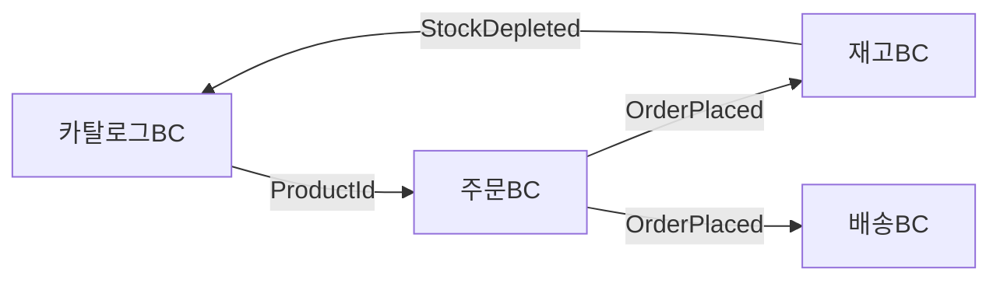
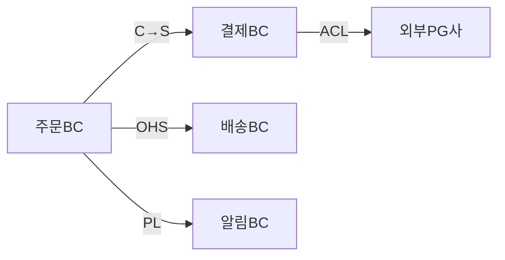
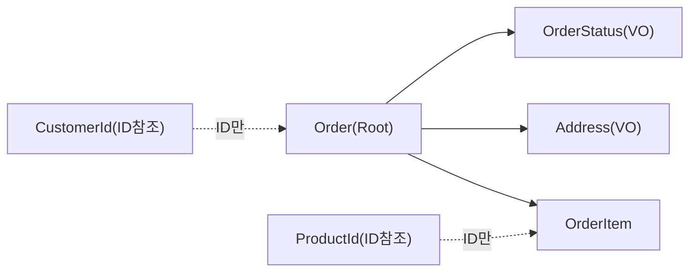
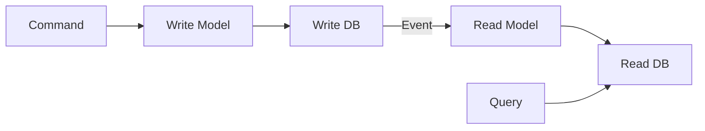

> **한 줄 요약**: DDD는 "코드가 비즈니스를 번역하는 것"이 아니라 "코드 자체가 비즈니스 언어로 말하는 것"을 목표로 한다. 모든 전술 패턴은 이 철학에서 필연적으로 도출된다.

---

## 왜 DDD인가 — 문제부터 이해하기

전통적인 트랜잭션 스크립트 방식의 서비스 코드를 먼저 보겠습니다.

```java
// 전형적인 절차지향 서비스 — 비즈니스 규칙이 어디 있는지 알기 어렵다
@Service
public class OrderService {
    public void cancelOrder(Long orderId, Long userId) {
        Order order = orderRepository.findById(orderId).orElseThrow();
        if (!order.getUserId().equals(userId)) throw new ForbiddenException();
        if (order.getStatus().equals("SHIPPED")) throw new RuntimeException("배송 중");
        if (order.getStatus().equals("CANCELLED")) throw new RuntimeException("이미 취소");
        order.setStatus("CANCELLED");
        order.setCancelledAt(LocalDateTime.now());
        orderRepository.save(order);
        // 알림, 재고 복원, 환불 — 이 모든 것이 한 메서드에?
        notificationService.sendCancelMail(order.getUserEmail());
        inventoryService.restore(order.getProductId(), order.getQuantity());
        paymentService.refund(order.getPaymentId(), order.getTotalAmount());
    }
}
```

무엇이 문제인가요?

1. **비즈니스 규칙이 서비스 메서드에 흩어짐** — `Order` 엔티티는 상태 컨테이너에 불과하고 "배송 중이면 취소 불가"라는 규칙이 서비스에 삽입됩니다. 이 규칙이 10개의 서비스 메서드에서 중복됩니다.
2. **결합도 폭발** — OrderService가 Notification, Inventory, Payment 세 시스템을 직접 호출합니다. 결제 서비스 장애가 주문 취소 실패로 전파됩니다.
3. **도메인 전문가가 코드를 읽을 수 없음** — "getStatus().equals('SHIPPED')"는 비즈니스 언어가 아닙니다.

DDD는 이 세 문제를 각각 풍부한 도메인 모델, Bounded Context 분리, Domain Event로 해결합니다.

---

## 전략적 설계 (Strategic Design)

전략적 설계는 큰 그림입니다. "무엇을 어떻게 나눌 것인가"를 결정합니다.

### Ubiquitous Language — 공통 언어의 힘

Ubiquitous Language는 단순히 "용어를 통일하자"가 아닙니다. **도메인 전문가의 멘탈 모델을 코드 구조에 직접 매핑**하는 것입니다.

같은 회사의 영업팀과 개발팀이 "주문"을 어떻게 다르게 이해하는지 봅시다.

```
영업팀 사고: 고객이 제품에 관심을 보이면 → 견적 → 협상 → 계약 → 주문 확정
개발팀 사고: users 테이블 JOIN orders 테이블, status = 'CONFIRMED'

Ubiquitous Language 적용 후:
영업팀: "계약 확정이 되면 수주가 등록됩니다"
개발팀: Order.confirm() 호출 → OrderConfirmedEvent 발행
```

코드에서의 실천 방법은 단순합니다. **도메인 전문가가 말하는 단어 그대로 클래스명, 메서드명, 변수명으로 씁니다.**

```java
// 나쁜 코드 — 기술 용어와 도메인 용어 혼재
public void processUserProductTransaction(Long uid, Long pid, int qty) {
    userProductMappingRepository.insertMapping(uid, pid, qty);
    userBalanceRepository.decreaseBalance(uid, getProductPrice(pid) * qty);
}

// 좋은 코드 — 유비쿼터스 언어로 작성, 도메인 전문가가 읽을 수 있다
public void addItemToCart(CustomerId customerId, ProductId productId, Quantity quantity) {
    Cart cart = cartRepository.findByCustomer(customerId);
    cart.addItem(productId, quantity);  // "장바구니에 상품을 담는다"
    cartRepository.save(cart);
}
```

테스트 코드 역시 동일합니다.

```java
@Test
void 고객이_장바구니에_상품을_담으면_수량이_증가한다() {
    // "장바구니에 담는다"는 도메인 언어가 테스트 명세가 된다
    Cart cart = Cart.createForCustomer(customerId);
    cart.addItem(productId, Quantity.of(2));

    assertThat(cart.totalItemCount()).isEqualTo(2);
}
```

### Bounded Context — 경계의 의미

Bounded Context는 **동일한 용어가 동일한 의미를 가지는 언어적 경계**입니다. 왜 이 경계가 필요한가요?

"상품(Product)"이라는 단어를 봅시다.

| Bounded Context | Product의 의미 | 핵심 속성 |
|----------------|--------------|----------|
| 상품 카탈로그 컨텍스트 | 판매 가능한 물건의 정보 | 이름, 설명, 이미지, 카테고리 |
| 주문 컨텍스트 | 주문 당시 구매한 물건 | 주문 시점 가격, 수량 |
| 재고 컨텍스트 | 창고에 있는 물리적 물건 | 수량, 위치, 입고일 |
| 배송 컨텍스트 | 포장하여 보낼 물건 | 무게, 부피, 위험물 여부 |

이 네 컨텍스트가 하나의 `Product` 클래스를 공유하면 어떻게 될까요? 배송을 위한 무게 필드가 카탈로그 조회 쿼리에서도 로딩됩니다. 재고 수량 변경 로직이 카탈로그 서비스 배포와 결합됩니다. 결국 아무도 선뜻 수정하지 못하는 거대한 `Product` 신 클래스가 탄생합니다.

각 컨텍스트가 자신의 언어로 Product를 정의하면:

```java
// 상품 카탈로그 컨텍스트 — 오직 카탈로그 정보만
package com.example.catalog.domain;

public class Product {
    private ProductId id;
    private ProductName name;
    private ProductDescription description;
    private List<ProductImage> images;
    private Category category;
    private Price currentPrice;

    public void updateDescription(ProductDescription newDesc) { ... }
    public void addImage(ProductImage image) { ... }
}

// 주문 컨텍스트 — 주문 시점의 스냅샷만
package com.example.order.domain;

public class OrderItem {
    private ProductId productId;        // 카탈로그의 Product를 ID로만 참조
    private String productNameSnapshot; // 주문 당시 이름 (이후 변경돼도 보존)
    private Money unitPriceSnapshot;    // 주문 당시 가격 (이후 변경돼도 보존)
    private Quantity quantity;
}

// 재고 컨텍스트 — 물리적 재고만
package com.example.inventory.domain;

public class StockItem {
    private ProductId productId;
    private StockQuantity availableQuantity;
    private StockQuantity reservedQuantity;
    private WarehouseLocation location;

    public void reserve(Quantity quantity) { ... }
    public void release(Quantity quantity) { ... }
}
```

각 컨텍스트의 `Product` 관련 클래스는 오직 해당 컨텍스트가 필요한 것만 가집니다. 변경도, 배포도, 테스트도 독립적입니다.



### Context Map — 컨텍스트 간 관계 패턴

Bounded Context들은 독립적이지만 서로 통신해야 합니다. Context Map은 이 관계를 명시합니다.



각 패턴의 의미와 구현 방식을 깊이 봅시다.

**Customer-Supplier (고객-공급자)**

공급자(Supplier)가 소비자(Customer)의 요구에 맞춰 API를 제공합니다. 주문 BC가 결제 BC에게 "이런 API가 필요하다"고 요구하면, 결제 BC가 그에 맞춰 구현합니다. 권력 관계가 명확합니다.

```java
// 결제 BC가 주문 BC를 위해 제공하는 API (공급자)
@RestController
@RequestMapping("/api/payments")
public class PaymentController {
    @PostMapping("/order-payments")
    public PaymentResponse initiateOrderPayment(@RequestBody OrderPaymentRequest request) {
        // 주문 BC의 요구사항에 맞는 API 형태
    }
}

// 주문 BC에서 결제 BC API를 호출 (소비자)
@Component
public class PaymentGatewayClient {
    public PaymentResult processPayment(OrderId orderId, Money amount) {
        OrderPaymentRequest request = new OrderPaymentRequest(orderId.getValue(), amount.getAmount());
        return restTemplate.postForObject("/api/payments/order-payments", request, PaymentResult.class);
    }
}
```

**Anti-Corruption Layer (ACL) — 도메인 보호**

외부 시스템(레거시, 서드파티 API)의 모델이 내 도메인을 오염시키지 못하도록 방어합니다. 외부 PG사의 결제 응답 모델이 내 도메인 언어와 다를 때 ACL이 변환합니다.

```java
// 외부 PG사의 응답 모델 — 내 도메인과 다른 언어를 사용
public class TossPaymentResponse {
    private String paymentKey;
    private String orderId;
    private String status;          // "DONE", "CANCELED", "PARTIAL_CANCELED"
    private Integer totalAmount;
    private String approvedAt;      // "2024-01-15T10:30:00+09:00"
}

// ACL — 외부 모델을 내 도메인 모델로 변환
@Component
public class TossPaymentAcl {

    public PaymentResult translate(TossPaymentResponse external) {
        PaymentStatus domainStatus = switch (external.getStatus()) {
            case "DONE" -> PaymentStatus.COMPLETED;
            case "CANCELED" -> PaymentStatus.CANCELLED;
            case "PARTIAL_CANCELED" -> PaymentStatus.PARTIALLY_REFUNDED;
            default -> throw new UnknownPaymentStatusException(external.getStatus());
        };

        return new PaymentResult(
            PaymentId.of(external.getPaymentKey()),
            OrderId.of(external.getOrderId()),
            domainStatus,
            Money.won(external.getTotalAmount()),
            parseApprovedAt(external.getApprovedAt())
        );
        // 내 도메인은 TossPaymentResponse를 전혀 모른다
    }

    private Instant parseApprovedAt(String approvedAt) {
        return OffsetDateTime.parse(approvedAt).toInstant();
    }
}

// 도메인 서비스 — 내부에서는 완전히 도메인 언어만 사용
@Service
public class PaymentService {
    private final TossPaymentAcl acl;

    public PaymentResult processPayment(OrderId orderId, Money amount) {
        TossPaymentResponse external = tossApiClient.pay(orderId.getValue(), amount.getAmount());
        return acl.translate(external); // ACL이 경계를 지킨다
    }
}
```

**Open Host Service (OHS)**

내 Bounded Context를 외부에 공개할 때 잘 정의된 프로토콜을 제공합니다. REST API, gRPC 인터페이스가 대표적입니다. 소비자들이 내 내부 모델을 알 필요 없이 공개 계약(contract)만 알면 됩니다.

**Published Language (PL)**

Kafka 이벤트 스키마처럼 여러 BC가 공유하는 공통 교환 형식입니다. Avro 스키마나 JSON Schema로 정의하고, 스키마 레지스트리로 버전 관리합니다.

```java
// Published Language — 이벤트 스키마 (여러 BC가 구독)
public record OrderPlacedEvent(
    String eventId,
    String eventType,       // "ORDER_PLACED"
    String schemaVersion,   // "v2" — 하위 호환 버전 관리
    String orderId,
    String customerId,
    List<OrderItemDto> items,
    Long totalAmount,
    String currency,
    Instant occurredAt
) {}
// 이 스키마는 주문BC/배송BC/알림BC/재고BC 모두가 이해한다
```

**Shared Kernel**

두 팀이 코드 일부를 공유합니다. 변경 시 양 팀의 합의가 필요해 결합도가 높으므로 신중하게 사용합니다. `Money`, `CustomerId` 같은 공통 Value Object가 후보입니다.

---

## 전술적 설계 (Tactical Design)

전술적 설계는 Bounded Context 내부 구조를 만드는 패턴들입니다.

### Entity — 정체성과 생명주기

Entity의 본질은 **식별자(Identity)**입니다. 속성이 모두 같아도 ID가 다르면 다른 객체입니다. 두 고객이 같은 이름과 주소를 가져도 다른 고객입니다.

왜 이것이 중요한가요? 실세계에서 "동일성"의 기준이 ID인 것들이 있습니다. 주민등록번호가 같으면 같은 사람, 주문번호가 같으면 같은 주문입니다. 이 개념을 코드로 정확히 표현해야 합니다.

```java
@Entity
@Table(name = "orders")
public class Order extends AbstractAggregateRoot<Order> {

    @EmbeddedId
    private OrderId id;

    @Embedded
    private CustomerId customerId;

    @Enumerated(EnumType.STRING)
    private OrderStatus status;

    @OneToMany(cascade = CascadeType.ALL, orphanRemoval = true)
    @JoinColumn(name = "order_id")
    private List<OrderItem> items = new ArrayList<>();

    @Embedded
    private Money totalAmount;

    @Embedded
    private Address shippingAddress;

    private Instant placedAt;
    private Instant cancelledAt;

    protected Order() {} // JPA 기본 생성자 (protected로 직접 생성 방지)

    // 정적 팩토리 메서드 — 유효한 초기 상태만 허용
    public static Order place(CustomerId customerId, List<OrderItem> items, Address shippingAddress) {
        validateItems(items);
        Order order = new Order();
        order.id = OrderId.generate();
        order.customerId = customerId;
        order.items = new ArrayList<>(items);
        order.status = OrderStatus.PENDING;
        order.totalAmount = calculateTotal(items);
        order.shippingAddress = shippingAddress;
        order.placedAt = Instant.now();
        order.registerEvent(new OrderPlacedEvent(order)); // 도메인 이벤트 등록
        return order;
    }

    // 비즈니스 행위 — "주문을 취소한다"
    public void cancel(CancellationReason reason) {
        // 불변식(Invariant) 검증 — Aggregate Root가 보호하는 비즈니스 규칙
        if (this.status == OrderStatus.SHIPPED || this.status == OrderStatus.DELIVERED) {
            throw new OrderCancellationNotAllowedException(
                "배송이 시작된 주문은 취소할 수 없습니다. 주문 ID: " + this.id);
        }
        if (this.status == OrderStatus.CANCELLED) {
            throw new OrderAlreadyCancelledException(this.id);
        }
        this.status = OrderStatus.CANCELLED;
        this.cancelledAt = Instant.now();
        // 도메인 이벤트 — "취소됐다"는 사실 기록. 누가 반응할지는 모른다.
        registerEvent(new OrderCancelledEvent(this.id, this.customerId, this.totalAmount, reason));
    }

    // 아이템 추가 — Root를 통해서만 내부 상태 변경
    public void addItem(ProductId productId, Money unitPrice, Quantity quantity) {
        ensureStatus(OrderStatus.PENDING, "PENDING 상태에서만 아이템을 추가할 수 있습니다");
        OrderItem item = new OrderItem(this.id, productId, unitPrice, quantity);
        this.items.add(item);
        this.totalAmount = this.totalAmount.add(unitPrice.multiply(quantity.getValue()));
    }

    // equals/hashCode — ID 기반 동일성 (속성이 달라도 ID가 같으면 동일)
    @Override
    public boolean equals(Object o) {
        if (this == o) return true;
        if (!(o instanceof Order)) return false;
        Order other = (Order) o;
        return id != null && id.equals(other.id);
    }

    @Override
    public int hashCode() {
        return getClass().hashCode(); // ID가 null일 수 있어 클래스 기반 해시
    }

    private void ensureStatus(OrderStatus expected, String message) {
        if (this.status != expected) throw new IllegalStateException(message);
    }

    private static void validateItems(List<OrderItem> items) {
        if (items == null || items.isEmpty()) {
            throw new EmptyOrderException("주문 아이템이 없습니다");
        }
    }

    private static Money calculateTotal(List<OrderItem> items) {
        return items.stream()
            .map(OrderItem::getSubtotal)
            .reduce(Money.ZERO_KRW, Money::add);
    }
}
```

### Value Object — 개념적 완전성과 불변성

Value Object의 본질은 **개념적 완전성(Conceptual Wholeness)**입니다. `amount`와 `currency`는 따로 존재할 때 의미가 불완전합니다. `10000`이 원인지 달러인지 알 수 없습니다. `Money(10000, KRW)`가 되어야 완전한 개념입니다.

왜 불변이어야 하는가? VO를 공유했을 때 한쪽이 변경하면 다른 쪽이 영향을 받습니다. 불변이면 공유해도 안전합니다.

```java
@Embeddable
public final class Money {

    @Column(name = "amount")
    private final BigDecimal amount;

    @Enumerated(EnumType.STRING)
    @Column(name = "currency")
    private final Currency currency;

    protected Money() { this.amount = BigDecimal.ZERO; this.currency = Currency.KRW; }

    private Money(BigDecimal amount, Currency currency) {
        if (amount == null) throw new IllegalArgumentException("금액은 null일 수 없습니다");
        if (currency == null) throw new IllegalArgumentException("통화는 null일 수 없습니다");
        if (amount.compareTo(BigDecimal.ZERO) < 0) {
            throw new NegativeAmountException("금액은 음수일 수 없습니다: " + amount);
        }
        // 정밀도 고정 — 화폐 계산은 scale이 중요
        this.amount = amount.setScale(currency.getDefaultScale(), RoundingMode.HALF_UP);
        this.currency = currency;
    }

    public static Money of(BigDecimal amount, Currency currency) {
        return new Money(amount, currency);
    }

    public static Money won(long amount) {
        return new Money(BigDecimal.valueOf(amount), Currency.KRW);
    }

    public static Money won(BigDecimal amount) {
        return new Money(amount, Currency.KRW);
    }

    public static final Money ZERO_KRW = won(0);

    // 불변 연산 — 새 객체 반환, 기존 객체 변경 없음
    public Money add(Money other) {
        requireSameCurrency(other);
        return new Money(this.amount.add(other.amount), this.currency);
    }

    public Money subtract(Money other) {
        requireSameCurrency(other);
        BigDecimal result = this.amount.subtract(other.amount);
        if (result.compareTo(BigDecimal.ZERO) < 0) {
            throw new InsufficientAmountException("차감 후 금액이 음수입니다");
        }
        return new Money(result, this.currency);
    }

    public Money multiply(int multiplier) {
        if (multiplier < 0) throw new IllegalArgumentException("승수는 음수일 수 없습니다");
        return new Money(this.amount.multiply(BigDecimal.valueOf(multiplier)), this.currency);
    }

    public Money applyDiscountRate(int discountPercent) {
        if (discountPercent < 0 || discountPercent > 100) {
            throw new IllegalArgumentException("할인율은 0~100 사이여야 합니다");
        }
        BigDecimal discountMultiplier = BigDecimal.ONE
            .subtract(BigDecimal.valueOf(discountPercent).divide(BigDecimal.valueOf(100)));
        return new Money(this.amount.multiply(discountMultiplier), this.currency);
    }

    public boolean isGreaterThan(Money other) {
        requireSameCurrency(other);
        return this.amount.compareTo(other.amount) > 0;
    }

    private void requireSameCurrency(Money other) {
        if (!this.currency.equals(other.currency)) {
            throw new CurrencyMismatchException(
                "통화가 다릅니다: " + this.currency + " vs " + other.currency);
        }
    }

    // 동일성 — 값의 조합으로 판단 (ID 없음)
    @Override
    public boolean equals(Object o) {
        if (!(o instanceof Money)) return false;
        Money m = (Money) o;
        return this.amount.compareTo(m.amount) == 0 && this.currency == m.currency;
    }

    @Override
    public int hashCode() {
        return Objects.hash(amount.stripTrailingZeros(), currency);
    }

    @Override
    public String toString() {
        return String.format("%s %s", amount.toPlainString(), currency.getCode());
    }
}
```

Value Object를 Entity로 착각하는 흔한 실수를 JPA 관점에서 봅시다.

```java
// 나쁜 설계 — Address를 별도 테이블로 관리
@Entity
@Table(name = "addresses")
public class Address {
    @Id @GeneratedValue
    private Long id;       // 불필요한 ID — 주소는 값이지 실체가 아니다
    private String city;
    private String street;
    private String zipCode;
}

@Entity
public class Order {
    @ManyToOne
    @JoinColumn(name = "address_id")
    private Address shippingAddress; // 조인 발생, 공유 시 한 주문 변경이 다른 주문에 영향
}

// 좋은 설계 — @Embeddable로 같은 테이블에 저장
@Embeddable
public final class Address {
    // ID 없음, 조인 없음, 공유해도 안전 (불변)
    @Column(name = "shipping_city")
    private final String city;
    @Column(name = "shipping_street")
    private final String street;
    @Column(name = "shipping_zip_code")
    private final String zipCode;

    public Address withCity(String newCity) {
        return new Address(newCity, this.street, this.zipCode); // 새 객체 반환
    }
}
```

### Aggregate — 일관성 경계의 WHY

Aggregate는 DDD에서 가장 오해가 많은 개념입니다. 핵심 질문은 "왜 Aggregate Root를 통해서만 접근해야 하는가?"입니다.

**불변식(Invariant)을 보호하기 위해서입니다.**

주문의 불변식 예시: "주문 총액은 항상 개별 아이템 합계와 일치해야 한다." `OrderItem`을 직접 수정하면 이 불변식이 깨집니다.

```java
// 불변식이 깨지는 시나리오 — OrderItem 직접 접근 허용 시
OrderItem item = orderItemRepository.findById(itemId); // 별도 Repository 존재
item.setQuantity(5);  // Order의 totalAmount는 그대로 — 불변식 위반!
orderItemRepository.save(item);
// 이제 Order.totalAmount != sum(OrderItem.subtotal) — 데이터 무결성 파괴
```

Aggregate Root가 관리하면:

```java
// 불변식 보호 — Root를 통해서만 변경
order.changeItemQuantity(itemId, Quantity.of(5));
// Order.changeItemQuantity 내부에서 totalAmount 재계산 보장
```

**트랜잭션 경계로서의 Aggregate**

하나의 트랜잭션 = 하나의 Aggregate 수정. 이 규칙이 왜 중요한가요?

```java
// 나쁜 패턴 — 하나의 트랜잭션에서 여러 Aggregate 수정
@Transactional
public void placeOrder(PlaceOrderCommand cmd) {
    Order order = new Order(cmd);
    orderRepository.save(order);

    // 같은 트랜잭션에서 Inventory 수정 — Aggregate 경계 위반
    Inventory inventory = inventoryRepository.findByProduct(cmd.getProductId());
    inventory.decrease(cmd.getQuantity());
    inventoryRepository.save(inventory);
    // 두 Aggregate 중 하나가 실패하면? 롤백 범위가 너무 넓다
    // Order BC와 Inventory BC를 같은 트랜잭션으로 묶으면 마이크로서비스 불가
}

// 좋은 패턴 — 이벤트로 다른 Aggregate와 통신
@Transactional
public void placeOrder(PlaceOrderCommand cmd) {
    Order order = Order.place(cmd.getCustomerId(), cmd.getItems(), cmd.getShippingAddress());
    orderRepository.save(order);
    // OrderPlacedEvent가 등록됨 — save 후 Spring이 이벤트 발행
    // Inventory는 이벤트를 구독해 별도 트랜잭션에서 처리
}
```

**Aggregate 크기 결정 원칙**



```java
// Aggregate 설계 원칙을 코드로 표현
@Entity
public class Order extends AbstractAggregateRoot<Order> {

    @EmbeddedId
    private OrderId id;

    // 다른 Aggregate Root는 ID로만 참조
    @Embedded
    private CustomerId customerId;    // Customer 전체 객체 X

    // Aggregate 내부 엔티티 — Order와 생명주기가 완전히 같음
    @OneToMany(cascade = CascadeType.ALL, orphanRemoval = true)
    private List<OrderItem> items;   // OrderItem은 Order 없이 독립 존재 불가

    // Value Object — 불변, Aggregate 내부에 임베드
    @Embedded
    private Address shippingAddress;

    @Embedded
    private Money totalAmount;
}

// OrderItem도 내부적으로는 Product를 ID로만 참조
@Entity
public class OrderItem {
    @EmbeddedId
    private OrderItemId id;

    @Embedded
    private ProductId productId;      // Product Aggregate는 ID로만

    private String productNameSnapshot;   // 주문 당시 스냅샷
    private Money unitPriceSnapshot;      // 주문 당시 가격 스냅샷

    @Embedded
    private Quantity quantity;
}
```

왜 스냅샷인가요? 주문 후 상품 가격이 변경되어도 "주문 당시 가격"은 변하지 않아야 합니다. 현재 상품 가격을 참조하면 과거 주문의 금액이 바뀝니다.

---

## Repository 패턴 — 영속성 무지(Persistence Ignorance)

Repository는 단순한 DAO가 아닙니다. **도메인 계층이 영속성 기술(JPA, MongoDB, Redis)을 모르도록 추상화**하는 것입니다. 이를 "영속성 무지(Persistence Ignorance)"라고 합니다.

왜 Aggregate Root에만 Repository가 있는가? OrderItem Repository가 있으면 Order를 거치지 않고 직접 접근 가능해집니다. Aggregate의 불변식 보호가 무너집니다.

```java
// 도메인 계층 — 인프라를 전혀 모르는 순수 인터페이스
package com.example.order.domain.repository;

public interface OrderRepository {
    // 컬렉션처럼 동작 — "저장소에서 꺼내고 넣는다"는 개념
    Order findById(OrderId id);
    Optional<Order> findByIdOptional(OrderId id);
    List<Order> findByCustomerId(CustomerId customerId);
    List<Order> findByStatus(OrderStatus status);
    void save(Order order);     // insert + update 모두 처리
    void delete(Order order);
    // JPA, SQL, MongoDB — 뭘 쓰든 인터페이스는 동일
}

// 인프라 계층 — JPA로 구현 (도메인 계층에 의존하지만 역방향)
package com.example.order.infrastructure.persistence;

@Repository
public class JpaOrderRepository implements OrderRepository {

    private final OrderJpaRepository jpaRepository;  // Spring Data JPA
    private final OrderMapper mapper;                  // 도메인 ↔ JPA 엔티티 변환

    @Override
    public Order findById(OrderId id) {
        return jpaRepository.findById(id.getValue())
            .map(mapper::toDomainEntity)
            .orElseThrow(() -> new OrderNotFoundException("주문을 찾을 수 없습니다: " + id));
    }

    @Override
    public void save(Order order) {
        OrderJpaEntity entity = mapper.toJpaEntity(order);
        jpaRepository.save(entity);
        // save 후 이벤트 발행 — AbstractAggregateRoot 활용
        // Spring Data가 자동으로 처리하거나 명시적으로 처리
    }

    @Override
    public List<Order> findByCustomerId(CustomerId customerId) {
        return jpaRepository.findByCustomerId(customerId.getValue()).stream()
            .map(mapper::toDomainEntity)
            .collect(Collectors.toList());
    }
}

// Spring Data JPA Repository — 인프라 세부사항
package com.example.order.infrastructure.persistence;

interface OrderJpaRepository extends JpaRepository<OrderJpaEntity, Long> {
    List<OrderJpaEntity> findByCustomerId(Long customerId);
    List<OrderJpaEntity> findByStatus(String status);
    // 이 인터페이스는 도메인 계층에 노출되지 않는다
}
```

**도메인 엔티티와 JPA 엔티티 분리 전략**

이것이 DDD Repository의 핵심이면서 가장 논란이 많은 부분입니다. 도메인 엔티티에 JPA 어노테이션을 직접 붙이면 도메인이 JPA에 오염됩니다. 분리하면 매핑 코드가 늘어납니다.

```java
// 전략 1: 도메인 엔티티 = JPA 엔티티 (실용적 타협)
// 장점: 간단함. 단점: 도메인이 @Column, @JoinColumn 등 JPA 어노테이션에 의존
@Entity
@Table(name = "orders")
public class Order extends AbstractAggregateRoot<Order> {
    @EmbeddedId private OrderId id;
    // JPA 어노테이션이 도메인 클래스에 존재 — 순수성 타협
}

// 전략 2: 완전 분리 (엄격한 DDD)
// 도메인 엔티티 — 순수 Java, 어떤 프레임워크 어노테이션도 없음
public class Order {
    private OrderId id;
    private CustomerId customerId;
    private OrderStatus status;
    // JPA 어노테이션 없음 — 진정한 영속성 무지
}

// JPA 엔티티 — 영속성만 담당
@Entity @Table(name = "orders")
class OrderJpaEntity {
    @Id Long id;
    Long customerId;
    String status;
    // 비즈니스 로직 없음, 순수 데이터 컨테이너
}

// Mapper — 두 모델 변환
@Component
public class OrderMapper {
    public Order toDomainEntity(OrderJpaEntity jpa) {
        return Order.reconstruct(
            OrderId.of(jpa.getId()),
            CustomerId.of(jpa.getCustomerId()),
            OrderStatus.valueOf(jpa.getStatus())
        );
    }

    public OrderJpaEntity toJpaEntity(Order domain) {
        OrderJpaEntity jpa = new OrderJpaEntity();
        jpa.setId(domain.getId().getValue());
        jpa.setCustomerId(domain.getCustomerId().getValue());
        jpa.setStatus(domain.getStatus().name());
        return jpa;
    }
}
```

실무에서는 전략 1을 많이 쓰되, 도메인 로직과 JPA 설정을 명확히 분리하는 방식을 취합니다.

---

## Domain Events — 느슨한 결합의 메커니즘

Domain Event는 "도메인에서 중요한 일이 발생했다"는 사실을 기록합니다. 과거형으로 명명합니다(`OrderPlaced`, `PaymentCompleted`, `StockDepleted`).

**왜 Domain Event를 사용하는가?**

Aggregate 간 통신 문제를 생각해 봅시다. 주문이 완료되면 결제 처리, 재고 감소, 알림 발송이 필요합니다. 이것을 직접 호출로 처리하면:

```java
// 직접 호출 — 강결합, 장애 전파, 테스트 어려움
@Transactional
public void placeOrder(PlaceOrderCommand cmd) {
    Order order = Order.place(...);
    orderRepository.save(order);
    paymentService.charge(order);       // 결제 실패 → 주문도 롤백
    inventoryService.decrease(order);   // 재고 실패 → 주문과 결제 모두 롤백
    notificationService.send(order);    // 알림 실패 → 모든 것 롤백
    // 알림 실패가 주문 자체를 실패시키는 말이 안 되는 상황
}
```

Domain Event로 해결하면:

```java
// Domain Event 정의 — 불변, 과거형, 멱등 처리를 위한 eventId 포함
public record OrderPlacedEvent(
    UUID eventId,               // 멱등성 — 같은 이벤트 중복 처리 방지
    OrderId orderId,
    CustomerId customerId,
    List<OrderItemSnapshot> items,
    Money totalAmount,
    Address shippingAddress,
    Instant occurredAt          // 발생 시각 — 이벤트 소싱에서 중요
) {
    public OrderPlacedEvent {
        Objects.requireNonNull(eventId, "eventId는 필수입니다");
        Objects.requireNonNull(orderId, "orderId는 필수입니다");
    }
}

// Aggregate에서 이벤트 등록
public class Order extends AbstractAggregateRoot<Order> {

    public static Order place(CustomerId customerId, List<OrderItem> items, Address address) {
        Order order = new Order();
        // ... 초기화 ...
        order.registerEvent(new OrderPlacedEvent(
            UUID.randomUUID(),
            order.id,
            customerId,
            OrderItemSnapshot.of(items),
            order.totalAmount,
            address,
            Instant.now()
        ));
        return order;
        // 이벤트는 아직 발행되지 않음 — save() 후 Spring이 처리
    }
}

// Application Service — 저장 후 Spring Data가 이벤트 자동 발행
@Service
@Transactional
public class OrderApplicationService {

    public OrderId placeOrder(PlaceOrderCommand cmd) {
        Order order = Order.place(cmd.getCustomerId(), cmd.getItems(), cmd.getShippingAddress());
        orderRepository.save(order);
        // Spring Data의 @DomainEvents 메커니즘이 save() 후 이벤트 발행
        // AbstractAggregateRoot가 이를 처리
        return order.getId();
    }
}
```

**Spring의 이벤트 처리 메커니즘**

```java
// 동기 이벤트 핸들러 — 같은 트랜잭션에서 처리 (트랜잭션 커밋 전)
@Component
public class InventoryEventHandler {

    @EventListener
    @Transactional(propagation = Propagation.REQUIRES_NEW)
    // REQUIRES_NEW: 별도 트랜잭션 — 재고 실패가 주문 롤백을 일으키지 않음
    public void on(OrderPlacedEvent event) {
        inventoryService.reserveStock(event.orderId(), event.items());
    }
}

// @TransactionalEventListener — 트랜잭션 커밋 후 처리 (가장 안전)
@Component
public class NotificationEventHandler {

    @TransactionalEventListener(phase = TransactionPhase.AFTER_COMMIT)
    // AFTER_COMMIT: 주문 트랜잭션이 성공적으로 커밋된 후에만 실행
    // 주문이 롤백되면 알림도 발송되지 않음
    public void on(OrderPlacedEvent event) {
        notificationService.sendOrderConfirmation(event.customerId(), event.orderId());
    }

    @TransactionalEventListener(phase = TransactionPhase.AFTER_ROLLBACK)
    public void onRollback(OrderPlacedEvent event) {
        // 주문 실패 시 처리가 필요한 경우
        log.warn("주문 처리 실패: {}", event.orderId());
    }
}

// ApplicationEventPublisher를 직접 사용하는 방법
@Service
@Transactional
public class OrderApplicationService {

    private final ApplicationEventPublisher eventPublisher;

    public OrderId placeOrder(PlaceOrderCommand cmd) {
        Order order = Order.place(cmd.getCustomerId(), cmd.getItems(), cmd.getShippingAddress());
        orderRepository.save(order);
        eventPublisher.publishEvent(new OrderPlacedEvent(...)); // 명시적 발행
        return order.getId();
    }
}
```

**@TransactionalEventListener의 AFTER_COMMIT 함정**

```java
@TransactionalEventListener(phase = TransactionPhase.AFTER_COMMIT)
@Transactional  // 주의: 이미 트랜잭션이 커밋된 후이므로 새 트랜잭션 필요
// @Transactional(propagation = Propagation.REQUIRES_NEW) 를 명시해야 한다
public void on(OrderPlacedEvent event) {
    // 여기서 DB 작업을 하려면 REQUIRES_NEW 필요
    // 없으면 "No EntityManager with actual transaction available" 에러 발생
    auditRepository.save(new AuditLog(event));
}
```

---

## Domain Service vs Application Service

이 구분은 면접에서 자주 나오는 질문입니다. 차이를 명확히 이해해야 합니다.

**Domain Service**: 도메인 로직을 담지만 단일 Entity/VO에 속하기 어려운 경우. **상태를 갖지 않으며**, 도메인 언어로 말합니다.

**Application Service**: 유스케이스를 조율합니다. 트랜잭션 시작, Repository 호출, Domain Service 호출, 이벤트 발행 등. **도메인 로직 자체는 갖지 않습니다.**

```java
// Domain Service — 여러 Aggregate에 걸친 도메인 로직
// 할인 계산은 Order, Customer, Coupon 세 개념이 모두 필요 → 어디에도 속하지 않음
@Service // 또는 커스텀 @DomainService 어노테이션
public class DiscountDomainService {

    // 상태 없음 — 입력을 받아 계산 결과를 반환
    public Money calculateDiscount(Order order, Customer customer, List<Coupon> applicableCoupons) {

        // 볼륨 할인 — 주문 금액 기준
        Money volumeDiscount = calculateVolumeDiscount(order.getTotalAmount());

        // 등급 할인 — 고객 등급 기준
        Money memberDiscount = switch (customer.getMembershipGrade()) {
            case VIP -> order.getTotalAmount().applyDiscountRate(10);
            case GOLD -> order.getTotalAmount().applyDiscountRate(5);
            case SILVER -> order.getTotalAmount().applyDiscountRate(2);
            case STANDARD -> Money.ZERO_KRW;
        };

        // 쿠폰 할인 — 중복 적용, 단 최대 할인율 제한
        Money couponDiscount = applicableCoupons.stream()
            .map(coupon -> coupon.calculateDiscount(order.getTotalAmount()))
            .reduce(Money.ZERO_KRW, Money::add);

        Money totalDiscount = volumeDiscount.add(memberDiscount).add(couponDiscount);

        // 불변식: 할인액은 주문금액을 초과할 수 없다
        if (totalDiscount.isGreaterThan(order.getTotalAmount())) {
            return order.getTotalAmount(); // 최대 전액 할인
        }

        return totalDiscount;
    }

    private Money calculateVolumeDiscount(Money totalAmount) {
        if (totalAmount.isGreaterThan(Money.won(1_000_000))) {
            return totalAmount.applyDiscountRate(15);
        } else if (totalAmount.isGreaterThan(Money.won(500_000))) {
            return totalAmount.applyDiscountRate(10);
        } else if (totalAmount.isGreaterThan(Money.won(100_000))) {
            return totalAmount.applyDiscountRate(5);
        }
        return Money.ZERO_KRW;
    }
}

// Application Service — 유스케이스 조율, 도메인 로직 없음
@Service
@Transactional
public class OrderApplicationService {

    private final OrderRepository orderRepository;
    private final CustomerRepository customerRepository;
    private final CouponRepository couponRepository;
    private final DiscountDomainService discountDomainService; // Domain Service 주입
    private final ApplicationEventPublisher eventPublisher;

    public OrderId placeOrder(PlaceOrderCommand cmd) {
        // 1. 필요한 도메인 객체 로딩 (Repository 호출 — Application Service의 역할)
        Customer customer = customerRepository.findById(cmd.getCustomerId())
            .orElseThrow(() -> new CustomerNotFoundException(cmd.getCustomerId()));

        List<Coupon> coupons = couponRepository.findApplicableCoupons(
            cmd.getCustomerId(), cmd.getCouponIds());

        // 2. 주문 생성 (도메인 로직 — Entity 내부)
        Order order = Order.place(cmd.getCustomerId(), cmd.getItems(), cmd.getShippingAddress());

        // 3. 할인 계산 (도메인 로직 — Domain Service)
        Money discount = discountDomainService.calculateDiscount(order, customer, coupons);
        order.applyDiscount(discount);

        // 4. 영속화 (Repository 호출)
        orderRepository.save(order);

        // Application Service는 "어떻게" 조율하는지 알지만 "비즈니스 규칙"은 모른다
        return order.getId();
    }
}
```

비즈니스 규칙이 Application Service에 있으면 안 되는 이유:

```java
// 나쁜 Application Service — 도메인 로직이 서비스에
@Service
public class OrderApplicationService {
    public void cancelOrder(OrderId orderId) {
        Order order = orderRepository.findById(orderId);
        // 이 if 문이 도메인 로직! Application Service에 있으면 안 된다
        if (order.getStatus() == OrderStatus.SHIPPED) {
            throw new Exception("배송 중인 주문은 취소 불가");
        }
        order.setStatus(OrderStatus.CANCELLED); // setter 사용도 문제
    }
}

// 좋은 Application Service — 도메인 로직은 Entity 안에
@Service
public class OrderApplicationService {
    public void cancelOrder(OrderId orderId, CancellationReason reason) {
        Order order = orderRepository.findById(orderId);
        order.cancel(reason); // 취소 가능 여부 판단은 Order 내부 책임
        orderRepository.save(order);
    }
}
```

---

## Factory 패턴 — 복잡한 생성 로직의 캡슐화

복잡한 Aggregate 생성 로직이 Application Service에 있으면 서비스가 오염됩니다. Factory로 분리합니다.

왜 Factory가 필요한가? 생성 규칙이 복잡할 때, 생성 과정에서 다른 서비스 조회가 필요할 때, 다양한 생성 변형(정기 주문, 빠른 주문, 선물 주문)이 있을 때입니다.

```java
// Factory — 복잡한 Aggregate 생성 캡슐화
@Component
public class OrderFactory {

    private final ProductRepository productRepository;
    private final CustomerRepository customerRepository;
    private final PricingService pricingService;

    // 일반 주문 생성
    public Order createOrder(CreateOrderRequest request) {
        Customer customer = customerRepository.findById(request.getCustomerId())
            .orElseThrow(() -> new CustomerNotFoundException(request.getCustomerId()));

        // 현재 가격 조회 및 스냅샷 생성
        List<OrderItem> items = request.getItems().stream()
            .map(itemReq -> {
                Product product = productRepository.findById(itemReq.getProductId())
                    .orElseThrow(() -> new ProductNotFoundException(itemReq.getProductId()));
                // 회원 등급에 따른 특별가 적용
                Money price = pricingService.getPriceForCustomer(product, customer);
                return OrderItem.of(product.getId(), product.getName(), price, itemReq.getQuantity());
            })
            .collect(Collectors.toList());

        validateMinimumOrderAmount(items, customer);

        return Order.place(customer.getId(), items, request.getShippingAddress());
    }

    // 정기 배송 주문 생성 — 일반 주문과 생성 규칙이 다름
    public Order createSubscriptionOrder(SubscriptionOrderRequest request) {
        // 정기 배송 특화 로직
        Order order = createOrder(request.toCreateOrderRequest());
        order.markAsSubscription(request.getSubscriptionId(), request.getDeliveryInterval());
        return order;
    }

    // 선물 주문 생성
    public Order createGiftOrder(GiftOrderRequest request) {
        Order order = createOrder(request.toCreateOrderRequest());
        order.setGiftMessage(request.getMessage(), request.getRecipient());
        return order;
    }

    private void validateMinimumOrderAmount(List<OrderItem> items, Customer customer) {
        Money total = items.stream()
            .map(OrderItem::getSubtotal)
            .reduce(Money.ZERO_KRW, Money::add);
        Money minimumAmount = customer.getMinimumOrderAmount();
        if (total.isLessThan(minimumAmount)) {
            throw new MinimumOrderAmountException(minimumAmount, total);
        }
    }
}

// Application Service에서 Factory 사용
@Service
@Transactional
public class OrderApplicationService {

    private final OrderFactory orderFactory;  // 복잡한 생성은 Factory에
    private final OrderRepository orderRepository;

    public OrderId placeOrder(CreateOrderRequest request) {
        Order order = orderFactory.createOrder(request); // 생성 책임 위임
        orderRepository.save(order);
        return order.getId();
        // Application Service는 조율만
    }
}
```

---

## Specification 패턴 — 조합 가능한 비즈니스 규칙

복잡한 조건 조합을 코드로 표현할 때 if-else가 폭발합니다. Specification 패턴은 비즈니스 규칙을 객체로 만들어 조합합니다.

```java
// Specification 인터페이스
public interface Specification<T> {
    boolean isSatisfiedBy(T entity);

    default Specification<T> and(Specification<T> other) {
        return entity -> this.isSatisfiedBy(entity) && other.isSatisfiedBy(entity);
    }

    default Specification<T> or(Specification<T> other) {
        return entity -> this.isSatisfiedBy(entity) || other.isSatisfiedBy(entity);
    }

    default Specification<T> not() {
        return entity -> !this.isSatisfiedBy(entity);
    }
}

// 구체적 명세 — 각각 하나의 비즈니스 규칙
public class OrderCancellableSpecification implements Specification<Order> {
    @Override
    public boolean isSatisfiedBy(Order order) {
        return order.getStatus() == OrderStatus.PENDING
            || order.getStatus() == OrderStatus.CONFIRMED;
    }
}

public class OrderOlderThanSpecification implements Specification<Order> {
    private final Duration maxAge;

    public OrderOlderThanSpecification(Duration maxAge) {
        this.maxAge = maxAge;
    }

    @Override
    public boolean isSatisfiedBy(Order order) {
        return Duration.between(order.getPlacedAt(), Instant.now()).compareTo(maxAge) > 0;
    }
}

public class HighValueOrderSpecification implements Specification<Order> {
    private static final Money HIGH_VALUE_THRESHOLD = Money.won(500_000);

    @Override
    public boolean isSatisfiedBy(Order order) {
        return order.getTotalAmount().isGreaterThan(HIGH_VALUE_THRESHOLD);
    }
}

// 명세 조합 — 복잡한 비즈니스 규칙도 읽기 쉽게
@Service
public class OrderEligibilityService {

    private final Specification<Order> cancellable = new OrderCancellableSpecification();
    private final Specification<Order> recentOrder = new OrderOlderThanSpecification(Duration.ofDays(30)).not();
    private final Specification<Order> highValue = new HighValueOrderSpecification();

    // "취소 가능하고, 30일 이내 주문이면 취소 허용"
    public boolean canCancel(Order order) {
        return cancellable.and(recentOrder).isSatisfiedBy(order);
    }

    // "취소 가능하고, 고가 주문이면 고객센터 승인 필요"
    public boolean requiresApprovalForCancellation(Order order) {
        return cancellable.and(highValue).isSatisfiedBy(order);
    }
}
```

**JPA Specification으로 복잡한 쿼리 표현**

```java
// Spring Data JPA Specification — DB 쿼리를 Specification으로 표현
public class OrderSpecifications {

    public static Specification<OrderJpaEntity> hasCustomer(CustomerId customerId) {
        return (root, query, cb) ->
            cb.equal(root.get("customerId"), customerId.getValue());
    }

    public static Specification<OrderJpaEntity> hasStatus(OrderStatus status) {
        return (root, query, cb) ->
            cb.equal(root.get("status"), status.name());
    }

    public static Specification<OrderJpaEntity> placedBetween(Instant from, Instant to) {
        return (root, query, cb) ->
            cb.between(root.get("placedAt"), from, to);
    }

    public static Specification<OrderJpaEntity> totalAmountGreaterThan(Money threshold) {
        return (root, query, cb) ->
            cb.greaterThan(root.get("totalAmount"), threshold.getAmount());
    }
}

// Repository에서 Specification 조합
public interface OrderJpaRepository extends JpaRepository<OrderJpaEntity, Long>,
    JpaSpecificationExecutor<OrderJpaEntity> {}

// 사용 — 비즈니스 규칙이 명세로 읽힌다
@Service
public class OrderQueryService {

    public List<Order> findHighValuePendingOrdersLastMonth(CustomerId customerId) {
        Specification<OrderJpaEntity> spec = OrderSpecifications.hasCustomer(customerId)
            .and(OrderSpecifications.hasStatus(OrderStatus.PENDING))
            .and(OrderSpecifications.placedBetween(lastMonthStart(), Instant.now()))
            .and(OrderSpecifications.totalAmountGreaterThan(Money.won(100_000)));

        return orderJpaRepository.findAll(spec).stream()
            .map(mapper::toDomainEntity)
            .collect(Collectors.toList());
    }
}
```

---

## CQRS — 읽기와 쓰기를 왜 분리하는가

CQRS(Command Query Responsibility Segregation)의 핵심은 **명령(쓰기)과 조회(읽기)의 책임이 근본적으로 다르다**는 것입니다.

쓰기 모델: 비즈니스 규칙 검증, Aggregate 불변식 보호, 트랜잭션 일관성이 중요합니다.
읽기 모델: 화면에 필요한 데이터를 빠르게 반환하는 것이 중요합니다. 정규화된 Aggregate 구조는 읽기에 비효율적입니다.



```java
// Command 측 — Aggregate 기반, 비즈니스 규칙 보호
@Service
@Transactional
public class OrderCommandService {

    public OrderId placeOrder(PlaceOrderCommand cmd) {
        // Aggregate 로딩, 비즈니스 규칙 검증, 저장
        Order order = orderFactory.createOrder(cmd);
        orderRepository.save(order);
        return order.getId();
    }

    public void cancelOrder(CancelOrderCommand cmd) {
        Order order = orderRepository.findById(cmd.getOrderId());
        order.cancel(cmd.getReason()); // Aggregate가 규칙 검증
        orderRepository.save(order);
    }
}

// Query 측 — DTO 직접 조회, Aggregate 로딩 없음
@Service
@Transactional(readOnly = true)
public class OrderQueryService {

    private final OrderQueryRepository queryRepository;

    // 주문 목록 조회 — Aggregate 로딩 없이 DTO로 바로 조회
    public List<OrderSummaryDto> getOrderSummaries(CustomerId customerId, Pageable pageable) {
        return queryRepository.findOrderSummaries(customerId, pageable);
    }

    // 주문 상세 조회 — 여러 테이블 JOIN으로 화면에 필요한 모든 데이터
    public OrderDetailDto getOrderDetail(OrderId orderId) {
        return queryRepository.findOrderDetail(orderId)
            .orElseThrow(() -> new OrderNotFoundException(orderId));
    }
}

// Query Repository — JPQL이나 Native Query로 읽기 최적화
@Repository
public class OrderQueryRepository {

    private final EntityManager em;

    public List<OrderSummaryDto> findOrderSummaries(CustomerId customerId, Pageable pageable) {
        // 정규화된 Aggregate 로딩 없이 DTO 직접 반환 (N+1 없음)
        return em.createQuery("""
                SELECT new com.example.order.dto.OrderSummaryDto(
                    o.id, o.status, o.totalAmount, o.placedAt,
                    COUNT(oi), SUM(oi.quantity)
                )
                FROM OrderJpaEntity o
                JOIN o.items oi
                WHERE o.customerId = :customerId
                GROUP BY o.id, o.status, o.totalAmount, o.placedAt
                ORDER BY o.placedAt DESC
                """, OrderSummaryDto.class)
            .setParameter("customerId", customerId.getValue())
            .setFirstResult((int) pageable.getOffset())
            .setMaxResults(pageable.getPageSize())
            .getResultList();
    }

    public Optional<OrderDetailDto> findOrderDetail(OrderId orderId) {
        // 한 쿼리로 주문 + 아이템 + 결제 + 배송 정보까지
        List<OrderDetailDto> results = em.createNativeQuery("""
                SELECT o.id, o.status, o.total_amount, o.placed_at,
                       c.name as customer_name, c.email as customer_email,
                       oi.product_name, oi.unit_price, oi.quantity,
                       p.status as payment_status, p.paid_at,
                       s.tracking_number, s.estimated_arrival
                FROM orders o
                JOIN customers c ON o.customer_id = c.id
                LEFT JOIN order_items oi ON oi.order_id = o.id
                LEFT JOIN payments p ON p.order_id = o.id
                LEFT JOIN shipments s ON s.order_id = o.id
                WHERE o.id = :orderId
                """, "OrderDetailDtoMapping")
            .setParameter("orderId", orderId.getValue())
            .getResultList();
        return results.isEmpty() ? Optional.empty() : Optional.of(results.get(0));
    }
}
```

**CQRS와 이벤트 소싱의 관계**

이벤트 소싱은 Aggregate의 현재 상태를 저장하지 않고 **상태 변경 이벤트를 순서대로 저장**하는 패턴입니다. CQRS와 자연스럽게 결합됩니다.

```java
// 이벤트 소싱 — 이벤트 저장소
@Entity
@Table(name = "domain_events")
public class DomainEventRecord {
    @Id @GeneratedValue
    private Long sequenceNumber;
    private String aggregateId;
    private String aggregateType;
    private String eventType;
    private String eventPayload;  // JSON 직렬화된 이벤트
    private Instant occurredAt;
    private Long version;
}

// Order 재구성 — 이벤트를 순서대로 재생
public class Order {

    // 이벤트 재생으로 상태 복원
    public static Order reconstitute(List<DomainEvent> events) {
        Order order = new Order();
        for (DomainEvent event : events) {
            order.apply(event); // 각 이벤트를 적용해 상태 재구성
        }
        return order;
    }

    private void apply(DomainEvent event) {
        switch (event) {
            case OrderPlacedEvent e -> {
                this.id = e.orderId();
                this.customerId = e.customerId();
                this.status = OrderStatus.PENDING;
                this.totalAmount = e.totalAmount();
            }
            case OrderCancelledEvent e -> {
                this.status = OrderStatus.CANCELLED;
                this.cancelledAt = e.occurredAt();
            }
            case OrderShippedEvent e -> {
                this.status = OrderStatus.SHIPPED;
            }
            default -> throw new UnknownEventException(event.getClass());
        }
    }
}

// CQRS Read Model 동기화 — 이벤트를 구독해 읽기 모델 업데이트
@Component
public class OrderReadModelSynchronizer {

    @TransactionalEventListener(phase = TransactionPhase.AFTER_COMMIT)
    public void on(OrderPlacedEvent event) {
        // 읽기 전용 Read Model 업데이트 (denormalized, 조회 최적화)
        OrderReadModel readModel = OrderReadModel.builder()
            .orderId(event.orderId().getValue())
            .customerId(event.customerId().getValue())
            .status("PENDING")
            .totalAmount(event.totalAmount().getAmount())
            .placedAt(event.occurredAt())
            .build();
        orderReadModelRepository.save(readModel);
    }

    @TransactionalEventListener(phase = TransactionPhase.AFTER_COMMIT)
    public void on(OrderCancelledEvent event) {
        orderReadModelRepository.updateStatus(
            event.orderId().getValue(), "CANCELLED", event.occurredAt());
    }
}
```

---

## Spring에서의 DDD 패키지 구조

패키지 구조가 Bounded Context 경계를 명확히 표현해야 합니다.

```
src/main/java/com/example/
├── order/                          # 주문 Bounded Context
│   ├── domain/                     # 도메인 계층 (순수 Java, 의존성 없음)
│   │   ├── model/
│   │   │   ├── Order.java          # Aggregate Root
│   │   │   ├── OrderItem.java      # Aggregate 내부 Entity
│   │   │   ├── OrderStatus.java    # Value Object (Enum)
│   │   │   └── OrderId.java        # Value Object (Identifier)
│   │   ├── valueobject/
│   │   │   ├── Money.java
│   │   │   ├── Address.java
│   │   │   └── Quantity.java
│   │   ├── event/
│   │   │   ├── OrderPlacedEvent.java
│   │   │   ├── OrderCancelledEvent.java
│   │   │   └── OrderShippedEvent.java
│   │   ├── service/
│   │   │   └── DiscountDomainService.java  # Domain Service
│   │   ├── repository/
│   │   │   └── OrderRepository.java        # 인터페이스만 (구현 없음)
│   │   └── exception/
│   │       ├── OrderNotFoundException.java
│   │       └── OrderCancellationNotAllowedException.java
│   ├── application/                # Application 계층
│   │   ├── service/
│   │   │   ├── OrderApplicationService.java
│   │   │   └── OrderQueryService.java
│   │   ├── command/
│   │   │   ├── PlaceOrderCommand.java
│   │   │   └── CancelOrderCommand.java
│   │   ├── dto/
│   │   │   ├── OrderSummaryDto.java
│   │   │   └── OrderDetailDto.java
│   │   └── factory/
│   │       └── OrderFactory.java
│   ├── infrastructure/             # 인프라 계층
│   │   ├── persistence/
│   │   │   ├── JpaOrderRepository.java     # OrderRepository 구현
│   │   │   ├── OrderJpaEntity.java         # JPA 엔티티 (분리 전략 시)
│   │   │   ├── OrderJpaRepository.java     # Spring Data JPA
│   │   │   └── OrderMapper.java            # 도메인 ↔ JPA 변환
│   │   ├── event/
│   │   │   └── OrderEventPublisher.java    # Kafka 이벤트 발행
│   │   └── external/
│   │       └── TossPaymentAcl.java         # ACL
│   └── presentation/               # Presentation 계층
│       ├── OrderController.java
│       └── OrderRequestDto.java
├── catalog/                        # 상품 카탈로그 Bounded Context
│   ├── domain/ ...
│   ├── application/ ...
│   └── infrastructure/ ...
├── inventory/                      # 재고 Bounded Context
└── notification/                   # 알림 Bounded Context
```

**Spring 의존성 방향**

```java
// 도메인 계층 — Spring 어노테이션 없음 (순수 Java)
// (실용적으로는 @DomainEvents, @AfterDomainEventPublication 정도 허용)
public class Order extends AbstractAggregateRoot<Order> {
    // AbstractAggregateRoot는 Spring Data의 것이지만
    // 도메인 이벤트 등록을 위해 실용적 타협
}

// 인프라 계층 — 도메인 인터페이스 구현, Spring 어노테이션 사용
@Repository  // Spring 어노테이션
public class JpaOrderRepository implements OrderRepository { // 도메인 인터페이스 구현
    // 의존성 역전 원칙(DIP) 적용
    // 도메인은 인터페이스만 알고, 구현체는 인프라에 있음
}

// Spring Configuration — 의존성 조립
@Configuration
public class OrderBoundedContextConfig {

    @Bean
    public OrderRepository orderRepository(
        OrderJpaRepository jpaRepository,
        OrderMapper mapper
    ) {
        return new JpaOrderRepository(jpaRepository, mapper);
    }

    @Bean
    public OrderApplicationService orderApplicationService(
        OrderRepository orderRepository,
        OrderFactory orderFactory,
        DiscountDomainService discountDomainService
    ) {
        return new OrderApplicationService(orderRepository, orderFactory, discountDomainService);
    }
}
```

---

## 극한 시나리오 — 면접 실전 대비

### 시나리오 1: 쇼핑몰 타임딜 — 10만 TPS, Order Aggregate에 items 500개

```
문제 분석:
- Order.findById() 시 OrderItem 500개 즉시 로딩 (OneToMany EAGER)
- 주문 취소 시 500개 아이템 모두 더티체킹
- 락 범위: Order 레코드 + OrderItem 500개 레코드
- 10만 TPS에서 DB 커넥션 풀 고갈
```

해결 접근:

```java
// 1단계: Lazy Loading + CQRS 분리
@OneToMany(fetch = FetchType.LAZY, cascade = CascadeType.ALL)
private List<OrderItem> items; // 조회 시에는 CQRS Read Model 사용

// 2단계: Aggregate 분리 — OrderSummary와 OrderDetail 분리
public class OrderSummary { // 목록 조회용 Aggregate
    private OrderId id;
    private CustomerId customerId;
    private OrderStatus status;
    private Money totalAmount;
    private int itemCount; // 개별 아이템 불필요
    private Instant placedAt;
}

public class Order { // 상세 조회/변경용 Aggregate (아이템 로딩)
    private OrderId id;
    private List<OrderItem> items; // 상세 조회시만 로딩
}

// 3단계: 읽기 모델 캐시 (Redis)
@Service
public class OrderQueryService {
    public OrderSummaryDto getOrderSummary(OrderId orderId) {
        return redisTemplate.opsForValue().get("order:summary:" + orderId.getValue(),
            OrderSummaryDto.class,
            () -> queryRepository.findSummary(orderId) // Cache-aside
        );
    }
}
```

### 시나리오 2: Bounded Context 간 데이터 일관성 — 주문 완료 후 재고 감소가 실패하면?

```
문제: 주문 BC 트랜잭션 커밋 완료
     → OrderPlacedEvent 발행
     → Inventory BC에서 재고 감소 시도
     → 재고 없음! StockDepleted 예외
     → 이미 주문은 커밋됨 — 보상 트랜잭션 필요
```

```java
// Saga 패턴으로 분산 트랜잭션 처리
@Service
public class OrderPlacementSaga {

    // 1단계: 재고 예약 요청
    @TransactionalEventListener
    public void on(OrderPlacedEvent event) {
        sagaStateRepository.save(new SagaState(event.orderId(), "STOCK_RESERVATION_REQUESTED"));
        eventPublisher.publish(new ReserveStockCommand(event.orderId(), event.items()));
    }

    // 2단계: 재고 예약 성공 → 결제 진행
    @EventListener
    public void on(StockReservedEvent event) {
        sagaStateRepository.updateState(event.orderId(), "PAYMENT_REQUESTED");
        eventPublisher.publish(new ProcessPaymentCommand(event.orderId(), event.totalAmount()));
    }

    // 2단계 실패: 재고 부족 → 주문 취소 (보상 트랜잭션)
    @EventListener
    public void on(StockReservationFailedEvent event) {
        sagaStateRepository.updateState(event.orderId(), "COMPENSATING");
        // 보상 트랜잭션: 주문을 CANCELLED로 변경
        eventPublisher.publish(new CancelOrderCommand(event.orderId(),
            CancellationReason.STOCK_DEPLETED));
    }

    // 3단계 실패: 결제 실패 → 재고 예약 해제 + 주문 취소
    @EventListener
    public void on(PaymentFailedEvent event) {
        eventPublisher.publish(new ReleaseStockReservationCommand(event.orderId(), event.items()));
        eventPublisher.publish(new CancelOrderCommand(event.orderId(),
            CancellationReason.PAYMENT_FAILED));
    }
}
```

### 시나리오 3: Ubiquitous Language 붕괴 — 조직이 커지면 언어가 분기된다

```
상황: 6개월 전에는 "결제"가 PG사 승인만 의미했음
     이제 "결제"가 팀마다 다른 의미:
     - 주문팀: PG사 승인 완료 시점
     - 정산팀: 판매자에게 정산 완료 시점
     - 회계팀: 매출 인식 시점
     - CS팀: 환불 가능 여부 판단 기준
```

해결: Context Map 명시적 관리 + 이벤트 스키마 버전 관리

```java
// 각 Bounded Context가 "결제"를 자신의 언어로 정의
// 주문 BC
public enum PaymentStatus { PENDING, AUTHORIZED, CAPTURED, REFUNDED }

// 정산 BC — "결제"라는 단어 대신 "정산"으로 명확히
public enum SettlementStatus { PENDING, PROCESSING, COMPLETED, FAILED }

// 회계 BC — "결제"라는 단어 대신 "매출인식"으로
public enum RevenueRecognitionStatus { NOT_RECOGNIZED, RECOGNIZED, REVERSED }

// ACL — 주문 BC의 PaymentStatus를 정산 BC의 SettlementStatus로 변환
@Component
public class PaymentToSettlementAcl {
    public SettlementStatus translate(PaymentStatus paymentStatus) {
        return switch (paymentStatus) {
            case CAPTURED -> SettlementStatus.PENDING;   // 결제 완료 → 정산 대기
            case REFUNDED -> SettlementStatus.FAILED;    // 환불 → 정산 불가
            default -> throw new UnmappableStatusException(paymentStatus);
        };
    }
}
```

---

## 면접 포인트 5가지 — 깊은 WHY 답변

**Q1. "Aggregate Root를 통해서만 내부 Entity에 접근해야 하는 이유를 설명하세요."**

단순히 "캡슐화 때문"이라고 답하면 부족합니다. 깊은 답변:

Aggregate Root가 존재하는 이유는 **불변식(Invariant) 보호**입니다. 불변식이란 "주문이 존재하는 동안 항상 참이어야 하는 비즈니스 규칙"입니다. 예를 들어 "주문 총액 = 모든 아이템 금액의 합"은 Order Aggregate의 불변식입니다.

OrderItem Repository를 따로 만들어 직접 `item.setQuantity(5)`를 호출하면, Order의 totalAmount는 갱신되지 않습니다. 불변식이 깨집니다. Root를 통해 `order.changeItemQuantity(itemId, Quantity.of(5))`를 호출하면 Root가 totalAmount를 재계산하여 불변식을 보장합니다.

트랜잭션 경계도 같은 이유입니다. 하나의 트랜잭션 안에서 하나의 Aggregate만 변경하면 어디까지가 원자적 단위인지 명확합니다. 여러 Aggregate를 하나의 트랜잭션으로 묶으면 BC 간 결합도가 높아져 독립 배포가 불가능해집니다.

**Q2. "Repository가 왜 Aggregate Root에만 존재해야 하는가?"**

Repository는 Aggregate의 생명주기를 관리합니다. Aggregate Root가 Aggregate 전체의 진입점이므로, Repository도 Root 단위로만 존재합니다.

OrderItem에 별도 Repository가 있으면 두 가지 문제가 생깁니다. 첫째, 이미 언급한 불변식 우회 문제. 둘째, 라이프사이클 관리 혼란입니다. Order를 삭제할 때 OrderItem도 함께 삭제되어야 합니다. 별도 Repository가 있으면 이 책임이 분산됩니다. JPA의 `orphanRemoval = true`와 `CascadeType.ALL`이 이 관계를 표현하는 방법입니다.

**Q3. "Domain Event와 Application Event의 차이를 설명하고, @TransactionalEventListener를 써야 하는 이유를 말하세요."**

Domain Event는 비즈니스 도메인에서 발생한 사실(`OrderPlaced`, `PaymentCompleted`)이고, Application Event는 기술적 이벤트(`CacheEvicted`, `ScheduleTriggered`)입니다.

`@EventListener`는 트랜잭션 커밋 여부와 무관하게 이벤트 처리 시점에 실행됩니다. 주문 트랜잭션이 롤백되어도 알림이 발송될 수 있습니다. `@TransactionalEventListener(phase = AFTER_COMMIT)`은 트랜잭션이 성공적으로 커밋된 후에만 실행됩니다. 주문이 롤백되면 알림도 발송되지 않습니다.

단, AFTER_COMMIT 이후에는 이미 트랜잭션이 없으므로, 핸들러 안에서 DB 작업을 하려면 `@Transactional(propagation = REQUIRES_NEW)`으로 새 트랜잭션을 시작해야 합니다. 이를 빠뜨리면 "No EntityManager with actual transaction available" 예외가 발생합니다.

**Q4. "CQRS를 도입했을 때 읽기 모델과 쓰기 모델의 일관성은 어떻게 보장하는가? 최종 일관성의 문제를 어떻게 해결하나?"**

이벤트 기반 CQRS에서는 쓰기 모델 커밋 후 이벤트를 발행해 읽기 모델을 갱신합니다. 이 사이에 불일치 시간이 존재합니다(최종 일관성). 이것은 결함이 아니라 의도된 트레이드오프입니다.

문제 해결 접근:
1. 이벤트 발행 실패 대비 — Outbox 패턴: 이벤트를 DB 테이블에 먼저 저장하고, 별도 프로세스가 읽어 발행합니다. 이벤트 유실이 없습니다.
2. 읽기 모델 갱신 실패 대비 — 멱등한 이벤트 핸들러: 같은 이벤트를 여러 번 처리해도 결과가 같도록 `eventId`로 중복 체크합니다.
3. 불일치 허용 불가한 경우 — 쓰기 후 즉시 쿼리: 방금 저장한 데이터를 Read Model 아닌 쓰기 Repository에서 직접 읽습니다. (CQRS의 예외 처리)

```java
// Outbox 패턴 — 이벤트 유실 방지
@Transactional
public OrderId placeOrder(PlaceOrderCommand cmd) {
    Order order = orderFactory.createOrder(cmd);
    orderRepository.save(order);
    // 이벤트를 Kafka가 아닌 DB 테이블에 먼저 저장 (같은 트랜잭션)
    outboxRepository.save(new OutboxEvent("ORDER_PLACED", orderId, serialize(event)));
    return order.getId();
    // 별도 스케줄러/Change Data Capture가 outbox 테이블을 읽어 Kafka로 발행
}
```

**Q5. "Anti-Corruption Layer를 구현할 때 Adapter 패턴과 어떻게 다른가?"**

Adapter 패턴은 기술적 인터페이스 불일치를 해결합니다. ACL은 **도메인 모델 오염 방지**를 목적으로 합니다.

Adapter는 "A 인터페이스를 B 인터페이스로 맞춰준다"입니다. ACL은 "외부 시스템의 개념이 내 도메인 개념과 다를 때, 외부 개념이 내 도메인 코드에 스며들지 않도록 번역 레이어를 둔다"입니다.

예를 들어 외부 PG사는 `DONE`, `CANCELED`라는 상태를 씁니다. 내 도메인은 `PaymentStatus.COMPLETED`, `PaymentStatus.CANCELLED`를 씁니다. ACL 없이 쓰면 내 도메인 코드 전반에 `"DONE".equals(status)` 같은 외부 언어가 스며듭니다. PG사 변경 시 이 코드를 모두 찾아 수정해야 합니다. ACL이 있으면 변환 로직이 한 곳에 모이고, PG사가 바뀌면 ACL만 교체합니다.

구현 관점에서 ACL은 Facade + Adapter + Translator의 조합입니다.

```java
// ACL = Translator (도메인 모델 변환) + Facade (외부 API 단순화)
@Component
public class ExternalPaymentAcl {

    private final TossPaymentsApiClient apiClient; // 외부 API 클라이언트

    // Facade: 복잡한 외부 API를 단순화
    public PaymentResult pay(PaymentRequest domainRequest) {
        // Translator: 내 도메인 Request → 외부 API Request
        TossPaymentRequest externalRequest = translateRequest(domainRequest);
        TossPaymentResponse externalResponse = apiClient.pay(externalRequest);
        // Translator: 외부 API Response → 내 도메인 Result
        return translateResponse(externalResponse);
    }

    private PaymentResult translateResponse(TossPaymentResponse res) {
        return new PaymentResult(
            PaymentId.of(res.getPaymentKey()),
            translateStatus(res.getStatus()), // 핵심 번역
            Money.won(res.getTotalAmount())
        );
    }

    private PaymentStatus translateStatus(String externalStatus) {
        return switch (externalStatus) {
            case "DONE" -> PaymentStatus.COMPLETED;          // 외부 → 도메인 번역
            case "CANCELED" -> PaymentStatus.CANCELLED;
            case "PARTIAL_CANCELED" -> PaymentStatus.PARTIALLY_REFUNDED;
            default -> throw new UnknownExternalStatusException(externalStatus);
        };
    }
}
```

---

## DDD 도입 판단 기준

| 상황 | DDD 적합성 | 이유 |
|------|-----------|------|
| 비즈니스 규칙이 복잡하고 자주 변함 | 매우 적합 | 도메인 로직을 코드에 명확히 표현 |
| 도메인 전문가와 긴밀한 협업 필요 | 매우 적합 | Ubiquitous Language로 소통 비용 절감 |
| 마이크로서비스 전환 계획 | 적합 | Bounded Context = 서비스 경계 |
| 단순 CRUD 위주 어드민 시스템 | 과도 | 트랜잭션 스크립트로 충분 |
| 팀 규모 2인 이하 스타트업 초기 | 오버엔지니어링 | 빠른 MVP가 우선 |
| 레거시 리팩토링 | 점진적 적용 | Strangler Fig 패턴과 병행 |

---

## 핵심 포인트 정리

```
1. Ubiquitous Language
   → 도메인 전문가와 개발자가 같은 단어를 쓴다
   → 코드 변수명 = 회의록 용어 = DB 컬럼명 = 이벤트 이름

2. Bounded Context
   → 같은 단어가 같은 의미를 가지는 경계
   → 이상적으로 마이크로서비스 1개 = Bounded Context 1개

3. Context Map 패턴
   → ACL: 외부 모델로부터 내 도메인 보호
   → OHS: 공개 프로토콜 제공
   → Customer-Supplier: 권력 관계 명시

4. Aggregate
   → 트랜잭션 일관성 경계
   → Root가 불변식 보호
   → 하나의 트랜잭션 = 하나의 Aggregate
   → 다른 Aggregate는 ID로만 참조

5. Repository
   → Aggregate Root에만 존재
   → 도메인 계층은 인터페이스, 인프라 계층이 구현
   → 영속성 무지(Persistence Ignorance) 실현

6. Domain Event
   → 과거형, 불변, eventId 포함 (멱등성)
   → @TransactionalEventListener(AFTER_COMMIT) 사용
   → Aggregate 간 느슨한 결합

7. Domain Service
   → 여러 Aggregate에 걸친 도메인 로직
   → 상태 없음, 도메인 언어 사용

8. Application Service
   → 유스케이스 조율만 (도메인 로직 없음)
   → 트랜잭션 시작, Repository 호출, Event 발행

9. CQRS
   → 쓰기: Aggregate 기반, 비즈니스 규칙 보호
   → 읽기: DTO 직접 조회, Aggregate 로딩 없음
   → 최종 일관성 허용, Outbox 패턴으로 유실 방지

10. ACL (Anti-Corruption Layer)
    → 외부 개념이 도메인에 스며드는 것을 차단
    → Translator + Facade 조합
    → 외부 시스템 교체 시 ACL만 수정
```
