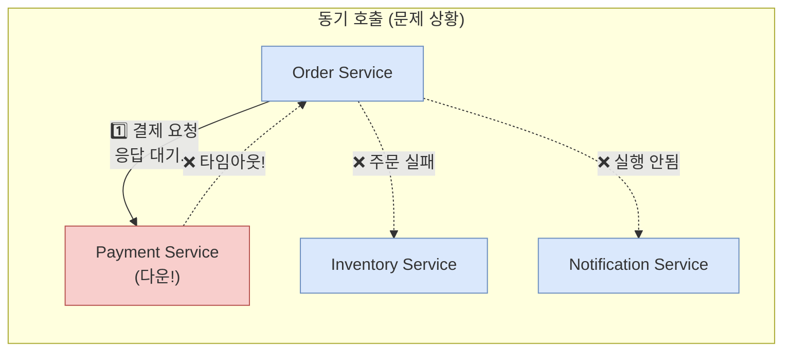
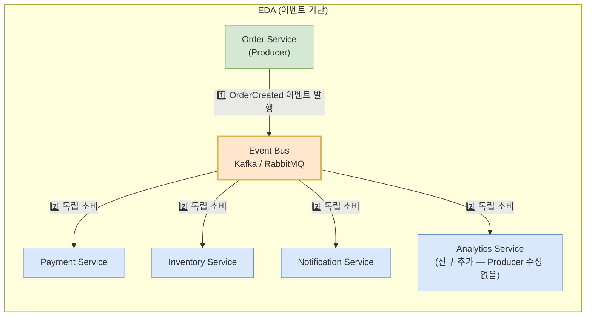
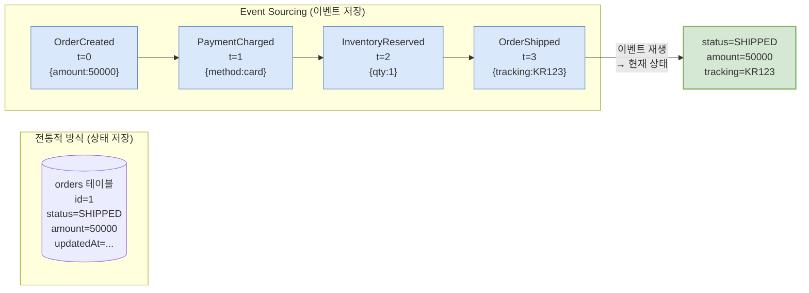
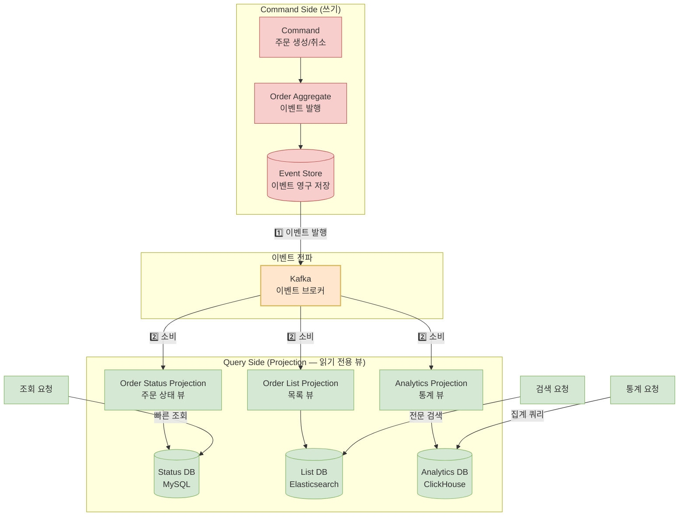

> **한 줄 요약**: 이벤트 기반 아키텍처(EDA)는 서비스들이 이벤트를 통해 간접 소통하여 결합도를 낮추고, 장애 전파를 차단하며, 시스템 확장성을 극대화하는 아키텍처 패턴이다.

## 비유로 시작하기

전통적인 시스템에서 서비스들은 서로를 직접 호출합니다. Order Service가 Payment, Inventory, Notification을 직접 호출하면, 하나라도 다운되면 주문 자체가 실패합니다.

**라디오 방송국 비유**: 방송국(Event Producer)이 뉴스(이벤트)를 송출하면, 각 가정(Event Consumer)이 독립적으로 라디오를 켜서 듣습니다. 방송국은 누가 듣는지 모르고, 청취자가 늘어도 방송국은 변경이 없습니다. 청취자가 라디오를 꺼도(서비스 다운) 방송국은 계속 방송합니다.

---

## 왜 EDA가 필요한가?

### 동기 호출 방식의 문제



```
동기 호출의 문제:
1. 결합도: Order가 Payment, Inventory, Notification 모두 알아야 함
2. 장애 전파: Payment 다운 → 주문 전체 실패
3. 확장성: Consumer 추가 시 Producer 수정 필요
4. 응답 대기: 모든 서비스 응답을 기다려야 함
```

### EDA로 해결



```
EDA의 이점:
1. 느슨한 결합: Producer는 Consumer를 모름
2. 장애 격리: Consumer 다운 → 이벤트 브로커에 보관 → 복구 후 처리
3. 유연한 확장: 새 Consumer 추가 시 Producer 수정 없음
4. 비동기 처리: 이벤트 발행 후 즉시 응답 반환
```

---

## 이벤트 설계

### 이벤트 명명 규칙

```
도메인 + 과거형 동사 (일어난 사실 표현)
✓ OrderCreated     (주문이 생성되었다)
✓ PaymentCompleted (결제가 완료되었다)
✓ InventoryReserved (재고가 예약되었다)
✗ CreateOrder      (명령형 금지 - 이벤트는 사실, 명령이 아님)
✗ DoPayment        (명령형 금지)

이벤트 = 불변의 사실 (과거에 일어난 일)
명령 = 의도 (미래에 할 일) → Command 패턴
```

### 이벤트 구조 설계

```java
// 이벤트는 불변 객체로 설계 - record 사용 (Java 16+)
public record OrderCreatedEvent(
    String eventId,           // 이벤트 고유 ID (멱등성 처리용)
    String eventType,         // "order.created" (라우팅 및 필터링)
    Instant occurredAt,       // 발생 시각 (과거 사실임을 명시)
    Long orderId,             // 집합체 ID
    Long userId,
    Long productId,
    int quantity,
    BigDecimal amount,
    String status             // 이벤트 발생 시점의 상태 스냅샷
) {
    // 도메인 객체에서 이벤트 생성
    public static OrderCreatedEvent from(Order order) {
        return new OrderCreatedEvent(
            UUID.randomUUID().toString(),
            "order.created",
            Instant.now(),
            order.getId(),
            order.getUserId(),
            order.getProductId(),
            order.getQuantity(),
            order.getAmount(),
            order.getStatus().name()
        );
    }
}
```

### 이벤트 버전 관리

```java
// v1 - 초기 버전
public record OrderCreatedEventV1(
    String eventId, Long orderId, Long userId, BigDecimal amount
) {}

// v2 - 하위 호환성 유지하며 필드 추가
// 기존 Consumer는 모르는 필드 무시 (관대한 파싱 원칙)
public record OrderCreatedEventV2(
    String eventId, Long orderId, Long userId, BigDecimal amount,
    String currency,    // 신규 필드 - 기존 Consumer는 무시
    String region       // 신규 필드
) {}

// 절대 하면 안 되는 것:
// - 기존 필드 제거 (Consumer가 NPE로 실패)
// - 기존 필드 타입 변경 (역직렬화 실패)
// - 필드 의미 변경 (Consumer 로직 오작동)
```

---

## Event Sourcing

### 개념: 상태 대신 이벤트를 저장



```
전통적 방식의 한계:
  orders 테이블: status=SHIPPED, amount=50000
  → 현재 상태만 보임. 어떻게 이 상태가 됐는지 알 수 없음
  → 이력 추적, 감사 로그가 별도 필요

Event Sourcing의 이점:
  → 전체 이력이 영구 보존
  → 현재 상태 = 이벤트 순서대로 재생한 결과
  → 특정 시점 상태 복원 가능 (Time Travel)
  → 버그 재현, 감사 로그 자동 생성
```

### 구현

```java
// Aggregate: 이벤트를 적용해 상태를 재구성
public class Order {
    private Long id;
    private OrderStatus status;
    private BigDecimal amount;
    private String trackingNo;

    // 아직 저장되지 않은 새 이벤트 목록
    private final List<DomainEvent> uncommittedEvents = new ArrayList<>();

    // 생성자 대신 팩토리 메서드 (이벤트 발행)
    public static Order create(CreateOrderCommand cmd) {
        Order order = new Order();
        order.apply(new OrderCreatedEvent(cmd));  // 이벤트로 상태 변경
        return order;
    }

    public void charge(BigDecimal amount) {
        if (status != OrderStatus.PENDING) {
            throw new IllegalStateException("결제 불가 상태: " + status);
        }
        apply(new PaymentChargedEvent(this.id, amount));
    }

    public void ship(String trackingNo) {
        apply(new OrderShippedEvent(this.id, trackingNo));
    }

    // 이벤트 적용 (상태 변경만, 사이드 이펙트 없음)
    private void apply(DomainEvent event) {
        handle(event);                    // 상태 변경
        uncommittedEvents.add(event);     // 저장 대기열에 추가
    }

    // 이벤트 재생 (저장소에서 복원 시) - 사이드 이펙트 없음
    public void replayEvent(DomainEvent event) {
        handle(event);
    }

    // 이벤트 타입별 상태 변경 로직
    private void handle(DomainEvent event) {
        switch (event) {
            case OrderCreatedEvent e -> {
                this.id = e.orderId();
                this.status = OrderStatus.PENDING;
                this.amount = e.amount();
            }
            case PaymentChargedEvent e -> {
                this.status = OrderStatus.PAID;
            }
            case OrderShippedEvent e -> {
                this.status = OrderStatus.SHIPPED;
                this.trackingNo = e.trackingNo();
            }
            default -> {}
        }
    }
}

// Event Store Repository
@Repository
public class OrderEventStoreRepository {
    private final EventStore eventStore;

    public void save(Order order) {
        List<DomainEvent> events = order.getUncommittedEvents();
        eventStore.append("order-" + order.getId(), events);
    }

    public Order findById(Long orderId) {
        List<DomainEvent> events = eventStore.load("order-" + orderId);
        if (events.isEmpty()) throw new OrderNotFoundException(orderId);

        Order order = new Order();
        events.forEach(order::replayEvent);  // 이벤트 순서대로 재생
        return order;
    }
}
```

### 스냅샷 (성능 최적화)

이벤트가 많아지면 재생 시간이 길어집니다. 주기적으로 스냅샷을 저장해 성능을 최적화합니다.

```java
// 1000개 이벤트마다 스냅샷 저장
public Order findById(Long orderId) {
    // 1. 가장 최근 스냅샷 로드
    Optional<OrderSnapshot> snapshot = snapshotRepository.findLatest(orderId);

    Order order;
    long startVersion;

    if (snapshot.isPresent()) {
        order = snapshot.get().toOrder();        // 스냅샷에서 복원
        startVersion = snapshot.get().getVersion();
    } else {
        order = new Order();
        startVersion = 0;
    }

    // 2. 스냅샷 이후 이벤트만 재생 (전체 재생보다 훨씬 빠름)
    List<DomainEvent> events = eventStore.load("order-" + orderId, startVersion);
    events.forEach(order::replayEvent);

    // 3. 1000개 이상 이벤트 쌓이면 새 스냅샷 저장
    if (events.size() > 1000) {
        snapshotRepository.save(OrderSnapshot.from(order));
    }

    return order;
}
```

---

## CQRS + Event Sourcing 결합

Event Sourcing은 CQRS와 함께 쓸 때 강력합니다.



---

## Eventual Consistency (최종 일관성)

EDA에서는 강한 일관성(Strong Consistency) 대신 최종 일관성을 수용합니다.

```
강한 일관성 (Strong Consistency):
  주문 생성 → 즉시 모든 시스템 반영
  → 분산 환경에서 달성 어려움 (2PC, 분산 락 필요)
  → 성능 저하, 가용성 감소 (CAP 정리 - CP 선택)

최종 일관성 (Eventual Consistency):
  주문 생성 → 이벤트 발행 → 각 서비스가 비동기 처리
  → 잠시 후 모든 시스템 일관된 상태로 수렴
  → 그 사이의 불일치는 허용 (AP 선택)
  → 성능 우수, 높은 가용성
```

```java
// 사용자 경험: 최종 일관성 숨기기
@RestController
public class OrderController {

    @PostMapping("/orders")
    public ResponseEntity<OrderResponse> createOrder(@RequestBody OrderRequest request) {
        Order order = orderService.create(request);  // 이벤트 발행

        // 즉시 반환 (Payment, Inventory 처리 완료 전)
        // "처리 중" 상태 표시로 UX 처리
        return ResponseEntity.accepted()
            .body(OrderResponse.builder()
                .orderId(order.getId())
                .status("PROCESSING")             // 처리 중 상태
                .message("주문이 접수되었습니다.")
                .pollUrl("/orders/" + order.getId() + "/status")  // 폴링 URL 제공
                .build());
    }

    @GetMapping("/orders/{orderId}/status")
    public OrderStatusResponse getStatus(@PathVariable Long orderId) {
        // 폴링 또는 SSE(Server-Sent Events)로 최종 상태 전달
        return orderQueryService.getStatus(orderId);
    }
}
```

---

## 이벤트 스토어 구현

### DB 기반 이벤트 스토어

```sql
CREATE TABLE event_store (
    id          BIGINT AUTO_INCREMENT PRIMARY KEY,
    stream_id   VARCHAR(255) NOT NULL,    -- "order-123" (Aggregate 식별)
    event_type  VARCHAR(255) NOT NULL,    -- "OrderCreated"
    version     BIGINT NOT NULL,          -- 스트림 내 순서
    payload     JSON NOT NULL,            -- 이벤트 데이터
    metadata    JSON,                     -- traceId, userId 등 기술적 메타데이터
    occurred_at TIMESTAMP(6) NOT NULL,
    UNIQUE KEY uq_stream_version (stream_id, version)  -- 낙관적 잠금 지원
);
```

```java
@Repository
public class JdbcEventStore {
    private final JdbcTemplate jdbc;
    private final ObjectMapper objectMapper;

    public void append(String streamId, List<DomainEvent> events) {
        // 낙관적 잠금: UNIQUE KEY로 동시 쓰기 충돌 방지
        long currentVersion = getCurrentVersion(streamId);

        for (int i = 0; i < events.size(); i++) {
            DomainEvent event = events.get(i);
            try {
                jdbc.update(
                    "INSERT INTO event_store (stream_id, event_type, version, payload, occurred_at) VALUES (?, ?, ?, ?, ?)",
                    streamId,
                    event.getClass().getSimpleName(),
                    currentVersion + i + 1,
                    objectMapper.writeValueAsString(event),
                    Instant.now()
                );
            } catch (DuplicateKeyException e) {
                // 동시 수정 감지 → 재시도 또는 실패 처리
                throw new OptimisticLockException("동시 수정 충돌: " + streamId);
            }
        }
    }

    public List<DomainEvent> load(String streamId, long fromVersion) {
        return jdbc.query(
            "SELECT event_type, payload FROM event_store WHERE stream_id = ? AND version > ? ORDER BY version",
            (rs, row) -> deserialize(rs.getString("event_type"), rs.getString("payload")),
            streamId, fromVersion
        );
    }
}
```

---

## 트래픽 시나리오별 분석

### 트래픽 적을 때 (100 TPS)

```
EDA 도입 여부 판단:
- 서비스가 2~3개 → 동기 호출로 충분히 단순하게 처리 가능
- EDA 도입 시 오버헤드: Kafka 운영, 최종 일관성 처리 등 복잡도 증가
- 권장: 동기 REST API + 단순 이벤트(Spring ApplicationEvent)로 시작

단, 도메인 이벤트 설계는 처음부터 올바르게:
  order.registerEvent(new OrderPlacedEvent(...));  // Spring ApplicationEvent
  → 나중에 Kafka로 전환 시 코드 변경 최소화
```

### 트래픽 높을 때 (10,000 TPS)

```
EDA의 진가 발휘:

시나리오: 주문 1만 TPS 처리 중 Notification Service 응답 지연
동기 방식: 알림 지연 → 주문 전체 응답 지연 → UX 악화
EDA 방식: 주문은 이벤트 발행 후 즉시 응답, 알림은 비동기 처리

처리량 계산:
  Kafka 토픽 파티션 10개, Consumer Group 10인스턴스
  각 Consumer 처리 능력: 1,000 TPS
  전체 처리량: 10,000 TPS (선형 확장)

Consumer 추가만으로 처리량 2배:
  파티션 20개, Consumer 20인스턴스 → 20,000 TPS
```

### 극한 시나리오 (100,000+ TPS)

```
이커머스 타임딜: 오후 8시 정각 100만 사용자 동시 주문 시도

문제: Order Service가 결제/재고/알림을 동기 호출
→ 100만 동시 HTTP 연결 → 연결 풀 고갈 → 전체 서비스 다운

EDA 해결:
1. Order 생성만 동기 처리 (Kafka 발행 포함 < 5ms)
2. 결제/재고/알림은 모두 이벤트로 비동기
3. Kafka 파티션 100개 → Consumer 100인스턴스 → 100,000 TPS

추가 고려:
- Event Store로 모든 주문 이벤트 저장 → 100만건 이력 보존
- Snapshot으로 재생 성능 보장
- Dead Letter Queue로 실패 이벤트 재처리
```

---

<details class="extreme-scenario-details">
<summary class="extreme-scenario-summary">
<span class="extreme-scenario-icon">🔥</span>
<span class="extreme-scenario-label">극한 시나리오 — 클릭하여 펼치기</span>
<span class="extreme-scenario-toggle"></span>
</summary>
<div class="extreme-scenario-body">

<div class="extreme-scenario-content" markdown="1">

### 시나리오 1: 이벤트 유실 방지

```
문제: Kafka 메시지 유실 → Consumer가 이벤트를 받지 못함

방어 전략:

1. Transactional Outbox Pattern:
   DB 트랜잭션과 이벤트 저장을 원자적으로 처리
   → Outbox 테이블에 이벤트 저장 (DB 트랜잭션 내)
   → CDC(Change Data Capture) 또는 Polling이 Kafka로 전달
   → DB 커밋 = 이벤트 저장 보장 (유실 불가)

2. Kafka 설정:
   acks=all: 모든 ISR 복제본에 저장 후 ack
   min.insync.replicas=2: 최소 2개 브로커 동기화
   enable.auto.commit=false: 수동 오프셋 커밋

3. Dead Letter Queue (DLQ):
   처리 실패 이벤트를 DLQ 토픽으로 이동
   → 운영자가 수동 재처리 또는 자동 재시도
```

### 시나리오 2: 중복 처리 방지 (멱등성)

```java
// 멱등성 Consumer: 같은 이벤트를 여러 번 처리해도 결과 동일
@KafkaListener(topics = "order.created")
public void onOrderCreated(OrderCreatedEvent event) {
    // 이미 처리한 이벤트인지 확인 (eventId로 중복 체크)
    if (processedEventRepository.exists(event.eventId())) {
        log.info("중복 이벤트 무시: {}", event.eventId());
        return;  // 멱등성 보장
    }

    // 처리 + 처리 완료 기록을 하나의 트랜잭션으로 묶음
    transactionTemplate.execute(status -> {
        paymentService.initiate(event);
        processedEventRepository.save(event.eventId());  // 처리 완료 기록
        return null;
    });
}
```

### 시나리오 3: 이벤트 순서 보장

```
문제: Kafka 파티션이 여러 개면 이벤트 순서가 뒤바뀔 수 있음

OrderCreated(v1) → OrderShipped(v2) 순서가
OrderShipped → OrderCreated 로 뒤집힐 수 있음

해결:
1. 같은 Aggregate의 이벤트는 같은 파티션으로
   → 파티션 키 = orderId (같은 주문 이벤트 = 같은 파티션)
```

```java
// 파티션 키로 orderId 사용 → 같은 주문 이벤트는 순서 보장
kafkaTemplate.send(
    new ProducerRecord<>("order-events",
        orderId.toString(),  // 파티션 키
        event
    )
);
```

```
2. 이벤트에 version(sequence number) 포함
   → Consumer가 version 검증 후 처리
   → 이전 version 이벤트가 오면 대기 후 재처리

3. Consumer에서 낙관적 잠금 적용
   → version 불일치 시 재처리 큐에 넣음
```

### 시나리오 4: GDPR - 개인정보 포함 이벤트 처리

```
문제: 이메일 포함 이벤트를 GDPR로 삭제해야 함
      이벤트는 불변이므로 삭제 불가

해결책 1 - Crypto-shredding:
  사용자별 암호화 키 관리
  → GDPR 요청 시 키만 삭제
  → 이벤트 데이터는 복호화 불가 (사실상 삭제 효과)

해결책 2 - 포인터 방식:
  이벤트: userId만 포함 (개인정보 없음)
  실제 개인정보: User Service에서 별도 관리
  → GDPR 요청: User Service에서만 삭제

해결책 3 - 보상 이벤트:
  UserDataDeletedEvent 발행
  → Projection에서 개인정보 필드 null 처리
```

---
</div>
</div>
</details>

## 실무에서 자주 하는 실수

#### 실수 1: 이벤트에 너무 많은 데이터 포함

```java
// 나쁜 예 - 이벤트에 모든 정보 포함
public record OrderCreatedEvent(
    Long orderId,
    String userEmail,    // 개인정보 포함 → GDPR 문제
    String userAddress,  // 개인정보 포함
    List<ProductDto> products,  // 상품 상세 전체 → 이벤트 비대화
    // ... 100개 필드
) {}

// 좋은 예 - 최소 정보 + 필요시 조회
public record OrderCreatedEvent(
    Long orderId,
    Long userId,         // ID만 포함, 상세는 User Service에서 조회
    Long cartId,         // ID만 포함
    BigDecimal amount,   // 비즈니스 핵심 정보만
    Instant occurredAt
) {}
```

#### 실수 2: 이벤트 Consumer에서 동기 API 호출

```java
// 나쁜 예 - Consumer 내에서 다른 서비스 동기 호출
@KafkaListener(topics = "order.created")
public void onOrderCreated(OrderCreatedEvent event) {
    // Consumer 내에서 HTTP 호출 → 실패 시 이벤트 처리 실패 → 재소비 폭발
    UserDto user = userServiceClient.getUser(event.getUserId());
    ProductDto product = productServiceClient.getProduct(event.getProductId());
    // ...
}

// 좋은 예 - 이벤트에 필요한 스냅샷 포함 또는 로컬 캐시 사용
@KafkaListener(topics = "order.created")
public void onOrderCreated(OrderCreatedEvent event) {
    // 이미 이벤트에 필요한 정보가 있음 (스냅샷)
    paymentService.initiate(event.orderId(), event.amount());
}
```

#### 실수 3: Exactly-Once 을 기본 전제로 설계

```
EDA에서 Exactly-Once는 달성 어렵고 비용이 큼
현실적 전략: At-Least-Once (최소 1회 전달) + 멱등성(Idempotency)

Consumer를 멱등하게 설계 = 중복 수신해도 결과 동일
→ eventId로 중복 처리 여부 확인
→ DB Unique 제약으로 중복 저장 방지
```

---

## EDA vs 요청/응답 비교

| 항목 | 요청/응답 (REST/gRPC) | 이벤트 기반 (EDA) |
|---|---|---|
| 결합도 | 강함 (직접 호출) | 약함 (이벤트 브로커 통해) |
| 응답 방식 | 동기 (즉시 응답) | 비동기 (최종 일관성) |
| 확장성 | 수신자 수에 비례해 복잡 | 파티션/Consumer 추가로 선형 확장 |
| 장애 전파 | 수신자 장애 → 발신자 영향 | 수신자 장애 → 이벤트 보관 |
| 디버깅 | 단순 (콜 스택 추적) | 복잡 (분산 추적 도구 필요) |
| 데이터 일관성 | 강한 일관성 가능 | 최종 일관성 |
| 적합한 경우 | 실시간 응답 필요 (로그인, 결제 확인) | 대용량, 느슨한 결합, 이력 보존 필요 |

---

## 면접 포인트

#### Q. Event Sourcing과 일반 이벤트 발행의 차이는?

```
일반 이벤트 발행 (EDA):
  DB에 현재 상태 저장 + Kafka로 이벤트 발행 (알림용)
  → 이벤트는 부가적, 상태가 주 저장소

Event Sourcing:
  이벤트가 주 저장소 (상태 테이블 없음)
  → 현재 상태 = 이벤트 재생 결과
  → 전체 이력 자동 보존, Time Travel 가능
  → 복잡도 높음, 스냅샷 전략 필요
```

#### Q. 최종 일관성을 어떻게 사용자에게 투명하게 처리하는가?

```
1. 낙관적 UI: 주문 완료 화면 바로 표시 (실제 처리 전)
   → 실패 시 후속 알림 (이메일/Push)

2. 폴링(Polling): 처리 중 상태 → 주기적으로 상태 확인 API 호출

3. SSE/WebSocket: 서버가 처리 완료 시 클라이언트에 Push

4. 사가(Saga): 분산 트랜잭션 → 실패 시 보상 트랜잭션으로 롤백
```

#### Q. 멱등성을 어떻게 구현하는가?

```
1. eventId 기반 중복 체크
   → processed_events 테이블에 eventId 저장
   → 중복 수신 시 이미 있으면 스킵

2. 자연 멱등성 설계
   → INSERT INTO ... ON DUPLICATE KEY IGNORE
   → 결과가 이미 존재하면 덮어쓰지 않음

3. 버전 기반 낙관적 잠금
   → expectedVersion 불일치 시 중복으로 판단
```

---

## 핵심 포인트 정리

```
1. EDA 핵심: Producer는 Consumer를 모른다
   → 새 Consumer 추가 = Producer 수정 없음
   → Consumer 다운 = 이벤트 브로커에 보관 (장애 격리)

2. 이벤트 설계 원칙
   → 과거형 동사: OrderCreated, PaymentCompleted
   → 불변 객체: record 사용
   → 최소 정보 + eventId 포함
   → 하위 호환성 유지 (필드 추가 OK, 제거/변경 금지)

3. Event Sourcing = 이벤트가 주 저장소
   → 상태 대신 이벤트 저장
   → 현재 상태 = 이벤트 재생
   → 스냅샷으로 재생 성능 최적화

4. 최종 일관성 수용 + 멱등성 필수
   → At-Least-Once 전달 전제
   → eventId로 중복 처리 방지

5. 트러블슈팅 필수 도구
   → 분산 추적 (Zipkin/Jaeger): TraceId 전파
   → 중앙 로그 (ELK): 이벤트 흐름 추적
   → DLQ: 실패 이벤트 별도 관리
```
