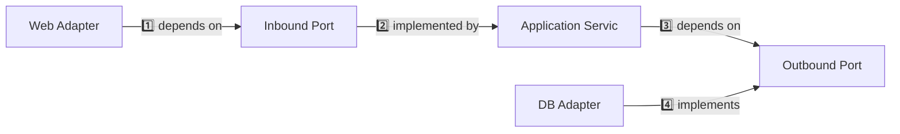
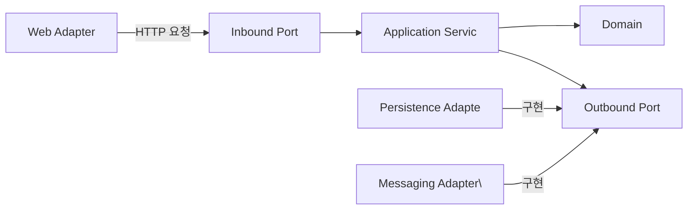

> **한 줄 요약**: 헥사고날 아키텍처는 비즈니스 로직을 외부 기술(DB, HTTP, 메시지 큐)로부터 완전히 격리하여, 기술 교체와 테스트를 쉽게 만드는 구조다.

## 비유로 시작하기

스마트폰을 생각해보세요. 스마트폰에는 USB-C, 이어폰 잭, Wi-Fi, Bluetooth 등 다양한 **포트(Port)**가 있습니다. 어떤 이어폰이든, 어떤 충전기든 규격만 맞으면 연결됩니다. 스마트폰 내부 회로(비즈니스 로직)는 외부 기기가 무엇인지 신경 쓰지 않습니다.

헥사고날 아키텍처는 정확히 이 개념입니다. **비즈니스 로직(Application Core)이 외부 세계(DB, HTTP, 메시지 큐)와 포트와 어댑터를 통해 연결**되며, 코어는 외부 기술에 전혀 의존하지 않습니다.

Alistair Cockburn이 2005년 제안했으며, "Ports and Adapters Architecture"라고도 불립니다.

---

## 왜 헥사고날 아키텍처가 필요한가?

### 전통적 레이어드 아키텍처의 문제

```
레이어드 아키텍처에서 흔히 발생하는 문제:

1. DB 교체가 불가능에 가까움
   Service → JpaRepository (직접 의존)
   → JPA를 MongoDB로 바꾸려면 Service 코드 전체 수정

2. 단위 테스트 시 DB 필요
   OrderService 테스트 → 실제 DB 필요 (느린 통합 테스트)
   → 테스트 실행에 수분 소요, CI/CD 병목

3. 외부 API 변경 시 비즈니스 로직 수정
   결제 로직 안에 Stripe SDK 직접 호출
   → 토스페이먼츠로 교체 시 비즈니스 로직까지 변경
```

### 헥사고날이 해결하는 방법

```
핵심 원칙: "비즈니스 로직은 외부 세계를 모른다"

Port(인터페이스)로 경계를 만들고,
Adapter(구현체)가 기술을 다룬다.
비즈니스 로직은 Port만 바라본다.

→ JPA → MongoDB 교체: Adapter만 새로 작성
→ 단위 테스트: Port를 Mock으로 대체 (DB 불필요)
→ 결제사 교체: PaymentGateway(Port) 구현체만 교체
```

---

## 핵심 구조

HTTP/CLI/Test →(Inbound Port/Adapt)→ Application Servic, Application Servic →(Outbound Port/Adap)→ DB/MQ/API

---

## Port와 Adapter 상세

### Port (포트) — 인터페이스

포트는 **인터페이스**입니다. "무엇을 할 수 있는가"만 정의하고, "어떻게 하는가"는 모릅니다.

| 종류 | 방향 | 역할 | 예시 |
|------|------|------|------|
| Inbound Port (Driving) | 외부 → Core | 외부가 애플리케이션을 호출하는 계약 | `PlaceOrderUseCase` |
| Outbound Port (Driven) | Core → 외부 | 애플리케이션이 외부를 호출하는 계약 | `OrderRepository`, `EventPublisher` |

### Adapter (어댑터) — 구현체

어댑터는 **포트의 구현체**입니다. 포트(인터페이스)를 실제 기술로 연결합니다.

| 종류 | 예시 |
|------|------|
| Inbound Adapter | `@RestController`, `@KafkaListener`, `@Scheduled`, `@GrpcService` |
| Outbound Adapter | `JpaOrderRepository`, `KafkaEventPublisher`, `StripePaymentAdapter` |

---

## 의존성 방향

헥사고날 아키텍처의 핵심 규칙:

> **모든 의존성은 Application Core를 향해야 한다**



`Application Service`는 `JpaRepository`를 직접 알지 않습니다. `OrderRepository` 인터페이스(Outbound Port)만 압니다. JPA는 언제든 교체 가능합니다.

---

## Spring에서의 구현

### 패키지 구조

```
com.example.order
├── adapter
│   ├── in
│   │   └── web
│   │       ├── OrderController.java         (Inbound Adapter)
│   │       └── OrderRequest.java            (Web DTO)
│   └── out
│       ├── persistence
│       │   ├── OrderPersistenceAdapter.java (Outbound Adapter)
│       │   ├── OrderJpaRepository.java      (Spring Data JPA)
│       │   └── OrderEntity.java             (JPA Entity)
│       └── messaging
│           └── OrderEventPublisher.java     (Outbound Adapter)
├── application
│   ├── port
│   │   ├── in
│   │   │   └── PlaceOrderUseCase.java       (Inbound Port)
│   │   └── out
│   │       ├── OrderRepository.java         (Outbound Port)
│   │       └── EventPublisher.java          (Outbound Port)
│   └── service
│       └── OrderService.java               (Application Service)
└── domain
    ├── Order.java                           (Aggregate Root)
    ├── OrderItem.java                       (Entity)
    └── Money.java                           (Value Object)
```

### 1단계: Inbound Port (UseCase 인터페이스)

```java
// application/port/in/PlaceOrderUseCase.java
// "주문을 접수할 수 있다" - 외부에게 제공하는 기능 계약
public interface PlaceOrderUseCase {
    OrderId placeOrder(PlaceOrderCommand command);
}

// Command: Inbound Port의 입력 모델 (HTTP DTO와 분리)
// 자체 검증 로직 포함 - 항상 유효한 상태로 Application Service에 전달
public record PlaceOrderCommand(
    CustomerId customerId,
    List<OrderItemCommand> items
) {
    public PlaceOrderCommand {
        Objects.requireNonNull(customerId, "고객 ID는 필수입니다");
        if (items == null || items.isEmpty()) {
            throw new IllegalArgumentException("주문 항목은 최소 1개 이상이어야 합니다");
        }
    }
}
```

### 2단계: Application Service (UseCase 구현)

```java
// application/service/OrderService.java
// Application Core - 비즈니스 로직의 중심
// JPA, Kafka, HTTP 등 기술 의존성 없음 - 인터페이스만 사용
@Service
@RequiredArgsConstructor
@Transactional
public class OrderService implements PlaceOrderUseCase {

    private final OrderRepository orderRepository;     // Outbound Port (인터페이스)
    private final EventPublisher eventPublisher;       // Outbound Port (인터페이스)
    private final ProductRepository productRepository; // Outbound Port (인터페이스)

    @Override
    public OrderId placeOrder(PlaceOrderCommand command) {
        // 1. 도메인 로직: 상품 조회 (어떻게 조회하는지는 모름)
        List<OrderItem> items = command.items().stream()
            .map(item -> {
                Product product = productRepository.findById(item.productId())
                    .orElseThrow(() -> new ProductNotFoundException(item.productId()));
                return new OrderItem(product.getId(), product.getPrice(), item.quantity());
            })
            .toList();

        // 2. 도메인 로직: 주문 생성 (Order Aggregate)
        Order order = Order.create(command.customerId(), items);

        // 3. 영속화 (DB가 무엇인지 모름 - Outbound Port 호출)
        OrderId savedId = orderRepository.save(order);

        // 4. 이벤트 발행 (Kafka인지 RabbitMQ인지 모름 - Outbound Port 호출)
        eventPublisher.publish(new OrderPlacedEvent(savedId, command.customerId()));

        return savedId;
    }
}
```

### 3단계: Inbound Adapter (Web Controller)

```java
// adapter/in/web/OrderController.java
// HTTP 요청을 Application Core로 전달하는 어댑터
@RestController
@RequestMapping("/api/orders")
@RequiredArgsConstructor
public class OrderController {

    // 중요: OrderService가 아닌 PlaceOrderUseCase(인터페이스)를 주입
    // OrderService 구현체가 바뀌어도 Controller는 변경 없음
    private final PlaceOrderUseCase placeOrderUseCase;

    @PostMapping
    public ResponseEntity<OrderResponse> placeOrder(
            @RequestBody @Valid OrderRequest request) {
        // HTTP DTO → Command 변환 (Adapter 책임)
        PlaceOrderCommand command = OrderRequestMapper.toCommand(request);
        OrderId orderId = placeOrderUseCase.placeOrder(command);
        return ResponseEntity.ok(new OrderResponse(orderId.getValue()));
    }
}
```

### 4단계: Outbound Adapter (Persistence)

```java
// adapter/out/persistence/OrderPersistenceAdapter.java
// OrderRepository(Port)를 JPA로 구현한 어댑터
@Component
@RequiredArgsConstructor
public class OrderPersistenceAdapter implements OrderRepository {

    private final OrderJpaRepository jpaRepository; // Spring Data JPA
    private final OrderMapper mapper;

    @Override
    public OrderId save(Order order) {
        // Domain Entity → JPA Entity 변환 후 저장
        OrderEntity entity = mapper.toEntity(order);
        OrderEntity saved = jpaRepository.save(entity);
        return new OrderId(saved.getId());
    }

    @Override
    public Optional<Order> findById(OrderId id) {
        return jpaRepository.findById(id.getValue())
            .map(mapper::toDomain);  // JPA Entity → Domain Entity 변환
    }
}
```

---

## 테스트 전략

헥사고날 아키텍처의 가장 큰 이점 중 하나는 **테스트 용이성**입니다.

통합 테스트 →(20%)→ E2E 테스트

```java
// Application Service 단위 테스트 — DB, Kafka 불필요
// Port를 Mock으로 대체하여 순수 비즈니스 로직만 테스트
class OrderServiceTest {

    // Outbound Port를 Mock으로 대체 (JPA, Kafka 코드 실행 없음)
    private OrderRepository orderRepository = mock(OrderRepository.class);
    private EventPublisher eventPublisher = mock(EventPublisher.class);
    private ProductRepository productRepository = mock(ProductRepository.class);

    // new 로 직접 생성 - Spring Context 불필요 (테스트 속도 10배 빠름)
    private OrderService orderService = new OrderService(
        orderRepository, eventPublisher, productRepository
    );

    @Test
    void 주문_생성_성공() {
        // given: 상품이 존재하고 저장이 성공한다고 가정
        given(productRepository.findById(any()))
            .willReturn(Optional.of(new Product(ProductId.of(1L), Money.of(10000))));
        given(orderRepository.save(any()))
            .willReturn(OrderId.of(100L));

        PlaceOrderCommand command = new PlaceOrderCommand(
            CustomerId.of(1L),
            List.of(new OrderItemCommand(ProductId.of(1L), 2))
        );

        // when
        OrderId result = orderService.placeOrder(command);

        // then: 결과 검증 + 이벤트 발행 검증
        assertThat(result.getValue()).isEqualTo(100L);
        verify(eventPublisher).publish(any(OrderPlacedEvent.class));
    }

    @Test
    void 존재하지_않는_상품_주문_시_예외() {
        // given: 상품이 없음
        given(productRepository.findById(any())).willReturn(Optional.empty());

        PlaceOrderCommand command = new PlaceOrderCommand(
            CustomerId.of(1L),
            List.of(new OrderItemCommand(ProductId.of(999L), 1))
        );

        // when & then: 예외 발생 검증
        assertThatThrownBy(() -> orderService.placeOrder(command))
            .isInstanceOf(ProductNotFoundException.class);

        // 상품이 없으면 저장, 이벤트 발행 없어야 함
        verifyNoInteractions(orderRepository, eventPublisher);
    }
}
```

---

## DDD와의 관계



- DDD의 **Domain Layer**가 헥사고날의 **Application Core** 내부에 위치
- DDD의 **Repository Interface**가 헥사고날의 **Outbound Port**
- DDD의 **Application Service**가 헥사고날의 **UseCase 구현체**

두 개념은 완벽하게 보완 관계입니다.

---

## 트래픽 시나리오별 분석

### 트래픽 적을 때 (100 TPS)

```
헥사고날 아키텍처 도입 여부 판단:
- 팀 5인 이하, 단순 CRUD 위주 → 레이어드 아키텍처 충분
- 도메인 복잡, 장기 프로젝트 → 헥사고날 투자 가치 있음

초기 비용: 인터페이스 + 어댑터 코드 추가 (약 30% 코드 증가)
장기 이익: DB 교체, 외부 API 변경 시 비용 대폭 절감
```

### 트래픽 높을 때 (10,000 TPS)

```
이 시점에서 헥사고날의 이점이 극대화:

시나리오: MySQL → Cassandra 전환 (쓰기 성능 개선 필요)
레이어드: Service 코드 전반 수정, 쿼리 재작성, 2~4주 작업
헥사고날: OrderPersistenceAdapter 교체만으로 완료, 1~2일 작업

시나리오: 특정 조회 경로만 Redis 캐싱 추가
레이어드: Service 로직에 캐싱 코드 침투
헥사고날: CachedOrderRepository(Outbound Adapter) 추가, 기존 코드 변경 없음
```

### 극한 시나리오 (100,000+ TPS)

```
이 규모에서 필수 전략:

1. ReadModel 분리 (CQRS)
   → 별도 QueryUseCase 인터페이스 + 전용 Adapter
   → 쓰기 Adapter (JPA) + 읽기 Adapter (Elasticsearch)

2. 다중 Outbound Adapter 전략
   → Primary: MySQL (쓰기)
   → Cache: Redis (읽기)
   → Search: Elasticsearch (검색)
   → 모두 OrderRepository Port 구현체로 구성

3. Saga Orchestrator도 Application Service로
   → Outbound Port로 각 서비스 클라이언트 추상화
   → 보상 트랜잭션도 비즈니스 로직으로 표현
```

---

## 레이어드 아키텍처와 비교

| 항목 | 레이어드 아키텍처 | 헥사고날 아키텍처 |
|------|-----------------|-----------------|
| 의존성 방향 | 위 → 아래 (단방향) | 모두 Core를 향해 (안쪽) |
| DB 교체 용이성 | 어려움 | 쉬움 (Adapter만 교체) |
| 단위 테스트 | DB 없이 하기 어려움 | 쉬움 (Port Mocking) |
| 외부 API 교체 | Service 코드 수정 필요 | Adapter만 교체 |
| 복잡도 | 낮음 | 높음 |
| 소규모 프로젝트 | 적합 | 과도할 수 있음 |
| 대규모/장수 프로젝트 | 유지보수 어려움 | 적합 |
| 코드량 | 적음 | 많음 (인터페이스 + 구현체) |

---

## 실무에서 자주 하는 실수

#### 실수 1: Port를 너무 세분화

```java
// 나쁜 예 - UseCase가 너무 쪼개짐
interface PlaceOrderUseCase { OrderId placeOrder(...); }
interface CancelOrderUseCase { void cancelOrder(...); }
interface UpdateOrderUseCase { void updateOrder(...); }
// → 클래스 파일 폭발, 오히려 관리 어려움

// 좋은 예 - 응집된 UseCase
interface OrderUseCase {
    OrderId placeOrder(PlaceOrderCommand cmd);
    void cancelOrder(CancelOrderCommand cmd);
    OrderDto getOrder(OrderId id);
}
```

#### 실수 2: Adapter에 비즈니스 로직 포함

```java
// 나쁜 예 - Controller에 비즈니스 로직
@PostMapping("/orders")
public ResponseEntity<?> placeOrder(@RequestBody OrderRequest request) {
    // 비즈니스 로직이 Adapter에 있음 - 헥사고날 위반
    if (request.getAmount() > 1_000_000) {
        throw new BadRequestException("100만원 초과 주문은 전화 확인 필요");
    }
    ...
}

// 좋은 예 - 비즈니스 로직은 Application Service에
@PostMapping("/orders")
public ResponseEntity<?> placeOrder(@RequestBody OrderRequest request) {
    // Adapter는 변환만
    PlaceOrderCommand command = mapper.toCommand(request);
    OrderId id = placeOrderUseCase.placeOrder(command);
    return ResponseEntity.ok(new OrderResponse(id));
}
```

#### 실수 3: Domain Model에서 Outbound Port 직접 호출

```java
// 나쁜 예 - Domain Model이 Repository를 알음
public class Order {
    @Autowired
    private ProductRepository productRepository; // 도메인이 인프라에 의존 - 금지!

    public void addItem(Long productId, int qty) {
        Product p = productRepository.findById(productId); // 도메인에서 DB 호출
    }
}

// 좋은 예 - Application Service에서 조율
public class OrderService implements PlaceOrderUseCase {
    private final ProductRepository productRepository; // Service가 Repository 호출

    public OrderId placeOrder(PlaceOrderCommand cmd) {
        Product product = productRepository.findById(cmd.productId()); // Service 책임
        order.addItem(product, cmd.quantity()); // Domain에는 이미 로딩된 객체 전달
    }
}
```

---

## 면접 포인트

#### Q. 헥사고날 아키텍처에서 Port와 Adapter의 차이는?

```
Port = 인터페이스 (계약). "무엇을"만 정의.
  Inbound Port: 외부가 Core를 호출하는 계약 (UseCase 인터페이스)
  Outbound Port: Core가 외부를 호출하는 계약 (Repository 인터페이스)

Adapter = 구현체. "어떻게"를 정의.
  Inbound Adapter: HTTP/Kafka/CLI 요청을 Port로 변환 (Controller)
  Outbound Adapter: Port를 실제 기술로 구현 (JpaRepository, KafkaPublisher)
```

#### Q. 레이어드 아키텍처와 가장 큰 차이점은?

```
레이어드: Service → Repository (직접 의존)
  → DB 교체 시 Service 수정 필요
  → DB 없이 Service 단위 테스트 불가

헥사고날: Service → Port(인터페이스) ← Adapter(구현체)
  → DB 교체: 새 Adapter만 작성
  → Service 단위 테스트: Port를 Mock으로 대체 (DB 불필요)

핵심: 의존성 역전(DIP) - Service가 Repository를 알지 않고,
      Repository가 Port(인터페이스)를 구현
```

#### Q. 언제 헥사고날 아키텍처를 선택해야 하나?

```
선택 기준:
✓ 외부 시스템(DB, 결제사, 메시지 큐)이 변경될 가능성 있음
✓ 비즈니스 로직이 복잡하고 단위 테스트 커버리지가 중요
✓ 팀이 크고 장기 운영 프로젝트
✓ DDD와 함께 적용할 때

피해야 할 경우:
✗ 간단한 CRUD 앱 (복잡도 대비 이점 없음)
✗ 팀 규모 2~3인 스타트업 MVP
✗ 단기 프로젝트
```

---


## 극한 시나리오

헥사고날 아키텍처에서 Stripe → 토스페이먼츠 교체:

```java
// Outbound Port (변경 없음 - 비즈니스 계약은 그대로)
public interface PaymentGateway {
    PaymentResult charge(PaymentRequest request);
    PaymentResult refund(String transactionId, Money amount);
}

// 기존 Stripe Adapter → 제거
class StripePaymentAdapter implements PaymentGateway {
    // Stripe SDK 코드...
}

// 새 TossPayments Adapter → 추가
class TossPaymentsAdapter implements PaymentGateway {
    private final TossPaymentsClient client;

    @Override
    public PaymentResult charge(PaymentRequest request) {
        // 토스페이먼츠 API 호출 로직
        TossResponse response = client.confirmPayment(
            request.getPaymentKey(), request.getAmount().getValue());
        return PaymentResult.success(response.getTransactionId());
    }
}

// Application Service → 단 한 줄도 변경 없음
class PaymentService {
    private final PaymentGateway paymentGateway; // Port만 앎

    public void processPayment(Order order) {
        PaymentResult result = paymentGateway.charge(
            new PaymentRequest(order.getId(), order.getTotalAmount()));
        // ...
    }
}
```

**Application Service, Domain 코드는 단 한 줄도 바꾸지 않아도 됩니다.**

레이어드 아키텍처였다면? 서비스 레이어 전반에 걸쳐 Stripe SDK 호출 코드가 퍼져 있어 대규모 수정이 필요합니다.

---
## 핵심 포인트 정리

```
1. 목적: 비즈니스 로직을 외부 기술(DB, HTTP, MQ)로부터 완전 격리
   → 기술이 바뀌어도 비즈니스 로직 불변

2. 핵심 규칙: 모든 의존성은 Application Core를 향한다
   → Web Adapter → Inbound Port → Application Service
   → Application Service → Outbound Port ← DB Adapter

3. Port = 인터페이스 (계약), Adapter = 구현체 (기술)
   → Inbound Port: UseCase 인터페이스
   → Outbound Port: Repository, EventPublisher 인터페이스

4. 테스트 이점
   → Application Service: Port를 Mock으로 교체 → DB 없이 단위 테스트
   → Adapter: 실제 DB/Kafka 사용하는 통합 테스트

5. DDD와 찰떡궁합
   → DDD Domain Layer = 헥사고날 Application Core 내부
   → DDD Repository Interface = 헥사고날 Outbound Port
```

---
## 실무에서 자주 하는 실수

**실수 1: Use Case 인터페이스를 도메인마다 1:1로 만들지 않고 Service 클래스에 모든 메서드 집중**
`OrderService`에 `createOrder()`, `cancelOrder()`, `updateDeliveryAddress()`, `getOrderHistory()`를 모두 넣으면 SRP 위반이고, 어떤 Use Case가 어떤 Port를 사용하는지 파악하기 어렵습니다. 헥사고날에서는 `CreateOrderUseCase`, `CancelOrderUseCase`를 각각 인터페이스로 정의하고, Application Service가 이를 구현합니다.

```java
// 잘못된 방식: 거대한 서비스 클래스
public class OrderService {
    public Order createOrder(...) { }
    public void cancelOrder(...) { }
    public void updateAddress(...) { }
    public List<Order> getHistory(...) { }
    // 시간이 지나면 수백 줄짜리 God Class가 됨
}

// 올바른 방식: Use Case별 인터페이스 분리
public interface CreateOrderUseCase {
    Order createOrder(CreateOrderCommand command);
}

public interface CancelOrderUseCase {
    void cancel(OrderId orderId, CancelReason reason);
}

@Service
@RequiredArgsConstructor
public class OrderCommandService implements CreateOrderUseCase, CancelOrderUseCase {
    private final LoadProductPort loadProductPort;      // Outbound Port
    private final SaveOrderPort saveOrderPort;          // Outbound Port

    @Override
    public Order createOrder(CreateOrderCommand command) {
        Product product = loadProductPort.loadProduct(command.getProductId());
        Order order = Order.create(product, command.getQuantity());
        return saveOrderPort.save(order);
    }

    @Override
    public void cancel(OrderId orderId, CancelReason reason) {
        // ...
    }
}
```

**실수 2: Adapter에서 도메인 로직 실행**
JPA Repository Adapter에서 `if (entity.getStatus() == PENDING) entity.setStatus(CANCELLED)`를 처리하면 도메인 규칙이 Adapter에 누출됩니다. Adapter는 오직 변환(Domain ↔ Entity)과 저장/조회만 담당해야 합니다. 상태 전환 로직은 반드시 Domain 객체의 메서드(`order.cancel()`)에 있어야 합니다.

**실수 3: Inbound/Outbound Port 구분 없이 단일 인터페이스 사용**
`OrderRepository`를 Inbound Port로 사용하면 Controller가 Repository를 직접 호출하는 구조가 됩니다. Inbound Port(UseCase)는 외부 → 도메인 방향, Outbound Port(Repository, ExternalService)는 도메인 → 외부 방향으로 방향이 명확히 구분되어야 합니다.

---
## 면접 포인트

**Q1. 헥사고날 아키텍처의 가장 큰 실무 이점은?**
테스트 용이성입니다. Outbound Port가 인터페이스이므로 Mock으로 교체해 DB 없이 도메인 로직 단위 테스트가 가능합니다. 실제 JPA 영속성 없이 `OrderCommandService`의 비즈니스 로직만 빠르게 테스트할 수 있습니다. 또한 PostgreSQL → MongoDB 저장소 교체 시 `JpaOrderRepository` Adapter만 교체하면 되고 Application Service와 Domain은 수정이 없습니다.

**Q2. 헥사고날이 레이어드 아키텍처보다 나은 이유는?**
레이어드에서는 도메인이 Infrastructure(JPA Entity)에 의존하는 경우가 많습니다. `@Entity` 어노테이션이 도메인 클래스에 붙고, JPA 제약(`@Column`, `fetch = LAZY`)이 도메인 설계를 오염시킵니다. 헥사고날은 Domain이 어떤 외부 기술에도 의존하지 않고(순수 Java), Adapter가 Domain을 향해 의존합니다. Domain 테스트에 Spring Context, H2 DB가 필요 없습니다.

**Q3. Port와 Adapter의 개수가 늘어날 때 패키지 구조는?**
```
com.example.order
├── domain/           # 순수 도메인 (의존성 0)
│   ├── Order.java
│   └── OrderId.java
├── application/      # Use Case, Port 인터페이스
│   ├── port/in/      # Inbound (CreateOrderUseCase)
│   ├── port/out/     # Outbound (LoadProductPort, SaveOrderPort)
│   └── service/      # Use Case 구현체
└── adapter/
    ├── in/web/       # REST Controller
    ├── in/messaging/ # Kafka Consumer
    ├── out/persistence/ # JPA Adapter
    └── out/external/ # 외부 API Adapter
```
패키지 구조 자체가 아키텍처를 문서화합니다.

**Q4. 헥사고날과 MSA의 관계는?**
헥사고날은 단일 서비스 내부 구조 패턴이고, MSA는 서비스 간 분리 패턴입니다. 둘은 다른 레벨의 아키텍처입니다. MSA 각 서비스 내부에 헥사고날을 적용하는 것이 이상적입니다. 헥사고날로 설계된 서비스는 외부 의존(DB, 다른 서비스 API)이 Outbound Adapter에 격리되어 있어, 나중에 MSA로 분리할 때 Adapter만 교체하면 됩니다.

**Q5. 헥사고날의 단점과 도입 시 주의사항은?**
보일러플레이트 코드가 많습니다. UseCase 인터페이스, Command/Response DTO, Mapper, Adapter 클래스가 각각 필요해 파일 수가 레이어드 대비 3~4배. 소규모 팀이나 단순 CRUD 서비스에는 오버엔지니어링입니다. 도입 기준: 도메인 로직이 복잡하고(비즈니스 규칙 10개+), 팀 인원이 4명 이상이며, 저장소 기술 교체 가능성이 있을 때. 단순 게시판 API에는 레이어드 아키텍처로 충분합니다.

---

## 왜 이 아키텍처인가

**헥사고날 아키텍처를 선택하는 이유는 비즈니스 로직이 외부 기술(DB, 프레임워크, 메시지 큐)에 오염되지 않게 하기 위해서다.**

| 대안 | 문제점 | 헥사고날의 해결 |
|------|--------|---------------|
| 레이어드 아키텍처 | 상위 레이어가 하위 레이어에 직접 의존 | Port/Adapter로 의존 방향 제어 |
| 스프링 직접 참조 | 도메인 서비스가 @Autowired 등에 의존 | 도메인은 순수 Java, 프레임워크는 Adapter에만 |
| 테스트 어려움 | DB 없이 단위 테스트 불가 | In-memory Adapter로 빠른 테스트 가능 |

DB를 MySQL에서 PostgreSQL로, HTTP를 gRPC로 교체할 때 Adapter만 바꾸면 되고 도메인 로직은 그대로 유지된다. 테스트에서 DB Adapter를 메모리 구현체로 교체하면 빠른 단위 테스트가 가능하다.
