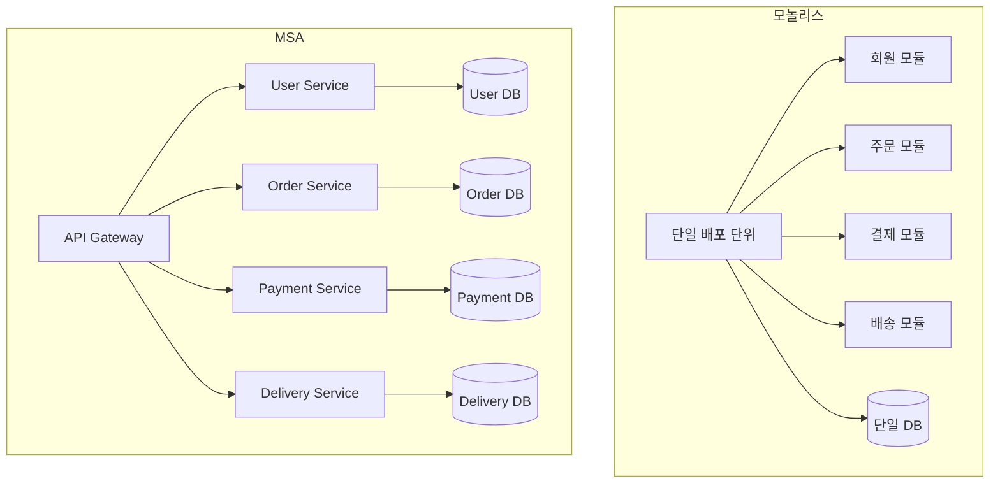
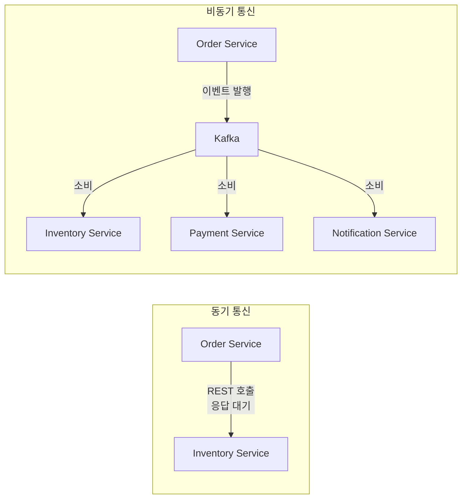
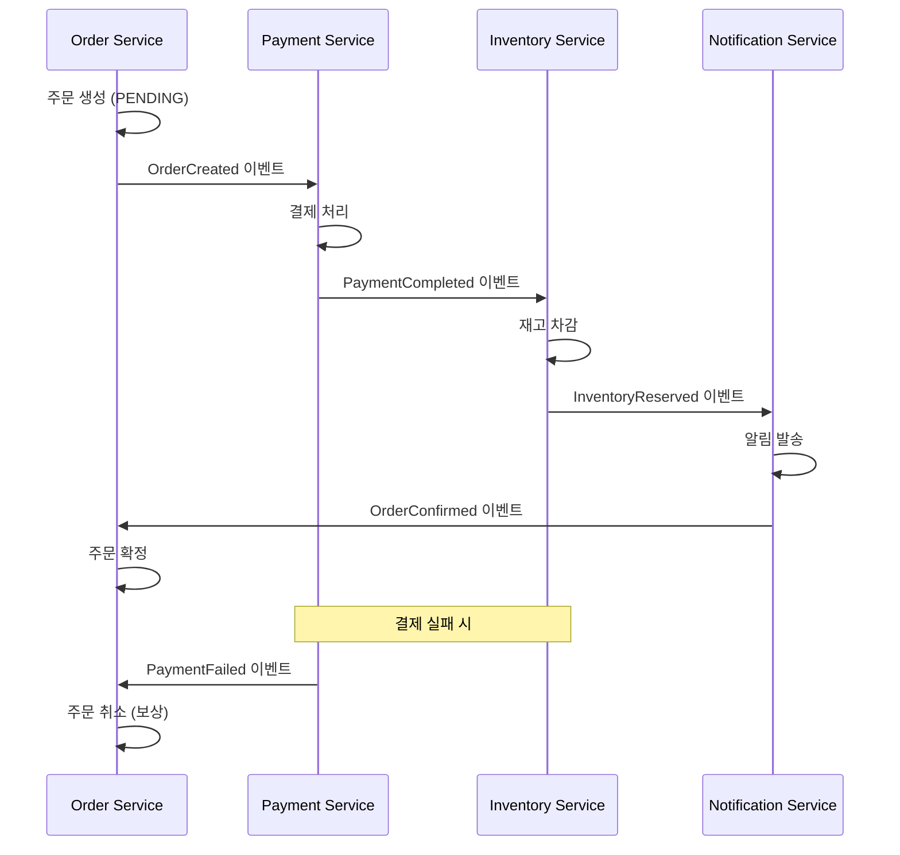
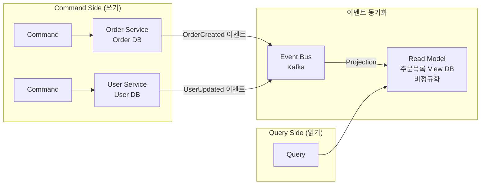

처음에는 작은 쇼핑몰 하나였다. 코드 한 곳에서 회원, 주문, 결제, 배송을 모두 처리했다. 팀이 커지고 기능이 늘면서 빌드는 30분, 배포는 하루에 한 번, 한 줄 수정이 전체 서비스를 다운시킨다. MSA는 이 문제를 해결하기 위해 시스템을 독립적으로 배포 가능한 작은 서비스들로 나눈다.

> **비유**: 큰 백화점 하나(모놀리스)를 개별 매장들이 모인 쇼핑몰(MSA)로 바꾸는 것이다. 각 매장은 독립적으로 운영되고, 인테리어를 바꿔도 옆 매장에 영향을 주지 않는다. 하지만 쇼핑몰 전체 운영(인프라, 보안, 주차)은 공통으로 관리된다.

---

## 모놀리스 vs MSA



### 모놀리스의 장단점

| 장점 | 단점 |
|---|---|
| 개발 초기 단순함 | 코드베이스 복잡도 폭증 |
| 단일 트랜잭션 처리 용이 | 빌드/배포 시간 증가 |
| 분산 시스템 문제 없음 | 특정 컴포넌트만 스케일 불가 |
| 트레이싱 단순 | 기술 스택 교체 어려움 |
| 테스트 용이 | 팀 간 코드 충돌 빈발 |

### MSA의 장단점

| 장점 | 단점 |
|---|---|
| 독립 배포/스케일링 | 분산 시스템 복잡도 |
| 기술 스택 자유 선택 | 네트워크 레이턴시 추가 |
| 장애 격리 | 분산 트랜잭션 관리 필요 |
| 팀 독립성 (Conway's Law) | 테스트/모니터링 복잡 |
| 서비스별 최적 DB 선택 | 운영 오버헤드 증가 |

---

## 서비스 분리 기준

MSA에서 가장 어려운 결정은 "어떻게 나눌 것인가"다.

### DDD 바운디드 컨텍스트

```
도메인 주도 설계(DDD)에서 바운디드 컨텍스트 = 마이크로서비스 경계

예시: 이커머스 도메인 분리
  - User Context:    회원가입, 로그인, 프로필
  - Order Context:   주문 생성, 조회, 취소
  - Payment Context: 결제 처리, 환불, 정산
  - Inventory Context: 재고 관리, 입출고
  - Delivery Context: 배송 추적, 택배사 연동
  - Notification Context: 이메일, SMS, Push

각 컨텍스트는 독립적 모델과 언어를 가짐
User Context의 "고객" ≠ Payment Context의 "결제자" (같은 개념이라도 다른 속성)
```

### 분리 원칙

```
1. 단일 책임 원칙: 하나의 서비스 = 하나의 비즈니스 능력
2. 독립 배포 가능: 다른 서비스 수정 없이 배포 가능해야 함
3. 데이터 소유권: 각 서비스는 자신의 DB를 소유, 다른 서비스 DB에 직접 접근 금지
4. 느슨한 결합: 서비스 간 인터페이스만 공유, 구현 공유 금지
5. 높은 응집도: 같이 변경되는 것들은 같은 서비스에

나쁜 분리 예시:
  User Service와 Profile Service가 항상 같이 배포됨 → 합쳐야 함
  Order Service가 Payment DB에 직접 쿼리 → 캡슐화 위반
```

---

## 서비스 간 통신

### 동기 통신 (Synchronous)

```
REST API / gRPC
  장점: 즉시 응답, 단순한 프로그래밍 모델
  단점: 강한 결합, 호출된 서비스 다운 시 호출자도 영향

적합한 경우:
  - 실시간 응답이 필요한 경우 (장바구니 조회, 재고 확인)
  - 사용자가 기다리는 동기적 흐름
```

```java
// FeignClient로 동기 호출
@FeignClient(name = "inventory-service")
public interface InventoryClient {
    @GetMapping("/inventory/{productId}")
    InventoryDto checkInventory(@PathVariable Long productId);
}

@Service
public class OrderService {
    private final InventoryClient inventoryClient;

    public OrderResult createOrder(OrderRequest request) {
        // 동기 호출: inventory-service가 다운되면 예외 발생
        InventoryDto inventory = inventoryClient.checkInventory(request.getProductId());
        if (inventory.getStock() < request.getQuantity()) {
            throw new OutOfStockException();
        }
        return processOrder(request);
    }
}
```

### 비동기 통신 (Asynchronous)

```
메시지 브로커 (Kafka, RabbitMQ)
  장점: 느슨한 결합, 수신자 다운 시에도 발신자 정상 동작
  단점: 최종 일관성, 복잡한 오류 처리, 디버깅 어려움

적합한 경우:
  - 즉시 응답이 불필요한 작업 (이메일 발송, 데이터 동기화)
  - 여러 서비스에 동일 이벤트 전파
  - 높은 처리량이 필요한 경우
```

```java
// 주문 생성 이벤트 발행
@Service
public class OrderService {
    private final KafkaTemplate<String, OrderEvent> kafkaTemplate;

    public OrderResult createOrder(OrderRequest request) {
        Order order = orderRepository.save(new Order(request));

        // 비동기 이벤트 발행: Payment, Inventory, Notification이 각자 처리
        kafkaTemplate.send("order.created", new OrderCreatedEvent(order));

        return OrderResult.accepted(order.getId());  // 즉시 반환
    }
}

// 각 서비스가 독립적으로 이벤트 소비
@KafkaListener(topics = "order.created")
public void onOrderCreated(OrderCreatedEvent event) {
    paymentService.initiatePayment(event);
}
```



---

## Saga 패턴 (분산 트랜잭션)

MSA에서 여러 서비스에 걸친 트랜잭션은 DB 레벨에서 처리할 수 없다. Saga는 로컬 트랜잭션의 연쇄와 보상 트랜잭션으로 최종 일관성을 달성한다.

### Choreography Saga (이벤트 기반)

```
서비스들이 이벤트를 발행/구독하며 스스로 조율
중앙 조율자 없음 → 느슨한 결합
단점: 전체 흐름 파악 어려움, 순환 의존 위험
```



### Orchestration Saga (중앙 조율)

```
중앙 Saga Orchestrator가 각 서비스에 명령을 보내며 조율
흐름 파악 용이, 복잡한 로직 처리 쉬움
단점: 오케스트레이터가 너무 많은 것을 알게 됨 (결합도 증가 위험)
```

```java
@Service
public class OrderSagaOrchestrator {

    public void executeOrderSaga(OrderRequest request) {
        // 1. 주문 생성
        Order order = orderService.create(request);

        try {
            // 2. 결제 처리
            paymentService.charge(order.getId(), request.getAmount());

            try {
                // 3. 재고 차감
                inventoryService.reserve(request.getProductId(), request.getQty());

                // 4. 알림 발송
                notificationService.sendConfirmation(order);

                order.confirm();

            } catch (InventoryException e) {
                // 재고 실패 → 결제 보상 트랜잭션
                paymentService.refund(order.getId());
                order.cancel("재고 부족");
            }

        } catch (PaymentException e) {
            // 결제 실패 → 주문 취소
            order.cancel("결제 실패");
        }
    }
}
```

---

## CQRS (Command Query Responsibility Segregation)

명령(쓰기)과 조회(읽기)를 분리하는 패턴이다.

```
문제:
  주문 목록 API: 주문 + 상품명 + 사용자명 + 배송 상태를 한 화면에 표시
  → 여러 서비스 DB에 걸친 복잡한 JOIN 불가 (각 서비스가 자기 DB만 접근)

CQRS 해결책:
  Command 모델: 각 서비스의 정규화된 도메인 DB
  Query 모델: 읽기 전용 비정규화된 통합 뷰 (Read Model)
```



```java
// Command: 각 서비스의 도메인 DB에 저장
@Service
public class OrderCommandService {
    public void createOrder(CreateOrderCommand cmd) {
        Order order = new Order(cmd);
        orderRepository.save(order);
        eventPublisher.publish(new OrderCreatedEvent(order));
    }
}

// Event Handler: Read Model 업데이트
@KafkaListener(topics = {"order.created", "user.updated", "delivery.updated"})
public class OrderReadModelProjection {
    public void on(OrderCreatedEvent event) {
        // 비정규화된 조회용 데이터 생성
        OrderListView view = OrderListView.builder()
            .orderId(event.getOrderId())
            .userId(event.getUserId())
            // 이 시점에 user-service에서 사용자명을 fetch하거나
            // 이벤트에 포함된 스냅샷 데이터 사용
            .userName(event.getUserName())
            .build();
        orderListViewRepository.save(view);
    }
}

// Query: Read Model에서 단순 조회
@Service
public class OrderQueryService {
    public List<OrderListView> getOrderList(Long userId) {
        // 복잡한 JOIN 없이 단순 조회
        return orderListViewRepository.findByUserId(userId);
    }
}
```

---

## API Composition

여러 서비스의 데이터를 합쳐서 하나의 응답을 만드는 패턴이다.

```java
// API Gateway 또는 BFF(Backend for Frontend)에서 수행
@Service
public class OrderDetailAggregator {

    private final OrderServiceClient orderClient;
    private final UserServiceClient userClient;
    private final ProductServiceClient productClient;
    private final DeliveryServiceClient deliveryClient;

    public OrderDetailResponse getOrderDetail(Long orderId) {
        // 병렬로 각 서비스 조회 (CompletableFuture)
        CompletableFuture<OrderDto> orderFuture =
            CompletableFuture.supplyAsync(() -> orderClient.getOrder(orderId));

        CompletableFuture<UserDto> userFuture = orderFuture.thenCompose(order ->
            CompletableFuture.supplyAsync(() -> userClient.getUser(order.getUserId()))
        );

        CompletableFuture<ProductDto> productFuture = orderFuture.thenCompose(order ->
            CompletableFuture.supplyAsync(() -> productClient.getProduct(order.getProductId()))
        );

        CompletableFuture<DeliveryDto> deliveryFuture =
            CompletableFuture.supplyAsync(() -> deliveryClient.getDelivery(orderId));

        // 모든 결과 합치기
        return CompletableFuture.allOf(orderFuture, userFuture, productFuture, deliveryFuture)
            .thenApply(v -> OrderDetailResponse.builder()
                .order(orderFuture.join())
                .user(userFuture.join())
                .product(productFuture.join())
                .delivery(deliveryFuture.join())
                .build())
            .join();
    }
}
```

---

## 극한 시나리오

### 시나리오 1: 서비스 간 데이터 일관성 붕괴

```
상황: Order가 생성됐지만 Payment 이벤트가 유실됨
결과: 주문은 PENDING, 결제는 처리됨 → 불일치

방어:
1. Transactional Outbox 패턴: DB 트랜잭션과 이벤트 발행을 원자적으로
   → 이벤트를 Kafka가 아닌 DB outbox 테이블에 같이 저장
   → CDC(Change Data Capture) 또는 Polling이 Kafka로 전달

2. Saga + 보상 트랜잭션: 실패 시 자동 롤백
3. 주기적 조정(Reconciliation): 배치로 불일치 탐지 및 수정
```

### 시나리오 2: 모놀리스에서 MSA 전환 전략

```
Strangler Fig Pattern (점진적 전환):

1단계: 모놀리스 앞에 API Gateway 배치
2단계: 새 기능은 별도 마이크로서비스로 구현
3단계: 기존 기능 하나씩 새 서비스로 추출 (가장 독립적인 것부터)
       예: Notification → Payment → Inventory → Order → User
4단계: 모놀리스 기능이 모두 빠지면 제거

핵심: 빅뱅 전환 금지. 단계적으로, 항상 롤백 가능하게.
```

### 시나리오 3: 분산 시스템 디버깅

```
문제: 주문 API가 가끔 실패하는데 원인 불명

해결 도구:
1. 분산 추적 (Zipkin/Jaeger): TraceId로 전체 흐름 추적
2. 중앙 로그 수집 (ELK): 모든 서비스 로그를 TraceId로 검색
3. 메트릭 수집 (Prometheus/Grafana): 서비스별 에러율/레이턴시
4. 서킷 브레이커 대시보드: 어떤 의존성이 불안정한지 실시간 확인

없으면: 각 서버에 SSH로 접속해서 로그 뒤지기 → 사실상 불가능
```

---

## MSA 적용 체크리스트

```
MSA를 선택하기 전 확인:
□ 팀 규모가 서비스 수를 감당할 만큼 큰가? (서비스당 최소 2인 팀)
□ DevOps/SRE 역량이 있는가? (컨테이너, K8s, CI/CD)
□ 분산 추적, 중앙 로깅 인프라를 구축할 수 있는가?
□ 비즈니스 도메인 경계가 명확히 정의됐는가?
□ 모놀리스로 충분히 검증된 제품인가?

"모놀리스로 시작해서 필요할 때 분리하라" - Martin Fowler
```
